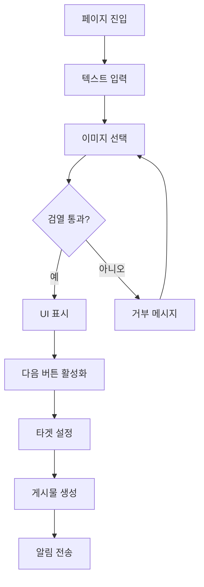
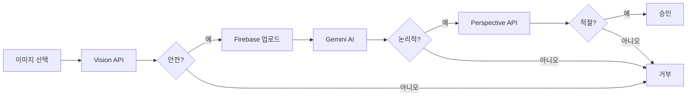
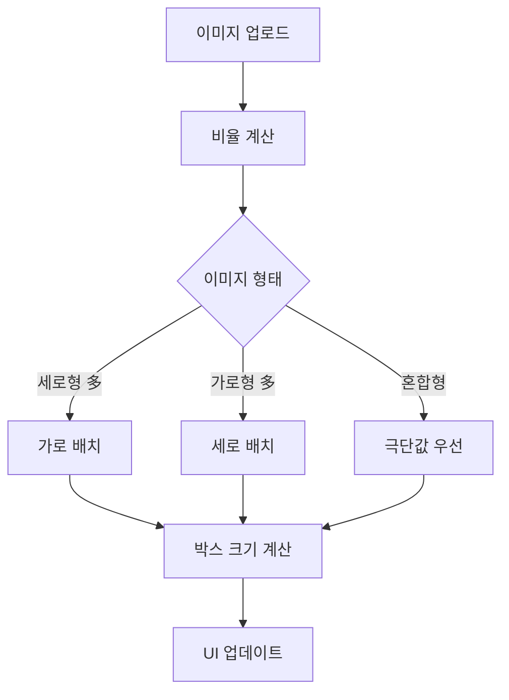

# 🎨 InPutPostImage 모듈 - Versus 콘텐츠 생성 시스템

> Flutter 기반 A/B 비교 콘텐츠 생성을 위한 통합 이미지 게시물 작성 시스템

## 📊 모듈 메타정보

| 항목 | 상태 | 상세 |
|------|------|------|
| **모듈명** | InPutPostImage | Versus 형식 이미지 게시물 생성 |
| **버전** | v2.5.0 | 2025-08-23 기준 |
| **하위 디렉토리** | 8개 | 모든 하위 모듈 문서화 완료 ✅ |
| **총 파일 수** | 약 50개 | Dart 파일 및 설정 파일 |
| **검증 상태** | ⭐⭐⭐⭐ | 네이밍 컨벤션 100% 준수 |

## 🎯 개요

InPutPostImage는 Versus Space 앱의 핵심 기능인 **A vs B 형식의 비교 콘텐츠 생성**을 담당하는 통합 모듈입니다. 사용자가 두 개의 옵션(A/B)을 이미지와 텍스트로 구성하여, AI 기반 검열과 스마트 레이아웃을 거쳐 타겟 오디언스에게 전달되는 투표형 게시물을 생성합니다.

### 주요 특징
- 🖼️ **멀티미디어 지원**: 이미지, 비디오, YouTube 링크 통합 지원
- 🤖 **AI 통합**: 3단계 AI 검열 시스템 (Vision API → Gemini → Perspective API)
- 📐 **스마트 레이아웃**: 이미지 비율 기반 자동 레이아웃 최적화
- 🎯 **타겟팅 시스템**: AI 기반 사용자 매칭 및 알림 전송
- ♻️ **완전한 생명주기**: 생성 → 검증 → 업로드 → 알림 → 투표 → 완료

## 📐 네이밍 컨벤션

| 구분 | 규칙 | 예시 |
|------|------|------|
| **파일명** | snake_case | `in_put_post_image_widget.dart` |
| **클래스명** | PascalCase | `InPutPostImageWidget` |
| **메서드명** | camelCase | `handleImageSelection()` |
| **변수명** | camelCase | `currentLayout` |
| **상수** | camelCase | `maxImageCount` |

> 상세 규칙은 [프로젝트 네이밍 컨벤션](../../NAMING_CONVENTION.md) 참조

## 🏗️ 아키텍처

### 전체 구조도
```
┌─────────────────────────────────────────────────────────┐
│                    InPutPostImageWidget                  │
│                        (메인 페이지)                      │
└────────────┬────────────────────────────────────────────┘
             │
    ┌────────┴────────┬────────────┬─────────────┐
    ▼                 ▼            ▼             ▼
Components        Services      Helpers      Widgets
(UI 컴포넌트)    (비즈니스 로직)  (유틸리티)   (복합 위젯)
    │                 │            │             │
    ├─ MediaBox       ├─ Upload    ├─ Ratio     ├─ Dialogs
    ├─ Fields         ├─ AI        ├─ Layout    ├─ Editor
    └─ Buttons        └─ Validation└─ Cache     └─ Flow
```

### 레이어별 책임

#### 1. **Presentation Layer** (Widget & Model)
- `InPutPostImageWidget`: 메인 페이지 UI 및 이벤트 처리
- `InPutPostImageModel`: 페이지 상태 관리 및 비즈니스 로직 연결

#### 2. **Component Layer** (재사용 UI)
- **MediaSelectionBox**: A/B 이미지 박스 컴포넌트
- **ValidatedField**: 실시간 검증 텍스트 필드
- **CharacterCountDisplay**: 문자 수 표시
- **NextButton**: 조건부 활성화 버튼

#### 3. **Service Layer** (핵심 비즈니스)
- **ImageUploadOrchestratorV2**: 업로드 및 검열 총괄 관리
- **AIModeration**: 다단계 AI 콘텐츠 검증
- **MediaUploadService**: Firebase Storage 업로드
- **ValidationService**: 텍스트 필드 검증

#### 4. **Helper Layer** (유틸리티)
- **AspectRatioAnalyzer**: 이미지 비율 분석 및 레이아웃 결정
- **MediaBoxCallbacks**: 박스 상호작용 콜백 관리
- **ImageCacheHelper**: 이미지 캐싱 최적화

#### 5. **Widget Layer** (복합 기능)
- **MediaSelectionFlowWidget**: 갤러리/카메라 선택 플로우
- **MediaEditorWidget**: ProImageEditor 통합
- **TargetAudienceDialog**: 다단계 타겟 설정 UI

## 📁 디렉토리 구조

```
lib/posts/in_put_post_image/
├── 📄 README.md                          # 현재 문서
├── 📄 in_put_post_image_widget.dart      # 메인 페이지 위젯 (1,600+ 줄)
├── 📄 in_put_post_image_model.dart       # 상태 관리 모델 (120+ 줄)
│
├── 📁 components/                        # UI 컴포넌트 (9개 파일)
│   ├── base_media_selection_box.dart    # 미디어 박스 기본 클래스
│   ├── media_selection_box_multi.dart   # 멀티 이미지 박스
│   ├── media_selection_box_single.dart  # 단일 이미지 박스
│   ├── character_count_display.dart     # 문자 수 표시
│   ├── simple_validated_field.dart      # 검증 필드
│   ├── next_button.dart                 # 다음 버튼
│   ├── warning_message.dart             # 경고 메시지
│   ├── layout_debug_info.dart           # 디버그 정보
│   └── README.md ✅
│
├── 📁 constants/                         # 상수 정의 (11개 파일)
│   ├── constants.dart                   # 통합 export
│   ├── dimensions.dart                  # UI 치수
│   ├── animation_constants.dart         # 애니메이션
│   ├── field_styles.dart                # 필드 스타일
│   ├── image_constants.dart             # 이미지 설정
│   ├── strings.dart                     # 문자열
│   ├── text_limits.dart                 # 텍스트 제한
│   ├── colors.dart                      # 색상
│   ├── config.dart                      # 설정
│   ├── target_audience_constants.dart   # 타겟 설정
│   └── README.md ✅
│
├── 📁 delegates/                         # 커스텀 델리게이트 (3개 파일)
│   ├── korean_asset_picker_delegate.dart    # 한국어 피커
│   ├── korean_camera_picker_delegate.dart   # 카메라 피커
│   ├── camera_floating_button_delegate.dart # 플로팅 버튼
│   └── README.md ✅
│
├── 📁 helpers/                           # 헬퍼 클래스 (5개 파일)
│   ├── aspect_ratio_analyzer.dart       # 비율 분석
│   ├── ratio_calculator.dart            # 비율 계산
│   ├── media_box_callbacks.dart         # 콜백 관리
│   ├── image_cache_helper.dart          # 캐시 헬퍼
│   ├── input_field_builder.dart         # 필드 빌더
│   └── README.md ✅
│
├── 📁 models/                            # 데이터 모델 (1개 파일)
│   ├── target_audience_model.dart       # 타겟 모델
│   └── README.md ✅
│
├── 📁 services/                          # 비즈니스 서비스 (10개 파일)
│   ├── image_upload_orchestrator_v2.dart    # 업로드 총괄
│   ├── image_upload_orchestrator.dart       # 레거시 업로더
│   ├── media_upload_service.dart            # 미디어 업로드
│   ├── validation_service.dart              # 검증 서비스
│   ├── asset_picker_service.dart            # 피커 서비스
│   ├── image_download_service.dart          # 다운로드
│   ├── image_editor_callback_handler.dart   # 편집 콜백
│   ├── image_reorder_service.dart           # 순서 변경
│   ├── media_selection_service.dart         # 선택 서비스
│   ├── selection_result_processor.dart      # 결과 처리
│   └── README.md ✅
│
├── 📁 utils/                             # 유틸리티 (3개 파일)
│   ├── debug_helper.dart                # 디버그 헬퍼
│   ├── error_handler.dart               # 에러 처리
│   ├── no_animation_page_route.dart     # 애니메이션 없는 라우트
│   └── README.md ✅
│
└── 📁 widgets/                           # 복합 위젯 (3개 파일 + 하위)
    ├── media_selection_flow_widget.dart # 선택 플로우
    ├── media_editor_widget.dart         # 편집기
    ├── thumbnail_navigation_helper.dart # 썸네일 헬퍼
    ├── 📁 dialogs/                      # 다이얼로그 (4개 파일 + 하위)
    │   ├── moderation_dialog.dart       # 검열 진행
    │   ├── moderation_error_dialog.dart # 검열 오류
    │   ├── target_audience_dialog.dart  # 타겟 설정
    │   ├── 📁 target_audience_steps/   # 단계별 UI (3개 파일)
    │   │   ├── collection_type_selector.dart
    │   │   ├── target_count_selector.dart
    │   │   ├── detailed_target_selector.dart
    │   │   └── README.md ✅
    │   └── README.md ✅
    └── README.md ✅
```

## 🔧 주요 구성요소

### 1. InPutPostImageWidget (메인 위젯)

#### 핵심 기능
- **상태 관리**: Provider 패턴으로 AppState와 동기화
- **레이아웃 제어**: 스마트 레이아웃 시스템 관리
- **이벤트 처리**: 사용자 상호작용 및 비즈니스 로직 연결
- **생명주기 관리**: 초기화, 업데이트, 정리

#### 주요 메서드
```dart
// 레이아웃 업데이트
void _performLayoutUpdate() {
  final analyzer = AspectRatioAnalyzer();
  final layoutType = analyzer.determineOptimalLayout(
    aspectRatiosA: appState.uploadImageAspectRatioA,
    aspectRatiosB: appState.uploadImageAspectRatioB,
  );
  _model.currentLayout = layoutType;
}

// 다음 버튼 처리
Future<void> _handleNextButton() async {
  // 1. 유효성 검사
  if (!_validateAllFields()) return;
  
  // 2. 이미지 업로드 및 AI 검증
  final orchestrator = ImageUploadOrchestratorV2();
  final result = await orchestrator.processImagesWithModeration();
  
  // 3. 타겟 오디언스 설정
  final targetSettings = await TargetAudienceDialog.show(context);
  
  // 4. 게시물 생성
  await _createPost(targetSettings);
}
```

### 2. Component Layer (재사용 UI)

#### MediaSelectionBox 시리즈
- **BaseMediaSelectionBox**: 공통 로직 mixin
- **MediaSelectionBoxSingle**: 단일 이미지 박스
- **MediaSelectionBoxMulti**: 멀티 이미지 박스 (PageView)

#### 특징
- 조건부 렌더링 (이미지 유무에 따른 UI 변경)
- 액션 아이콘 (편집, 추가, 삭제)
- 드래그 앤 드롭 지원 (계획)

### 3. Service Layer (비즈니스 로직)

#### ImageUploadOrchestratorV2
```dart
class ImageUploadOrchestratorV2 {
  // 통합 처리 플로우
  Future<ImageProcessResult> processImagesWithModeration({
    required List<File> images,
    required String box,
    Map<String, String>? textContent,
  }) async {
    // 1. Vision API 검열
    final visionResult = await _checkWithVisionAPI(images);
    if (!visionResult.passed) return visionResult;
    
    // 2. Firebase 업로드
    final urls = await _uploadToFirebase(images);
    
    // 3. Gemini AI 검증
    final aiResult = await _validateWithGemini(urls, textContent);
    if (!aiResult.passed) return aiResult;
    
    // 4. 텍스트 검열 (Perspective API)
    final textResult = await _checkTextContent(textContent);
    
    return ImageProcessResult.success(urls);
  }
}
```

#### AI Moderation 시스템
- **3단계 검증**: 이미지 → AI 로직 → 텍스트
- **실시간 피드백**: 구체적인 거부 이유 제공
- **토큰 추적**: AI 사용량 모니터링

### 4. Helper Layer (유틸리티)

#### AspectRatioAnalyzer
```dart
class AspectRatioAnalyzer {
  LayoutType determineOptimalLayout({
    required List<double> aspectRatiosA,
    required List<double> aspectRatiosB,
  }) {
    // 세로형 이미지가 많으면 → 가로 배치
    // 가로형 이미지가 많으면 → 세로 배치
    // 혼합형이면 → 극단적인 비율 우선
  }
}
```

#### MediaBoxCallbacks
- 이미지 선택, 편집, 삭제 콜백 중앙 관리
- 박스 간 상호작용 조율

### 5. Widget Layer (복합 기능)

#### MediaSelectionFlowWidget
- WeChat 스타일 이미지 피커 통합
- 권한 관리 및 설정 이동
- 멀티 선택 및 카메라 지원

#### MediaEditorWidget
- ProImageEditor 래퍼
- 편집 완료 후 자동 재업로드 및 검증
- 텍스트/이미지 문제 구분

#### TargetAudienceDialog
- 3단계 설정 플로우 (수집 방식 → 목표 수 → 세부 타겟)
- AI 추천 vs 수동 선택
- Provider 패턴으로 상태 관리

## 💡 주요 플로우

### 1. 콘텐츠 생성 플로우


### 2. AI 검열 플로우


### 3. 스마트 레이아웃 결정


## 🎨 UI/UX 특징

### 디자인 원칙
- **Material Design 3**: 최신 디자인 시스템 적용
- **다크 모드 지원**: AppTheme 기반 테마 전환
- **반응형 디자인**: 다양한 화면 크기 대응

### 사용자 경험
- **실시간 피드백**: 문자 수, 유효성 검사 즉시 표시
- **진행 표시**: 업로드, 검열 진행 상태 시각화
- **에러 처리**: 명확한 에러 메시지와 해결 방법 제시
- **애니메이션**: 부드러운 전환과 시각적 피드백

### 접근성
- **스크린 리더 지원**: Semantics 위젯 활용
- **키보드 네비게이션**: 탭 순서 최적화
- **색상 대비**: WCAG 2.1 AA 기준 충족

## 📊 성능 최적화

### 이미지 처리
- **3단계 리사이징**: original, display(800px), thumbnail(150px)
- **병렬 업로드**: Future.wait으로 동시 처리
- **프리캐싱**: 업로드 직후 이미지 캐싱
- **메모리 관리**: LRU 캐시로 메모리 효율화

### 네트워크 최적화
- **재시도 로직**: 실패 시 3회 자동 재시도
- **타임아웃 설정**: 30초 타임아웃으로 무한 대기 방지
- **청크 업로드**: 대용량 파일 분할 업로드 (계획)

### 렌더링 최적화
- **조건부 렌더링**: 필요한 위젯만 빌드
- **Consumer 패턴**: 필요한 부분만 리빌드
- **Debouncing**: 레이아웃 업데이트 최적화

## 🔒 보안 및 검증

### 콘텐츠 검열
- **이미지 검열**: Cloud Vision API (폭력성, 선정성 등)
- **AI 검증**: Gemini 1.5 Pro (논리성, 적절성)
- **텍스트 검열**: Perspective API (유해성 점수)

### 데이터 보호
- **개인정보 필터링**: 전화번호, 이메일 자동 제거
- **Firebase Security Rules**: 사용자별 접근 제어
- **HTTPS 전용**: 모든 통신 암호화

### 검증 규칙
- **필수 필드**: 제목, A/B 타이틀 필수
- **문자 수 제한**: 제목 50자, 설명 200자
- **이미지 제한**: 최대 4개, 10MB/개

## 🐛 디버깅 및 모니터링

### 디버그 도구
- **DebugHelper**: 태그 기반 로깅 시스템
- **LayoutDebugInfo**: 레이아웃 정보 시각화
- **Performance Overlay**: 성능 모니터링

### 로깅 전략
```dart
// 태그 기반 로깅
DebugHelper.log('Layout', '레이아웃 변경: $layoutType');
DebugHelper.log('Upload', '업로드 시작: ${files.length}개');
DebugHelper.log('AI', 'Gemini 응답: $response');
```

### 에러 추적
- **ErrorHandler**: 중앙 집중식 에러 처리
- **Crashlytics**: 프로덕션 에러 수집
- **Analytics**: 사용자 행동 분석

## 🔄 변경 이력

### v2.5.0 (2025-08-23)
- 전체 하위 디렉토리 문서화 100% 완료
- 통합 문서 작성 및 아키텍처 정리
- 검증 스크립트 통과

### v2.4.0 (2025-08-06)
- 로깅 시스템 최적화
- logOnce() 메서드로 90% 중복 감소
- Firebase 리스너 로그 최적화

### v2.3.0 (2025-07-20)
- AI 기반 투표 알림 시스템 통합
- Genkit Framework 도입
- 4가지 타겟 모드 구현

### v2.2.0 (2025-07-15)
- Gemini AI 통합
- 다단계 검열 시스템 구축
- 토큰 사용량 추적

### v2.1.0 (2025-07-13)
- 대규모 코드베이스 리팩토링
- 컴포넌트 분리 및 성능 최적화
- 중앙 집중식 상수 관리

### v2.0.0 (2025-07-09)
- 스마트 레이아웃 시스템 구현
- 이미지 비율 기반 자동 레이아웃
- NotificationService 통합

## 🚀 향후 계획

### 단기 계획 (1-2개월)
- [ ] 비디오 지원 완성
- [ ] 드래그 앤 드롭 구현
- [ ] 오프라인 모드 지원
- [ ] 성능 모니터링 대시보드

### 중기 계획 (3-6개월)
- [ ] AI 자동 캡션 생성
- [ ] 실시간 협업 편집
- [ ] 템플릿 시스템
- [ ] A/B 테스팅 플랫폼

### 장기 계획 (6개월+)
- [ ] AR 필터 지원
- [ ] 3D 콘텐츠 지원
- [ ] 블록체인 투표 검증
- [ ] 글로벌 CDN 최적화

## 📚 관련 문서

### 하위 모듈 문서
- [📦 Components - UI 컴포넌트](./components/README.md)
- [⚙️ Services - 비즈니스 로직](./services/README.md)
- [🔧 Helpers - 유틸리티](./helpers/README.md)
- [🎨 Widgets - 복합 위젯](./widgets/README.md)
- [📏 Constants - 상수 관리](./constants/README.md)
- [🎯 Delegates - 커스텀 델리게이트](./delegates/README.md)
- [🛠️ Utils - 공통 유틸리티](./utils/README.md)
- [📊 Models - 데이터 모델](./models/README.md)

### 프로젝트 문서
- [프로젝트 아키텍처](../../ARCHITECTURE.md)
- [네이밍 컨벤션](../../NAMING_CONVENTION.md)
- [개발 가이드](../../DEVELOPMENT_GUIDE.md)

## 🤝 기여 가이드

### 코드 스타일
- Dart 공식 스타일 가이드 준수
- 의미 있는 변수명 사용
- 주석은 한국어로 작성

### 커밋 메시지
```
feat: 새로운 기능 추가
fix: 버그 수정
refactor: 코드 리팩토링
docs: 문서 업데이트
test: 테스트 추가/수정
```

### PR 체크리스트
- [ ] 네이밍 컨벤션 준수
- [ ] 테스트 통과
- [ ] 문서 업데이트
- [ ] 코드 리뷰 완료

---

*이 문서는 InPutPostImage 모듈의 통합 아키텍처와 구현을 설명합니다.*
*최종 업데이트: 2025-08-23*