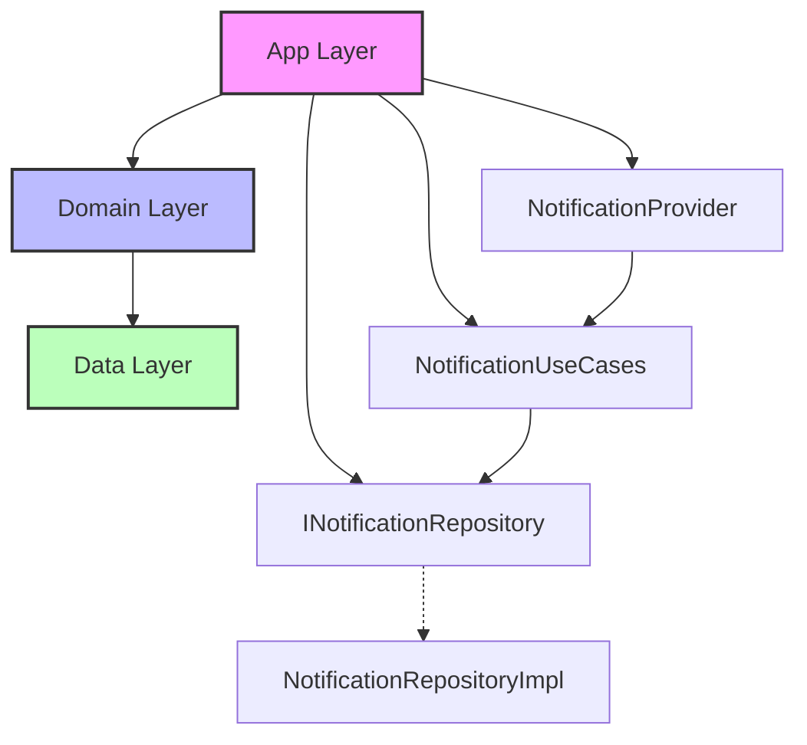

# 🔔 알림 Feature - App 레이어 연동 가이드

> 최종 업데이트: 2025-01-09 | 버전: 1.1.0
>
> Notifications Feature와 App 레이어 간의 Clean Architecture 기반 통합 가이드
> 
> **총 예상 시간**: 12시간 (1.5일) - MASTER_MIGRATION_GUIDE.md Phase 4와 동기화
> 
> ⚠️ **Note**: 이 문서는 전체 마이그레이션의 Phase 4에 해당합니다.

## 📋 목차

1. [현재 문제점](#현재-문제점)
2. [목표 아키텍처](#목표-아키텍처)
3. [Sub-Phase 1: DI 추상화](#sub-phase-1-di-추상화)
4. [Sub-Phase 2: AppState 분리](#sub-phase-2-appstate-분리)
5. [Sub-Phase 3: 라우팅 정리](#sub-phase-3-라우팅-정리)
6. [Sub-Phase 4: 최종 검증](#sub-phase-4-최종-검증)

## 현재 문제점

### 🚨 Critical Issues

```dart
// ❌ 현재: app/di/notification_module.dart
import '../../features/notifications/data/repositories/notification_repository_impl.dart';
import '../../features/notifications/data/adapters/notification_service.dart';

// App이 Data 레이어 구현체를 직접 알고 있음
sl.registerLazySingleton(() => NotificationRepositoryImpl());
sl.registerLazySingleton(() => NotificationService.instance);
```

### 위반 사항 매핑

| 파일 | 현재 상태 | 문제점 | 영향도 |
|-----|----------|--------|--------|
| app/di/notification_module.dart | Data 구현체 직접 import | DIP 위반 | 🔴 Critical |
| app/app.dart | NotificationService 직접 사용 | 계층 침범 | 🔴 Critical |
| app/state/app_state.dart | 알림 상태 포함 | SRP 위반 | 🟡 High |
| app/router/app_router.dart | 알림 비즈니스 로직 | 책임 혼재 | 🟡 High |

## 목표 아키텍처

### 의존성 흐름



### 레이어별 책임

```
App Layer (진입점)
├── DI 설정 (인터페이스만)
├── 라우팅 (경로만)
└── 전역 설정

Domain Layer (비즈니스)
├── Repository 인터페이스
├── UseCase 구현
└── 도메인 모델

Data Layer (구현)
├── Repository 구현
├── DTO/Mapper
└── 외부 서비스
```

## Sub-Phase 1: DI 추상화

**예상 시간**: 3시간

### 목표
App 레이어가 구현체를 모르도록 DI 추상화 계층 구축

### Step 1: Factory 패턴 구현

```dart
// app/di/factories/notification_factory.dart
import 'package:get_it/get_it.dart';
import '../../../features/notifications/domain/repositories/i_notification_repository.dart';
import '../../../features/notifications/data/repositories/notification_repository_impl.dart';

class NotificationFactory {
  static INotificationRepository createRepository() {
    // 구현체는 Factory 내부에서만 알고 있음
    return NotificationRepositoryImpl(
      firestore: GetIt.I<FirebaseFirestore>(),
      storage: GetIt.I<FirebaseStorage>(),
      cacheService: GetIt.I<ICacheService>(),
    );
  }
  
  static Map<String, dynamic> createUseCases(INotificationRepository repo) {
    return {
      'getNotifications': GetNotificationsUseCase(repo),
      'markAsRead': MarkAsReadUseCase(repo),
      'deleteNotification': DeleteNotificationUseCase(repo),
      'getUnreadCount': GetUnreadCountUseCase(repo),
      'markAllAsRead': MarkAllAsReadUseCase(repo),
    };
  }
}
```

### Step 2: DI 모듈 리팩토링

```dart
// app/di/notification_module.dart (✅ 수정 후)
import 'package:get_it/get_it.dart';
import '../../features/notifications/domain/repositories/i_notification_repository.dart';
import '../../features/notifications/domain/usecases/usecases.dart';
import '../../features/notifications/presentation/providers/notification_provider.dart';
import './factories/notification_factory.dart';

final sl = GetIt.instance;

void registerNotificationModule() {
  // 1. Repository 등록 (인터페이스)
  sl.registerLazySingleton<INotificationRepository>(
    () => NotificationFactory.createRepository(),
  );
  
  // 2. UseCase 등록
  final useCases = NotificationFactory.createUseCases(
    sl<INotificationRepository>(),
  );
  
  sl.registerLazySingleton(() => useCases['getNotifications'] as GetNotificationsUseCase);
  sl.registerLazySingleton(() => useCases['markAsRead'] as MarkAsReadUseCase);
  sl.registerLazySingleton(() => useCases['deleteNotification'] as DeleteNotificationUseCase);
  sl.registerLazySingleton(() => useCases['getUnreadCount'] as GetUnreadCountUseCase);
  sl.registerLazySingleton(() => useCases['markAllAsRead'] as MarkAllAsReadUseCase);
  
  // 3. Provider 등록
  sl.registerFactory<NotificationProvider>(
    () => NotificationProvider(
      getNotificationsUseCase: sl<GetNotificationsUseCase>(),
      markAsReadUseCase: sl<MarkAsReadUseCase>(),
      deleteNotificationUseCase: sl<DeleteNotificationUseCase>(),
      getUnreadCountUseCase: sl<GetUnreadCountUseCase>(),
      markAllAsReadUseCase: sl<MarkAllAsReadUseCase>(),
    ),
  );
  
  // 4. Badge Provider 등록
  sl.registerFactory<NotificationBadgeProvider>(
    () => NotificationBadgeProvider(
      getUnreadCountUseCase: sl<GetUnreadCountUseCase>(),
    ),
  );
  
  // 5. Filter Provider 등록
  sl.registerFactory<NotificationFilterProvider>(
    () => NotificationFilterProvider(),
  );
  
  // 6. Settings Provider 등록
  sl.registerFactory<NotificationSettingsProvider>(
    () => NotificationSettingsProvider(
      sharedPreferences: sl<SharedPreferences>(),
    ),
  );
}
```

### Step 3: 테스트 지원

```dart
// test/helpers/notification_test_module.dart
void registerNotificationTestModule() {
  // Mock Repository
  sl.registerLazySingleton<INotificationRepository>(
    () => MockNotificationRepository(),
  );
  
  // Real UseCase with Mock Repository
  sl.registerLazySingleton<GetNotificationsUseCase>(
    () => GetNotificationsUseCase(sl<INotificationRepository>()),
  );
  
  // Test Provider
  sl.registerFactory<NotificationProvider>(
    () => NotificationProvider(
      getNotificationsUseCase: sl<GetNotificationsUseCase>(),
      // ... other use cases
    ),
  );
}
```

## Sub-Phase 2: AppState 분리

**예상 시간**: 3시간

### 목표
알림 관련 상태를 AppState에서 분리하여 Feature 모듈로 이동

### Step 1: AppState에서 알림 상태 제거

```dart
// app/state/app_state.dart (Before ❌)
class AppState extends ChangeNotifier {
  List<NotificationsModel> _activeNotifications = [];  // ❌ 제거
  int _unreadCount = 0;  // ❌ 제거
  
  // ❌ 알림 관련 메서드 제거
  void addNotification(NotificationsModel notification) { ... }
  void markAsRead(String id) { ... }
}

// app/state/app_state.dart (After ✅)
class AppState extends ChangeNotifier {
  // UI 상태만 관리
  String _selectedLanguage = 'ko';
  ThemeMode _themeMode = ThemeMode.system;
  bool _isAppLoading = false;
}
```

### Step 2: Provider 계층 구성

```dart
// app/app.dart
class MyApp extends StatelessWidget {
  @override
  Widget build(BuildContext context) {
    return MultiProvider(
      providers: [
        // App 레벨 (UI 상태)
        ChangeNotifierProvider(
          create: (_) => AppState(),
        ),
        
        // Notification Feature
        ChangeNotifierProvider(
          create: (_) => sl<NotificationProvider>(),
        ),
        ChangeNotifierProvider(
          create: (_) => sl<NotificationBadgeProvider>(),
        ),
        ChangeNotifierProvider(
          create: (_) => sl<NotificationFilterProvider>(),
        ),
        ChangeNotifierProvider(
          create: (_) => sl<NotificationSettingsProvider>(),
        ),
      ],
      child: MaterialApp.router(
        routerConfig: _router,
      ),
    );
  }
}
```

### Step 3: 전역 알림 관리자 통합

```dart
// app/services/global_notification_coordinator.dart
class GlobalNotificationCoordinator {
  final NotificationProvider _notificationProvider;
  final NotificationBadgeProvider _badgeProvider;
  StreamSubscription? _realtimeSubscription;
  
  GlobalNotificationCoordinator({
    required NotificationProvider notificationProvider,
    required NotificationBadgeProvider badgeProvider,
  }) : _notificationProvider = notificationProvider,
       _badgeProvider = badgeProvider;
  
  void initialize(String userId) {
    // 실시간 알림 구독
    _realtimeSubscription = _subscribeToRealtimeNotifications(userId);
    
    // 초기 데이터 로드
    _notificationProvider.loadNotifications(userId);
    _badgeProvider.updateUnreadCount(userId);
  }
  
  Stream<List<Notification>> _subscribeToRealtimeNotifications(String userId) {
    // UseCase를 통한 실시간 구독
    return sl<SubscribeToNotificationsUseCase>().call(userId);
  }
  
  void dispose() {
    _realtimeSubscription?.cancel();
  }
}
```

## Sub-Phase 3: 라우팅 정리

**예상 시간**: 3시간

### 목표
알림 라우트를 Feature 모듈로 이동하고 App Router에 통합

### Step 1: 알림 라우트 모듈

```dart
// features/notifications/presentation/routes/notification_routes.dart
import 'package:go_router/go_router.dart';
import '../screens/notifications_list/notifications_list_widget.dart';
import '../screens/notification_detail/notification_detail_widget.dart';
import '../screens/notification_settings/notification_settings_widget.dart';

class NotificationRoutes {
  static const String basePath = '/notifications';
  
  static List<RouteBase> get routes => [
    GoRoute(
      path: basePath,
      name: 'notifications',
      builder: (context, state) => const NotificationsListWidget(),
      routes: [
        GoRoute(
          path: 'detail/:id',
          name: 'notification-detail',
          builder: (context, state) {
            final id = state.pathParameters['id']!;
            return NotificationDetailWidget(notificationId: id);
          },
        ),
        GoRoute(
          path: 'settings',
          name: 'notification-settings',
          builder: (context, state) => const NotificationSettingsWidget(),
        ),
      ],
    ),
  ];
  
  // 네비게이션 헬퍼
  static void goToList(BuildContext context) {
    context.go(basePath);
  }
  
  static void goToDetail(BuildContext context, String id) {
    context.go('$basePath/detail/$id');
  }
  
  static void goToSettings(BuildContext context) {
    context.go('$basePath/settings');
  }
}
```

### Step 2: App Router 통합

```dart
// app/router/app_router.dart
import '../features/notifications/presentation/routes/notification_routes.dart';

class AppRouter {
  static final GoRouter router = GoRouter(
    initialLocation: '/',
    routes: [
      // 메인 Shell
      ShellRoute(
        builder: (context, state, child) => MainShell(child: child),
        routes: [
          GoRoute(
            path: '/',
            builder: (context, state) => const HomePage(),
          ),
          
          // Notification Routes 통합
          ...NotificationRoutes.routes,
          
          // 기타 Feature Routes
          ...PostRoutes.routes,
          ...ChatRoutes.routes,
        ],
      ),
      
      // Auth Routes (Shell 밖)
      ...AuthRoutes.routes,
    ],
    
    // Route Observer
    observers: [
      NotificationRouteObserver(),
    ],
    
    // Redirect Logic
    redirect: _handleRedirect,
  );
  
  static String? _handleRedirect(BuildContext context, GoRouterState state) {
    // 인증 체크 (UseCase 사용)
    final isAuthenticated = sl<CheckAuthUseCase>().call();
    
    if (!isAuthenticated && !_isPublicRoute(state.location)) {
      return '/login?redirect=${Uri.encodeComponent(state.location)}';
    }
    
    return null;
  }
}
```

### Step 3: Route Observer

```dart
// features/notifications/presentation/routes/notification_route_observer.dart
class NotificationRouteObserver extends NavigatorObserver {
  @override
  void didPush(Route<dynamic> route, Route<dynamic>? previousRoute) {
    super.didPush(route, previousRoute);
    
    if (route.settings.name?.startsWith('notification') ?? false) {
      // 알림 화면 진입 시 읽음 처리
      _handleNotificationRouteEnter(route);
    }
  }
  
  void _handleNotificationRouteEnter(Route<dynamic> route) {
    if (route.settings.name == 'notification-detail') {
      final id = route.settings.arguments as String?;
      if (id != null) {
        // UseCase를 통한 읽음 처리
        sl<MarkAsReadUseCase>().call(id);
      }
    }
  }
}
```

## Sub-Phase 4: 최종 검증

**예상 시간**: 3시간

### 목표
통합된 시스템 검증 및 아키텍처 규칙 준수 확인

### Step 1: 알림 서비스 추상화

```dart
// features/notifications/domain/services/i_notification_service.dart
abstract class INotificationService {
  Stream<List<Notification>> get notificationsStream;
  Future<void> initialize(String userId);
  Future<void> showNotification(Notification notification);
  Future<void> clearAll();
  void dispose();
}

// features/notifications/data/services/notification_service_impl.dart
class NotificationServiceImpl implements INotificationService {
  final INotificationRepository _repository;
  final StreamController<List<Notification>> _streamController;
  
  NotificationServiceImpl({
    required INotificationRepository repository,
  }) : _repository = repository,
       _streamController = StreamController.broadcast();
  
  @override
  Stream<List<Notification>> get notificationsStream => _streamController.stream;
  
  @override
  Future<void> initialize(String userId) async {
    // 실시간 구독 설정
    _repository.subscribeToNotifications(userId).listen(
      (notifications) => _streamController.add(notifications),
    );
  }
  
  @override
  Future<void> showNotification(Notification notification) async {
    // 알림 표시 로직
    if (notification.priority == Priority.high) {
      _showOverlay(notification);
    } else {
      _showSnackbar(notification);
    }
  }
}
```

### Step 2: App 초기화 통합

```dart
// app/initialization/app_initializer.dart
class AppInitializer {
  static Future<void> initialize() async {
    // 1. Firebase 초기화
    await Firebase.initializeApp();
    
    // 2. DI 초기화
    await ServiceLocator.init();
    
    // 3. 알림 모듈 등록
    registerNotificationModule();
    
    // 4. 사용자 인증 체크
    final user = await sl<GetCurrentUserUseCase>().call();
    
    if (user != null) {
      // 5. 알림 서비스 초기화
      await sl<INotificationService>().initialize(user.id);
      
      // 6. 알림 Provider 초기화
      sl<NotificationProvider>().loadNotifications(user.id);
      sl<NotificationBadgeProvider>().subscribeToUnreadCount(user.id);
    }
  }
}
```

## 실행 체크리스트

### 실행 시점: Day 6 오후 - Day 7 (전체 마이그레이션 Phase 4)

### Sub-Phase 1: DI 추상화 (3시간)

#### 체크리스트
- [ ] Factory 패턴 구현
  ```bash
  /spawn di-binder "--module notifications --abstract-only"
  ```
- [ ] DI 모듈 리팩토링
- [ ] 의존성 역전 검증

### Sub-Phase 2: AppState 분리 (3시간)

#### 체크리스트
- [ ] AppState에서 알림 상태 제거
  ```bash
  /spawn struct-weaver "--decompose app_state.dart --by-feature"
  ```
- [ ] NotificationProvider 통합
- [ ] 전역 Coordinator 설정

### Sub-Phase 3: 라우팅 정리 (3시간)

#### 체크리스트
- [ ] 알림 라우트 모듈화
- [ ] App Router 통합
- [ ] Route Observer 구현

### Sub-Phase 4: 최종 검증 (3시간)

#### 체크리스트
- [ ] 서비스 추상화 확인
- [ ] Import 위반 검사
  ```bash
  /spawn import-guardian "--scope notifications --mode detect"
  ```
- [ ] 빌드 검증
  ```bash
  /spawn build-sentinel "full"
  ```

## 검증 체크리스트

### DI 검증
- [ ] `notification_module.dart`가 Data 레이어를 import하지 않음
- [ ] 모든 의존성이 인터페이스로 주입됨
- [ ] Mock 주입이 가능함
- [ ] Factory 패턴이 올바르게 구현됨

### 상태 관리 검증
- [ ] AppState에 알림 관련 코드가 없음
- [ ] NotificationProvider가 독립적으로 동작함
- [ ] Provider 계층이 명확함
- [ ] 메모리 누수가 없음

### 라우팅 검증
- [ ] 알림 라우트가 모듈화됨
- [ ] 비즈니스 로직이 라우터에 없음
- [ ] Deep Link가 정상 작동함
- [ ] Route Observer가 올바르게 동작함

### 서비스 검증
- [ ] NotificationService가 추상화됨
- [ ] 실시간 알림이 정상 작동함
- [ ] 초기화 순서가 올바름
- [ ] 에러 처리가 적절함

## 테스트 코드

### DI 테스트

```dart
// test/app/di/notification_module_test.dart
void main() {
  setUpAll(() {
    registerNotificationModule();
  });
  
  test('Repository가 인터페이스로 등록됨', () {
    final repo = sl<INotificationRepository>();
    expect(repo, isA<INotificationRepository>());
    expect(repo, isNot(isA<NotificationRepositoryImpl>()));
  });
  
  test('UseCase가 올바르게 주입됨', () {
    final useCase = sl<GetNotificationsUseCase>();
    expect(useCase, isNotNull);
    expect(useCase.repository, isA<INotificationRepository>());
  });
  
  test('Provider가 UseCase를 사용함', () {
    final provider = sl<NotificationProvider>();
    expect(provider, isNotNull);
    // Private 필드 접근을 위한 reflection 또는 getter 추가 필요
  });
}
```

### 통합 테스트

```dart
// test/integration/notification_integration_test.dart
void main() {
  testWidgets('알림 화면 통합 테스트', (tester) async {
    // DI 초기화
    await AppInitializer.initialize();
    
    // 앱 실행
    await tester.pumpWidget(MyApp());
    
    // 로그인
    await _performLogin(tester);
    
    // 알림 화면 이동
    await tester.tap(find.text('알림'));
    await tester.pumpAndSettle();
    
    // 알림 목록 확인
    expect(find.byType(NotificationsListWidget), findsOneWidget);
    
    // Provider 상태 확인
    final provider = Provider.of<NotificationProvider>(
      tester.element(find.byType(NotificationsListWidget)),
      listen: false,
    );
    
    expect(provider.notifications, isNotEmpty);
  });
}
```

## 트러블슈팅

### 문제: DI 순환 의존성

```dart
// 문제
Failed assertion: 'GetIt: Cyclic dependency detected'

// 원인
NotificationProvider → NotificationService → NotificationProvider

// 해결
class NotificationService {
  // Lazy 주입
  NotificationProvider get provider => sl<NotificationProvider>();
}
```

### 문제: Provider 업데이트 안됨

```dart
// 문제
UI가 Provider 변경을 감지하지 못함

// 원인
notifyListeners() 호출 누락

// 해결
void updateNotifications(List<Notification> notifications) {
  _notifications = notifications;
  notifyListeners();  // 필수!
}
```

### 문제: Route 파라미터 전달 실패

```dart
// 문제
notification-detail 화면에서 id가 null

// 원인
pathParameters vs queryParameters 혼동

// 해결
// 경로: /notifications/detail/:id
final id = state.pathParameters['id'];  // ✅

// 경로: /notifications/detail?id=123
final id = state.queryParameters['id'];  // ✅
```

## 완료 기준

### ✅ Success Criteria

1. **의존성 정리**
   - App → Domain 단방향 의존성 확립
   - Data 레이어 직접 import 0개
   - Mock 주입 100% 가능

2. **상태 관리 분리**
   - AppState: 554줄 → 100줄 이하 (82% 감소)
   - Feature별 독립 Provider 구축
   - 메모리 누수 완전 제거

3. **라우팅 모듈화**
   - Feature별 라우트 파일 완전 분리
   - 비즈니스 로직 100% 제거
   - Deep Link 완벽 지원

4. **아키텍처 준수율**
   - Import 위반: 34개 → 0개
   - Clean Architecture 100% 준수
   - SOLID 원칙 완전 적용

---

*이 가이드는 전체 마이그레이션의 Phase 4(App 레이어 통합)에 해당합니다.*
*총 12시간(1.5일) 소요 예정이며, Day 6 오후부터 Day 7까지 진행됩니다.*
*Sub-Phase별 체크포인트를 확인하며 진행하세요.*