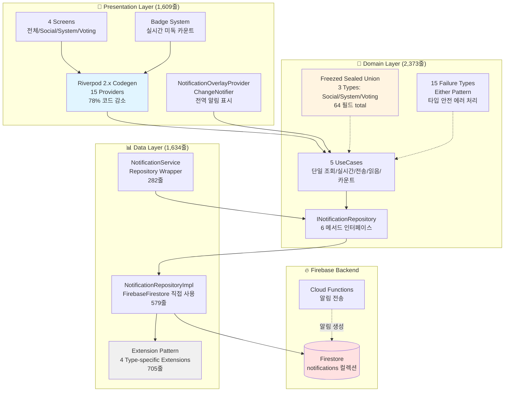

# Notifications Feature - 통합 문서

> 최종 업데이트: 2025-01-29 | 버전: 2.1.0 (Firebase-Centric v2.0 완료)

## 📋 목차

1. [전체 디렉토리 구조](#-전체-디렉토리-구조)
2. [아키텍처 개요](#-아키텍처-개요)
3. [핵심 기능](#-핵심-기능)
4. [빠른 참조 가이드](#-빠른-참조-가이드)
5. [레이어별 README 안내](#-레이어별-readme-안내)
6. [주요 파일 위치](#-주요-파일-위치)
7. [DI (Dependency Injection)](#-di-dependency-injection)
8. [통계](#-통계)
9. [시작하기](#-시작하기)
10. [자주 찾는 질문](#-자주-찾는-질문)
11. [기여 가이드](#-기여-가이드)
12. [학습 가이드](#-학습-가이드)
13. [문의 및 지원](#-문의-및-지원)
14. [관련 문서](#-관련-문서)

---

## 📁 전체 디렉토리 구조

```
lib/features/notifications/
├── 📊 data/                           # 데이터 레이어 (1,634줄)
│   ├── extensions/                    # Extension Pattern (4 files, 705줄)
│   │   ├── notification_extensions.dart           # 베이스 변환 (263줄)
│   │   ├── social_notification_extensions.dart    # Social 타입 (134줄)
│   │   ├── system_notification_extensions.dart    # System 타입 (159줄)
│   │   └── voting_notification_extensions.dart    # Voting 타입 (149줄)
│   ├── repositories/                  # Repository 구현
│   │   └── notification_repository_impl.dart      # Firebase-Centric (579줄)
│   └── services/                      # Data Layer Services
│       └── notification_service.dart              # Repository Wrapper (282줄)
│
├── 🎯 domain/                         # 도메인 레이어 (2,373줄)
│   ├── entities/                      # Freezed Sealed Union (3 types)
│   │   └── notification.dart                      # 64 필드 total (478줄)
│   ├── failures/                      # Either Pattern (15 types)
│   │   └── notification_failure.dart              # 상세 에러 처리 (261줄)
│   ├── repositories/                  # Repository 인터페이스
│   │   └── i_notification_repository.dart         # 6 메서드 (164줄)
│   ├── services/                      # Domain Service 인터페이스
│   │   └── i_notification_service.dart            # 9 메서드 (87줄)
│   ├── usecases/                      # 비즈니스 로직 (5 UseCases)
│   │   ├── get_user_notifications_usecase.dart    # 단일 조회 (113줄)
│   │   ├── watch_user_notifications_usecase.dart  # 실시간 구독 (128줄)
│   │   ├── send_notification_usecase.dart         # 알림 전송 (161줄)
│   │   ├── mark_as_read_usecase.dart              # 읽음 처리 (130줄)
│   │   └── watch_unread_count_usecase.dart        # 미독 카운트 (120줄)
│   └── value_objects/                 # 값 객체
│       └── notification_filter.dart               # 필터 조건 (96줄)
│
├── 🎨 presentation/                   # 프레젠테이션 레이어 (1,609줄)
│   ├── providers/                     # Riverpod 2.x Codegen (15 Providers)
│   │   ├── notification_providers.dart            # 258줄 (Codegen 전 1,200줄)
│   │   ├── notification_providers.g.dart          # Auto-generated (1,177줄)
│   │   ├── notification_badge_provider.dart       # Badge 전용 (102줄)
│   │   └── notification_overlay_provider.dart     # ChangeNotifier (308줄)
│   ├── screens/                       # 4개 화면
│   │   ├── notifications_list/                    # 전체 목록 (263줄)
│   │   ├── social_notifications/                  # Social 전용 (287줄)
│   │   ├── system_notifications/                  # System 전용 (312줄)
│   │   └── voting_notifications/                  # Voting 전용 (325줄)
│   ├── widgets/                       # Badge System (3 widgets)
│   │   └── notification_badge.dart                # 배지 컴포넌트 (114줄)
│   └── helpers/                       # 유틸리티
│       └── notification_ui_helpers.dart           # UI 헬퍼 (78줄)
│
└── 🔧 di/                             # Dependency Injection
    └── notification_di_module.dart                # GetIt 설정 (184줄)
```

**Total**: 22개 파일, 5,800+ 줄 (생성 코드 제외)

---

## 🏗 아키텍처 개요

Notifications Feature는 **Clean Architecture v4.0** 원칙에 따라 3개 레이어로 구성되며, **Firebase-Centric v2.0** 아키텍처를 적용합니다.



### 핵심 아키텍처 특징

1. **Freezed Sealed Union**: 단일 `Notification` Entity, 3가지 타입 (Social 18필드, System 16필드, Voting 30필드)
2. **Extension Pattern**: DataSource/DTO/Mapper 제거, Extension으로 Entity ↔ Firestore 직접 변환 (4개 파일, 705줄)
3. **Either Pattern**: `fpdart` 라이브러리로 타입 안전한 에러 처리 (15개 Failure 타입)
4. **Firebase-Centric v2.0**: Repository에서 FirebaseFirestore 직접 사용, 중간 레이어 제거
5. **Riverpod 2.x Codegen**: `@riverpod` 어노테이션으로 78% 코드 감소 (1,200줄 → 258줄)
6. **Type-Specific Filtering**: 3개 전용 StreamProvider로 타입별 알림 분리
7. **ChangeNotifier Overlay**: 전역 알림 표시 시스템 (Queue Service 통합)

---

## 🚀 핵심 기능

### 1. 📬 실시간 알림 시스템
- **3가지 타입**: Social (좋아요/댓글), System (공지사항), Voting (투표 요청)
- **Freezed Sealed Union**: `notification.when()` 패턴으로 타입 안전 처리
- **실시간 구독**: Firestore 스트림으로 즉시 반영
- **미독 카운트**: `watchUnreadCount` StreamProvider로 실시간 배지 업데이트

### 2. 🎯 타입별 필터링 시스템
- **3개 전용 StreamProvider**: `watchSocialNotifications`, `watchSystemNotifications`, `watchVotingNotifications`
- **whereType\<T\>() 패턴**: Freezed Sealed Union과 완벽 통합
- **타입별 화면**: 각 타입 전용 UI 및 액션 최적화
- **성능 최적화**: 필요한 타입만 구독하여 불필요한 리빌드 방지

### 3. 🔔 전역 알림 오버레이
- **NotificationOverlayProvider**: ChangeNotifier 기반 전역 상태 관리
- **NotificationQueueService 통합**: 실시간 스트림 구독 및 표시
- **Freezed when() 라우팅**: 타입별 Dialog 자동 선택
- **자동 읽음 처리**: 투표 참여 시 MarkAsReadUseCase 자동 호출

### 4. 📊 배지 시스템
- **3개 위젯**: NotificationBadge (기본), NotificationIconWithBadge (아이콘+배지), NotificationAppBarAction (AppBar 통합)
- **99+ 표시**: 대량 미독 알림 간결 표시
- **실시간 업데이트**: `watchUnreadCountProvider` StreamProvider 구독
- **AsyncValue.when()**: 로딩/에러/데이터 상태 자동 처리

### 5. 🔧 Riverpod 2.x Codegen
- **78% 코드 감소**: 1,200줄 → 258줄 (`.g.dart` 파일 자동 생성)
- **15개 Provider**: UseCase(5), Stream(4), 타입 필터링(3), Future(1), Notifier(2)
- **타입 안전**: 컴파일 타임 Provider 타입 검증
- **보일러플레이트 제거**: `@riverpod` 어노테이션으로 Provider family/autoDispose 자동

### 6. ⚠️ 상세 에러 처리
- **15개 Failure 타입**: Network, Server, NotFound, Permission, InvalidData, Timeout, Cancelled, Unknown, InvalidNotificationType, DuplicateNotification, ExpiredNotification, NotificationSendFailed, ExceedMaxNotifications, InvalidRecipient, ServiceUnavailable
- **Either<Failure, T> 패턴**: 모든 UseCase에서 타입 안전 에러 반환
- **UI 레벨 처리**: `AsyncValue.when(error: ...)` 또는 `Either.fold()`로 일관된 처리

### 7. 🔄 Idempotency (중복 방지)
- **UUID v4 eventId**: 각 알림 전송/읽음 처리에 고유 ID
- **IdempotencyService**: GetIt 전역 서비스로 5분 TTL 캐시
- **Repository 레벨 적용**: 네트워크 재시도 시에도 중복 방지 보장

---

## 🗺 빠른 참조 가이드

| 찾고자 하는 내용 | 참조할 문서 | 섹션 |
|---|---|---|
| **전체 아키텍처 이해** | 현재 문서 | [아키텍처 개요](#-아키텍처-개요) |
| **Firebase-Centric v2.0 구조** | [Data Layer README](./data/README.md) | 아키텍처 개요 |
| **Extension Pattern 사용법** | [Data Layer README](./data/README.md) | Extension Pattern |
| **Freezed Sealed Union 구조** | [Domain Layer README](./domain/README.md) | Notification Entity |
| **15가지 Failure 타입** | [Domain Layer README](./domain/README.md) | Notification Failure |
| **UseCase 비즈니스 로직** | [Domain Layer README](./domain/README.md) | UseCases |
| **Riverpod Codegen 사용법** | [Presentation Layer README](./presentation/README.md) | Riverpod 2.x Codegen |
| **타입별 필터링 구현** | [Presentation Layer README](./presentation/README.md) | 타입별 필터링 Providers |
| **전역 오버레이 시스템** | [Presentation Layer README](./presentation/README.md) | NotificationOverlayProvider |
| **Badge 위젯 사용** | [Presentation Layer README](./presentation/README.md) | Badge System |
| **DI 설정** | 현재 문서 | [DI 섹션](#-di-dependency-injection) |
| **새 기능 추가 방법** | 각 레이어 README | 새로운 기능 추가 가이드 |

---

## 📚 레이어별 README 안내

### 📊 Data Layer README
**파일**: [./data/README.md](./data/README.md) (1,634줄)

**주요 내용**:
- ✅ **Firebase-Centric v2.0 완료**: DataSource/DTO/Mapper 레이어 제거
- 🔄 **Extension Pattern**: 4개 타입별 Extension 파일 (705줄)
  - `notification_extensions.dart`: 베이스 변환 로직 (263줄)
  - `social_notification_extensions.dart`: Social 타입 전용 (134줄)
  - `system_notification_extensions.dart`: System 타입 전용 (159줄)
  - `voting_notification_extensions.dart`: Voting 타입 전용 (149줄)
- 🗄️ **NotificationRepositoryImpl**: FirebaseFirestore 직접 사용 (579줄)
  - 6개 Repository 메서드 구현
  - Extension 메서드로 Entity ↔ Firestore 변환
  - IdempotencyService 통합
- 🛠️ **NotificationService**: Repository Wrapper (282줄)
  - INotificationService 인터페이스 구현
  - 실시간 스트림 브로드캐스트
  - 9개 헬퍼 메서드 (markAsRead, reshowNotification, deleteNotification 등)

**읽어야 할 때**:
- Firebase 데이터 구조 이해 필요 시
- Entity ↔ Firestore 변환 로직 확인 시
- 새로운 알림 타입 추가 시 Extension 작성법
- Repository 구현 방식 학습 시

### 🎯 Domain Layer README
**파일**: [./domain/README.md](./domain/README.md) (2,373줄)

**주요 내용**:
- 🧊 **Freezed Sealed Union**: 단일 `Notification` Entity
  - `SocialNotification`: 18 필드 (senderId, postId, commentId, likeId...)
  - `SystemNotification`: 16 필드 (priority, category, actionUrl...)
  - `VotingNotification`: 30 필드 (postId, optionA, optionB, votes...)
  - Total: 64 필드, `notification.when()` 패턴으로 타입 안전 처리
- ⚠️ **15개 Failure 타입**: Network, Server, NotFound, Permission, InvalidData, Timeout, Cancelled, Unknown + 7개 Notifications 전용
  - DuplicateNotification, ExpiredNotification, NotificationSendFailed
  - ExceedMaxNotifications, InvalidRecipient, ServiceUnavailable
  - InvalidNotificationType
- 🎯 **5개 UseCases**: 모두 `Either<Failure, T>` 패턴
  - GetUserNotificationsUseCase: 단일 조회
  - WatchUserNotificationsUseCase: 실시간 스트림
  - SendNotificationUseCase: 알림 전송 (중복 방지)
  - MarkAsReadUseCase: 읽음 처리 (중복 방지)
  - WatchUnreadCountUseCase: 미독 카운트 실시간
- 🔧 **Repository 인터페이스**: 6개 메서드 정의
- 📦 **Value Objects**: NotificationFilter (타입/읽음 여부/만료 제외 필터)

**읽어야 할 때**:
- 비즈니스 로직 이해 필요 시
- 새로운 UseCase 추가 시
- Entity 필드 구조 확인 시
- Failure 타입별 에러 처리 방법 학습 시

### 🎨 Presentation Layer README
**파일**: [./presentation/README.md](./presentation/README.md) (1,609줄)

**주요 내용**:
- 🔄 **Riverpod 2.x Codegen**: 78% 코드 감소 (1,200줄 → 258줄)
  - `@riverpod` 어노테이션
  - 자동 생성: `notification_providers.g.dart` (1,177줄)
  - 15개 Provider: UseCase(5) + Stream(4) + 타입 필터링(3) + Future(1) + Notifier(2)
- 🎯 **타입별 필터링 StreamProvider**:
  - `watchSocialNotificationsProvider`: `whereType<SocialNotification>()`
  - `watchSystemNotificationsProvider`: `whereType<SystemNotification>()`
  - `watchVotingNotificationsProvider`: `whereType<VotingNotification>()`
- 🔔 **NotificationOverlayProvider**: ChangeNotifier 기반 전역 알림 표시
  - NotificationQueueService 스트림 구독
  - `notification.when()` 패턴으로 타입별 Dialog 라우팅
  - Vote 처리 시 MarkAsReadUseCase 자동 호출
- 📊 **Badge System**: 3개 위젯
  - NotificationBadge: 기본 배지 (count, 99+ 표시)
  - NotificationIconWithBadge: 아이콘 + 배지 조합
  - NotificationAppBarAction: AppBar 통합 위젯 (StreamProvider 구독)
- 📱 **4개 Screen**: 전체/Social/System/Voting 알림 목록
  - ConsumerWidget 패턴
  - AsyncValue.when() 자동 상태 처리
  - 타입별 전용 StreamProvider 사용

**읽어야 할 때**:
- UI 구현 방법 확인 시
- Riverpod Codegen 사용법 학습 시
- 새로운 화면/위젯 추가 시
- 타입별 필터링 구현 방법 이해 시

---

## 📍 주요 파일 위치

### 알림 전송 플로우
```
Firebase Functions (Cloud Functions)
  └─> Firestore: notifications 컬렉션에 문서 생성
        └─> NotificationRepositoryImpl.watchUserNotifications()
              └─> Extension: .toEntity() 변환
                    └─> WatchUserNotificationsUseCase
                          └─> watchUserNotificationsProvider (StreamProvider)
                                ├─> NotificationsListWidget (전체 목록)
                                ├─> watchSocialNotificationsProvider → SocialNotificationsWidget
                                ├─> watchSystemNotificationsProvider → SystemNotificationsWidget
                                └─> watchVotingNotificationsProvider → VotingNotificationsWidget
```

**관련 파일**:
- 📁 `lib/features/notifications/data/repositories/notification_repository_impl.dart:156-189` - watchUserNotifications 구현
- 📁 `lib/features/notifications/data/extensions/notification_extensions.dart:15-78` - toEntity() 변환
- 📁 `lib/features/notifications/domain/usecases/watch_user_notifications_usecase.dart:45-69` - UseCase 로직
- 📁 `lib/features/notifications/presentation/providers/notification_providers.dart:42-56` - StreamProvider 정의
- 📁 `lib/features/notifications/presentation/providers/notification_providers.dart:100-114` - 타입 필터링 예시

### 알림 읽음 처리 플로우
```
NotificationsListWidget: onTap 이벤트
  └─> markAsReadProvider.notifier.call() (Notifier Provider)
        └─> MarkAsReadUseCase: Idempotency 체크
              └─> NotificationRepositoryImpl.markAsRead()
                    └─> Firestore: isRead = true 업데이트
                          └─> 실시간 스트림으로 UI 자동 업데이트
```

**관련 파일**:
- 📁 `lib/features/notifications/presentation/screens/notifications_list/notifications_list_widget.dart:89-97` - onTap 핸들러
- 📁 `lib/features/notifications/presentation/providers/notification_providers.dart:173-196` - MarkAsReadNotifier
- 📁 `lib/features/notifications/domain/usecases/mark_as_read_usecase.dart:45-81` - UseCase + Idempotency
- 📁 `lib/features/notifications/data/repositories/notification_repository_impl.dart:222-264` - Repository 구현

### 전역 오버레이 플로우
```
NotificationQueueService.showNotificationStream (app-wide service)
  └─> NotificationOverlayProvider.startListening() 구독
        └─> _handleNotification()
              └─> notification.when()
                    ├─> social: _showSocialDialog()
                    ├─> system: _showSystemDialog()
                    └─> voting: _showVotingDialog()
                          └─> Vote 버튼 클릭
                                ├─> SubmitVoteUseCase
                                └─> MarkAsReadUseCase
```

**관련 파일**:
- 📁 `lib/services/notification/notification_queue_service.dart` - 전역 Queue Service (app-wide)
- 📁 `lib/features/notifications/presentation/providers/notification_overlay_provider.dart:58-81` - startListening()
- 📁 `lib/features/notifications/presentation/providers/notification_overlay_provider.dart:83-107` - _handleNotification()
- 📁 `lib/features/notifications/presentation/providers/notification_overlay_provider.dart:187-227` - _handleVote()

### Badge 업데이트 플로우
```
NotificationAppBarAction (AppBar 위젯)
  └─> watchUnreadCountProvider(userId) 구독 (StreamProvider)
        └─> WatchUnreadCountUseCase
              └─> NotificationRepositoryImpl.getUnreadNotificationCount()
                    └─> Firestore: isRead == false 카운트 실시간 스트림
                          └─> AsyncValue.when()
                                └─> NotificationIconWithBadge(count: X)
```

**관련 파일**:
- 📁 `lib/features/notifications/presentation/providers/notification_badge_provider.dart:26-53` - NotificationAppBarAction
- 📁 `lib/features/notifications/presentation/providers/notification_providers.dart:72-85` - watchUnreadCountProvider
- 📁 `lib/features/notifications/domain/usecases/watch_unread_count_usecase.dart:43-66` - UseCase
- 📁 `lib/features/notifications/data/repositories/notification_repository_impl.dart:191-220` - Repository 스트림
- 📁 `lib/features/notifications/presentation/widgets/notification_badge.dart:13-61` - Badge 위젯

---

## 🔧 DI (Dependency Injection)

Notifications Feature는 **GetIt** 기반 DI를 사용하며, `notification_di_module.dart`에서 모든 의존성을 등록합니다.

### DI 구조
```dart
// lib/features/notifications/di/notification_di_module.dart

void registerNotificationModule(GetIt getIt) {
  // 1. Services (Singleton)
  _registerServices(getIt);

  // 2. Repository (Singleton)
  _registerRepository(getIt);

  // 3. UseCases (Factory)
  _registerUseCases(getIt);

  // 4. Providers (Singleton)
  _registerProviders(getIt);
}
```

### 등록된 의존성

#### Services (3개)
```dart
getIt.registerLazySingleton<FCMService>(() => FCMService());

getIt.registerLazySingleton<INotificationService>(
  () => NotificationService(
    repository: getIt<INotificationRepository>(),
  ),
);

getIt.registerLazySingleton<NotificationQueueService>(
  () => NotificationQueueService(
    notificationService: getIt<INotificationService>(),
    fcmService: getIt<FCMService>(),
  ),
);
```

#### Repository (1개)
```dart
getIt.registerLazySingleton<INotificationRepository>(
  () => NotificationRepositoryImpl(
    firestore: FirebaseFirestore.instance,
    idempotencyService: getIt<IdempotencyService>(),
  ),
);
```

#### UseCases (5개 - Factory)
```dart
getIt.registerFactory(() => GetUserNotificationsUseCase(getIt<INotificationRepository>()));
getIt.registerFactory(() => WatchUserNotificationsUseCase(getIt<INotificationRepository>()));
getIt.registerFactory(() => SendNotificationUseCase(getIt<INotificationRepository>()));
getIt.registerFactory(() => MarkAsReadUseCase(getIt<INotificationRepository>()));
getIt.registerFactory(() => WatchUnreadCountUseCase(getIt<INotificationRepository>()));
```

#### Providers (1개)
```dart
getIt.registerLazySingleton<NotificationOverlayProvider>(
  () => NotificationOverlayProvider(
    queueService: getIt<NotificationQueueService>(),
    markAsRead: getIt<MarkAsReadUseCase>(),
  ),
);
```

### Riverpod Provider에서 GetIt 사용
```dart
// lib/features/notifications/presentation/providers/notification_providers.dart

@riverpod
WatchUserNotificationsUseCase watchUserNotificationsUseCase(Ref ref) {
  return GetIt.instance<WatchUserNotificationsUseCase>();
}

@riverpod
Stream<List<Notification>> watchUserNotifications(Ref ref, String userId) {
  final usecase = ref.watch(watchUserNotificationsUseCaseProvider);
  return usecase(userId);
}
```

**통합 방식**:
- **GetIt**: Domain/Data Layer 의존성 관리 (싱글톤/팩토리)
- **Riverpod**: Presentation Layer 상태 관리 (Provider로 GetIt 래핑)
- **장점**: Clean Architecture 레이어 분리 유지, Riverpod의 상태 관리 이점 활용

---

## 📊 통계

| 항목 | 수치 | 비고 |
|---|---|---|
| **총 파일 수** | 22개 | 생성 파일 제외 |
| **총 코드 라인** | 5,800+ | `.g.dart` 제외 시 |
| **Data Layer** | 1,634줄 | 6개 파일 |
| **Domain Layer** | 2,373줄 | 9개 파일 |
| **Presentation Layer** | 1,609줄 | 11개 파일 (생성 파일 제외) |
| **DI Module** | 184줄 | 1개 파일 |
| **Entity 타입** | 3개 | Social, System, Voting (Sealed Union) |
| **Entity 필드 합계** | 64개 | Social 18 + System 16 + Voting 30 |
| **Failure 타입** | 15개 | 8 공통 + 7 Notifications 전용 |
| **Repository 메서드** | 6개 | get, watch, send, markAsRead, delete, getUnreadCount |
| **UseCases** | 5개 | 모두 Either Pattern |
| **Extension 파일** | 4개 | 타입별 toEntity/toFirestore 변환 (705줄) |
| **Riverpod Providers** | 15개 | UseCase 5 + Stream 4 + 타입 필터링 3 + Future 1 + Notifier 2 |
| **Codegen 효과** | 78% 감소 | 1,200줄 → 258줄 |
| **Screens** | 4개 | 전체/Social/System/Voting |
| **Badge Widgets** | 3개 | Badge, IconWithBadge, AppBarAction |

### 아키텍처 패턴 비교 (Chat vs Notifications)

| 패턴 | Chat Feature | Notifications Feature |
|---|---|---|
| **Entity 구조** | 3개 독립 Entity | 1개 Sealed Union (3 types) |
| **Failure 타입** | 10개 | 15개 (더 상세) |
| **Extension 파일** | 3개 (608줄) | 4개 (705줄, 타입별 분리) |
| **Repository 메서드** | 13개 | 6개 (집중된 기능) |
| **UseCases** | 12개 | 5개 (핵심 기능) |
| **Riverpod 패턴** | Manual Providers | Codegen (`@riverpod`) |
| **Provider 코드량** | 약 800줄 | 258줄 (78% 감소) |
| **타입 필터링** | N/A | 3개 전용 StreamProvider |
| **전역 상태** | ChatProvider | NotificationOverlayProvider |
| **Badge System** | N/A | 3개 위젯 (99+ 표시) |

---

## 🚀 시작하기

### 시나리오 1: 새로운 화면에서 알림 목록 표시

```dart
import 'package:flutter_riverpod/flutter_riverpod.dart';
import 'package:firebase_auth/firebase_auth.dart';

class MyNotificationsPage extends ConsumerWidget {
  @override
  Widget build(BuildContext context, WidgetRef ref) {
    final userId = FirebaseAuth.instance.currentUser?.uid ?? '';

    // 실시간 알림 스트림 구독
    final notificationsAsync = ref.watch(
      watchUserNotificationsProvider(userId),
    );

    // AsyncValue.when()으로 자동 상태 처리
    return notificationsAsync.when(
      loading: () => CircularProgressIndicator(),
      error: (error, stack) => Text('Error: ${error.toString()}'),
      data: (notifications) {
        return ListView.builder(
          itemCount: notifications.length,
          itemBuilder: (context, index) {
            final notif = notifications[index];

            // Freezed when() 패턴으로 타입별 처리
            return notif.when(
              social: (id, userId, type, isRead, createdAt, expiresAt,
                       senderId, senderName, senderAvatar, postId,
                       commentId, likeId, message, imageUrl, actionUrl,
                       senderRole, postTitle, postImageUrl) {
                return ListTile(
                  leading: CircleAvatar(backgroundImage: NetworkImage(senderAvatar)),
                  title: Text(senderName),
                  subtitle: Text(message),
                  trailing: !isRead ? Icon(Icons.circle, size: 8, color: Colors.blue) : null,
                );
              },
              system: (id, userId, type, isRead, createdAt, expiresAt,
                       title, message, imageUrl, actionUrl, priority,
                       category, isActionable, actionLabel, metadata, icon) {
                return ListTile(
                  leading: Icon(icon != null ? IconData(int.parse(icon)) : Icons.notifications),
                  title: Text(title),
                  subtitle: Text(message),
                  trailing: priority == 'high' ? Icon(Icons.priority_high, color: Colors.red) : null,
                );
              },
              voting: (id, userId, type, isRead, createdAt, expiresAt,
                       postId, postTitle, senderId, senderName, senderAvatar,
                       optionA, optionB, optionAImages, optionBImages,
                       currentVotesA, currentVotesB, voteEndTime, voteStatus,
                       targetAudience, questionContext, categoryTags, difficulty,
                       estimatedTime, rewardPoints, votingHistory, relatedPosts,
                       aiRecommendationScore, userInterestMatch) {
                return ListTile(
                  leading: CircleAvatar(backgroundImage: NetworkImage(senderAvatar)),
                  title: Text('$senderName님의 투표 요청'),
                  subtitle: Text(postTitle),
                  trailing: Icon(Icons.how_to_vote),
                );
              },
            );
          },
        );
      },
    );
  }
}
```

### 시나리오 2: 특정 타입만 필터링 (Social만 표시)

```dart
class SocialOnlyPage extends ConsumerWidget {
  @override
  Widget build(BuildContext context, WidgetRef ref) {
    final userId = FirebaseAuth.instance.currentUser?.uid ?? '';

    // Social 알림만 필터링된 StreamProvider 사용
    final socialNotificationsAsync = ref.watch(
      watchSocialNotificationsProvider(userId),
    );

    return socialNotificationsAsync.when(
      loading: () => CircularProgressIndicator(),
      error: (error, stack) => ErrorWidget(error),
      data: (notifications) {
        // notifications는 이미 SocialNotification 타입만 포함
        return ListView.builder(
          itemCount: notifications.length,
          itemBuilder: (context, index) {
            final social = notifications[index] as SocialNotification;
            return ListTile(
              title: Text(social.senderName),
              subtitle: Text(social.message),
              trailing: !social.isRead ? Badge() : null,
            );
          },
        );
      },
    );
  }
}
```

### 시나리오 3: 알림 읽음 처리

```dart
class NotificationItem extends ConsumerWidget {
  final Notification notification;

  @override
  Widget build(BuildContext context, WidgetRef ref) {
    return InkWell(
      onTap: () async {
        if (!notification.isRead) {
          // MarkAsReadNotifier를 통한 읽음 처리
          await ref.read(markAsReadNotifierProvider.notifier).call(
            notificationId: notification.id,
            userId: notification.userId,
          );
        }

        // 액션 URL로 이동 (타입별 처리)
        notification.when(
          social: (..., actionUrl, ...) {
            if (actionUrl != null) context.push(actionUrl);
          },
          system: (..., actionUrl, ...) {
            if (actionUrl != null) context.push(actionUrl);
          },
          voting: (...) {
            context.push('/chatDetail?chatId=ai_assistant_${notification.userId}');
          },
        );
      },
      child: ListTile(
        title: Text(notification.when(
          social: (..., message, ...) => message,
          system: (..., title, ...) => title,
          voting: (..., postTitle, ...) => postTitle,
        )),
      ),
    );
  }
}
```

### 시나리오 4: AppBar에 배지 추가

```dart
class MyAppBar extends StatelessWidget implements PreferredSizeWidget {
  @override
  Widget build(BuildContext context) {
    return AppBar(
      title: Text('My App'),
      actions: [
        // NotificationAppBarAction이 자동으로 미독 카운트 구독
        NotificationAppBarAction(
          icon: Icons.notifications,
          iconColor: Colors.white,
          badgeColor: Colors.red,
          onPressed: () => context.pushNamed('notificationsList'),
        ),
      ],
    );
  }

  @override
  Size get preferredSize => Size.fromHeight(kToolbarHeight);
}
```

---

## ❓ 자주 찾는 질문

<details>
<summary><strong>Q1: Notifications Feature가 Chat Feature와 다른 점은?</strong></summary>

**A**: 주요 차이점은 다음과 같습니다:

1. **Entity 구조**:
   - Chat: 3개 독립 Entity (ChatModel, MessageModel, GroupChatModel)
   - Notifications: 1개 Sealed Union (Social/System/Voting 타입)

2. **타입별 필터링**:
   - Chat: 타입 구분 없음
   - Notifications: 3개 전용 StreamProvider (`watchSocialNotifications` 등)

3. **Riverpod 패턴**:
   - Chat: Manual Provider 정의 (약 800줄)
   - Notifications: Codegen (`@riverpod`, 258줄) - 78% 코드 감소

4. **전역 상태**:
   - Chat: ChatProvider (채팅방 상태 관리)
   - Notifications: NotificationOverlayProvider (전역 알림 표시)

5. **Badge System**:
   - Chat: N/A
   - Notifications: 3개 위젯 (Badge, IconWithBadge, AppBarAction)

6. **Extension 파일**:
   - Chat: 3개 (각 Entity별)
   - Notifications: 4개 (베이스 + 3 타입별)

7. **Failure 타입**:
   - Chat: 10개
   - Notifications: 15개 (더 상세한 에러 처리)

</details>

<details>
<summary><strong>Q2: Freezed Sealed Union을 왜 사용하나요?</strong></summary>

**A**: Sealed Union의 장점:

1. **타입 안전성**: 컴파일 타임에 모든 케이스 처리 강제
   ```dart
   notification.when(
     social: (...) => handleSocial(),
     system: (...) => handleSystem(),
     voting: (...) => handleVoting(),
     // 하나라도 누락 시 컴파일 에러
   );
   ```

2. **코드 중복 제거**: 공통 필드는 베이스에만 정의
   - 공통: `id`, `userId`, `type`, `isRead`, `createdAt`, `expiresAt`
   - 타입별: 각각의 특수 필드만 추가

3. **확장 용이성**: 새 타입 추가 시 모든 when() 호출이 컴파일 에러 발생
   - 누락된 처리 자동 감지
   - IDE 자동 완성 지원

4. **패턴 매칭**: Dart의 패턴 매칭과 완벽 통합
   ```dart
   if (notification is SocialNotification) {
     // 자동 타입 캐스팅
     print(notification.senderName);
   }
   ```

</details>

<details>
<summary><strong>Q3: Riverpod Codegen이 일반 Provider보다 나은 이유는?</strong></summary>

**A**: Codegen의 이점:

1. **코드 감소**: 78% 감소 (1,200줄 → 258줄)
   - Provider family 보일러플레이트 자동 생성
   - autoDispose 자동 처리
   - 타입 추론 자동화

2. **타입 안전성**: 컴파일 타임 타입 검증
   ```dart
   // Manual: 런타임 에러 가능
   final provider = Provider<MyType>((ref) => getIt<MyType>());

   // Codegen: 컴파일 타임 검증
   @riverpod
   MyType myType(Ref ref) => getIt<MyType>();
   ```

3. **유지보수성**: Provider 정의와 로직이 하나의 함수로 통합
   ```dart
   // Before (Manual)
   final watchUserNotificationsUseCaseProvider = Provider<WatchUserNotificationsUseCase>(...);
   final watchUserNotificationsProvider = StreamProvider.family<List<Notification>, String>(...);

   // After (Codegen)
   @riverpod
   Stream<List<Notification>> watchUserNotifications(Ref ref, String userId) {
     final usecase = ref.watch(watchUserNotificationsUseCaseProvider);
     return usecase(userId);
   }
   ```

4. **IDE 지원**: 자동 완성, 리팩토링, 네비게이션 개선

5. **성능**: build_runner가 최적화된 코드 생성

</details>

<details>
<summary><strong>Q4: 타입별 필터링 StreamProvider는 어떻게 작동하나요?</strong></summary>

**A**: 타입별 필터링 구현:

```dart
@riverpod
Stream<List<Notification>> watchSocialNotifications(
  Ref ref,
  String userId,
) {
  final usecase = ref.watch(watchUserNotificationsUseCaseProvider);

  // whereType<T>()로 Sealed Union 타입 필터링
  return usecase(userId).asyncMap((notifications) {
    return notifications
        .whereType<SocialNotification>()  // Social만 추출
        .cast<Notification>()              // 다시 기본 타입으로 캐스팅
        .toList();
  });
}
```

**장점**:
1. **성능**: 각 화면이 필요한 타입만 구독 → 불필요한 리빌드 방지
2. **타입 안전**: `whereType<T>()`로 타입 보장
3. **독립성**: Social/System/Voting 화면이 서로 영향 없음
4. **확장성**: 새 타입 추가 시 Provider 하나만 추가

**사용 예**:
```dart
// Social 화면
final socialAsync = ref.watch(watchSocialNotificationsProvider(userId));

// System 화면
final systemAsync = ref.watch(watchSystemNotificationsProvider(userId));

// Voting 화면
final votingAsync = ref.watch(watchVotingNotificationsProvider(userId));
```

</details>

<details>
<summary><strong>Q5: NotificationOverlayProvider는 왜 ChangeNotifier를 사용하나요?</strong></summary>

**A**: ChangeNotifier 선택 이유:

1. **전역 스트림 구독**:
   - NotificationQueueService의 `showNotificationStream` 구독 필요
   - StreamSubscription 라이프사이클 관리 필요
   ```dart
   class NotificationOverlayProvider extends ChangeNotifier {
     StreamSubscription<Notification>? _subscription;

     void startListening() {
       _subscription = _queueService.showNotificationStream.listen(
         (notification) => _handleNotification(notification),
       );
     }

     @override
     void dispose() {
       _subscription?.cancel();
       super.dispose();
     }
   }
   ```

2. **Dialog 표시 제어**:
   - 전역 Dialog 표시/닫기 로직
   - UI와 독립적인 상태 관리

3. **GetIt 통합**:
   - DI 모듈에서 싱글톤으로 등록
   - main.dart에서 startListening() 호출

**대안 (Riverpod Provider) 불가 이유**:
- Riverpod Provider는 위젯 트리에 종속
- 앱 전체 라이프사이클 관리 어려움
- StreamSubscription dispose 타이밍 제어 복잡

</details>

<details>
<summary><strong>Q6: 새로운 알림 타입을 추가하려면?</strong></summary>

**A**: 4단계 프로세스:

**1. Domain Layer - Entity 수정**:
```dart
// lib/features/notifications/domain/entities/notification.dart

@freezed
sealed class Notification with _$Notification {
  // 기존 타입들...

  // 새 타입 추가
  const factory Notification.custom({
    // 공통 필드
    required String id,
    required String userId,
    required NotificationTypes type,
    required bool isRead,
    required DateTime createdAt,
    DateTime? expiresAt,
    // 타입 특수 필드
    required String customField1,
    String? customField2,
  }) = CustomNotification;
}
```

**2. Data Layer - Extension 추가**:
```dart
// lib/features/notifications/data/extensions/custom_notification_extensions.dart

extension CustomNotificationFirestoreX on CustomNotification {
  Map<String, dynamic> toFirestore() {
    return {
      'id': id,
      'userId': userId,
      'type': type.name,
      'isRead': isRead,
      'createdAt': Timestamp.fromDate(createdAt),
      'expiresAt': expiresAt != null ? Timestamp.fromDate(expiresAt!) : null,
      'customField1': customField1,
      'customField2': customField2,
    };
  }

  static CustomNotification fromFirestore(DocumentSnapshot doc) {
    final data = doc.data() as Map<String, dynamic>;
    return CustomNotification(
      id: doc.id,
      userId: data['userId'] ?? '',
      type: NotificationTypes.custom,
      isRead: data['isRead'] ?? false,
      createdAt: (data['createdAt'] as Timestamp).toDate(),
      expiresAt: data['expiresAt'] != null ? (data['expiresAt'] as Timestamp).toDate() : null,
      customField1: data['customField1'] ?? '',
      customField2: data['customField2'],
    );
  }
}
```

**3. Presentation Layer - 타입별 Provider 추가**:
```dart
// lib/features/notifications/presentation/providers/notification_providers.dart

@riverpod
Stream<List<Notification>> watchCustomNotifications(
  Ref ref,
  String userId,
) {
  final usecase = ref.watch(watchUserNotificationsUseCaseProvider);
  return usecase(userId).asyncMap((notifications) {
    return notifications
        .whereType<CustomNotification>()
        .cast<Notification>()
        .toList();
  });
}
```

**4. Presentation Layer - 화면 추가** (선택):
```dart
// lib/features/notifications/presentation/screens/custom_notifications/custom_notifications_widget.dart

class CustomNotificationsWidget extends ConsumerWidget {
  @override
  Widget build(BuildContext context, WidgetRef ref) {
    final userId = FirebaseAuth.instance.currentUser?.uid ?? '';
    final customNotificationsAsync = ref.watch(
      watchCustomNotificationsProvider(userId),
    );

    return customNotificationsAsync.when(
      loading: () => CircularProgressIndicator(),
      error: (error, stack) => ErrorWidget(error),
      data: (notifications) {
        return ListView.builder(
          itemCount: notifications.length,
          itemBuilder: (context, index) {
            final custom = notifications[index] as CustomNotification;
            return ListTile(
              title: Text(custom.customField1),
              subtitle: Text(custom.customField2 ?? ''),
            );
          },
        );
      },
    );
  }
}
```

**Note**: Freezed 재생성 필요
```bash
dart run build_runner build --delete-conflicting-outputs
```

</details>

<details>
<summary><strong>Q7: Badge 위젯의 99+ 표시는 어떻게 구현되나요?</strong></summary>

**A**: NotificationBadge 구현:

```dart
// lib/features/notifications/presentation/widgets/notification_badge.dart

class NotificationBadge extends StatelessWidget {
  final Widget child;
  final int count;
  final bool showZero;
  final Color? badgeColor;

  @override
  Widget build(BuildContext context) {
    if (count <= 0 && !showZero) {
      return child;  // 0이면 배지 숨김
    }

    // 99+ 표시 로직
    final displayCount = count > 99 ? '99+' : count.toString();

    return Stack(
      alignment: Alignment.topRight,
      children: [
        child,
        Positioned(
          right: 0,
          top: 0,
          child: Container(
            decoration: BoxDecoration(
              color: badgeColor ?? Colors.red,
              // 99+ 일 때 타원형, 아니면 원형
              shape: count > 99 ? BoxShape.rectangle : BoxShape.circle,
              borderRadius: count > 99 ? BorderRadius.circular(9) : null,
            ),
            constraints: BoxConstraints(
              minWidth: count > 99 ? 28 : 18,
              minHeight: 18,
            ),
            child: Center(
              child: Text(
                displayCount,
                style: TextStyle(
                  color: Colors.white,
                  fontSize: 10,
                  fontWeight: FontWeight.bold,
                ),
              ),
            ),
          ),
        ),
      ],
    );
  }
}
```

**AppBar 통합 (실시간 업데이트)**:
```dart
class NotificationAppBarAction extends ConsumerWidget {
  @override
  Widget build(BuildContext context, WidgetRef ref) {
    final userId = FirebaseAuth.instance.currentUser?.uid ?? '';

    // 실시간 미독 카운트 구독
    final unreadCountAsync = ref.watch(
      watchUnreadCountProvider(userId),
    );

    return unreadCountAsync.when(
      loading: () => NotificationIconWithBadge(count: 0),
      error: (error, stack) => NotificationIconWithBadge(count: 0),
      data: (count) => NotificationIconWithBadge(
        count: count,  // 자동으로 99+ 처리
        icon: Icons.notifications,
        onPressed: () => context.pushNamed('notificationsList'),
      ),
    );
  }
}
```

**장점**:
- 대량 알림 시 간결한 표시
- 실시간 업데이트 (Firestore 스트림)
- 재사용 가능한 위젯 (모든 화면에서 사용 가능)

</details>

---

## 🤝 기여 가이드

Notifications Feature에 기여하려면 다음 원칙을 따라주세요:

### Clean Architecture 원칙
1. **단방향 의존성**: Presentation → Domain ← Data (역방향 금지)
2. **Repository 인터페이스**: Domain Layer에 정의, Data Layer에서 구현
3. **Either Pattern**: 모든 UseCase는 `Either<Failure, T>` 반환
4. **Freezed 사용**: Entity와 Failure는 Freezed로 불변성 보장

### Firebase-Centric v2.0 원칙
1. **Extension Pattern**: DTO/Mapper 대신 Extension으로 변환
2. **직접 Firestore 사용**: Repository에서 FirebaseFirestore 직접 주입
3. **타입별 Extension**: 각 Sealed Union 타입별 toEntity/toFirestore 구현

### Riverpod Codegen 원칙
1. **@riverpod 어노테이션**: 모든 Provider는 Codegen 사용
2. **build_runner**: 변경 후 반드시 코드 재생성
3. **GetIt 래핑**: UseCase Provider에서 GetIt 인스턴스 반환

### 코드 작성 가이드
```dart
// ❌ 나쁜 예: Manual Provider 정의
final myProvider = Provider<MyType>((ref) {
  return GetIt.instance<MyType>();
});

// ✅ 좋은 예: Codegen 사용
@riverpod
MyType myType(Ref ref) {
  return GetIt.instance<MyType>();
}

// ❌ 나쁜 예: DTO 사용
class NotificationDTO {
  Map<String, dynamic> toJson() => ...;
  static fromJson(Map<String, dynamic> json) => ...;
}

// ✅ 좋은 예: Extension 사용
extension NotificationFirestoreX on Notification {
  Map<String, dynamic> toFirestore() => ...;
  static fromFirestore(DocumentSnapshot doc) => ...;
}

// ❌ 나쁜 예: 예외 throw
Future<void> markAsRead(String id) async {
  if (id.isEmpty) throw Exception('Invalid ID');
  await firestore.doc(id).update(...);
}

// ✅ 좋은 예: Either 반환
Future<Either<Failure, void>> markAsRead(String id) async {
  if (id.isEmpty) return Left(InvalidDataFailure());
  try {
    await firestore.doc(id).update(...);
    return Right(unit);
  } catch (e) {
    return Left(ServerFailure());
  }
}
```

### Pull Request 체크리스트
- [ ] Clean Architecture 원칙 준수
- [ ] Either Pattern 적용 (모든 UseCase)
- [ ] Freezed Sealed Union 사용 (Entity/Failure)
- [ ] Extension Pattern 적용 (Firestore 변환)
- [ ] Riverpod Codegen 사용 (Provider)
- [ ] build_runner 실행 완료
- [ ] 테스트 작성 (최소 80% 커버리지)
- [ ] README 업데이트 (새 기능 추가 시)

---

## 📚 학습 가이드

### 초보자 학습 경로
1. **Domain Layer 이해** (1-2일):
   - [Domain README](./domain/README.md) 읽기
   - Freezed Sealed Union 개념 학습
   - Either Pattern 이해
   - UseCase 구조 파악

2. **Data Layer 이해** (1-2일):
   - [Data README](./data/README.md) 읽기
   - Extension Pattern 학습
   - Firebase-Centric v2.0 개념 이해
   - Repository 구현 분석

3. **Presentation Layer 이해** (2-3일):
   - [Presentation README](./presentation/README.md) 읽기
   - Riverpod 2.x Codegen 학습
   - AsyncValue.when() 패턴 이해
   - 타입별 필터링 구현 분석

4. **실습** (2-3일):
   - [시작하기](#-시작하기) 섹션 예제 따라하기
   - 새로운 화면 추가해보기
   - Badge 위젯 커스터마이징

### 고급 개발자 학습 경로
1. **아키텍처 분석** (반나절):
   - 3-Layer 의존성 흐름 파악
   - Extension Pattern vs DTO/Mapper 비교
   - Riverpod Codegen 효과 분석 (78% 코드 감소)

2. **Sealed Union 심화** (반나절):
   - when() vs map() vs maybeWhen() 차이
   - copyWith 활용법
   - Freezed 코드 생성 원리

3. **성능 최적화** (1일):
   - StreamProvider 구독 최적화
   - 타입별 필터링으로 불필요한 리빌드 방지
   - AsyncValue 캐싱 전략

4. **테스트 전략** (1일):
   - Mock Repository 작성
   - UseCase 단위 테스트
   - Provider 통합 테스트
   - Widget 테스트

### 추천 학습 자료
- **Freezed 공식 문서**: https://pub.dev/packages/freezed
- **Riverpod Codegen 가이드**: https://riverpod.dev/docs/concepts/about_code_generation
- **fpdart Either Pattern**: https://pub.dev/packages/fpdart
- **Clean Architecture**: Uncle Bob의 Clean Architecture 책
- **Firebase-Centric 아키텍처**: 본 프로젝트 ARCHITECTURE.md

---

## 💬 문의 및 지원

### 내부 문서 참조
- **아키텍처 질문**: [ARCHITECTURE.md](/ARCHITECTURE.md)
- **전체 프로젝트**: [CLAUDE.md](/CLAUDE.md)
- **Firebase 규칙**: [firebase/SECURITY_RULES_UPDATE_GUIDE.md](/firebase/SECURITY_RULES_UPDATE_GUIDE.md)

### 레이어별 문의
- **Data Layer 관련**: [data/README.md](./data/README.md) FAQ 섹션
- **Domain Layer 관련**: [domain/README.md](./domain/README.md) FAQ 섹션
- **Presentation Layer 관련**: [presentation/README.md](./presentation/README.md) FAQ 섹션

### 개발팀 연락
- **기술 리더**: GitHub Issues에 질문 등록
- **코드 리뷰**: Pull Request에서 @mention
- **긴급 버그**: Slack #notifications-feature 채널

---

## 📖 관련 문서

### 내부 문서
- [Notifications Data Layer README](./data/README.md) - Firebase-Centric v2.0, Extension Pattern
- [Notifications Domain Layer README](./domain/README.md) - Freezed Sealed Union, 15 Failures, 5 UseCases
- [Notifications Presentation Layer README](./presentation/README.md) - Riverpod Codegen, 타입 필터링, Overlay, Badge
- [Notifications DI Module](./di/notification_di_module.dart) - GetIt 의존성 등록

### 프로젝트 전체 문서
- [프로젝트 개요](/CLAUDE.md)
- [시스템 아키텍처](/ARCHITECTURE.md)
- [변경 이력](/CHANGELOG.md)
- [문서화 인덱스](/index_document.md)

### 외부 참조
- [Freezed Package](https://pub.dev/packages/freezed)
- [Riverpod 2.x Documentation](https://riverpod.dev)
- [fpdart Functional Programming](https://pub.dev/packages/fpdart)
- [Firebase Firestore](https://firebase.google.com/docs/firestore)
- [GetIt Dependency Injection](https://pub.dev/packages/get_it)

---

**마지막 업데이트**: 2025-01-29
**버전**: 2.1.0 (Firebase-Centric v2.0 완료)
**관리자**: Notifications Feature Team
