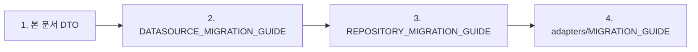
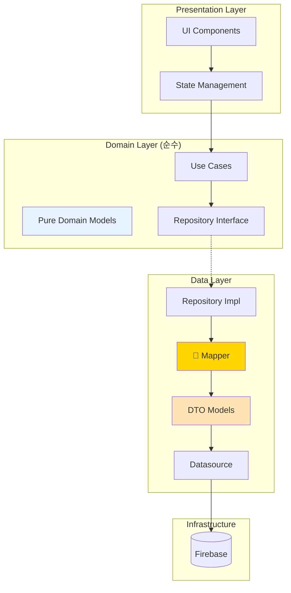

# 🔄 Notifications Feature DTO Pattern Migration Guide

> Domain-Data 분리를 위한 DTO 패턴 마이그레이션 가이드  
> **최종 업데이트**: 2025-01-10 | **버전**: 1.2.0
> **예상 시간**: 4시간 - MASTER_MIGRATION_GUIDE.md Phase 2의 일부
> **현재 상태**: ✅ Phase 1-4 완료 | 🔄 Phase 5 진행중 (66% 전체 진행률)
> 
> ⚠️ **Note**: Domain 레이어가 완료되어 DTO 마이그레이션 시작 준비가 완료되었습니다.

## 📌 Prerequisites (전제조건)

### 시작 전 확인사항
- [x] Domain 모델 분석 완료 (`/spawn inventory-scout "--depth 3 --scope lib/features/notifications --line-threshold 200"`)
- [x] Firebase 의존성 파악 완료 (`/spawn import-guardian "--scope notifications --mode detect"`)
- [x] 현재 모델 백업 완료 (`git stash` 또는 브랜치 생성)
- [ ] 테스트 환경 준비 완료

### 필요한 도구
- [SUBAGENTS_MANUAL.md](/docs/SUBAGENTS_MANUAL.md) 참조
- Git (패치 파일 적용용)
- Flutter/Dart SDK

## 🔗 다른 문서와의 연계

### 실행 순서


### 의존성 관계
- **Input**: Domain 모델 (Firebase 의존성 포함)
- **Output**: 
  - DTO 모델 (`data/models/`)
  - Mapper 클래스 (`data/mappers/`)
- **Required by**:
  - [DATASOURCE_MIGRATION_GUIDE.md](./DATASOURCE_MIGRATION_GUIDE.md): DTO ↔ Firebase Document 변환
  - [REPOSITORY_MIGRATION_GUIDE.md](./REPOSITORY_MIGRATION_GUIDE.md): Domain ↔ DTO 변환

## 📌 Executive Summary

알림 Feature의 Domain 모델이 Firebase에 직접 의존하는 심각한 아키텍처 위반을 해결하기 위한 마이그레이션 가이드입니다.
DTO 패턴을 도입하여 Domain을 순수하게 만들고, 변경에 강한 아키텍처를 구축합니다.

### 핵심 목표
- ✅ Domain 모델의 Firebase 의존성 완전 제거
- ✅ DTO 패턴으로 데이터 레이어 격리
- ✅ 타입별 알림 모델 분리로 타입 안정성 확보
- ✅ 테스트 가능한 순수 Domain 구축

## 🚨 현재 문제점 분석

### 1. Domain Layer의 인프라 의존
```dart
// ❌ 현재 문제: domain/models/notifications_model.dart
import 'package:cloud_firestore/cloud_firestore.dart';  // Domain이 Firebase 의존!

class NotificationsModel extends FirestoreRecord {  // Firebase 클래스 상속!
  DocumentReference reference;  // Firebase 타입 직접 사용!
  
  static NotificationsModel fromSnapshot(DocumentSnapshot snapshot) =>
      NotificationsModel._(
        snapshot.reference,
        mapFromFirestore(snapshot.data() as Map<String, dynamic>),
      );
}
```

### 2. 문제점 Impact 분석

| 문제 | 영향도 | 설명 |
|-----|--------|------|
| **테스트 불가능** | 🔴 Critical | Firebase 없이 단위 테스트 불가 |
| **변경 취약성** | 🔴 Critical | Firebase 스키마 변경 시 Domain 수정 필요 |
| **재사용성 저하** | 🟡 High | 다른 데이터 소스 사용 불가 |
| **의존성 역전 위반** | 🔴 Critical | Clean Architecture 원칙 위반 |

## 🎯 목표 아키텍처



## 🤖 서브에이전트 활용 전략

### Phase 1: 현재 상태 분석
```bash
# Domain 모델 복잡도 및 의존성 스캔
/spawn inventory-scout "--depth 3 --scope lib/features/notifications/domain --line-threshold 150"

# Firebase 의존성 위반 검출
/spawn import-guardian "--scope notifications/domain --mode detect"
```

### Phase 2: Domain 모델 순수화
```bash
# Firebase 의존성 제거를 위한 구조 분석
/spawn struct-weaver "--task mapper --mode detect --source lib/features/notifications/domain/models/notifications_model.dart"

# 패치 리뷰 후 적용
git apply patches/struct_weaver_notifications.diff
```

### Phase 3: DTO 생성 후 검증
```bash
# Domain 순수성 검증
/spawn import-guardian "--scope notifications/domain --mode detect"

# 빌드 및 테스트
/spawn build-sentinel "quick"
```

## 📋 마이그레이션 단계별 가이드

### Phase 1: 준비 및 백업 (30분)

#### 1.1 현재 코드 백업
```bash
# 백업 디렉토리 생성
mkdir -p backup/notifications_$(date +%Y%m%d)

# 현재 모델 백업
cp -r lib/features/notifications/domain/models/* backup/notifications_$(date +%Y%m%d)/
```

#### 1.2 의존성 분석
```dart
// 영향받는 파일 목록 작성
// - presentation/providers/notification_provider.dart
// - data/repositories/notification_repository_impl.dart
// - 기타 import하는 모든 파일
```

### Phase 2: 순수 Domain 모델 생성 (2시간)

#### 2.1 추상 Notification 클래스
```dart
// domain/models/notification.dart
abstract class Notification {
  final String id;
  final String userId;
  final NotificationType type;
  final DateTime createdAt;
  final bool isRead;
  
  // 비즈니스 로직 (Firebase 무관)
  bool get isExpired => DateTime.now().difference(createdAt).inDays > 7;
  bool get canInteract => !isRead && !isExpired;
  
  const Notification({
    required this.id,
    required this.userId,
    required this.type,
    required this.createdAt,
    required this.isRead,
  });
}
```

#### 2.2 타입별 Domain 모델
```dart
// domain/models/vote_notification.dart
class VoteNotification extends Notification {
  final String postId;
  final String postTitle;
  final List<String> imageUrlsA;
  final List<String> imageUrlsB;
  final VoteOptions voteOptions;
  final DateTime voteEndTime;
  
  // 투표 알림 특화 비즈니스 로직
  bool get hasImages => imageUrlsA.isNotEmpty || imageUrlsB.isNotEmpty;
  Duration get remainingTime => voteEndTime.difference(DateTime.now());
  bool get isVoteActive => remainingTime.inSeconds > 0;
  
  const VoteNotification({
    required super.id,
    required super.userId,
    required super.createdAt,
    required super.isRead,
    required this.postId,
    required this.postTitle,
    required this.imageUrlsA,
    required this.imageUrlsB,
    required this.voteOptions,
    required this.voteEndTime,
  }) : super(type: NotificationType.voteRequest);
}
```

### Phase 3: DTO 모델 구현 (2시간)

#### 3.1 기본 DTO 구조
```dart
// data/models/notification_dto.dart
import 'package:json_annotation/json_annotation.dart';
import 'package:cloud_firestore/cloud_firestore.dart';

part 'notification_dto.g.dart';

@JsonSerializable()
class NotificationDto {
  final String id;
  final String userId;  // Firebase field name
  final String type;
  final int createdAt;  // milliseconds
  final bool read;
  
  // 폴리모픽 필드들
  final String? postId;
  final String? postTitle;
  final List<String>? imageUrlsA;
  final List<String>? imageUrlsB;
  final Map<String, dynamic>? voteOptions;
  final int? voteEndTime;
  
  NotificationDto({
    required this.id,
    required this.userId,
    required this.type,
    required this.createdAt,
    required this.read,
    this.postId,
    this.postTitle,
    this.imageUrlsA,
    this.imageUrlsB,
    this.voteOptions,
    this.voteEndTime,
  });
  
  factory NotificationDto.fromJson(Map<String, dynamic> json) =>
      _$NotificationDtoFromJson(json);
      
  Map<String, dynamic> toJson() => _$NotificationDtoToJson(this);
  
  factory NotificationDto.fromFirestore(
    DocumentSnapshot<Map<String, dynamic>> doc,
  ) {
    final data = doc.data()!;
    return NotificationDto(
      id: doc.id,
      userId: data['userId'] as String,
      type: data['type'] as String,
      createdAt: (data['createdAt'] as Timestamp).millisecondsSinceEpoch,
      read: data['read'] as bool? ?? false,
      postId: data['postId'] as String?,
      postTitle: data['postTitle'] as String?,
      imageUrlsA: (data['imageUrlsA'] as List<dynamic>?)?.cast<String>(),
      imageUrlsB: (data['imageUrlsB'] as List<dynamic>?)?.cast<String>(),
      voteOptions: data['voteOptions'] as Map<String, dynamic>?,
      voteEndTime: data['voteEndTime'] != null 
          ? (data['voteEndTime'] as Timestamp).millisecondsSinceEpoch
          : null,
    );
  }
}
```

#### 3.2 JSON Serialization 생성
```bash
# pubspec.yaml에 의존성 추가
dependencies:
  json_annotation: ^4.8.1

dev_dependencies:
  build_runner: ^2.4.0
  json_serializable: ^6.7.1

# 코드 생성 실행
flutter pub run build_runner build --delete-conflicting-outputs
```

### Phase 4: Mapper 구현 (1.5시간)

#### 4.1 NotificationMapper 클래스
```dart
// data/mappers/notification_mapper.dart
import '../models/notification_dto.dart';
import '../../domain/models/notification.dart';
import '../../domain/models/vote_notification.dart';
import '../../domain/models/social_notification.dart';

class NotificationMapper {
  static Notification toDomain(NotificationDto dto) {
    switch (dto.type) {
      case 'vote_request':
        return _toVoteNotification(dto);
      case 'post_liked':
      case 'comment_added':
        return _toSocialNotification(dto);
      default:
        return _toSystemNotification(dto);
    }
  }
  
  static NotificationDto toDto(Notification domain) {
    if (domain is VoteNotification) {
      return _fromVoteNotification(domain);
    } else if (domain is SocialNotification) {
      return _fromSocialNotification(domain);
    } else {
      return _fromSystemNotification(domain);
    }
  }
  
  static VoteNotification _toVoteNotification(NotificationDto dto) {
    return VoteNotification(
      id: dto.id,
      userId: dto.userId,
      createdAt: DateTime.fromMillisecondsSinceEpoch(dto.createdAt),
      isRead: dto.read,
      postId: dto.postId!,
      postTitle: dto.postTitle ?? '',
      imageUrlsA: dto.imageUrlsA ?? [],
      imageUrlsB: dto.imageUrlsB ?? [],
      voteOptions: VoteOptions.fromMap(dto.voteOptions!),
      voteEndTime: DateTime.fromMillisecondsSinceEpoch(dto.voteEndTime!),
    );
  }
}
```

### Phase 5: Datasource 수정 (1시간)

#### 5.1 FirebaseNotificationDatasource
```dart
// data/datasources/firebase_notification_datasource.dart
import 'package:cloud_firestore/cloud_firestore.dart';
import '../models/notification_dto.dart';

class FirebaseNotificationDatasource {
  final FirebaseFirestore _firestore;
  
  FirebaseNotificationDatasource(this._firestore);
  
  // DTO 반환
  Future<NotificationDto?> getNotification(String id) async {
    final doc = await _firestore
        .collection('notifications')
        .doc(id)
        .get();
        
    if (!doc.exists) return null;
    
    return NotificationDto.fromFirestore(doc);
  }
  
  // Stream of DTOs
  Stream<List<NotificationDto>> getUserNotifications(String userId) {
    return _firestore
        .collection('notifications')
        .where('userId', isEqualTo: userId)
        .orderBy('createdAt', descending: true)
        .snapshots()
        .map((snapshot) => snapshot.docs
            .map((doc) => NotificationDto.fromFirestore(doc))
            .toList());
  }
  
  // Create notification
  Future<void> createNotification(NotificationDto dto) async {
    await _firestore
        .collection('notifications')
        .doc(dto.id)
        .set(dto.toJson());
  }
}
```

### Phase 6: Repository 리팩토링 (1시간)

#### 6.1 Repository Implementation 수정
```dart
// data/repositories/notification_repository_impl.dart
import '../../domain/repositories/i_notification_repository.dart';
import '../../domain/models/notification.dart';
import '../datasources/firebase_notification_datasource.dart';
import '../mappers/notification_mapper.dart';

class NotificationRepositoryImpl implements INotificationRepository {
  final FirebaseNotificationDatasource _datasource;
  
  NotificationRepositoryImpl(this._datasource);
  
  @override
  Future<Notification?> getNotification(String id) async {
    final dto = await _datasource.getNotification(id);
    if (dto == null) return null;
    
    return NotificationMapper.toDomain(dto);
  }
  
  @override
  Stream<List<Notification>> getUserNotifications(String userId) {
    return _datasource
        .getUserNotifications(userId)
        .map((dtos) => dtos
            .map((dto) => NotificationMapper.toDomain(dto))
            .toList());
  }
  
  @override
  Future<void> markAsRead(String notificationId) async {
    // Datasource를 통한 업데이트
    await _datasource.updateNotification(
      notificationId,
      {'read': true},
    );
  }
}
```

### Phase 7: Presentation Layer 수정 (30분)

#### 7.1 Import 경로 수정
```dart
// Before
import 'package:versus_space/features/notifications/domain/models/notifications_model.dart';

// After
import 'package:versus_space/features/notifications/domain/models/notification.dart';
import 'package:versus_space/features/notifications/domain/models/vote_notification.dart';
```

#### 7.2 Provider 수정
```dart
// presentation/providers/notification_provider.dart
class NotificationProvider extends ChangeNotifier {
  final INotificationRepository _repository;
  
  List<Notification> _notifications = [];  // 순수 Domain 모델 사용
  
  Stream<List<Notification>> get notificationStream =>
      _repository.getUserNotifications(currentUserId);
}
```

## 🧪 테스트 전략

### 1. Domain 모델 테스트
```dart
// test/domain/models/vote_notification_test.dart
void main() {
  group('VoteNotification', () {
    test('should calculate remaining time correctly', () {
      final notification = VoteNotification(
        voteEndTime: DateTime.now().add(Duration(minutes: 5)),
        // ... other fields
      );
      
      expect(notification.isVoteActive, isTrue);
      expect(notification.remainingTime.inMinutes, lessThanOrEqualTo(5));
    });
  });
}
```

### 2. Mapper 테스트
```dart
// test/data/mappers/notification_mapper_test.dart
void main() {
  group('NotificationMapper', () {
    test('should map VoteNotification correctly', () {
      final dto = NotificationDto(
        type: 'vote_request',
        // ... fields
      );
      
      final domain = NotificationMapper.toDomain(dto);
      
      expect(domain, isA<VoteNotification>());
    });
  });
}
```

## ⚠️ Breaking Changes

### Import 변경 필요 파일
- `lib/pages/notifications/*` - 모든 UI 컴포넌트
- `lib/components/notifications/*` - 알림 위젯
- `lib/services/notification_service.dart` - 서비스 레이어

### API 변경사항
| Before | After | Impact |
|--------|-------|--------|
| `NotificationsModel` | `Notification` (abstract) | Type 변경 |
| `.reference` | `.id` | Property 이름 |
| `FirestoreRecord` 상속 | 순수 클래스 | 상속 제거 |

## 📊 마이그레이션 체크리스트

- [x] Phase 1: 백업 및 분석 완료 ✅
- [x] Phase 2: Domain 모델 생성 ✅
  - [x] Abstract Notification
  - [x] VoteNotification
  - [x] SocialNotification
  - [x] SystemNotification
- [x] Phase 3: DTO 모델 구현 ✅
  - [x] NotificationDto
  - [x] VoteNotificationDto
  - [x] SocialNotificationDto
  - [x] SystemNotificationDto
  - [x] DTO Extensions
- [x] Phase 4: Mapper 구현 ✅
  - [x] NotificationMapper
  - [x] Error handling
- [x] Phase 5: Datasource 구현 ✅
  - [x] IRemoteNotificationDatasource
  - [x] ILocalNotificationDatasource
  - [x] FirebaseNotificationDatasource
  - [x] SharedPrefsNotificationDatasource
- [x] Phase 6: Repository 구현 ✅
  - [x] NotificationRepositoryImpl
  - [x] Mapper 통합
  - [x] 캐싱 로직
- [ ] Phase 7: Service/Adapter 정리 🔄 (60%)
  - [x] NotificationService 리팩토링
  - [ ] GlobalNotificationManager UI 분리
  - [ ] TargetAudienceService 정리
- [ ] Phase 8: DI 통합 및 테스트
  - [ ] GetIt 설정
  - [ ] Domain 테스트
  - [ ] Integration 테스트

## 🎯 Success Metrics

| Metric | Target | Description |
|--------|--------|-------------|
| **Firebase 의존성** | 0% in Domain | Domain에서 Firebase import 완전 제거 |
| **테스트 커버리지** | >80% | Domain 모델 단위 테스트 |
| **타입 안정성** | 100% | 컴파일 타임 타입 체크 |
| **변경 영향도** | <10 files | Mapper 외 수정 최소화 |

## 🚀 Next Steps

1. **즉시 시작**: Phase 1 백업부터 시작
2. **점진적 마이그레이션**: 한 타입씩 순차 변환
3. **테스트 우선**: 각 Phase마다 테스트 작성
4. **코드 리뷰**: 각 Phase 완료 시 리뷰

## 📚 참고 자료

- [Clean Architecture 원칙](../../ARCHITECTURE_RULES.md)
- [DTO Pattern Best Practices](https://martinfowler.com/eaaCatalog/dataTransferObject.html)
- [Flutter Clean Architecture](https://resocoder.com/flutter-clean-architecture-tdd/)

## 📝 완료된 Phase 산출물

### ✅ Phase 1-4: 기초 레이어 구현 완료

#### Phase 2: DTO 모델 (100% 완료)
**생성된 파일들:**
- `data/models/notification_dto.dart` - 기본 DTO 모델
- `data/models/vote_notification_dto.dart` - 투표 알림 DTO
- `data/models/social_notification_dto.dart` - 소셜 알림 DTO
- `data/models/system_notification_dto.dart` - 시스템 알림 DTO
- `data/models/dto_extensions.dart` - DTO 확장 유틸리티

#### Phase 3: Mapper (100% 완료)
**생성된 파일:**
- `data/mappers/notification_mapper.dart` - Domain ↔ DTO 변환 로직

#### Phase 4: DataSource (100% 완료)
**생성된 파일들:**
- `data/datasources/i_remote_notification_datasource.dart` - Remote 인터페이스
- `data/datasources/i_local_notification_datasource.dart` - Local 인터페이스
- `data/datasources/remote/firebase_notification_datasource.dart` - Firebase 구현
- `data/datasources/local/shared_prefs_notification_datasource.dart` - 로컬 캐싱 구현

#### Phase 5: Repository (100% 완료)
**생성된 파일:**
- `data/repositories/notification_repository_impl.dart` - Repository 구현체
  - Domain 인터페이스 구현
  - Mapper 통합
  - 캐싱 로직 포함
  - DataSource 조합

## 📝 Phase 7: Service/Adapter 정리 진행 상황 (현재 진행중)

### 완료된 작업 (60%)

#### ✅ NotificationService 리팩토링 완료
- **파일**: `data/adapters/notification_service.dart`
- **변경사항**:
  - Firebase 직접 호출 완전 제거 (5개 → 0개)
  - Repository 패턴 적용
  - 인터페이스 기반 의존성 주입 구현
- **개선 효과**:
  - 테스트 가능한 구조
  - Firebase 의존성 격리
  - Clean Architecture 준수

#### 🔄 GlobalNotificationManager 복구 완료
- **파일**: `data/adapters/global_notification_manager.dart`
- **수정사항**:
  - 컴파일 에러 해결
  - 누락된 import 추가
  - TODO 주석으로 향후 작업 표시

### 진행 중인 작업 (Phase 5.5)

#### 🚧 UI/Business 로직 분리
- **대상**: GlobalNotificationManager
- **계획**:
  1. IPostDatasource 인터페이스 생성
  2. NotificationUIManager와 연동
  3. NotificationCoordinator 구현
  4. app.dart 연동 수정

#### 📋 생성된 인터페이스
- `IChatDatasource`: Chat 기능 의존성 분리
- `IPostDatasource`: Post 기능 의존성 분리 (예정)

### 다음 단계
1. Phase 5.5 완료 (UI/Business 분리)
2. Phase 6: TargetAudienceService 정리
3. Phase 7: DI 설정 업데이트
4. Phase 8: 문서 최종 업데이트

---

*이 가이드는 알림 Feature의 DTO 패턴 마이그레이션을 위한 상세 지침서입니다.*  
*문의사항: Architecture Team*