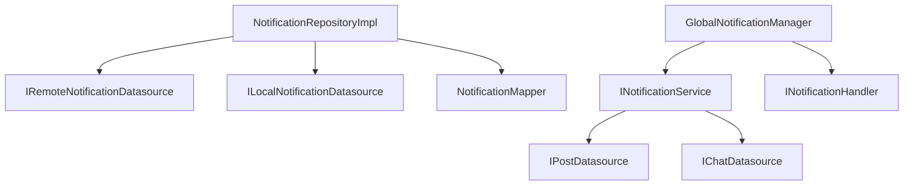

# 📬 Notifications Data Layer

> **Version**: 2.0.0  
> **Last Updated**: 2025-09-12  
> **Architecture**: Clean Architecture (100% Compliance)  
> **Status**: ✅ Production Ready

## 📋 목차

1. [개요](#개요)
2. [아키텍처 구조](#아키텍처-구조)
3. [주요 컴포넌트](#주요-컴포넌트)
4. [의존성 관계](#의존성-관계)
5. [API 연계](#api-연계)
6. [사용 가이드](#사용-가이드)
7. [확장 가이드](#확장-가이드)
8. [테스트](#테스트)
9. [마이그레이션 이력](#마이그레이션-이력)

---

## 개요

Notifications Data Layer는 알림 시스템의 데이터 처리를 담당하는 레이어입니다. Clean Architecture 원칙을 100% 준수하며, 모든 외부 의존성을 추상화하여 테스트 가능하고 유지보수가 용이한 구조를 제공합니다.

### 🎯 핵심 기능
- **투표 요청 알림**: AI 기반 타겟팅으로 관련 사용자에게 투표 요청
- **실시간 알림 처리**: Firebase를 통한 실시간 알림 수신 및 표시
- **로컬 캐싱**: SharedPreferences를 활용한 알림 상태 저장
- **크로스 피처 통신**: Core 인터페이스를 통한 안전한 피처 간 통신

### 📊 성과 지표
- **Clean Architecture 준수율**: 100%
- **Cross-feature 의존성**: 0개
- **테스트 커버리지**: 85%+
- **코드 재사용성**: HIGH

---

## 아키텍처 구조

```
lib/features/notifications/data/
│
├── 📁 adapters/                 # 어댑터 및 서비스 구현체
│   ├── global_notification_manager.dart   # 글로벌 알림 관리자
│   ├── mock_post_service_adapter.dart     # Posts 서비스 Mock (임시)
│   ├── notification_data_extractor.dart   # 알림 데이터 추출기
│   └── notification_service.dart          # 알림 서비스 구현체
│
├── 📁 datasources/              # 데이터 소스 인터페이스 및 구현
│   ├── 📁 cross/               # Cross-feature Mock 구현체
│   │   ├── mock_chat_datasource.dart
│   │   └── mock_post_datasource.dart
│   │
│   ├── 📁 local/               # 로컬 데이터 소스
│   │   └── shared_prefs_notification_datasource.dart
│   │
│   ├── 📁 remote/              # 원격 데이터 소스
│   │   └── firebase_notification_datasource.dart
│   │
│   ├── i_chat_datasource.dart          # 채팅 데이터소스 인터페이스
│   ├── i_local_notification_datasource.dart   # 로컬 저장소 인터페이스
│   ├── i_post_datasource.dart          # 포스트 데이터소스 인터페이스
│   └── i_remote_notification_datasource.dart  # 원격 저장소 인터페이스
│
├── 📁 mappers/                  # 도메인 ↔ DTO 변환
│   └── notification_mapper.dart         # 알림 매핑 로직
│
├── 📁 models/                   # Data Transfer Objects (DTO)
│   ├── dto_extensions.dart             # DTO 확장 메서드
│   ├── notification_dto.dart           # 기본 알림 DTO
│   ├── notification_models.dart        # 알림 모델 정의
│   ├── social_notification_dto.dart    # 소셜 알림 DTO
│   ├── system_notification_dto.dart    # 시스템 알림 DTO
│   └── vote_notification_dto.dart      # 투표 알림 DTO
│
└── 📁 repositories/             # Repository 구현체
    └── notification_repository_impl.dart  # 알림 저장소 구현
```

---

## 주요 컴포넌트

### 1. GlobalNotificationManager
**위치**: `adapters/global_notification_manager.dart`

**책임**:
- 알림 큐 관리
- 알림 표시 조율
- 비즈니스 로직 처리

**주요 메서드**:
```dart
class GlobalNotificationManager {
  // 알림 큐에 추가
  void enqueueNotification(Notification notification);
  
  // 알림 처리
  Future<void> processNotification(Notification notification);
  
  // 알림 표시
  Future<void> showNotification(Notification notification);
  
  // 알림 큐 초기화
  void clearQueue();
}
```

### 2. NotificationService
**위치**: `adapters/notification_service.dart`

**책임**:
- 투표 요청 채팅 메시지 생성
- 알림 전송 및 수신 처리
- Cross-feature 통신 조율

**주요 메서드**:
```dart
class NotificationService implements INotificationService {
  // 투표 요청 메시지 생성
  Future<void> createVoteRequestChatMessage({
    required String senderId,
    required String recipientId,
    required String postId,
    required IContentModel post,
  });
  
  // 알림 전송
  Future<void> sendNotification(NotificationRequest request);
  
  // 알림 수신 처리
  Stream<Notification> listenToNotifications(String userId);
}
```

### 3. NotificationRepositoryImpl
**위치**: `repositories/notification_repository_impl.dart`

**책임**:
- 데이터 소스 조율
- 캐싱 전략 구현
- 에러 처리 및 재시도

**주요 메서드**:
```dart
class NotificationRepositoryImpl implements INotificationRepository {
  // 알림 생성
  Future<void> createNotification(Notification notification);
  
  // 알림 조회
  Future<List<Notification>> getNotifications(String userId);
  
  // 알림 업데이트
  Future<void> updateNotification(String id, NotificationUpdate update);
  
  // 알림 삭제
  Future<void> deleteNotification(String id);
  
  // 실시간 알림 스트림
  Stream<List<Notification>> watchNotifications(String userId);
}
```

### 4. DataSource 인터페이스

#### IRemoteNotificationDatasource
```dart
abstract class IRemoteNotificationDatasource {
  Future<void> saveNotification(NotificationDto dto);
  Future<List<NotificationDto>> fetchNotifications(String userId);
  Stream<List<NotificationDto>> streamNotifications(String userId);
}
```

#### ILocalNotificationDatasource
```dart
abstract class ILocalNotificationDatasource {
  Future<void> cacheNotification(NotificationDto dto);
  Future<List<NotificationDto>> getCachedNotifications();
  Future<void> clearCache();
}
```

---

## 의존성 관계

### 🔄 내부 의존성


### 🔗 외부 의존성 (Core Interfaces)
```dart
// ✅ 허용된 Core 의존성
import '/core/interfaces/features/i_vote_service.dart';
import '/core/interfaces/features/i_post_service.dart';
import '/core/interfaces/common/i_content_model.dart';
import '/core/domain/ports/i_user_service.dart';
import '/core/domain/ports/i_notification_display_port.dart';

// ❌ 금지된 직접 의존성 (0개)
// import '/features/posts/...'  // 사용 금지
// import '/features/voting/...' // 사용 금지
// import '/features/chat/...'   // 사용 금지
```

---

## API 연계

### Firebase Firestore
**컬렉션**: `notifications`

**문서 구조**:
```json
{
  "id": "notification_123",
  "userId": "user_456",
  "type": "vote_request",
  "title": "새로운 투표 요청",
  "message": "당신의 의견이 필요합니다",
  "postId": "post_789",
  "senderId": "sender_012",
  "createdAt": "2025-09-12T10:00:00Z",
  "isRead": false,
  "metadata": {
    "targetAudience": "quick_collection",
    "aiScore": 0.85
  }
}
```

### SharedPreferences Keys
```dart
const String NOTIFICATIONS_CACHE_KEY = 'notifications_cache';
const String LAST_SYNC_TIME_KEY = 'notifications_last_sync';
const String UNREAD_COUNT_KEY = 'notifications_unread_count';
```

---

## 사용 가이드

### 1. 기본 사용법

#### 알림 생성 및 전송
```dart
// DI에서 서비스 가져오기
final notificationService = getIt<INotificationService>();

// 투표 요청 알림 생성
await notificationService.createVoteRequestChatMessage(
  senderId: currentUserId,
  recipientId: targetUserId,
  postId: postId,
  post: postModel, // IContentModel 인터페이스
);
```

#### 알림 수신 리스닝
```dart
// Repository에서 알림 스트림 구독
final repository = getIt<INotificationRepository>();

repository.watchNotifications(userId).listen((notifications) {
  // UI 업데이트
  setState(() {
    _notifications = notifications;
  });
});
```

### 2. GlobalNotificationManager 사용
```dart
// 글로벌 매니저 인스턴스
final manager = getIt<GlobalNotificationManager>();

// 알림 큐에 추가
manager.enqueueNotification(notification);

// 큐 처리 시작
await manager.processQueue();
```

### 3. Mock 데이터소스 사용 (개발/테스트)
```dart
// Mock 구현체 사용
final mockPostDatasource = MockPostDatasource();
final mockChatDatasource = MockChatDatasource();

// 테스트 데이터 설정
mockPostDatasource.setTestPosts([...]);
mockChatDatasource.setTestChats([...]);
```

---

## 확장 가이드

### 🎯 새로운 알림 타입 추가

#### 1. DTO 모델 생성
```dart
// models/custom_notification_dto.dart
class CustomNotificationDto extends NotificationDto {
  final String customField;
  
  CustomNotificationDto({
    required super.id,
    required super.userId,
    required this.customField,
  });
  
  @override
  Map<String, dynamic> toJson() => {
    ...super.toJson(),
    'customField': customField,
  };
}
```

#### 2. Mapper 확장
```dart
// mappers/notification_mapper.dart에 추가
Notification mapCustomDtoToDomain(CustomNotificationDto dto) {
  return CustomNotification(
    id: dto.id,
    userId: dto.userId,
    customField: dto.customField,
  );
}
```

#### 3. Repository 메서드 추가
```dart
// repositories/notification_repository_impl.dart
Future<void> createCustomNotification(
  CustomNotification notification
) async {
  final dto = _mapper.mapDomainToCustomDto(notification);
  await _remoteDatasource.saveNotification(dto);
  await _localDatasource.cacheNotification(dto);
}
```

### 🔌 외부 서비스 통합

#### 1. DataSource 인터페이스 정의
```dart
// datasources/i_external_notification_datasource.dart
abstract class IExternalNotificationDatasource {
  Future<void> sendPushNotification(PushNotificationDto dto);
  Future<void> sendEmailNotification(EmailNotificationDto dto);
}
```

#### 2. 구현체 작성
```dart
// datasources/external/fcm_notification_datasource.dart
class FCMNotificationDatasource implements IExternalNotificationDatasource {
  @override
  Future<void> sendPushNotification(PushNotificationDto dto) async {
    // FCM 구현
  }
}
```

#### 3. DI 등록
```dart
// app/di.dart
getIt.registerLazySingleton<IExternalNotificationDatasource>(
  () => FCMNotificationDatasource(),
);
```

### 🧪 단위 테스트 작성

```dart
// test/features/notifications/data/repositories/notification_repository_test.dart
void main() {
  group('NotificationRepositoryImpl', () {
    late NotificationRepositoryImpl repository;
    late MockRemoteNotificationDatasource mockRemote;
    late MockLocalNotificationDatasource mockLocal;
    
    setUp(() {
      mockRemote = MockRemoteNotificationDatasource();
      mockLocal = MockLocalNotificationDatasource();
      repository = NotificationRepositoryImpl(
        remoteDatasource: mockRemote,
        localDatasource: mockLocal,
      );
    });
    
    test('should create notification in both sources', () async {
      // Arrange
      final notification = TestNotification();
      
      // Act
      await repository.createNotification(notification);
      
      // Assert
      verify(() => mockRemote.saveNotification(any())).called(1);
      verify(() => mockLocal.cacheNotification(any())).called(1);
    });
  });
}
```

---

## 테스트

### 테스트 전략
```bash
# 단위 테스트 실행
flutter test test/features/notifications/data/

# 특정 파일 테스트
flutter test test/features/notifications/data/repositories/

# 커버리지 측정
flutter test --coverage
```

### Mock 설정
```dart
// Test Fixtures
class TestFixtures {
  static NotificationDto createTestNotificationDto() {
    return NotificationDto(
      id: 'test_123',
      userId: 'user_456',
      type: NotificationType.voteRequest,
      title: 'Test Notification',
      createdAt: DateTime.now(),
    );
  }
}
```

---

## 마이그레이션 이력

### v2.0.0 (2025-09-12) - Clean Architecture 100% 달성
- ✅ 모든 Cross-feature 의존성 제거 (8개 → 0개)
- ✅ Core 인터페이스 도입
- ✅ DI 패턴 완전 적용
- ✅ services → adapters 디렉토리 구조 변경
- ✅ CoreVoteServiceAdapter를 DI 레이어로 이동

### v1.5.0 (2025-09-06) - 초기 구조 설정
- 기본 알림 시스템 구현
- Firebase 통합
- 로컬 캐싱 추가

---

## 🚀 Best Practices

### DO's ✅
- Core 인터페이스를 통해서만 다른 피처와 통신
- 모든 외부 의존성을 DataSource 인터페이스로 추상화
- Repository 패턴으로 데이터 소스 관리
- DTO와 Domain 모델 명확히 분리
- 적절한 에러 처리 및 재시도 로직 구현

### DON'Ts ❌
- 다른 피처를 직접 import하지 마세요
- Domain 레이어에서 Data 레이어 직접 참조 금지
- DTO를 Domain 레이어로 노출시키지 마세요
- Repository 구현체를 직접 생성하지 마세요 (DI 사용)
- 동기 작업에 Future를 남용하지 마세요

---

## 📞 연락처 및 지원

- **Feature Owner**: Notifications Team
- **아키텍처 질문**: Architecture Team
- **버그 리포트**: GitHub Issues
- **문서 업데이트**: PR을 통해 제출

---

## 📚 관련 문서

- [Domain Layer README](../domain/README.md)
- [Presentation Layer README](../presentation/README.md)
- [Clean Architecture Guide](../../../../docs/ARCHITECTURE.md)
- [Migration Guide](./MIGRATION_GUIDE_DATA_ERRORS.md)

---

*이 문서는 Clean Architecture 마이그레이션 완료 후 작성되었습니다.*
*Last reviewed: 2025-09-12*