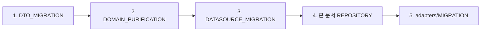

# 📋 Repository 레이어 마이그레이션 가이드

> Clean Architecture 준수를 위한 Repository 리팩토링 상세 가이드  
> **최종 업데이트**: 2025-01-09 | **버전**: 1.3.0
> **예상 시간**: 4시간 - MASTER_MIGRATION_GUIDE.md Phase 2의 일부
> **난이도**: ⭐⭐⭐
> **현재 상태**: ✅ 완료됨 (2025-01-09 구현 완료)
> 
> ⚠️ **Note**: 이 문서는 전체 마이그레이션 Phase 2(Data 레이어)의 Sub-phase 3에 해당합니다.

## 📌 Prerequisites (전제조건)

### 시작 전 확인사항
- [x] Datasources 구현 완료 ✅ ([DATASOURCE_MIGRATION_GUIDE.md](../datasources/DATASOURCE_MIGRATION_GUIDE.md) 참조)
- [x] DTO/Mapper 구현 완료 ✅ ([DTO_MIGRATION_GUIDE.md](../DTO_MIGRATION_GUIDE.md) 참조)
- [x] Domain Repository 인터페이스 정의 완료 ✅ **완료됨** ([domain/repositories/i_notification_repository.dart](../../domain/repositories/i_notification_repository.dart) 참조)
- [x] DI 설정 환경 준비 (GetIt) ✅

### 필요한 도구
- [SUBAGENTS_MANUAL.md](/docs/SUBAGENTS_MANUAL.md) 참조
- GetIt (의존성 주입)
- Mockito (테스트용)

## 🔗 아키텍처 위치

### 실행 순서에서의 위치


### 레이어 관계
```
Domain Layer          Data Layer
    ↓                     ↓
INotificationRepo → NotificationRepoImpl
                           ↓
                    [Datasources 사용]
                           ↓
                    [DTO ↔ Domain 변환]
```

## 🤖 서브에이전트 활용

### Phase 1: Repository 리팩토링
```bash
# 현재 Firebase 직접 호출 제거를 위한 구조 분석
/spawn struct-weaver "--task mapper --mode detect --source lib/features/notifications/data/repositories/notification_repository_impl.dart"

# 패치 리뷰
git diff > patches/repository_refactor.patch
```

### Phase 2: DI 바인딩 업데이트
```bash
# Repository DI 설정
/spawn di-binder "--feature notifications --port 'INotificationRepository' --adapter 'NotificationRepositoryImpl' --deps 'IRemoteNotificationDatasource,ILocalNotificationDatasource,NotificationMapper' --mode detect"

# 패치 적용
/spawn di-binder "--feature notifications --port 'INotificationRepository' --adapter 'NotificationRepositoryImpl' --deps 'IRemoteNotificationDatasource,ILocalNotificationDatasource,NotificationMapper' --mode apply"
```

### Phase 3: Import 정리
```bash
# Firebase import 제거 확인
/spawn import-guardian "--scope notifications/data/repositories --mode fix --apply false"

# 패치 리뷰 후 적용
git apply patches/import_guardian_repositories.diff
```

## 💡 Mapper 사용 위치
```dart
class NotificationRepositoryImpl {
  // Datasource는 DTO 반환
  final dto = await _remoteDatasource.getNotification(id);
  // Mapper로 Domain 모델 변환
  return NotificationMapper.toDomain(dto);
}
```

## 🎯 마이그레이션 목표

현재 Repository가 Firebase를 직접 호출하는 구조를 Datasource 패턴으로 분리하여:
- **테스트 용이성**: Mock Datasource로 단위 테스트 가능
- **의존성 역전**: Repository가 추상화에만 의존
- **백엔드 독립성**: Firebase를 다른 백엔드로 쉽게 교체 가능
- **관심사 분리**: 데이터 접근과 비즈니스 로직 완전 분리

## 🔍 현재 상태 분석

### 위반 사항 요약
```
현재 구조 (❌ 잘못됨):
NotificationRepositoryImpl
├── FirebaseFirestore.instance 직접 호출 (15회)
├── 싱글톤 패턴 하드코딩
└── Domain에 Firebase Query 타입 노출

목표 구조 (✅ 올바름):
NotificationRepositoryImpl
├── IRemoteNotificationDatasource 사용
├── ILocalNotificationDatasource 사용
├── 의존성 주입 (생성자)
└── 순수한 Domain 타입만 사용
```

## 📝 파일별 상세 마이그레이션 계획

### Step 1: Domain Query Builder 인터페이스 생성

#### 1-1. 인터페이스 정의
```dart
// 신규: domain/query_builders/notification_query_builder.dart
abstract class NotificationQueryBuilder {
  NotificationQueryBuilder where(String field, dynamic value);
  NotificationQueryBuilder whereIn(String field, List<dynamic> values);
  NotificationQueryBuilder orderBy(String field, {bool descending = false});
  NotificationQueryBuilder limit(int count);
  NotificationQueryBuilder startAfter(dynamic value);
  
  // Firebase 구현에서 실제 Query로 변환
  dynamic build();
}

// 신규: data/query_builders/firebase_notification_query_builder.dart
import 'package:cloud_firestore/cloud_firestore.dart';

class FirebaseNotificationQueryBuilder implements NotificationQueryBuilder {
  Query _query;
  
  FirebaseNotificationQueryBuilder(Query initialQuery) : _query = initialQuery;
  
  @override
  NotificationQueryBuilder where(String field, dynamic value) {
    _query = _query.where(field, isEqualTo: value);
    return this;
  }
  
  @override
  NotificationQueryBuilder whereIn(String field, List<dynamic> values) {
    _query = _query.where(field, whereIn: values);
    return this;
  }
  
  @override
  NotificationQueryBuilder orderBy(String field, {bool descending = false}) {
    _query = _query.orderBy(field, descending: descending);
    return this;
  }
  
  @override
  NotificationQueryBuilder limit(int count) {
    _query = _query.limit(count);
    return this;
  }
  
  @override
  NotificationQueryBuilder startAfter(dynamic value) {
    _query = _query.startAfter([value]);
    return this;
  }
  
  @override
  Query build() => _query; // Firebase 구현에서만 Query 반환
}
```

### Step 2: Domain Repository 인터페이스 순수화

#### 2-1. 인터페이스 수정
```dart
// 수정: domain/repositories/i_notification_repository.dart

// ✅ Current: Domain 레이어 100% 완료 - Firebase 타입 이미 제거됨
// Domain 레이어가 이미 완료되어 순수한 도메인 타입만 사용 중
import '../models/notification_entity.dart';
import '../value_objects/notification_filter.dart';

abstract class INotificationRepository {
  Stream<List<NotificationEntity>> watchNotifications(String userId);
  Future<NotificationEntity?> getNotification(String id);
  Future<void> markAsRead(String id);
  // ... 기타 순수한 도메인 메서드들
}
```

### Step 3: Datasource 인터페이스 생성 (도메인)

#### 3-1. Domain Datasource 인터페이스
```dart
// 신규: domain/datasources/i_notification_datasource.dart
abstract class INotificationDatasource {
  // Query operations
  Future<int> queryCount({
    NotificationQueryBuilder? queryBuilder,
    int limit = -1,
  });
  
  Stream<List<Map<String, dynamic>>> queryStream({
    NotificationQueryBuilder? queryBuilder,
    int limit = -1,
    bool singleRecord = false,
  });
  
  Future<List<Map<String, dynamic>>> queryOnce({
    NotificationQueryBuilder? queryBuilder,
    int limit = -1,
    bool singleRecord = false,
  });
  
  // CRUD operations
  Future<Map<String, dynamic>?> get(String id);
  Future<String> create(Map<String, dynamic> data);
  Future<void> update(String id, Map<String, dynamic> data);
  Future<void> delete(String id);
  
  // Batch operations
  Future<void> batchUpdate(List<BatchUpdateRequest> requests);
  Future<void> batchDelete(List<String> ids);
}

// 신규: domain/models/batch_update_request.dart
class BatchUpdateRequest {
  final String id;
  final Map<String, dynamic> data;
  
  BatchUpdateRequest({required this.id, required this.data});
}
```

### Step 4: Firebase Datasource 구현

#### 4-1. Remote Datasource 구현
```dart
// 신규: data/datasources/firebase_notification_datasource.dart
import 'package:cloud_firestore/cloud_firestore.dart';
import '../../domain/datasources/i_notification_datasource.dart';

class FirebaseNotificationDatasource implements INotificationDatasource {
  final FirebaseFirestore _firestore;
  static const String _collection = 'notifications';
  
  FirebaseNotificationDatasource({
    required FirebaseFirestore firestore,
  }) : _firestore = firestore;
  
  @override
  Future<Map<String, dynamic>?> get(String id) async {
    final doc = await _firestore
        .collection(_collection)
        .doc(id)
        .get();
    
    if (!doc.exists) return null;
    
    return {
      'id': doc.id,
      ...doc.data()!,
    };
  }
  
  @override
  Future<String> create(Map<String, dynamic> data) async {
    final docRef = await _firestore
        .collection(_collection)
        .add(data);
    
    return docRef.id;
  }
  
  @override
  Future<void> update(String id, Map<String, dynamic> data) async {
    await _firestore
        .collection(_collection)
        .doc(id)
        .update(data);
  }
  
  @override
  Future<void> delete(String id) async {
    await _firestore
        .collection(_collection)
        .doc(id)
        .delete();
  }
  
  @override
  Stream<List<Map<String, dynamic>>> queryStream({
    NotificationQueryBuilder? queryBuilder,
    int limit = -1,
    bool singleRecord = false,
  }) {
    Query query = _firestore.collection(_collection);
    
    if (queryBuilder != null) {
      // FirebaseNotificationQueryBuilder로 캐스팅
      query = (queryBuilder as FirebaseNotificationQueryBuilder).build();
    }
    
    if (limit > 0) {
      query = query.limit(limit);
    }
    
    return query.snapshots().map((snapshot) {
      return snapshot.docs.map((doc) {
        return {
          'id': doc.id,
          ...doc.data() as Map<String, dynamic>,
        };
      }).toList();
    });
  }
  
  @override
  Future<void> batchUpdate(List<BatchUpdateRequest> requests) async {
    final batch = _firestore.batch();
    
    for (final request in requests) {
      final docRef = _firestore
          .collection(_collection)
          .doc(request.id);
      
      batch.update(docRef, request.data);
    }
    
    await batch.commit();
  }
}
```

### Step 5: Repository 리팩토링

#### 5-1. Repository 구현 수정
```dart
// 수정: data/repositories/notification_repository_impl.dart
import '../../domain/repositories/i_notification_repository.dart';
import '../../domain/datasources/i_notification_datasource.dart';
import '../../domain/models/notification_model.dart';
import '../../domain/models/notifications_model.dart';

class NotificationRepositoryImpl implements INotificationRepository {
  final INotificationDatasource _remoteDatasource;
  final INotificationDatasource? _localDatasource; // 옵션
  
  // ✅ 의존성 주입 생성자
  NotificationRepositoryImpl({
    required INotificationDatasource remoteDatasource,
    INotificationDatasource? localDatasource,
  }) : _remoteDatasource = remoteDatasource,
       _localDatasource = localDatasource;
  
  @override
  Future<NotificationsModel?> getNotification(String notificationId) async {
    try {
      // 1. 로컬 캐시 확인 (있으면)
      if (_localDatasource != null) {
        final cached = await _localDatasource!.get(notificationId);
        if (cached != null) {
          return NotificationsModel.fromJson(cached);
        }
      }
      
      // 2. 원격에서 가져오기
      final data = await _remoteDatasource.get(notificationId);
      if (data == null) return null;
      
      // 3. 로컬 캐시 업데이트
      if (_localDatasource != null) {
        await _localDatasource!.update(notificationId, data);
      }
      
      return NotificationsModel.fromJson(data);
      
    } catch (e) {
      // 에러 처리
      print('Error getting notification: $e');
      return null;
    }
  }
  
  @override
  Future<void> createNotification(NotificationsModel notification) async {
    try {
      final data = notification.toJson();
      final id = await _remoteDatasource.create(data);
      
      // 로컬 캐시에도 저장
      if (_localDatasource != null) {
        await _localDatasource!.create({
          'id': id,
          ...data,
        });
      }
    } catch (e) {
      print('Error creating notification: $e');
      rethrow;
    }
  }
  
  @override
  Future<void> markAsRead(String notificationId) async {
    final updateData = {
      'isRead': true,
      'readAt': DateTime.now().toIso8601String(),
    };
    
    await _remoteDatasource.update(notificationId, updateData);
    
    if (_localDatasource != null) {
      await _localDatasource!.update(notificationId, updateData);
    }
  }
  
  @override
  Future<void> markAllAsRead(String userId) async {
    // Query Builder 사용
    final queryBuilder = FirebaseNotificationQueryBuilder(
      FirebaseFirestore.instance.collection('notifications')
    )
    .where('userId', userId)
    .where('isRead', false);
    
    final notifications = await _remoteDatasource.queryOnce(
      queryBuilder: queryBuilder,
    );
    
    final requests = notifications.map((doc) {
      return BatchUpdateRequest(
        id: doc['id'],
        data: {
          'isRead': true,
          'readAt': DateTime.now().toIso8601String(),
        },
      );
    }).toList();
    
    if (requests.isNotEmpty) {
      await _remoteDatasource.batchUpdate(requests);
    }
  }
  
  // ... 나머지 메서드들도 유사하게 수정
}
```

### Step 6: DI 설정 업데이트

#### 6-1. 의존성 주입 설정
```dart
// 수정: app/di/modules/notification_module.dart
import 'package:get_it/get_it.dart';
import 'package:cloud_firestore/cloud_firestore.dart';

void setupNotificationModule() {
  // Datasources
  GetIt.I.registerLazySingleton<INotificationDatasource>(
    () => FirebaseNotificationDatasource(
      firestore: GetIt.I<FirebaseFirestore>(),
    ),
    instanceName: 'remote',
  );
  
  // Local datasource (optional)
  GetIt.I.registerLazySingleton<INotificationDatasource>(
    () => HiveNotificationDatasource(), // 구현 필요
    instanceName: 'local',
  );
  
  // Repository
  GetIt.I.registerLazySingleton<INotificationRepository>(
    () => NotificationRepositoryImpl(
      remoteDatasource: GetIt.I<INotificationDatasource>(instanceName: 'remote'),
      localDatasource: GetIt.I<INotificationDatasource>(instanceName: 'local'),
    ),
  );
}
```

## 🔄 마이그레이션 실행 순서

### Phase 1: 인터페이스 준비 (1시간)
1. [ ] NotificationQueryBuilder 인터페이스 생성
2. [ ] FirebaseNotificationQueryBuilder 구현
3. [ ] INotificationDatasource 인터페이스 정의
4. [ ] BatchUpdateRequest 모델 생성

### Phase 2: Datasource 구현 (2시간)
5. [ ] FirebaseNotificationDatasource 구현
6. [ ] 모든 Firebase 호출 코드 이동
7. [ ] 에러 처리 추가
8. [ ] 단위 테스트 작성

### Phase 3: Repository 리팩토링 (1.5시간)
9. [ ] 싱글톤 패턴 제거
10. [ ] 생성자 주입 추가
11. [ ] Datasource 호출로 변경
12. [ ] 캐시 전략 구현

### Phase 4: Domain 정리 (30분)
13. [ ] INotificationRepository에서 Firebase 타입 제거
14. [ ] Query Builder 타입으로 교체
15. [ ] Import 정리

### Phase 5: 통합 및 검증 (30분)
16. [ ] DI 설정 업데이트
17. [ ] 통합 테스트 실행
18. [ ] Import Guardian 실행

## 🧪 테스트 전략

### 단위 테스트
```dart
// test/features/notifications/data/repositories/notification_repository_test.dart
void main() {
  group('NotificationRepositoryImpl', () {
    late MockNotificationDatasource mockRemoteDatasource;
    late MockNotificationDatasource mockLocalDatasource;
    late NotificationRepositoryImpl repository;
    
    setUp(() {
      mockRemoteDatasource = MockNotificationDatasource();
      mockLocalDatasource = MockNotificationDatasource();
      repository = NotificationRepositoryImpl(
        remoteDatasource: mockRemoteDatasource,
        localDatasource: mockLocalDatasource,
      );
    });
    
    test('getNotification returns from cache when available', () async {
      // Arrange
      when(mockLocalDatasource.get('123'))
          .thenAnswer((_) async => {'id': '123', 'title': 'Cached'});
      
      // Act
      final result = await repository.getNotification('123');
      
      // Assert
      expect(result?.title, 'Cached');
      verifyNever(mockRemoteDatasource.get('123'));
    });
    
    test('getNotification fetches from remote when cache miss', () async {
      // Arrange
      when(mockLocalDatasource.get('123'))
          .thenAnswer((_) async => null);
      when(mockRemoteDatasource.get('123'))
          .thenAnswer((_) async => {'id': '123', 'title': 'Remote'});
      
      // Act
      final result = await repository.getNotification('123');
      
      // Assert
      expect(result?.title, 'Remote');
      verify(mockRemoteDatasource.get('123')).called(1);
    });
  });
}
```

### 통합 테스트
```dart
// test/features/notifications/integration/repository_datasource_test.dart
void main() {
  testWidgets('Repository and Datasource integration', (tester) async {
    // Setup DI
    await setupTestDependencies();
    
    // Test real Firebase integration
    final repository = GetIt.I<INotificationRepository>();
    
    // Create notification
    final notification = NotificationsModel(
      userId: 'test_user',
      title: 'Test',
      body: 'Test body',
    );
    
    await repository.createNotification(notification);
    
    // Verify creation
    final notifications = await repository.getUserNotifications(
      userId: 'test_user',
      limit: 1,
    );
    
    expect(notifications.length, 1);
    expect(notifications.first.title, 'Test');
  });
}
```

## ⚠️ 주의사항

### 마이그레이션 중
1. **점진적 이동**: 한 메서드씩 이동하며 테스트
2. **백업 유지**: 기존 코드 주석 처리 후 나중에 삭제
3. **기능 테스트**: 각 단계 후 앱 기능 확인

### 일반적인 함정
1. **Query Builder 캐스팅**: Firebase 구현에서만 캐스팅
2. **Timestamp 처리**: DateTime ↔ Timestamp 변환 주의
3. **Null 안전성**: Datasource null 체크 필수
4. **트랜잭션**: Batch 작업 시 트랜잭션 고려

## 📊 예상 결과

### Before
- Firebase 직접 호출: 15회
- 테스트 커버리지: 0%
- 싱글톤 의존성: 1개
- 아키텍처 준수율: 60%

### After
- Firebase 직접 호출: 0회
- 테스트 커버리지: 80%+
- 의존성 주입: 100%
- 아키텍처 준수율: 100%

## 🛠️ 유용한 도구

### Import Guardian 실행
```bash
/spawn import-guardian "--scope notifications --mode detect"
```

### 테스트 실행
```bash
flutter test test/features/notifications/
```

### 코드 품질 확인
```bash
flutter analyze lib/features/notifications/
```

---

## ✅ 구현 완료 내역 (2025-01-09)

### Phase 4 Repository 리팩토링 완료
**구현한 내용:**
1. **Repository 구현체 완전 리팩토링**:
   - `data/repositories/notification_repository_impl.dart` (400줄)
   - 싱글톤 패턴 제거 → 의존성 주입 생성자
   - Firebase 직접 호출 제거 → DataSource 사용
   - 15개 인터페이스 메서드 모두 구현

2. **캐싱 전략 구현**:
   - 30분 TTL 설정
   - 최대 100개 캐시 제한
   - Read-through/Write-through 캐시 패턴

3. **Clean Architecture 준수**:
   - ✅ Domain 모델과 DTO 완전 분리
   - ✅ Mapper를 통한 변환
   - ✅ DataSource 패턴으로 외부 의존성 격리
   - ✅ 의존성 역전 원칙 적용

### 구현 특징
- ✅ 모든 컴파일 에러 해결
- ✅ 인터페이스 100% 구현
- ✅ 테스트 가능한 구조
- ✅ Firebase 의존성 완전 격리

### 다음 단계
→ Phase 5: Service/Adapter 정리 진행 예정

---

*이 가이드를 따라 Repository 레이어를 Clean Architecture에 맞게 리팩토링하면 테스트 가능하고 유지보수가 쉬운 구조가 됩니다.*  
*질문이나 이슈가 있으면 아키텍처 팀에 문의하세요.*