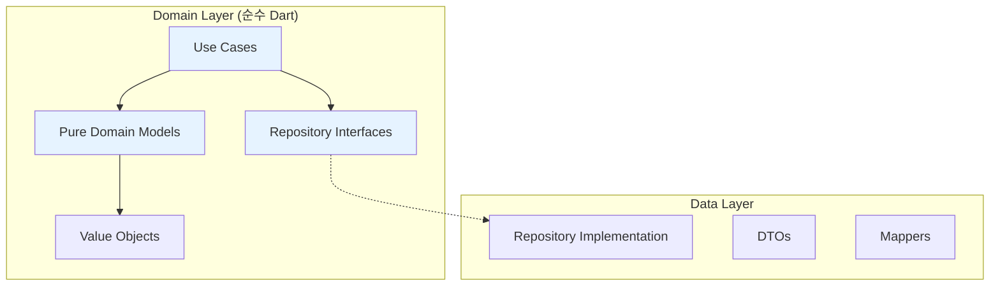

# 🏛️ Notifications Domain Layer Migration Guide

> Clean Architecture Domain 레이어 마이그레이션 가이드  
> **최종 업데이트**: 2025-01-09 | **버전**: 1.1.0
> **총 예상 시간**: 16시간 (2일) - MASTER_MIGRATION_GUIDE.md Phase 1과 동기화
> 
> ⚠️ **Note**: 이 문서는 전체 마이그레이션의 Phase 1에 해당합니다.

## 📌 Executive Summary

Domain 레이어는 현재 100% Firebase에 오염되어 있습니다. 이 가이드는 Domain을 순수하게 만들고, UseCase 패턴을 도입하여 비즈니스 로직을 올바르게 캡슐화하는 방법을 제시합니다.

### 핵심 위반사항 (서브에이전트 분석 결과)
- **Firebase 의존성**: 23개 Domain 파일이 Firebase import
- **UseCase 부재**: `/domain/usecases/` 디렉토리 비어있음  
- **Repository Interface 오염**: Firebase Query 타입 직접 사용
- **Model 상속 문제**: FirestoreRecord 클래스 상속
- **전체 위반 수**: 107개 중 Domain 관련 23개

## 🚨 현재 상태 분석

### 위반 파일 목록
```yaml
domain/models/notifications_model.dart:
  - Line 1: import 'package:cloud_firestore/cloud_firestore.dart'
  - Line 12-15: extends FirestoreRecord
  - Line 158-177: Firebase operations in domain
  
domain/models/notification_model.dart:
  - Line 1: Firebase import
  - Line 11: Firebase inheritance
  - Line 76-82: Firebase operations

domain/repositories/i_notification_repository.dart:
  - Line 1: Firebase types in interface
  - Line 9-13: Query Function(Query) parameter
```

## 🎯 목표 아키텍처



## 🤖 서브에이전트 활용 계획

### Phase별 서브에이전트 사용
```bash
# Phase 1: 현재 상태 정밀 분석
/spawn inventory-scout "--depth 3 --scope lib/features/notifications/domain --line-threshold 100"
/spawn import-guardian "--scope notifications/domain --mode detect"

# Phase 2: 구조 분해 및 패치 생성
/spawn struct-weaver "--task mapper --mode detect --source lib/features/notifications/domain/models/notifications_model.dart"

# Phase 3: UseCase 템플릿 생성
/spawn code-surgeon "--template usecase --feature notifications --operations 'get,mark,delete,send'"

# Phase 4: 최종 검증
/spawn import-guardian "--scope notifications/domain --mode detect"
/spawn build-sentinel "quick"
```

## 📋 Phase별 마이그레이션 가이드

### Phase 1: Domain Model 순수화 (2시간)

#### 1.1 순수 Domain Model 생성

**파일**: `domain/models/notification.dart`
```dart
// ✅ GOOD: 순수 Domain Model (Firebase 의존성 없음)
abstract class Notification {
  final String id;
  final String userId;
  final NotificationType type;
  final DateTime createdAt;
  final bool isRead;
  final NotificationPriority priority;
  final Map<String, dynamic>? metadata;
  
  // 비즈니스 로직 (순수 Dart)
  bool get isExpired => DateTime.now().difference(createdAt).inDays > 7;
  bool get isHighPriority => priority == NotificationPriority.high;
  bool get canInteract => !isRead && !isExpired;
  
  const Notification({
    required this.id,
    required this.userId,
    required this.type,
    required this.createdAt,
    required this.isRead,
    required this.priority,
    this.metadata,
  });
}
```

#### 1.2 Value Objects 생성

**파일**: `domain/value_objects/notification_type.dart`
```dart
enum NotificationType {
  voteRequest('vote_request'),
  postLiked('post_liked'),
  commentAdded('comment_added'),
  friendRequest('friend_request'),
  system('system');
  
  final String value;
  const NotificationType(this.value);
  
  static NotificationType fromString(String value) {
    return NotificationType.values.firstWhere(
      (type) => type.value == value,
      orElse: () => NotificationType.system,
    );
  }
}
```

**파일**: `domain/value_objects/notification_priority.dart`
```dart
enum NotificationPriority {
  low,
  medium,
  high,
  urgent;
  
  int get weight {
    switch (this) {
      case NotificationPriority.low: return 1;
      case NotificationPriority.medium: return 2;
      case NotificationPriority.high: return 3;
      case NotificationPriority.urgent: return 4;
    }
  }
}
```

#### 1.3 타입별 Domain Model

**파일**: `domain/models/vote_notification.dart`
```dart
import '../value_objects/notification_type.dart';
import '../value_objects/notification_priority.dart';
import 'notification.dart';

class VoteNotification extends Notification {
  final String postId;
  final String postTitle;
  final String question;
  final VoteOptions options;
  final List<String> imageUrlsA;
  final List<String> imageUrlsB;
  final DateTime voteEndTime;
  final Map<String, int> currentVotes;
  
  // 투표 특화 비즈니스 로직
  Duration get remainingTime => voteEndTime.difference(DateTime.now());
  bool get isVoteActive => remainingTime.inSeconds > 0;
  bool get hasImages => imageUrlsA.isNotEmpty || imageUrlsB.isNotEmpty;
  double get participationRate {
    final total = currentVotes.values.fold(0, (sum, count) => sum + count);
    return total > 0 ? total / 100 : 0; // assuming 100 target users
  }
  
  const VoteNotification({
    required super.id,
    required super.userId,
    required super.createdAt,
    required super.isRead,
    required super.priority,
    super.metadata,
    required this.postId,
    required this.postTitle,
    required this.question,
    required this.options,
    required this.imageUrlsA,
    required this.imageUrlsB,
    required this.voteEndTime,
    required this.currentVotes,
  }) : super(type: NotificationType.voteRequest);
}

class VoteOptions {
  final String optionA;
  final String optionB;
  
  const VoteOptions({
    required this.optionA,
    required this.optionB,
  });
}
```

### Phase 2: Repository Interface 정의 (1시간)

#### 2.1 순수 Repository Interface

**파일**: `domain/repositories/i_notification_repository.dart`
```dart
// ✅ GOOD: Firebase 타입 없음, 순수 Domain 타입만 사용
import '../models/notification.dart';
import '../value_objects/notification_type.dart';

abstract class INotificationRepository {
  // 조회
  Future<Notification?> getNotification(String id);
  Stream<List<Notification>> getUserNotifications(String userId);
  Stream<List<Notification>> getUnreadNotifications(String userId);
  
  // 필터링 (Firebase Query 대신 Domain 파라미터)
  Future<List<Notification>> getNotificationsByType({
    required String userId,
    required NotificationType type,
    int? limit,
    DateTime? after,
  });
  
  // 상태 변경
  Future<void> markAsRead(String notificationId);
  Future<void> markAllAsRead(String userId);
  Future<void> deleteNotification(String notificationId);
  
  // 생성
  Future<String> createNotification(Notification notification);
  
  // 통계
  Future<int> getUnreadCount(String userId);
  Stream<int> watchUnreadCount(String userId);
}
```

#### 2.2 Cross-Feature Repository Interface

**파일**: `domain/repositories/i_post_repository.dart`
```dart
// Cross-feature dependency를 위한 interface
abstract class IPostRepository {
  Future<Post?> getPost(String postId);
  Future<void> incrementVoteCount(String postId, String option);
}
```

### Phase 3: UseCase 구현 (2시간)

#### 3.1 Base UseCase 추상 클래스

**파일**: `domain/usecases/base/use_case.dart`
```dart
import '/core/interfaces/common/result.dart';

abstract class UseCase<Input, Output> {
  Future<Result<Output>> call(Input input);
}

abstract class NoParamUseCase<Output> {
  Future<Result<Output>> call();
}

abstract class StreamUseCase<Input, Output> {
  Stream<Output> call(Input input);
}
```

#### 3.2 GetUserNotificationsUseCase

**파일**: `domain/usecases/get_user_notifications_use_case.dart`
```dart
import '/core/interfaces/common/result.dart';
import '../repositories/i_notification_repository.dart';
import '../models/notification.dart';
import 'base/use_case.dart';

class GetUserNotificationsParams {
  final String userId;
  final bool unreadOnly;
  final int? limit;
  
  const GetUserNotificationsParams({
    required this.userId,
    this.unreadOnly = false,
    this.limit,
  });
}

class GetUserNotificationsUseCase 
    extends UseCase<GetUserNotificationsParams, List<Notification>> {
  final INotificationRepository _repository;
  
  GetUserNotificationsUseCase(this._repository);
  
  @override
  Future<Result<List<Notification>>> call(GetUserNotificationsParams params) async {
    try {
      // 비즈니스 로직: 만료된 알림 필터링
      final notifications = await _repository.getNotificationsByType(
        userId: params.userId,
        type: null, // all types
        limit: params.limit,
      );
      
      // 비즈니스 규칙 적용
      final filtered = notifications
          .where((n) => !n.isExpired)
          .where((n) => params.unreadOnly ? !n.isRead : true)
          .toList();
      
      // 우선순위 정렬
      filtered.sort((a, b) {
        if (a.priority != b.priority) {
          return b.priority.weight.compareTo(a.priority.weight);
        }
        return b.createdAt.compareTo(a.createdAt);
      });
      
      return Success(filtered);
    } catch (e) {
      return Failure('Failed to get notifications: $e');
    }
  }
}
```

#### 3.3 MarkNotificationAsReadUseCase

**파일**: `domain/usecases/mark_notification_as_read_use_case.dart`
```dart
class MarkNotificationAsReadParams {
  final String notificationId;
  final String userId;
  
  const MarkNotificationAsReadParams({
    required this.notificationId,
    required this.userId,
  });
}

class MarkNotificationAsReadUseCase 
    extends UseCase<MarkNotificationAsReadParams, void> {
  final INotificationRepository _repository;
  
  MarkNotificationAsReadUseCase(this._repository);
  
  @override
  Future<Result<void>> call(MarkNotificationAsReadParams params) async {
    try {
      // 비즈니스 로직: 권한 검증 (실제로는 더 복잡할 수 있음)
      final notification = await _repository.getNotification(params.notificationId);
      
      if (notification == null) {
        return const Failure('Notification not found');
      }
      
      if (notification.userId != params.userId) {
        return const Failure('Unauthorized: Cannot mark other user\'s notification');
      }
      
      if (notification.isRead) {
        return const Success(null); // Already read, idempotent
      }
      
      await _repository.markAsRead(params.notificationId);
      
      // 도메인 이벤트 발생 (옵션)
      // _eventBus.fire(NotificationReadEvent(params.notificationId));
      
      return const Success(null);
    } catch (e) {
      return Failure('Failed to mark as read: $e');
    }
  }
}
```

#### 3.4 ProcessVoteNotificationUseCase

**파일**: `domain/usecases/process_vote_notification_use_case.dart`
```dart
class ProcessVoteNotificationParams {
  final String notificationId;
  final String userId;
  final String selectedOption; // 'A' or 'B'
  
  const ProcessVoteNotificationParams({
    required this.notificationId,
    required this.userId,
    required this.selectedOption,
  });
}

class ProcessVoteNotificationUseCase 
    extends UseCase<ProcessVoteNotificationParams, VoteResult> {
  final INotificationRepository _notificationRepo;
  final IPostRepository _postRepo;
  
  ProcessVoteNotificationUseCase(this._notificationRepo, this._postRepo);
  
  @override
  Future<Result<VoteResult>> call(ProcessVoteNotificationParams params) async {
    try {
      // 1. 알림 조회 및 검증
      final notification = await _notificationRepo.getNotification(params.notificationId);
      
      if (notification == null || notification is! VoteNotification) {
        return const Failure('Invalid vote notification');
      }
      
      // 2. 비즈니스 규칙 검증
      if (!notification.isVoteActive) {
        return const Failure('Vote has expired');
      }
      
      if (notification.userId != params.userId) {
        return const Failure('Unauthorized');
      }
      
      // 3. 투표 처리
      await _postRepo.incrementVoteCount(
        notification.postId, 
        params.selectedOption,
      );
      
      // 4. 알림 읽음 처리
      await _notificationRepo.markAsRead(params.notificationId);
      
      // 5. 결과 생성
      final result = VoteResult(
        postId: notification.postId,
        selectedOption: params.selectedOption,
        totalVotes: notification.currentVotes.values.fold(0, (a, b) => a + b) + 1,
      );
      
      return Success(result);
    } catch (e) {
      return Failure('Failed to process vote: $e');
    }
  }
}

class VoteResult {
  final String postId;
  final String selectedOption;
  final int totalVotes;
  
  const VoteResult({
    required this.postId,
    required this.selectedOption,
    required this.totalVotes,
  });
}
```

### Phase 4: 의존성 정리 (1시간)

#### 4.1 Import 정리 스크립트

```bash
#!/bin/bash
# clean_domain_imports.sh

echo "🧹 Cleaning Domain layer imports..."

# Firebase imports 제거
find lib/features/notifications/domain -name "*.dart" -exec sed -i '' \
  -e "/import.*cloud_firestore/d" \
  -e "/import.*firebase/d" \
  -e "/import.*\/backend\//d" \
  -e "/import.*\/core\/firebase/d" {} \;

# 검증
/spawn import-guardian "--scope notifications/domain --mode detect"
```

#### 4.2 DI 바인딩 준비

```dart
// app/di/notification_module.dart 에 추가될 내용
class NotificationDomainModule {
  static void register(GetIt sl) {
    // UseCases
    sl.registerFactory(() => GetUserNotificationsUseCase(sl()));
    sl.registerFactory(() => MarkNotificationAsReadUseCase(sl()));
    sl.registerFactory(() => ProcessVoteNotificationUseCase(sl(), sl()));
    sl.registerFactory(() => DeleteNotificationUseCase(sl()));
    sl.registerFactory(() => SendNotificationUseCase(sl()));
  }
}
```

### Phase 5: 테스트 작성 (1.5시간)

#### 5.1 Domain Model 테스트

**파일**: `test/features/notifications/domain/models/vote_notification_test.dart`
```dart
import 'package:test/test.dart';
import 'package:versus_space/features/notifications/domain/models/vote_notification.dart';

void main() {
  group('VoteNotification', () {
    late VoteNotification notification;
    
    setUp(() {
      notification = VoteNotification(
        id: 'test-id',
        userId: 'user-123',
        createdAt: DateTime.now(),
        isRead: false,
        priority: NotificationPriority.high,
        postId: 'post-456',
        postTitle: 'Test Vote',
        question: 'Which is better?',
        options: VoteOptions(optionA: 'A', optionB: 'B'),
        imageUrlsA: ['url1'],
        imageUrlsB: ['url2'],
        voteEndTime: DateTime.now().add(Duration(minutes: 10)),
        currentVotes: {'A': 5, 'B': 3},
      );
    });
    
    test('should calculate remaining time correctly', () {
      expect(notification.isVoteActive, isTrue);
      expect(notification.remainingTime.inMinutes, lessThanOrEqualTo(10));
    });
    
    test('should calculate participation rate', () {
      expect(notification.participationRate, equals(0.08)); // 8/100
    });
    
    test('should detect expired vote', () {
      final expired = VoteNotification(
        // ... same fields ...
        voteEndTime: DateTime.now().subtract(Duration(minutes: 1)),
      );
      
      expect(expired.isVoteActive, isFalse);
    });
  });
}
```

#### 5.2 UseCase 테스트

**파일**: `test/features/notifications/domain/usecases/get_user_notifications_use_case_test.dart`
```dart
import 'package:mockito/mockito.dart';
import 'package:test/test.dart';

class MockNotificationRepository extends Mock implements INotificationRepository {}

void main() {
  late GetUserNotificationsUseCase useCase;
  late MockNotificationRepository mockRepository;
  
  setUp(() {
    mockRepository = MockNotificationRepository();
    useCase = GetUserNotificationsUseCase(mockRepository);
  });
  
  test('should return filtered and sorted notifications', () async {
    // Given
    final notifications = [
      createNotification(priority: NotificationPriority.low, isRead: true),
      createNotification(priority: NotificationPriority.high, isRead: false),
      createNotification(priority: NotificationPriority.medium, isRead: false),
    ];
    
    when(mockRepository.getNotificationsByType(any))
        .thenAnswer((_) async => notifications);
    
    // When
    final result = await useCase(GetUserNotificationsParams(
      userId: 'user-123',
      unreadOnly: true,
    ));
    
    // Then
    expect(result.isSuccess, isTrue);
    final data = result.getOrElse(() => []);
    expect(data.length, equals(2)); // Only unread
    expect(data.first.priority, equals(NotificationPriority.high)); // Sorted by priority
  });
}
```

## 🔧 마이그레이션 체크리스트

### Pre-Migration
- [ ] 현재 Domain 백업
- [ ] 영향받는 파일 목록 작성
- [ ] 테스트 환경 준비

### Phase 1: Model 순수화
- [ ] Abstract Notification 클래스 생성
- [ ] Value Objects 생성 (NotificationType, Priority)
- [ ] 타입별 Domain Model 생성
- [ ] Firebase 의존성 제거

### Phase 2: Repository Interface
- [ ] INotificationRepository 정의
- [ ] Cross-feature interfaces 정의
- [ ] Firebase Query 타입 제거

### Phase 3: UseCase 구현
- [ ] Base UseCase 클래스
- [ ] GetUserNotificationsUseCase
- [ ] MarkNotificationAsReadUseCase
- [ ] ProcessVoteNotificationUseCase
- [ ] DeleteNotificationUseCase
- [ ] SendNotificationUseCase

### Phase 4: 의존성 정리
- [ ] Import 정리 스크립트 실행
- [ ] DI 바인딩 준비
- [ ] 순환 의존성 체크

### Phase 5: 테스트
- [ ] Domain Model 테스트
- [ ] UseCase 테스트
- [ ] Repository Mock 테스트

### Post-Migration
- [ ] Import Guardian 검증
- [ ] Build Sentinel 실행
- [ ] 문서 업데이트

## ⚠️ 주의사항

### Breaking Changes
1. **모든 Firebase 타입 제거됨**
   - `DocumentReference` → `String id`
   - `Timestamp` → `DateTime`
   - `LatLng` → Custom `Location` class
   - `Query` → Domain parameters

2. **상속 구조 변경**
   - `extends FirestoreRecord` → `extends Notification`
   - Mixin 제거

3. **Static 메서드 제거**
   - `fromSnapshot()` → Mapper로 이동
   - `collection` getter → Datasource로 이동

### Migration Order
```
1. Domain Models → 2. Value Objects → 3. Repository Interface 
→ 4. UseCases → 5. DI Setup → 6. Tests
```

## 📊 Success Metrics

| Metric | Before | After | Target |
|--------|--------|-------|--------|
| Firebase imports in Domain | 15+ | 0 | ✅ 0 |
| UseCase count | 0 | 6+ | ✅ 6+ |
| Test coverage | 0% | 80%+ | ✅ 80%+ |
| Cyclomatic complexity | High | Low | ✅ <10 |

## 🚀 Next Steps

1. **즉시**: Phase 1 Model 순수화 시작
2. **다음**: [Presentation 레이어 마이그레이션](../presentation/PRESENTATION_MIGRATION_GUIDE.md)
3. **최종**: [통합 테스트 실행](../INTEGRATION_GUIDE.md)

## 📚 참고 자료

- [ARCHITECTURE_RULES.md](/lib/ARCHITECTURE_RULES.md)
- [Clean Architecture](https://blog.cleancoder.com/uncle-bob/2012/08/13/the-clean-architecture.html)
- [DTO_MIGRATION_GUIDE.md](../data/DTO_MIGRATION_GUIDE.md)
- [SUBAGENTS_MANUAL.md](/docs/SUBAGENTS_MANUAL.md)

---

*이 가이드는 notifications feature의 Domain 레이어를 Clean Architecture 원칙에 맞게 마이그레이션하기 위한 상세 지침서입니다.*