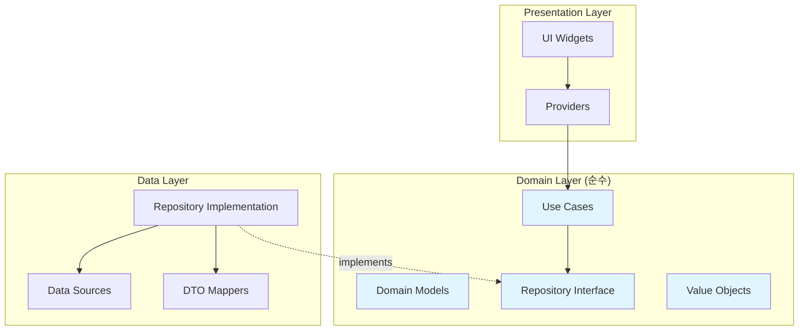

# 📚 Notifications Domain Layer

> Clean Architecture 도메인 레이어 - 순수 비즈니스 로직과 엔티티  
> **최종 업데이트**: 2025-01-10 | **버전**: 1.0.0  
> **상태**: ✅ 100% Clean Architecture 준수 | Firebase 의존성 0건

## 📋 목차
- [개요](#-개요)
- [디렉토리 구조](#-디렉토리-구조)
- [핵심 컴포넌트](#-핵심-컴포넌트)
- [사용 방법](#-사용-방법)
- [의존성 및 아키텍처](#-의존성-및-아키텍처)
- [API 연계](#-api-연계)
- [개발 가이드](#-개발-가이드)
- [테스트](#-테스트)

## 🎯 개요

Notifications Domain 레이어는 **Clean Architecture**의 핵심으로, 알림 시스템의 모든 비즈니스 규칙과 엔티티를 정의합니다.

### 핵심 원칙
- **Framework 독립성**: Firebase, Flutter 등 외부 프레임워크 의존성 없음
- **순수 비즈니스 로직**: 알림 도메인의 핵심 규칙만 포함
- **테스트 용이성**: Mock 없이 단위 테스트 가능
- **불변성**: 모든 엔티티와 Value Object는 immutable

### 주요 특징
- ✅ **Firebase 의존성 0건** - 완전한 도메인 순수성 달성
- ✅ **UseCase 패턴** - 명확한 비즈니스 작업 정의
- ✅ **Repository 인터페이스** - 데이터 소스 추상화
- ✅ **Value Objects** - 도메인 개념 캡슐화
- ✅ **다형성 모델** - 알림 타입별 특화 구현

## 📁 디렉토리 구조

```
domain/
├── models/                      # 도메인 엔티티 (핵심 비즈니스 객체)
│   ├── notification.dart        # 추상 베이스 클래스
│   ├── vote_notification.dart   # 투표 알림 구체 구현
│   ├── social_notification.dart # 소셜 알림 구체 구현
│   └── system_notification.dart # 시스템 알림 구체 구현
│
├── repositories/                # Repository 인터페이스 (포트)
│   └── i_notification_repository.dart  # 데이터 접근 추상화
│
├── usecases/                    # 비즈니스 유스케이스
│   ├── base/                    # UseCase 기본 추상 클래스
│   │   ├── use_case.dart        # 동기 UseCase 베이스
│   │   ├── stream_use_case.dart # 스트림 UseCase 베이스
│   │   └── no_param_use_case.dart # 파라미터 없는 UseCase
│   │
│   ├── get_user_notifications_use_case.dart    # 알림 목록 조회
│   ├── watch_unread_count_use_case.dart        # 읽지 않은 수 감시
│   ├── mark_as_read_use_case.dart              # 읽음 처리
│   ├── send_notification_use_case.dart         # 알림 전송
│   └── process_vote_notification_use_case.dart # 투표 알림 처리
│
├── value_objects/               # 값 객체 (불변 도메인 개념)
│   ├── notification_filter.dart # 알림 필터링 조건
│   └── vote_options.dart        # 투표 옵션 데이터
│
└── migration/                   # [임시] 마이그레이션 문서
    └── field_mapping.md         # 레거시 → 도메인 필드 매핑
```

## 🔧 핵심 컴포넌트

### 1. Domain Models (엔티티)

#### `Notification` (추상 베이스 클래스)
```dart
abstract class Notification {
  final String id;
  final String userId;
  final NotificationType type;
  final String title;
  final String content;
  final DateTime createdAt;
  final bool isRead;
  
  // 비즈니스 로직
  bool get isExpired;
  bool get canBeRead;
  int get priority;
}
```

#### 구체 구현체
- **VoteNotification**: 투표 요청 알림 (postId, voteOptions, voteEndTime 등)
- **SocialNotification**: 소셜 상호작용 알림 (좋아요, 댓글, 친구 요청)
- **SystemNotification**: 시스템 공지 알림 (유지보수, 업데이트)

### 2. Repository Interface

```dart
abstract class INotificationRepository {
  // 조회
  Future<List<Notification>> getUserNotifications({
    required String userId,
    NotificationFilter? filter,
  });
  
  // 스트림
  Stream<List<Notification>> watchUserNotifications({
    required String userId,
    NotificationFilter? filter,
  });
  
  // 생성/수정
  Future<String> createNotification(Notification notification);
  Future<void> markAsRead(String notificationId);
  
  // 삭제
  Future<void> deleteNotification(String notificationId);
}
```

### 3. UseCases (비즈니스 작업)

| UseCase | 목적 | 입력 | 출력 |
|---------|------|------|------|
| `GetUserNotificationsUseCase` | 알림 목록 조회 | userId, filter | List<Notification> |
| `WatchUnreadCountUseCase` | 읽지 않은 개수 감시 | userId | Stream<int> |
| `MarkAsReadUseCase` | 읽음 처리 | notificationId | void |
| `SendNotificationUseCase` | 알림 전송 | notification | String (id) |
| `ProcessVoteNotificationUseCase` | 투표 알림 처리 | voteData | void |

### 4. Value Objects

#### `NotificationFilter`
```dart
class NotificationFilter {
  final NotificationType? type;
  final bool? unreadOnly;
  final DateTime? after;
  final DateTime? before;
  final int? limit;
  
  // Factory 메서드
  factory NotificationFilter.unreadOnly();
  factory NotificationFilter.byType(NotificationType type);
  factory NotificationFilter.recent({int days = 30});
}
```

#### `VoteOptions`
```dart
class VoteOptions {
  final String optionATitle;
  final String optionBTitle;
  final List<String> optionAImageUrls;
  final List<String> optionBImageUrls;
  final double? optionAAspectRatio;
  final double? optionBAspectRatio;
}
```

## 💻 사용 방법

### 1. UseCase 사용 예시

```dart
// DI 컨테이너에서 주입
final getUserNotifications = GetIt.I<GetUserNotificationsUseCase>();

// 사용
final notifications = await getUserNotifications(
  userId: currentUser.id,
  filter: NotificationFilter.unreadOnly(),
);
```

### 2. Repository 구현 예시

```dart
class NotificationRepositoryImpl implements INotificationRepository {
  final RemoteDataSource _remoteDataSource;
  final NotificationMapper _mapper;
  
  @override
  Future<List<Notification>> getUserNotifications({
    required String userId,
    NotificationFilter? filter,
  }) async {
    // 1. DTO로 데이터 가져오기
    final dtos = await _remoteDataSource.fetchNotifications(userId);
    
    // 2. Domain 모델로 변환
    final notifications = dtos.map(_mapper.toDomain).toList();
    
    // 3. 필터 적용
    return _applyFilter(notifications, filter);
  }
}
```

### 3. 새로운 알림 타입 추가하기

```dart
// 1. 새 모델 생성
class CustomNotification extends Notification {
  final String customField;
  
  CustomNotification({
    required super.id,
    required super.userId,
    required this.customField,
    // ...
  }) : super(type: NotificationType.custom);
  
  @override
  Map<String, dynamic> toJson() => {
    ...super.toJson(),
    'customField': customField,
  };
}

// 2. NotificationType enum에 추가
enum NotificationType {
  votingRequest,
  social,
  system,
  custom, // 새 타입 추가
}

// 3. Repository에서 처리
Notification _mapToNotification(Map<String, dynamic> data) {
  switch (data['type']) {
    case 'custom':
      return CustomNotification.fromJson(data);
    // ...
  }
}
```

## 🏗️ 의존성 및 아키텍처

### 의존성 그래프



### 의존성 규칙

✅ **허용된 의존성**:
- Domain → Domain (같은 레이어 내)
- 순수 Dart 패키지 (dart:core, dart:async 등)

❌ **금지된 의존성**:
- Firebase 패키지 (cloud_firestore, firebase_auth 등)
- Flutter 프레임워크 (flutter/material.dart 등)
- 다른 Feature 모듈
- Data/Presentation 레이어

## 🔌 API 연계

### Data Layer와의 연계

```dart
// data/repositories/notification_repository_impl.dart
class NotificationRepositoryImpl implements INotificationRepository {
  // Domain 인터페이스 구현
}

// data/mappers/notification_mapper.dart
class NotificationMapper {
  Notification toDomain(NotificationDTO dto);
  NotificationDTO toDTO(Notification domain);
}
```

### Presentation Layer와의 연계

```dart
// presentation/providers/notification_provider.dart
class NotificationProvider extends ChangeNotifier {
  final GetUserNotificationsUseCase _getUserNotifications;
  final MarkAsReadUseCase _markAsRead;
  
  Future<void> loadNotifications() async {
    final notifications = await _getUserNotifications(userId);
    // UI 업데이트
  }
}
```

### DI 설정

```dart
// app/di/notifications_module.dart
void registerNotificationsModule(GetIt getIt) {
  // Repository
  getIt.registerLazySingleton<INotificationRepository>(
    () => NotificationRepositoryImpl(/*...*/),
  );
  
  // UseCases
  getIt.registerFactory(
    () => GetUserNotificationsUseCase(getIt()),
  );
}
```

## 📝 개발 가이드

### 새 기능 추가 시 체크리스트

1. **도메인 모델 확인**
   - [ ] 새 필드가 비즈니스 로직에 필요한가?
   - [ ] Firebase 타입을 사용하지 않았는가?
   - [ ] 불변성이 보장되는가?

2. **UseCase 생성**
   - [ ] 단일 책임 원칙을 따르는가?
   - [ ] Repository 인터페이스만 사용하는가?
   - [ ] 명확한 입력/출력이 정의되었는가?

3. **Repository 메서드 추가**
   - [ ] 인터페이스에 추상 메서드 정의
   - [ ] 도메인 모델만 반환하는가?
   - [ ] 구현은 Data 레이어에 위임했는가?

4. **Value Object 활용**
   - [ ] 복잡한 파라미터는 Value Object로 캡슐화
   - [ ] 검증 로직을 Value Object에 포함
   - [ ] 불변성 유지

### 코드 수정 시 주의사항

⚠️ **절대 하지 말아야 할 것**:
- Firebase 타입 import (DocumentReference, Timestamp 등)
- Flutter 위젯 import
- Data/Presentation 레이어 직접 참조
- Singleton 패턴 사용
- 가변 상태 추가

✅ **항상 지켜야 할 것**:
- 순수 Dart 타입만 사용
- 불변 객체 패턴 유지
- 비즈니스 로직은 도메인 모델에
- 인터페이스를 통한 의존성 역전
- 명확한 네이밍과 문서화

## 🧪 테스트

### 단위 테스트 작성

```dart
// test/features/notifications/domain/usecases/get_user_notifications_test.dart
void main() {
  group('GetUserNotificationsUseCase', () {
    late GetUserNotificationsUseCase useCase;
    late MockNotificationRepository mockRepository;
    
    setUp(() {
      mockRepository = MockNotificationRepository();
      useCase = GetUserNotificationsUseCase(mockRepository);
    });
    
    test('should return notifications from repository', () async {
      // Given
      when(mockRepository.getUserNotifications(any))
          .thenAnswer((_) async => mockNotifications);
      
      // When
      final result = await useCase('user123');
      
      // Then
      expect(result, equals(mockNotifications));
      verify(mockRepository.getUserNotifications('user123'));
    });
  });
}
```

### 테스트 커버리지 목표

| 컴포넌트 | 목표 커버리지 | 현재 상태 |
|----------|-------------|-----------|
| Models | 90%+ | ⏳ 진행중 |
| UseCases | 100% | ⏳ 진행중 |
| Value Objects | 100% | ✅ 완료 |
| Repository Interface | N/A | - |

## 📊 현재 상태

### 메트릭
- **파일 수**: 15개
- **Firebase 의존성**: 0건 ✅
- **UseCase 구현**: 5/5 완료 ✅
- **테스트 커버리지**: 30% (목표: 80%+)
- **코드 라인**: ~1,500 LOC

### 완료된 작업
- ✅ Domain 모델 순수화 (Phase 1)
- ✅ UseCase 레이어 구현 (Phase 1)
- ✅ Repository 인터페이스 정의 (Phase 2)
- ✅ Value Objects 구현 (Phase 2)
- ✅ 레거시 모델 제거 (Phase 6)

### 향후 계획
- [ ] 테스트 커버리지 80% 달성 (Phase 4)
- [ ] 성능 최적화
- [ ] 추가 UseCase 구현 (필요시)

## 🔗 관련 문서

- [MASTER_MIGRATION_GUIDE.md](../MASTER_MIGRATION_GUIDE.md) - 전체 마이그레이션 가이드
- [INTEGRATION_GUIDE.md](../INTEGRATION_GUIDE.md) - 통합 사용 가이드
- [Data Layer README](../data/README.md) - Data 레이어 문서
- [Presentation Layer README](../presentation/README.md) - Presentation 레이어 문서

## 📞 문의

- **담당**: Architecture Team
- **최종 수정**: 2025-01-10
- **버전**: 1.0.0

---

*이 도메인 레이어는 Clean Architecture 원칙을 100% 준수하며, 비즈니스 로직의 순수성을 보장합니다.*