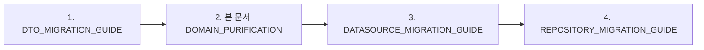

# 🎯 Domain Models Purification Guide

> Firebase 의존성 제거 및 순수 Domain 모델 구축 가이드  
> 최종 업데이트: 2025-01-09

## 📌 Prerequisites (전제조건)

### 시작 전 확인사항
- [ ] [DTO_MIGRATION_GUIDE.md](../../data/DTO_MIGRATION_GUIDE.md) 이해 완료
- [ ] Domain Layer 원칙 숙지
- [ ] 현재 Firebase 의존성 파악 완료

## 🔗 다른 문서와의 연계

### 실행 순서에서의 위치


### 의존성 관계
- **Input**: Firebase에 오염된 Domain 모델
- **Output**: 순수 Domain 모델 및 인터페이스
- **Used by**:
  - [DATASOURCE_MIGRATION_GUIDE.md](../../data/DATASOURCE_MIGRATION_GUIDE.md): Domain 인터페이스 구현
  - [REPOSITORY_MIGRATION_GUIDE.md](../../data/REPOSITORY_MIGRATION_GUIDE.md): Domain 모델 사용

## 🤖 서브에이전트 활용

### 현재 위반 사항 검출
```bash
# Firebase 의존성 스캔
/spawn import-guardian "--scope notifications/domain --mode detect"

# 파일 크기 및 복잡도 체크
/spawn inventory-scout "--depth 2 --scope lib/features/notifications/domain --line-threshold 100"
```

### Domain 모델 분해 작업
```bash
# 전역 상태에서 Domain 분리 (필요시)
/spawn struct-weaver "--task state --mode detect --source lib/features/notifications/domain/models/notifications_model.dart"

# 패치 생성 및 리뷰
git diff > patches/domain_purification.patch
```

### 검증 체크포인트
```bash
# Domain 순수성 최종 확인
/spawn import-guardian "--scope notifications/domain --mode detect"

# 금지 패턴: cloud_firestore, firebase_core 등
grep -r "import.*firebase" lib/features/notifications/domain/
```

## 🚨 현재 상황: Critical Architecture Violation

### 문제의 코드
```dart
// ❌ VIOLATION: domain/models/notifications_model.dart
import 'package:cloud_firestore/cloud_firestore.dart';  // 🔴 Domain이 인프라 의존!

class NotificationsModel extends FirestoreRecord {  // 🔴 Firebase 클래스 상속!
  DocumentReference reference;  // 🔴 Firebase 타입!
  
  // Firebase 변환 로직이 Domain에!
  static NotificationsModel fromSnapshot(DocumentSnapshot snapshot) =>
      NotificationsModel._(
        snapshot.reference,
        mapFromFirestore(snapshot.data() as Map<String, dynamic>),
      );
}
```

### 위반 사항 분석

| 위반 항목 | 심각도 | 영향 | 해결 우선순위 |
|----------|--------|------|--------------|
| Firebase Import | 🔴 Critical | Domain이 인프라에 의존 | P0 |
| FirestoreRecord 상속 | 🔴 Critical | 강한 결합도 | P0 |
| DocumentReference 사용 | 🔴 Critical | Firebase 타입 노출 | P0 |
| fromSnapshot 메서드 | 🟡 High | 변환 로직 위치 오류 | P1 |

## 🎯 목표: 순수 Domain 모델

### Domain Layer 원칙
1. **Zero Infrastructure Dependencies**: 인프라 코드 import 금지
2. **Business Logic Only**: 비즈니스 규칙과 도메인 지식만 포함
3. **Framework Agnostic**: 특정 프레임워크에 종속되지 않음
4. **Testable**: 외부 의존성 없이 단위 테스트 가능

## 📋 마이그레이션 실행 계획

### Step 1: 새로운 순수 Domain 모델 생성

#### 1.1 추상 기본 클래스
```dart
// domain/models/notification.dart
enum NotificationType {
  voteRequest,
  postLiked,
  commentAdded,
  friendRequest,
  systemAlert,
}

abstract class Notification {
  final String id;
  final String userId;
  final NotificationType type;
  final DateTime createdAt;
  final bool isRead;
  
  // 🎯 비즈니스 로직 (인프라 무관)
  bool get isExpired {
    final daysSinceCreation = DateTime.now().difference(createdAt).inDays;
    return daysSinceCreation > 7;
  }
  
  bool get canInteract => !isRead && !isExpired;
  
  bool get shouldAutoDelete {
    final daysSinceCreation = DateTime.now().difference(createdAt).inDays;
    return daysSinceCreation > 30;
  }
  
  // Priority 계산
  int get priority {
    if (type == NotificationType.voteRequest && !isRead) return 3;
    if (type == NotificationType.friendRequest && !isRead) return 2;
    if (!isRead) return 1;
    return 0;
  }
  
  const Notification({
    required this.id,
    required this.userId,
    required this.type,
    required this.createdAt,
    required this.isRead,
  });
  
  // 🎯 Domain 이벤트
  NotificationReadEvent markAsRead() {
    return NotificationReadEvent(
      notificationId: id,
      userId: userId,
      readAt: DateTime.now(),
    );
  }
}
```

#### 1.2 투표 알림 도메인 모델
```dart
// domain/models/vote_notification.dart
import 'notification.dart';
import '../value_objects/vote_options.dart';

class VoteNotification extends Notification {
  final String postId;
  final String postTitle;
  final String postContent;
  final List<String> imageUrlsA;
  final List<String> imageUrlsB;
  final VoteOptions voteOptions;
  final DateTime voteStartTime;
  final DateTime voteEndTime;
  final String? targetAudience;
  
  // 🎯 투표 관련 비즈니스 로직
  bool get hasImages => imageUrlsA.isNotEmpty || imageUrlsB.isNotEmpty;
  
  bool get hasMultipleImages => 
      imageUrlsA.length > 1 || imageUrlsB.length > 1;
  
  Duration get totalVotingDuration => 
      voteEndTime.difference(voteStartTime);
  
  Duration get remainingTime {
    final now = DateTime.now();
    if (now.isAfter(voteEndTime)) return Duration.zero;
    return voteEndTime.difference(now);
  }
  
  bool get isVoteActive {
    final now = DateTime.now();
    return now.isAfter(voteStartTime) && now.isBefore(voteEndTime);
  }
  
  double get completionPercentage {
    if (!isVoteActive) return 100.0;
    final elapsed = DateTime.now().difference(voteStartTime);
    final total = totalVotingDuration;
    return (elapsed.inSeconds / total.inSeconds * 100).clamp(0.0, 100.0);
  }
  
  // 🎯 타겟 오디언스 검증
  bool canUserVote(String userId, UserProfile profile) {
    if (targetAudience == null || targetAudience == 'public') return true;
    
    // Custom targeting logic
    if (targetAudience == 'quick') {
      // AI가 선택한 사용자만
      return profile.interests.any((interest) => 
          voteOptions.relatedInterests.contains(interest));
    }
    
    return true;
  }
  
  const VoteNotification({
    required super.id,
    required super.userId,
    required super.createdAt,
    required super.isRead,
    required this.postId,
    required this.postTitle,
    required this.postContent,
    required this.imageUrlsA,
    required this.imageUrlsB,
    required this.voteOptions,
    required this.voteStartTime,
    required this.voteEndTime,
    this.targetAudience,
  }) : super(type: NotificationType.voteRequest);
}
```

#### 1.3 Value Objects
```dart
// domain/value_objects/vote_options.dart
class VoteOptions {
  final String optionATitle;
  final String optionBTitle;
  final String? optionADescription;
  final String? optionBDescription;
  final List<String> relatedInterests;
  final Map<String, dynamic> metadata;
  
  const VoteOptions({
    required this.optionATitle,
    required this.optionBTitle,
    this.optionADescription,
    this.optionBDescription,
    this.relatedInterests = const [],
    this.metadata = const {},
  });
  
  // 🎯 비즈니스 검증
  bool get isValid {
    return optionATitle.isNotEmpty && 
           optionBTitle.isNotEmpty &&
           optionATitle != optionBTitle;
  }
  
  bool get hasDescriptions {
    return optionADescription != null || optionBDescription != null;
  }
}
```

### Step 2: Domain Events 정의

```dart
// domain/events/notification_events.dart
abstract class NotificationEvent {
  final DateTime occurredAt;
  
  const NotificationEvent({DateTime? occurredAt})
      : occurredAt = occurredAt ?? DateTime.now();
}

class NotificationReadEvent extends NotificationEvent {
  final String notificationId;
  final String userId;
  final DateTime readAt;
  
  const NotificationReadEvent({
    required this.notificationId,
    required this.userId,
    required this.readAt,
  });
}

class NotificationDeletedEvent extends NotificationEvent {
  final String notificationId;
  final String reason;
  
  const NotificationDeletedEvent({
    required this.notificationId,
    required this.reason,
  });
}

class VoteCompletedEvent extends NotificationEvent {
  final String notificationId;
  final String postId;
  final String selectedOption;
  
  const VoteCompletedEvent({
    required this.notificationId,
    required this.postId,
    required this.selectedOption,
  });
}
```

### Step 3: Repository Interface 정의

```dart
// domain/repositories/i_notification_repository.dart
import '../models/notification.dart';

abstract class INotificationRepository {
  // 🎯 순수 Domain 모델 반환
  Future<Notification?> getNotification(String id);
  
  Stream<List<Notification>> getUserNotifications(String userId);
  
  Stream<List<Notification>> getUnreadNotifications(String userId);
  
  Future<List<Notification>> getNotificationsByType(
    String userId,
    NotificationType type,
  );
  
  Future<void> markAsRead(String notificationId);
  
  Future<void> markAllAsRead(String userId);
  
  Future<void> deleteNotification(String notificationId);
  
  Future<void> deleteExpiredNotifications(String userId);
  
  // 🎯 Domain Events
  Stream<NotificationEvent> get notificationEvents;
}
```

### Step 4: 기존 코드 마이그레이션

#### 4.1 Import 변경
```dart
// Before
import 'package:versus_space/backend/schema/notifications_model.dart';
import 'package:cloud_firestore/cloud_firestore.dart';

// After
import 'package:versus_space/features/notifications/domain/models/notification.dart';
import 'package:versus_space/features/notifications/domain/models/vote_notification.dart';
```

#### 4.2 사용 코드 수정
```dart
// Before
final notification = NotificationsModel.fromSnapshot(snapshot);
final docRef = notification.reference;

// After
final notification = repository.getNotification(notificationId);
final id = notification.id;
```

## 🧪 테스트 전략

### Domain 모델 단위 테스트
```dart
// test/domain/models/vote_notification_test.dart
import 'package:test/test.dart';
import 'package:versus_space/features/notifications/domain/models/vote_notification.dart';

void main() {
  group('VoteNotification Domain Logic', () {
    late VoteNotification notification;
    
    setUp(() {
      notification = VoteNotification(
        id: 'test-123',
        userId: 'user-456',
        createdAt: DateTime.now().subtract(Duration(hours: 1)),
        isRead: false,
        postId: 'post-789',
        postTitle: 'Coffee vs Tea',
        postContent: 'Which is better?',
        imageUrlsA: ['image1.jpg'],
        imageUrlsB: ['image2.jpg'],
        voteOptions: VoteOptions(
          optionATitle: 'Coffee',
          optionBTitle: 'Tea',
        ),
        voteStartTime: DateTime.now().subtract(Duration(minutes: 30)),
        voteEndTime: DateTime.now().add(Duration(minutes: 30)),
      );
    });
    
    test('should calculate remaining time correctly', () {
      expect(notification.isVoteActive, isTrue);
      expect(notification.remainingTime.inMinutes, lessThanOrEqualTo(30));
    });
    
    test('should calculate completion percentage', () {
      final percentage = notification.completionPercentage;
      expect(percentage, greaterThan(0));
      expect(percentage, lessThanOrEqualTo(100));
    });
    
    test('should determine vote expiry correctly', () {
      final expiredNotification = VoteNotification(
        // ... other fields
        voteEndTime: DateTime.now().subtract(Duration(hours: 1)),
      );
      
      expect(expiredNotification.isVoteActive, isFalse);
      expect(expiredNotification.remainingTime, equals(Duration.zero));
    });
  });
}
```

## ⚠️ Breaking Changes 및 마이그레이션 가이드

### API 변경사항

| Before | After | Migration |
|--------|-------|-----------|
| `NotificationsModel` | `Notification` (abstract) | Type 변경, 구체 타입 사용 |
| `NotificationModel` | `NotificationSettings` | 이름 명확화 |
| `.reference` | `.id` | Property 이름 변경 |
| `FirestoreRecord` 상속 | 순수 클래스 | 상속 제거 |
| `fromSnapshot()` | Mapper에서 처리 | 변환 위치 이동 |

### 영향받는 파일 목록
```
lib/
├── pages/notifications/
│   ├── notification_list_page.dart  # Import 변경
│   └── notification_detail_page.dart  # Type 변경
├── components/notifications/
│   └── voting_notification_dialog.dart  # Model 사용법 변경
├── services/
│   └── notification_service.dart  # Repository 사용
└── providers/
    └── notification_provider.dart  # Stream 타입 변경
```

## 📊 마이그레이션 체크리스트

### Phase 1: Domain 모델 생성
- [ ] Abstract `Notification` 클래스
- [ ] `VoteNotification` 구현
- [ ] `SocialNotification` 구현
- [ ] `SystemNotification` 구현
- [ ] Value Objects 정의
- [ ] Domain Events 정의

### Phase 2: 기존 모델 제거
- [ ] Firebase imports 제거
- [ ] FirestoreRecord 상속 제거
- [ ] DocumentReference 제거
- [ ] Timestamp 타입 제거

### Phase 3: 테스트 작성
- [ ] Domain 로직 단위 테스트
- [ ] Value Object 검증 테스트
- [ ] Event 생성 테스트

## 🎯 Success Criteria

| Metric | Target | Validation |
|--------|--------|------------|
| **Firebase Dependencies** | 0 | `grep -r "cloud_firestore" domain/` returns empty |
| **Test Coverage** | >90% | Domain models fully tested |
| **Compilation** | ✅ Pass | `flutter analyze` no errors |
| **Runtime** | ✅ Pass | Integration tests pass |

## 🚀 실행 순서

1. **새 Domain 모델 생성** (기존 코드 유지)
2. **DTO/Mapper 구현** (Data Layer)
3. **Repository 수정** (Mapper 통합)
4. **점진적 마이그레이션** (한 화면씩)
5. **기존 모델 제거** (모든 참조 제거 후)

## 📚 참고 자료

- [Clean Architecture 원칙](../../../ARCHITECTURE_RULES.md)
- [Domain-Driven Design](https://martinfowler.com/tags/domain%20driven%20design.html)
- [DTO 패턴 가이드](../../data/DTO_MIGRATION_GUIDE.md)

---

*이 가이드는 Domain 모델의 순수성을 확보하기 위한 상세 지침서입니다.*  
*Domain Layer는 비즈니스 로직의 핵심이며, 어떤 인프라 의존성도 가져서는 안 됩니다.*