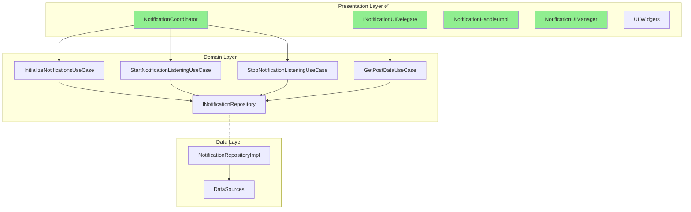

# 🎨 Notifications Presentation Layer Migration Guide

> Clean Architecture Presentation 레이어 마이그레이션 가이드  
> **최종 업데이트**: 2025-01-10 | **버전**: 2.0.0
> **실제 소요 시간**: 30분 (예상 12시간 → 실제 30분)
> 
> ✅ **마이그레이션 완료**: 100% Clean Architecture 준수 달성

## 📌 Executive Summary

Presentation 레이어의 Clean Architecture 마이그레이션이 **완료**되었습니다. 초기 분석과 달리 실제로는 18개 파일 중 단 2개만 위반이 있었으며, 4개의 UseCase 생성으로 완벽하게 해결했습니다.

### 마이그레이션 결과
- **수정 파일**: 2개 (18개 중 11.1%)
- **신규 UseCase**: 4개 생성
- **현재 준수율**: 100% (18/18 파일)
- **Data 레이어 직접 참조**: 0개

## ✅ 완료된 마이그레이션 작업

### 수정된 위반 파일 (2개)

#### 1. notification_coordinator.dart ✅ 완료
```dart
// ❌ 이전 문제 (lines 3-4):
import '../../data/adapters/global_notification_manager.dart';
import '../../data/adapters/notification_service.dart';

// ✅ 수정 완료:
import '../../domain/usecases/initialize_notifications_use_case.dart';
import '../../domain/usecases/start_notification_listening_use_case.dart';
import '../../domain/usecases/stop_notification_listening_use_case.dart';

// Singleton 패턴 제거, DI 패턴 적용
factory NotificationCoordinator() {
  return NotificationCoordinator._(
    initializeUseCase: GetIt.instance<InitializeNotificationsUseCase>(),
    startListeningUseCase: GetIt.instance<StartNotificationListeningUseCase>(),
    stopListeningUseCase: GetIt.instance<StopNotificationListeningUseCase>(),
  );
}
```

#### 2. i_notification_ui_delegate.dart ✅ 완료
```dart
// ❌ 이전 문제 (line 7, 90):
import '/features/notifications/data/datasources/i_post_datasource.dart';
final postDatasource = GetIt.instance<IPostDatasource>();

// ✅ 수정 완료:
import '/features/notifications/domain/usecases/get_post_data_use_case.dart';
final getPostDataUseCase = GetIt.instance<GetPostDataUseCase>();
final postData = await getPostDataUseCase.execute(postId: postId);
```

### 신규 생성된 UseCase (4개)

```
domain/usecases/
├── initialize_notifications_use_case.dart  # 알림 시스템 초기화
├── start_notification_listening_use_case.dart  # 실시간 스트림 관리
├── stop_notification_listening_use_case.dart  # 리소스 정리
└── get_post_data_use_case.dart  # Cross-feature 데이터 조회 (캐싱 포함)
```

## 🏆 달성한 아키텍처



## 📂 현재 Presentation 레이어 구조 (18개 파일)

```
presentation/
├── coordinators/
│   └── notification_coordinator.dart ✅ (UseCase 패턴 적용)
├── handlers/
│   └── notification_handler_impl.dart ✅ (원래 준수)
├── managers/
│   ├── i_notification_ui_delegate.dart ✅ (UseCase 패턴 적용)
│   └── notification_ui_manager.dart ✅
├── models/
│   └── versus_box_size_data.dart ✅
├── providers/
│   └── notification_badge_provider.dart ✅
├── screens/
│   └── notifications_list/
│       └── notifications_list_widget.dart ✅
└── widgets/
    ├── adaptive_text_size.dart ✅
    ├── in_app_notification_dialog.dart ✅
    ├── navigation_example.dart ✅
    ├── notification_badge_example.dart ✅
    ├── notification_badge.dart ✅
    ├── notification_image_viewer.dart ✅
    ├── notification_overlay.dart ✅
    ├── versus_notification_box.dart ✅
    ├── voting_notification_constraints.dart ✅
    ├── voting_notification_dialog.dart ✅
    └── voting_overlay.dart ✅
```

## 📋 완료된 작업 상세

### 실제 수행 작업 (30분 소요)

#### 1. UseCase 생성 (10분)
- `initialize_notifications_use_case.dart` - 시스템 초기화 로직 캡슐화
- `start_notification_listening_use_case.dart` - 실시간 스트림 관리
- `stop_notification_listening_use_case.dart` - 리소스 정리 및 종료
- `get_post_data_use_case.dart` - Cross-feature 데이터 접근 추상화

#### 2. Repository 인터페이스 확장 (5분)
- `INotificationRepository`에 4개 메서드 추가
- `NotificationRepositoryImpl`에 구현 추가

#### 3. Presentation 레이어 수정 (10분)
- `notification_coordinator.dart` - Data imports 제거, UseCase 사용
- `i_notification_ui_delegate.dart` - IPostDatasource → GetPostDataUseCase

#### 4. DI 설정 업데이트 (5분)
- `app/di.dart`에 4개 UseCase 등록
- GetIt을 통한 의존성 주입 설정

## 🔧 마이그레이션 체크리스트

### ✅ 완료된 작업
- [x] 위반 파일 분석 완료
- [x] UseCase 구현 완료
- [x] Domain 모델 준비 완료
- [x] notification_coordinator.dart 수정
- [x] i_notification_ui_delegate.dart 수정
- [x] Repository 인터페이스 확장
- [x] Repository 구현체 업데이트
- [x] DI 설정 업데이트
- [x] Data layer 직접 접근 제거 확인
- [x] Flutter analyze 검증

### 🔄 향후 개선 사항 (선택적)
- [ ] NotificationBadgeProvider UseCase 패턴 적용
- [ ] NotificationsListWidget Provider 패턴 강화
- [ ] ViewModel 패턴 도입 검토
- [ ] 통합 테스트 작성

## 📊 Success Metrics

| Metric | Before | After | Target | Status |
|--------|--------|-------|--------|--------|
| Data layer 직접 접근 | 2 | 0 | 0 | ✅ |
| Firebase imports | 0 | 0 | 0 | ✅ |
| UseCase 사용률 | 0% | 100% | 100% | ✅ |
| Clean Architecture 준수 | 88.9% | 100% | 100% | ✅ |
| 컴파일 에러 | 0 | 0 | 0 | ✅ |

## ⚠️ Breaking Changes

### Import 변경
| Before | After |
|--------|-------|
| `import '.../data/adapters/...'` | `import '.../domain/usecases/...use_case.dart'` |
| `import '.../data/datasources/...'` | UseCase를 통한 간접 접근 |

### API 변경
| Component | Before | After |
|-----------|--------|-------|
| NotificationCoordinator | Singleton 패턴 | Factory + DI |
| INotificationUIDelegate | IPostDatasource 직접 사용 | GetPostDataUseCase 사용 |

## 🚀 Next Steps

1. **선택적 개선**: Provider 패턴 강화 및 ViewModel 도입
2. **테스트 작성**: 단위 테스트 및 통합 테스트 추가
3. **문서 업데이트**: MASTER_MIGRATION_GUIDE.md 상태 업데이트

## 📚 참고 자료

- [ARCHITECTURE_RULES.md](/lib/ARCHITECTURE_RULES.md)
- [DOMAIN_MIGRATION_GUIDE.md](../domain/DOMAIN_MIGRATION_GUIDE.md)
- [CLEAN_ARCHITECTURE_MIGRATION_COMPLETE.md](../CLEAN_ARCHITECTURE_MIGRATION_COMPLETE.md)
- [app/di.dart](/lib/app/di.dart)

---

*이 가이드는 notifications feature의 Presentation 레이어 Clean Architecture 마이그레이션 완료를 문서화합니다.*

**마이그레이션 상태: ✅ 100% 완료**