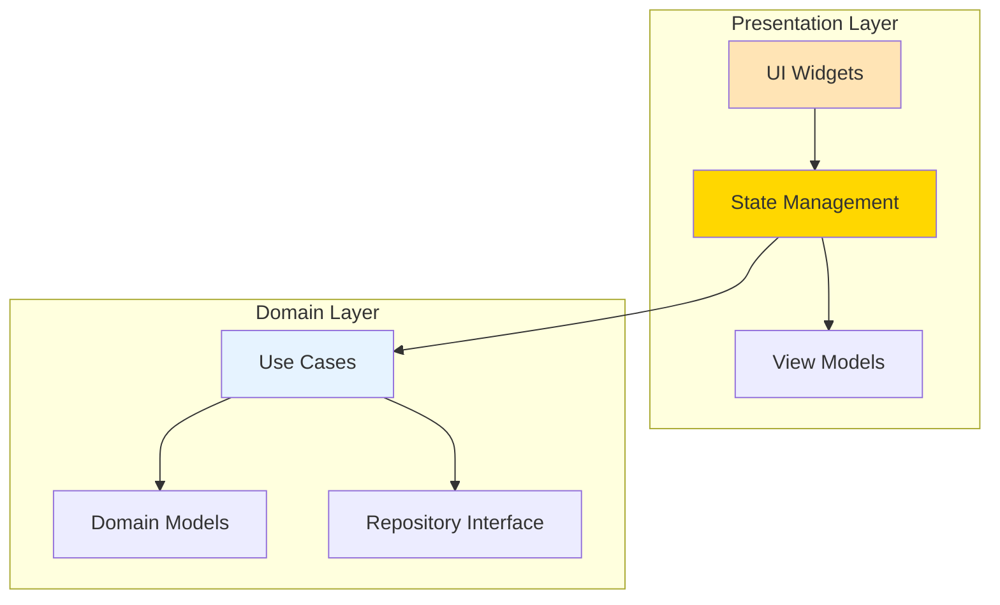

# 🎨 Notifications Presentation Layer Migration Guide

> Clean Architecture Presentation 레이어 마이그레이션 가이드  
> **최종 업데이트**: 2025-01-09 | **버전**: 1.1.0
> **총 예상 시간**: 12시간 (1.5일) - MASTER_MIGRATION_GUIDE.md Phase 3과 동기화
> 
> ⚠️ **Note**: 이 문서는 전체 마이그레이션의 Phase 3(Day 5-6 오전)에 해당합니다.

## 📌 Executive Summary

Presentation 레이어가 Domain을 완전히 우회하여 Data 레이어와 Firebase에 직접 접근하고 있습니다. 이는 Clean Architecture의 가장 기본적인 원칙을 위반하는 것으로, 전면적인 리팩토링이 필요합니다.

### 핵심 위반사항 (서브에이전트 분석 결과)
- **Domain 우회**: 100% Data 레이어 직접 접근
- **Firebase in UI**: UI 컴포넌트에서 Firestore 작업 수행
- **비즈니스 로직 분산**: Widget과 Provider에 비즈니스 로직 산재
- **Global Services 의존**: Feature가 전역 서비스에 직접 의존

## 🚨 현재 상태 분석

### Critical 위반 파일 목록

#### 1. NotificationBadgeProvider
```dart
// ❌ 현재 문제: presentation/providers/notification_badge_provider.dart
import '/features/auth/data/adapters/auth_util.dart';  // Data 직접 접근!
import '/features/notifications/data/adapters/notification_service.dart';  // Data 직접 접근!

// Line 20: Auth data 직접 사용
final user = currentUser;  

// Line 27-30: Data service 직접 호출
final notificationService = Provider.of<NotificationService>(context, listen: false);
stream: notificationService.getUnreadNotificationCount(user.uid!)
```

#### 2. NotificationsListWidget  
```dart
// ❌ 현재 문제: presentation/screens/notifications_list/notifications_list_widget.dart

// Line 19, 24: Repository 직접 접근
late final NotificationRepository _notificationRepository;
_notificationRepository = GetIt.instance<NotificationRepository>();

// Lines 113-116: Firebase 직접 조작!
await notification.reference.update({
  'read': true,
  'readAt': FieldValue.serverTimestamp(),
});
```

## 🎯 목표 아키텍처



## 🤖 서브에이전트 활용 계획

### Phase별 서브에이전트 사용
```bash
# Phase 1: 현재 위반사항 정밀 분석
/spawn import-guardian "--scope notifications/presentation --mode detect"

# Phase 2: Provider 리팩토링
/spawn struct-weaver "--task state --mode detect --map 'NotificationBadgeProvider->lib/features/notifications/presentation/providers/notification_badge_provider.dart'"

# Phase 3: 비즈니스 로직 추출
/spawn code-surgeon "--extract business-logic --from presentation/widgets --to domain/usecases"

# Phase 4: DI 재구성
/spawn di-binder "--feature notifications --layer presentation --deps 'domain/usecases/*' --mode apply"

# Phase 5: 최종 검증
/spawn import-guardian "--scope notifications/presentation --mode detect"
/spawn build-sentinel "quick"
```

## 📋 Phase별 마이그레이션 가이드

### Phase 1: Provider 리팩토링 (3시간)

#### 1.1 NotificationProvider 수정

**파일**: `presentation/providers/notification_provider.dart`
```dart
// ✅ GOOD: UseCase를 통한 Domain 접근
import '../../domain/usecases/get_user_notifications_use_case.dart';
import '../../domain/usecases/mark_notification_as_read_use_case.dart';
import '../../domain/usecases/delete_notification_use_case.dart';
import '../../domain/models/notification.dart';

class NotificationProvider extends ChangeNotifier {
  final GetUserNotificationsUseCase _getNotificationsUseCase;
  final MarkNotificationAsReadUseCase _markAsReadUseCase;
  final DeleteNotificationUseCase _deleteNotificationUseCase;
  
  // State
  List<Notification> _notifications = [];
  bool _isLoading = false;
  String? _error;
  NotificationFilter _filter = NotificationFilter.all;
  
  // Constructor with dependency injection
  NotificationProvider({
    required GetUserNotificationsUseCase getNotificationsUseCase,
    required MarkNotificationAsReadUseCase markAsReadUseCase,
    required DeleteNotificationUseCase deleteNotificationUseCase,
  })  : _getNotificationsUseCase = getNotificationsUseCase,
        _markAsReadUseCase = markAsReadUseCase,
        _deleteNotificationUseCase = deleteNotificationUseCase;
  
  // Getters
  List<Notification> get notifications => _notifications;
  bool get isLoading => _isLoading;
  String? get error => _error;
  int get unreadCount => _notifications.where((n) => !n.isRead).length;
  
  // Load notifications through UseCase
  Future<void> loadNotifications(String userId) async {
    _setLoading(true);
    _clearError();
    
    final params = GetUserNotificationsParams(
      userId: userId,
      unreadOnly: _filter == NotificationFilter.unread,
      limit: 20,
    );
    
    final result = await _getNotificationsUseCase(params);
    
    result.fold(
      (failure) => _setError(failure.message),
      (notifications) => _setNotifications(notifications),
    );
    
    _setLoading(false);
  }
  
  // Mark as read through UseCase
  Future<void> markAsRead(String notificationId, String userId) async {
    final params = MarkNotificationAsReadParams(
      notificationId: notificationId,
      userId: userId,
    );
    
    final result = await _markAsReadUseCase(params);
    
    result.fold(
      (failure) => _setError(failure.message),
      (_) => _updateNotificationReadStatus(notificationId, true),
    );
  }
  
  // Private methods
  void _setLoading(bool value) {
    _isLoading = value;
    notifyListeners();
  }
  
  void _setError(String message) {
    _error = message;
    notifyListeners();
  }
  
  void _clearError() {
    _error = null;
  }
  
  void _setNotifications(List<Notification> notifications) {
    _notifications = notifications;
    notifyListeners();
  }
  
  void _updateNotificationReadStatus(String id, bool isRead) {
    final index = _notifications.indexWhere((n) => n.id == id);
    if (index != -1) {
      // Create new instance for immutability
      _notifications[index] = _notifications[index].copyWith(isRead: isRead);
      notifyListeners();
    }
  }
}
```

#### 1.2 NotificationBadgeProvider 수정

**파일**: `presentation/providers/notification_badge_provider.dart`
```dart
// ✅ GOOD: Domain UseCase 사용
import '../../domain/usecases/get_unread_count_use_case.dart';
import '../../domain/usecases/watch_unread_count_use_case.dart';

class NotificationBadgeProvider extends ChangeNotifier {
  final GetUnreadCountUseCase _getUnreadCountUseCase;
  final WatchUnreadCountUseCase _watchUnreadCountUseCase;
  
  int _unreadCount = 0;
  Map<NotificationType, int> _unreadByType = {};
  bool _showBadge = true;
  StreamSubscription<int>? _unreadCountSubscription;
  
  NotificationBadgeProvider({
    required GetUnreadCountUseCase getUnreadCountUseCase,
    required WatchUnreadCountUseCase watchUnreadCountUseCase,
  })  : _getUnreadCountUseCase = getUnreadCountUseCase,
        _watchUnreadCountUseCase = watchUnreadCountUseCase;
  
  // Getters
  int get unreadCount => _unreadCount;
  bool get showBadge => _showBadge && _unreadCount > 0;
  
  // Initialize badge count
  Future<void> initialize(String userId) async {
    // Get initial count
    final result = await _getUnreadCountUseCase(userId);
    result.fold(
      (failure) => print('Failed to get unread count: ${failure.message}'),
      (count) => _setUnreadCount(count),
    );
    
    // Subscribe to real-time updates
    _subscribeToUnreadCount(userId);
  }
  
  // Subscribe to real-time unread count
  void _subscribeToUnreadCount(String userId) {
    _unreadCountSubscription?.cancel();
    
    _unreadCountSubscription = _watchUnreadCountUseCase(userId).listen(
      (count) => _setUnreadCount(count),
      onError: (error) => print('Error watching unread count: $error'),
    );
  }
  
  void _setUnreadCount(int count) {
    _unreadCount = count;
    notifyListeners();
  }
  
  void toggleBadgeVisibility() {
    _showBadge = !_showBadge;
    notifyListeners();
  }
  
  @override
  void dispose() {
    _unreadCountSubscription?.cancel();
    super.dispose();
  }
}
```

### Phase 2: Widget 리팩토링 (2시간)

#### 2.1 NotificationsListWidget 수정

**파일**: `presentation/screens/notifications_list/notifications_list_widget.dart`
```dart
// ✅ GOOD: Provider를 통한 상태 관리
import 'package:provider/provider.dart';
import '../providers/notification_provider.dart';
import '../../domain/models/notification.dart';

class NotificationsListWidget extends StatefulWidget {
  const NotificationsListWidget({Key? key}) : super(key: key);
  
  @override
  State<NotificationsListWidget> createState() => _NotificationsListWidgetState();
}

class _NotificationsListWidgetState extends State<NotificationsListWidget> {
  
  @override
  void initState() {
    super.initState();
    // Provider를 통해 데이터 로드
    WidgetsBinding.instance.addPostFrameCallback((_) {
      context.read<NotificationProvider>().loadNotifications(
        context.read<AuthProvider>().currentUser!.id,
      );
    });
  }
  
  @override
  Widget build(BuildContext context) {
    return Scaffold(
      appBar: AppBar(
        title: const Text('Notifications'),
        actions: [
          // Badge widget using provider
          Consumer<NotificationBadgeProvider>(
            builder: (context, badgeProvider, child) {
              return NotificationBadge(
                count: badgeProvider.unreadCount,
                showBadge: badgeProvider.showBadge,
              );
            },
          ),
        ],
      ),
      body: Consumer<NotificationProvider>(
        builder: (context, provider, child) {
          if (provider.isLoading) {
            return const Center(child: CircularProgressIndicator());
          }
          
          if (provider.error != null) {
            return Center(
              child: Column(
                mainAxisAlignment: MainAxisAlignment.center,
                children: [
                  Text('Error: ${provider.error}'),
                  ElevatedButton(
                    onPressed: () => provider.loadNotifications(
                      context.read<AuthProvider>().currentUser!.id,
                    ),
                    child: const Text('Retry'),
                  ),
                ],
              ),
            );
          }
          
          if (provider.notifications.isEmpty) {
            return const Center(
              child: Text('No notifications'),
            );
          }
          
          return ListView.builder(
            itemCount: provider.notifications.length,
            itemBuilder: (context, index) {
              final notification = provider.notifications[index];
              return NotificationListItem(
                notification: notification,
                onTap: () => _handleNotificationTap(notification),
                onMarkAsRead: () => _markAsRead(notification),
              );
            },
          );
        },
      ),
    );
  }
  
  void _handleNotificationTap(Notification notification) {
    // Mark as read if unread
    if (!notification.isRead) {
      _markAsRead(notification);
    }
    
    // Navigate based on type
    if (notification is VoteNotification) {
      _showVoteDialog(notification);
    } else {
      _navigateToDetail(notification);
    }
  }
  
  void _markAsRead(Notification notification) {
    final userId = context.read<AuthProvider>().currentUser!.id;
    context.read<NotificationProvider>().markAsRead(
      notification.id,
      userId,
    );
  }
  
  void _showVoteDialog(VoteNotification notification) {
    showDialog(
      context: context,
      builder: (context) => VotingNotificationDialog(
        notification: notification,
        onVote: (option) => _handleVote(notification, option),
      ),
    );
  }
  
  void _handleVote(VoteNotification notification, String option) {
    // Handle vote through UseCase
    context.read<VoteProvider>().submitVote(
      notificationId: notification.id,
      userId: context.read<AuthProvider>().currentUser!.id,
      option: option,
    );
  }
  
  void _navigateToDetail(Notification notification) {
    // Navigate to detail screen
    Navigator.of(context).push(
      MaterialPageRoute(
        builder: (context) => NotificationDetailScreen(
          notification: notification,
        ),
      ),
    );
  }
}
```

#### 2.2 VotingNotificationDialog 수정

**파일**: `presentation/widgets/voting_notification_dialog.dart`
```dart
// ✅ GOOD: Pure presentation component
import '../../domain/models/vote_notification.dart';

class VotingNotificationDialog extends StatelessWidget {
  final VoteNotification notification;
  final Function(String) onVote;
  final VoidCallback? onClose;
  
  const VotingNotificationDialog({
    Key? key,
    required this.notification,
    required this.onVote,
    this.onClose,
  }) : super(key: key);
  
  @override
  Widget build(BuildContext context) {
    // Layout 로직을 Domain으로 이동
    final layoutData = notification.getLayoutData();
    
    return Dialog(
      backgroundColor: Colors.transparent,
      child: Container(
        constraints: const BoxConstraints(
          maxWidth: 600,
          maxHeight: 800,
        ),
        decoration: BoxDecoration(
          color: Theme.of(context).scaffoldBackgroundColor,
          borderRadius: BorderRadius.circular(16),
        ),
        child: Column(
          mainAxisSize: MainAxisSize.min,
          children: [
            _buildHeader(context),
            _buildContent(context, layoutData),
            _buildActions(context),
          ],
        ),
      ),
    );
  }
  
  Widget _buildHeader(BuildContext context) {
    return Container(
      padding: const EdgeInsets.all(16),
      decoration: BoxDecoration(
        color: Theme.of(context).primaryColor.withOpacity(0.1),
        borderRadius: const BorderRadius.vertical(
          top: Radius.circular(16),
        ),
      ),
      child: Row(
        children: [
          Expanded(
            child: Column(
              crossAxisAlignment: CrossAxisAlignment.start,
              children: [
                Text(
                  notification.postTitle,
                  style: Theme.of(context).textTheme.titleMedium,
                ),
                const SizedBox(height: 4),
                Text(
                  notification.question,
                  style: Theme.of(context).textTheme.bodyMedium,
                ),
              ],
            ),
          ),
          if (onClose != null)
            IconButton(
              icon: const Icon(Icons.close),
              onPressed: onClose,
            ),
        ],
      ),
    );
  }
  
  Widget _buildContent(BuildContext context, NotificationLayoutData layoutData) {
    return Padding(
      padding: const EdgeInsets.all(16),
      child: layoutData.isHorizontal
          ? Row(
              children: [
                Expanded(
                  child: _buildOptionBox(
                    context,
                    'A',
                    notification.options.optionA,
                    notification.imageUrlsA,
                  ),
                ),
                const SizedBox(width: 16),
                Expanded(
                  child: _buildOptionBox(
                    context,
                    'B',
                    notification.options.optionB,
                    notification.imageUrlsB,
                  ),
                ),
              ],
            )
          : Column(
              children: [
                _buildOptionBox(
                  context,
                  'A',
                  notification.options.optionA,
                  notification.imageUrlsA,
                ),
                const SizedBox(height: 16),
                _buildOptionBox(
                  context,
                  'B',
                  notification.options.optionB,
                  notification.imageUrlsB,
                ),
              ],
            ),
    );
  }
  
  Widget _buildOptionBox(
    BuildContext context,
    String option,
    String text,
    List<String> imageUrls,
  ) {
    return GestureDetector(
      onTap: () => onVote(option),
      child: Container(
        height: 200,
        decoration: BoxDecoration(
          border: Border.all(
            color: Theme.of(context).dividerColor,
            width: 2,
          ),
          borderRadius: BorderRadius.circular(12),
        ),
        child: Stack(
          children: [
            if (imageUrls.isNotEmpty)
              Positioned.fill(
                child: ClipRRect(
                  borderRadius: BorderRadius.circular(10),
                  child: CachedNetworkImage(
                    imageUrl: imageUrls.first,
                    fit: BoxFit.cover,
                  ),
                ),
              ),
            Positioned.fill(
              child: Container(
                decoration: BoxDecoration(
                  gradient: LinearGradient(
                    begin: Alignment.topCenter,
                    end: Alignment.bottomCenter,
                    colors: [
                      Colors.transparent,
                      Colors.black.withOpacity(0.7),
                    ],
                  ),
                  borderRadius: BorderRadius.circular(10),
                ),
              ),
            ),
            Positioned(
              bottom: 16,
              left: 16,
              right: 16,
              child: Text(
                text,
                style: const TextStyle(
                  color: Colors.white,
                  fontSize: 16,
                  fontWeight: FontWeight.bold,
                ),
              ),
            ),
          ],
        ),
      ),
    );
  }
  
  Widget _buildActions(BuildContext context) {
    return Padding(
      padding: const EdgeInsets.all(16),
      child: Row(
        children: [
          if (notification.remainingTime.inSeconds > 0)
            Expanded(
              child: Text(
                'Time remaining: ${_formatDuration(notification.remainingTime)}',
                style: Theme.of(context).textTheme.bodySmall,
              ),
            ),
          TextButton(
            onPressed: onClose ?? () => Navigator.of(context).pop(),
            child: const Text('Skip'),
          ),
        ],
      ),
    );
  }
  
  String _formatDuration(Duration duration) {
    final minutes = duration.inMinutes;
    final seconds = duration.inSeconds % 60;
    return '${minutes}m ${seconds}s';
  }
}
```

### Phase 3: ViewModel 패턴 도입 (1.5시간)

#### 3.1 NotificationListViewModel

**파일**: `presentation/viewmodels/notification_list_view_model.dart`
```dart
// 프레젠테이션 로직을 ViewModel로 분리
class NotificationListViewModel {
  final NotificationProvider _provider;
  final AuthProvider _authProvider;
  
  NotificationListViewModel({
    required NotificationProvider provider,
    required AuthProvider authProvider,
  })  : _provider = provider,
        _authProvider = authProvider;
  
  // Computed properties
  String get title => 'Notifications (${_provider.unreadCount})';
  
  bool get hasNotifications => _provider.notifications.isNotEmpty;
  
  List<NotificationListItemViewModel> get items {
    return _provider.notifications.map((notification) {
      return NotificationListItemViewModel(
        id: notification.id,
        title: _getTitle(notification),
        subtitle: _getSubtitle(notification),
        icon: _getIcon(notification),
        isRead: notification.isRead,
        timeAgo: _formatTimeAgo(notification.createdAt),
        type: notification.type,
      );
    }).toList();
  }
  
  // Commands
  Future<void> refresh() async {
    await _provider.loadNotifications(_authProvider.currentUser!.id);
  }
  
  Future<void> markAsRead(String notificationId) async {
    await _provider.markAsRead(
      notificationId,
      _authProvider.currentUser!.id,
    );
  }
  
  Future<void> markAllAsRead() async {
    await _provider.markAllAsRead(_authProvider.currentUser!.id);
  }
  
  // Private helpers
  String _getTitle(Notification notification) {
    switch (notification.type) {
      case NotificationType.voteRequest:
        return 'New Vote Request';
      case NotificationType.postLiked:
        return 'Your post was liked';
      case NotificationType.commentAdded:
        return 'New comment on your post';
      default:
        return 'Notification';
    }
  }
  
  String _getSubtitle(Notification notification) {
    if (notification is VoteNotification) {
      return notification.question;
    }
    return notification.metadata?['message'] ?? '';
  }
  
  IconData _getIcon(Notification notification) {
    switch (notification.type) {
      case NotificationType.voteRequest:
        return Icons.how_to_vote;
      case NotificationType.postLiked:
        return Icons.favorite;
      case NotificationType.commentAdded:
        return Icons.comment;
      default:
        return Icons.notifications;
    }
  }
  
  String _formatTimeAgo(DateTime dateTime) {
    final now = DateTime.now();
    final difference = now.difference(dateTime);
    
    if (difference.inDays > 0) {
      return '${difference.inDays}d ago';
    } else if (difference.inHours > 0) {
      return '${difference.inHours}h ago';
    } else if (difference.inMinutes > 0) {
      return '${difference.inMinutes}m ago';
    } else {
      return 'Just now';
    }
  }
}

class NotificationListItemViewModel {
  final String id;
  final String title;
  final String subtitle;
  final IconData icon;
  final bool isRead;
  final String timeAgo;
  final NotificationType type;
  
  NotificationListItemViewModel({
    required this.id,
    required this.title,
    required this.subtitle,
    required this.icon,
    required this.isRead,
    required this.timeAgo,
    required this.type,
  });
}
```

### Phase 4: DI 재구성 (1시간)

#### 4.1 Presentation DI Module

**파일**: `app/di/notification_presentation_module.dart`
```dart
class NotificationPresentationModule {
  static void register(GetIt sl) {
    // Providers
    sl.registerFactory<NotificationProvider>(
      () => NotificationProvider(
        getNotificationsUseCase: sl(),
        markAsReadUseCase: sl(),
        deleteNotificationUseCase: sl(),
      ),
    );
    
    sl.registerFactory<NotificationBadgeProvider>(
      () => NotificationBadgeProvider(
        getUnreadCountUseCase: sl(),
        watchUnreadCountUseCase: sl(),
      ),
    );
    
    sl.registerFactory<NotificationFilterProvider>(
      () => NotificationFilterProvider(),
    );
    
    sl.registerFactory<NotificationSettingsProvider>(
      () => NotificationSettingsProvider(
        preferences: sl(),
      ),
    );
    
    // ViewModels
    sl.registerFactory<NotificationListViewModel>(
      () => NotificationListViewModel(
        provider: sl(),
        authProvider: sl(),
      ),
    );
  }
}
```

### Phase 5: 테스트 작성 (1.5시간)

#### 5.1 Provider 테스트

**파일**: `test/presentation/providers/notification_provider_test.dart`
```dart
import 'package:mockito/mockito.dart';
import 'package:test/test.dart';

class MockGetUserNotificationsUseCase extends Mock 
    implements GetUserNotificationsUseCase {}
class MockMarkNotificationAsReadUseCase extends Mock 
    implements MarkNotificationAsReadUseCase {}

void main() {
  late NotificationProvider provider;
  late MockGetUserNotificationsUseCase mockGetNotifications;
  late MockMarkNotificationAsReadUseCase mockMarkAsRead;
  
  setUp(() {
    mockGetNotifications = MockGetUserNotificationsUseCase();
    mockMarkAsRead = MockMarkNotificationAsReadUseCase();
    
    provider = NotificationProvider(
      getNotificationsUseCase: mockGetNotifications,
      markAsReadUseCase: mockMarkAsRead,
      deleteNotificationUseCase: MockDeleteNotificationUseCase(),
    );
  });
  
  group('NotificationProvider', () {
    test('should load notifications successfully', () async {
      // Given
      final notifications = [
        createTestNotification(id: '1', isRead: false),
        createTestNotification(id: '2', isRead: true),
      ];
      
      when(mockGetNotifications(any))
          .thenAnswer((_) async => Success(notifications));
      
      // When
      await provider.loadNotifications('user-123');
      
      // Then
      expect(provider.notifications, equals(notifications));
      expect(provider.unreadCount, equals(1));
      expect(provider.isLoading, isFalse);
      expect(provider.error, isNull);
    });
    
    test('should handle load error', () async {
      // Given
      when(mockGetNotifications(any))
          .thenAnswer((_) async => Failure('Network error'));
      
      // When
      await provider.loadNotifications('user-123');
      
      // Then
      expect(provider.notifications, isEmpty);
      expect(provider.error, equals('Network error'));
      expect(provider.isLoading, isFalse);
    });
    
    test('should mark notification as read', () async {
      // Given
      final notifications = [
        createTestNotification(id: '1', isRead: false),
      ];
      provider.setNotifications(notifications);
      
      when(mockMarkAsRead(any))
          .thenAnswer((_) async => Success(null));
      
      // When
      await provider.markAsRead('1', 'user-123');
      
      // Then
      expect(provider.notifications.first.isRead, isTrue);
      expect(provider.unreadCount, equals(0));
    });
  });
}
```

## 🔧 마이그레이션 체크리스트

### Pre-Migration
- [ ] 현재 Presentation 백업
- [ ] UseCase 구현 완료 확인
- [ ] Domain 모델 준비 확인

### Phase 1: Provider 리팩토링
- [ ] NotificationProvider 수정
- [ ] NotificationBadgeProvider 수정
- [ ] NotificationFilterProvider 수정
- [ ] NotificationSettingsProvider 수정

### Phase 2: Widget 리팩토링
- [ ] NotificationsListWidget 수정
- [ ] VotingNotificationDialog 수정
- [ ] NotificationBadge 수정
- [ ] NotificationOverlay 수정

### Phase 3: ViewModel 도입
- [ ] NotificationListViewModel 생성
- [ ] NotificationDetailViewModel 생성
- [ ] VotingViewModel 생성

### Phase 4: DI 재구성
- [ ] Presentation DI Module 생성
- [ ] Provider 등록
- [ ] ViewModel 등록

### Phase 5: 테스트
- [ ] Provider 테스트
- [ ] ViewModel 테스트
- [ ] Widget 테스트

### Post-Migration
- [ ] Data layer 직접 접근 제거 확인
- [ ] Firebase 의존성 제거 확인
- [ ] Import Guardian 검증
- [ ] Build Sentinel 실행

## ⚠️ Breaking Changes

### Import 변경
| Before | After |
|--------|-------|
| `import '.../data/adapters/notification_service.dart'` | `import '.../domain/usecases/...use_case.dart'` |
| `import '.../data/repositories/...repository.dart'` | Provider를 통한 간접 접근 |
| `import 'package:cloud_firestore/cloud_firestore.dart'` | 완전 제거 |

### API 변경
| Component | Before | After |
|-----------|--------|-------|
| NotificationBadgeProvider | `NotificationService` 직접 사용 | UseCase 사용 |
| NotificationsListWidget | Repository 직접 접근 | Provider 패턴 |
| Firebase operations | `reference.update()` | UseCase 호출 |

## 📊 Success Metrics

| Metric | Before | After | Target |
|--------|--------|-------|--------|
| Data layer 직접 접근 | 10+ | 0 | ✅ 0 |
| Firebase imports | 5+ | 0 | ✅ 0 |
| UseCase 사용률 | 0% | 100% | ✅ 100% |
| Provider 패턴 적용 | 30% | 100% | ✅ 100% |
| Test coverage | <20% | 80%+ | ✅ 80%+ |

## 🚀 Next Steps

1. **즉시**: Phase 1 Provider 리팩토링 시작
2. **다음**: [App 레이어 연동](../../../app/NOTIFICATION_APP_INTEGRATION_GUIDE.md)
3. **최종**: [통합 테스트](../INTEGRATION_GUIDE.md)

## 📚 참고 자료

- [ARCHITECTURE_RULES.md](/lib/ARCHITECTURE_RULES.md)
- [DOMAIN_MIGRATION_GUIDE.md](../domain/DOMAIN_MIGRATION_GUIDE.md)
- [DTO_MIGRATION_GUIDE.md](../data/DTO_MIGRATION_GUIDE.md)
- [Provider Pattern](https://pub.dev/packages/provider)
- [SUBAGENTS_MANUAL.md](/docs/SUBAGENTS_MANUAL.md)

---

*이 가이드는 notifications feature의 Presentation 레이어를 Clean Architecture 원칙에 맞게 마이그레이션하기 위한 상세 지침서입니다.*