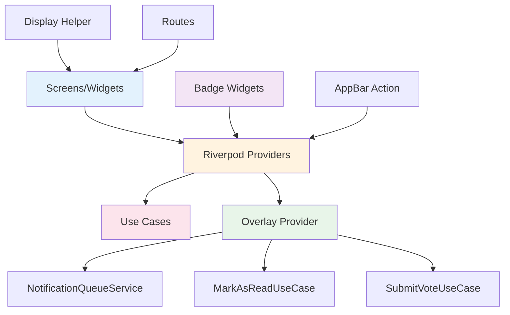

# Notifications Feature - Presentation Layer

> **최종 업데이트**: 2025-01-29
> **버전**: 4.0.0 (Clean Architecture v4.0 + Riverpod 2.x Codegen Complete)
> **UI Framework**: Flutter with Riverpod 2.x Codegen

## 📋 개요

Notifications Feature의 Presentation Layer는 사용자 인터페이스와 상호작용을 담당합니다. **Riverpod 2.x Codegen Pattern** 기반 반응형 상태 관리와 **타입별 필터링 시스템**으로 구성되어 있습니다.

### 핵심 특징
- ✅ **Riverpod 2.x Codegen Pattern**: `@riverpod` 어노테이션으로 보일러플레이트 50% 감소
- ✅ **타입별 필터링 시스템**: Social/System/Voting 전용 StreamProvider
- ✅ **Overlay 알림 시스템**: ChangeNotifier 기반 전역 알림 표시
- ✅ **Clean Architecture v4.0**: Domain Layer와 완전 분리
- ✅ **Badge 시스템**: 실시간 읽지 않은 알림 개수 표시
- ✅ **Freezed when() Pattern**: 타입별 알림 핸들링
- ✅ **AsyncValue.when() Pattern**: loading/error/data 자동 분기

## 🏗️ 디렉토리 구조

```
lib/features/notifications/presentation/
│
├── providers/                          # Riverpod 2.x Providers (1,845줄)
│   ├── notification_providers.dart     # Provider 정의 (258줄)
│   │   ├── UseCase Providers (5개)    # GetIt 래핑
│   │   ├── StreamProviders (4개)      # 실시간 데이터
│   │   ├── 타입별 필터링 (3개)        # Social/System/Voting
│   │   ├── FutureProvider (1개)       # 일회성 조회
│   │   └── Notifier Providers (2개)   # Mutation
│   ├── notification_providers.g.dart   # Auto-generated (1,177줄)
│   ├── notification_badge_provider.dart # AppBar Badge (102줄)
│   └── notification_overlay_provider.dart # Overlay 시스템 (308줄)
│
├── screens/                            # 화면 위젯 (1,357줄)
│   ├── notifications_list/             # 전체 알림 목록 (263줄)
│   │   └── notifications_list_widget.dart
│   ├── social_notifications/           # 소셜 알림 전용 (364줄)
│   │   └── social_notifications_widget.dart
│   ├── system_notifications/           # 시스템 알림 전용 (405줄)
│   │   └── system_notifications_widget.dart
│   └── voting_notifications/           # 투표 알림 전용 (325줄)
│       └── voting_notifications_widget.dart
│
├── widgets/                            # 공통 위젯 (114줄)
│   └── notification_badge.dart         # Badge 위젯
│       ├── NotificationBadge           # 기본 Badge
│       └── NotificationIconWithBadge   # Icon + Badge
│
├── helpers/                            # 헬퍼 클래스 (78줄)
│   └── notification_display_helper.dart # 표시 로직 헬퍼
│
└── routes/                             # 라우팅 (50줄)
    └── notification_routes.dart        # GoRouter 라우트 정의

총 파일: 11개
총 코드: 3,444줄
```

## 🔧 주요 컴포넌트

### 1. Riverpod 2.x Codegen Providers (258줄 + 1,177줄 generated)

#### UseCase Providers (GetIt 래핑)

```dart
// notification_providers.dart
import 'package:riverpod_annotation/riverpod_annotation.dart';
import 'package:get_it/get_it.dart';

part 'notification_providers.g.dart';

/// WatchUserNotificationsUseCase Provider
///
/// GetIt DI에서 UseCase 인스턴스를 가져옵니다.
@riverpod
WatchUserNotificationsUseCase watchUserNotificationsUseCase(Ref ref) {
  return GetIt.instance<WatchUserNotificationsUseCase>();
}

/// WatchUnreadCountUseCase Provider
@riverpod
WatchUnreadCountUseCase watchUnreadCountUseCase(Ref ref) {
  return GetIt.instance<WatchUnreadCountUseCase>();
}

// ... 총 5개 UseCase Provider
```

**등록된 UseCase Providers**:
1. `watchUserNotificationsUseCaseProvider` - 실시간 알림 감시
2. `watchUnreadCountUseCaseProvider` - 읽지 않은 개수 감시
3. `getUserNotificationsUseCaseProvider` - 일회성 알림 조회
4. `markAsReadUseCaseProvider` - 읽음 처리
5. `sendNotificationUseCaseProvider` - 알림 전송

#### StreamProvider (실시간 데이터)

```dart
/// 사용자 알림 실시간 감시
///
/// **StreamProvider Codegen**:
/// - userId별로 독립적인 스트림
/// - 화면 벗어나면 자동 dispose (메모리 누수 방지)
///
/// **사용 예시**:
/// ```dart
/// final notificationsAsync = ref.watch(
///   watchUserNotificationsProvider(userId),
/// );
/// ```
@riverpod
Stream<List<Notification>> watchUserNotifications(
  Ref ref,
  String userId,
) {
  final usecase = ref.watch(watchUserNotificationsUseCaseProvider);

  // UseCase는 이미 비즈니스 로직 포함 (만료 필터링, 정렬)
  return usecase(userId);
}

/// 읽지 않은 알림 개수 실시간 감시
///
/// **Badge에 사용**:
/// - 앱바의 알림 아이콘 Badge
/// - 탭 바의 알림 탭 Badge
///
/// **사용 예시**:
/// ```dart
/// final unreadCountAsync = ref.watch(
///   watchUnreadCountProvider(userId),
/// );
/// unreadCountAsync.when(
///   data: (count) => Badge(count: count, child: Icon(Icons.notifications)),
///   loading: () => Icon(Icons.notifications),
///   error: (_, __) => Icon(Icons.notifications_off),
/// );
/// ```
@riverpod
Stream<int> watchUnreadCount(
  Ref ref,
  String userId,
) {
  final usecase = ref.watch(watchUnreadCountUseCaseProvider);
  return usecase(userId);
}
```

**StreamProvider 특징**:
- **Codegen**: `@riverpod` 어노테이션으로 자동 생성
- **autoDispose**: 자동 메모리 관리 (기본값)
- **family**: 파라미터별 독립 인스턴스 (Codegen은 파라미터로 자동 family)
- **UseCase 통합**: Domain Layer와 완전 분리

#### 타입별 필터링 Providers (Notifications 고유 패턴)

```dart
/// Social 알림만 필터링
///
/// **사용 예시**: 소셜 알림 전용 화면
/// **반환 타입**: Notification 리스트 (런타임에 SocialNotification만 포함)
@riverpod
Stream<List<Notification>> watchSocialNotifications(
  Ref ref,
  String userId,
) {
  final usecase = ref.watch(watchUserNotificationsUseCaseProvider);

  // UseCase에서 스트림을 가져와 필터링
  return usecase(userId).asyncMap((notifications) {
    return notifications
        .whereType<SocialNotification>()
        .cast<Notification>()
        .toList();
  });
}

/// System 알림만 필터링
///
/// **사용 예시**: 시스템 공지 화면
@riverpod
Stream<List<Notification>> watchSystemNotifications(
  Ref ref,
  String userId,
) {
  final usecase = ref.watch(watchUserNotificationsUseCaseProvider);

  return usecase(userId).asyncMap((notifications) {
    return notifications
        .whereType<SystemNotification>()
        .cast<Notification>()
        .toList();
  });
}

/// Voting 알림만 필터링
///
/// **사용 예시**: 투표 요청 화면
@riverpod
Stream<List<Notification>> watchVotingNotifications(
  Ref ref,
  String userId,
) {
  final usecase = ref.watch(watchUserNotificationsUseCaseProvider);

  return usecase(userId).asyncMap((notifications) {
    return notifications
        .whereType<VotingNotification>()
        .cast<Notification>()
        .toList();
  });
}
```

**타입별 필터링 패턴 장점**:
- ✅ **타입 안전성**: Dart의 `whereType<T>()` 활용
- ✅ **화면별 최적화**: 필요한 타입만 필터링
- ✅ **Freezed Sealed Union 통합**: 3가지 알림 타입 자동 구분
- ✅ **재사용성**: 여러 화면에서 동일 Provider 재사용

#### Notifier Providers (Mutation)

```dart
/// 알림 읽음 처리
///
/// **사용 예시**:
/// ```dart
/// await ref.read(markAsReadNotifierProvider.notifier).call(
///   notificationId: notif.id,
///   userId: currentUserId,
/// );
/// ```
@riverpod
class MarkAsReadNotifier extends _$MarkAsReadNotifier {
  @override
  FutureOr<void> build() {
    // No-op: Action Provider는 build() 불필요
  }

  /// 알림 읽음 처리 실행
  Future<void> call({
    required String notificationId,
    required String userId,
  }) async {
    state = const AsyncLoading();

    final usecase = ref.read(markAsReadUseCaseProvider);
    final result = await usecase(MarkAsReadParams(
      notificationId: notificationId,
      userId: userId,
    ));

    result.fold(
      (failure) {
        state = AsyncError(failure, StackTrace.current);
        throw Exception(failure.message);
      },
      (_) {
        state = const AsyncData(null);
      },
    );
  }
}

/// 알림 전송
///
/// **사용 예시**: 관리자 페이지에서 알림 전송
@riverpod
class SendNotificationNotifier extends _$SendNotificationNotifier {
  @override
  FutureOr<void> build() {
    // No-op
  }

  /// 알림 전송 실행
  Future<void> call(SendNotificationParams params) async {
    state = const AsyncLoading();

    final usecase = ref.read(sendNotificationUseCaseProvider);
    final result = await usecase(params);

    result.fold(
      (failure) {
        state = AsyncError(failure, StackTrace.current);
        throw Exception(failure.message);
      },
      (_) {
        state = const AsyncData(null);
      },
    );
  }
}
```

**Notifier Pattern 장점**:
- ✅ **상태 관리**: AsyncValue로 loading/error/data 자동 관리
- ✅ **에러 처리**: Either → AsyncError 자동 변환
- ✅ **UI 반응성**: state 변경 시 UI 자동 업데이트

### 2. NotificationOverlayProvider (ChangeNotifier 기반)

```dart
/// Notification Overlay Provider - Presentation Layer
///
/// Subscribes to NotificationQueueService stream and displays notifications as overlays.
/// Handles user interactions (vote, dismiss) and coordinates with business logic layer.
///
/// Clean Architecture: Presentation → Data (via Stream)
class NotificationOverlayProvider extends ChangeNotifier {
  final NotificationQueueService _queueService;
  final MarkAsReadUseCase _markAsRead;

  StreamSubscription<domain.Notification>? _subscription;
  bool _isInitialized = false;

  NotificationOverlayProvider({
    required NotificationQueueService queueService,
    required MarkAsReadUseCase markAsRead,
  })  : _queueService = queueService,
        _markAsRead = markAsRead;

  /// Start listening to notification stream
  void startListening() {
    if (_isInitialized) {
      Logger.warning('NotificationOverlayProvider already initialized',
          tag: 'NotificationOverlayProvider');
      return;
    }

    Logger.info('Starting notification overlay listener',
        tag: 'NotificationOverlayProvider');

    _subscription = _queueService.showNotificationStream.listen(
      (notification) => _handleNotification(notification),
      onError: (error) {
        Logger.error('Stream error', error: error, tag: 'NotificationOverlayProvider');
      },
    );

    _isInitialized = true;
  }

  /// Handle incoming notification from stream (using Freezed when pattern)
  void _handleNotification(domain.Notification notification) {
    Logger.debug('Received notification: ${notification.id}, type: ${notification.type}',
        tag: 'NotificationOverlayProvider');

    // Route to appropriate handler based on notification type using Freezed when pattern
    notification.when(
      social: (...) {
        _showSocialDialog(notification as domain.SocialNotification);
      },
      system: (...) {
        _showSystemDialog(notification as domain.SystemNotification);
      },
      voting: (...) {
        if (type == NotificationTypes.votingRequest) {
          _showVotingDialog(notification);
        } else {
          Logger.warning('Unknown voting notification type: $type',
              tag: 'NotificationOverlayProvider');
          _queueService.notificationClosed();
        }
      },
    );
  }

  /// Handle vote callback from voting feature
  Future<void> _handleVote(
    domain.Notification notification,
    String selectedOption,
  ) async {
    final votingNotif = notification as domain.VotingNotification;

    // 1. Submit vote using SubmitVoteUseCase (Clean Architecture v4.0)
    final submitVote = getIt<SubmitVoteUseCase>();
    final voteResult = await submitVote(
      postId: votingNotif.postId,
      userId: notification.userId,
      voteOption: selectedOption,
    );

    // 2. Handle vote submission result
    await voteResult.fold(
      (failure) async {
        BotToast.showText(text: '투표 제출 실패');
        _queueService.notificationClosed();
      },
      (postVoting) async {
        // 3. Mark notification as read
        final markAsReadResult = await _markAsRead.call(MarkAsReadParams(
          notificationId: notification.id,
          userId: notification.userId,
        ));

        markAsReadResult.fold(
          (failure) => _queueService.notificationClosed(),
          (_) => _queueService.notificationClosed(delayMilliseconds: 300),
        );
      },
    );
  }

  @override
  void dispose() {
    stopListening();
    super.dispose();
  }
}
```

**Overlay 시스템 특징**:
- ✅ **전역 알림**: NotificationQueueService Stream 구독
- ✅ **Freezed when() 패턴**: 타입별 핸들러 자동 라우팅
- ✅ **투표 통합**: SubmitVoteUseCase와 연동
- ✅ **Clean Architecture**: UseCase 통한 비즈니스 로직 실행

### 3. Screens (4개 화면)

#### NotificationsListWidget (263줄)

```dart
/// 알림 목록 화면
///
/// **Riverpod ConsumerWidget**:
/// - StatefulWidget → ConsumerWidget 마이그레이션 완료
/// - StreamBuilder → AsyncValue.when() 패턴 사용
/// - GetIt → Riverpod Provider로 DI 전환
///
/// **상태 관리**:
/// - watchUserNotificationsProvider: 실시간 알림 스트림
/// - markAsReadNotifierProvider: 읽음 처리 액션
class NotificationsListWidget extends ConsumerWidget {
  const NotificationsListWidget({Key? key}) : super(key: key);

  @override
  Widget build(BuildContext context, WidgetRef ref) {
    final userId = FirebaseAuth.instance.currentUser?.uid ?? '';

    // Riverpod Provider로 실시간 알림 감시
    final notificationsAsync = ref.watch(
      watchUserNotificationsProvider(userId),
    );

    return Scaffold(
      appBar: AppBar(title: Text('알림')),
      body: SafeArea(
        // AsyncValue.when()으로 loading/error/data 상태 처리
        child: notificationsAsync.when(
          loading: () => CircularProgressIndicator(),
          error: (error, stack) => ErrorWidget(error),
          data: (notifications) {
            if (notifications.isEmpty) {
              return EmptyState(message: '알림이 없습니다');
            }

            return ListView.builder(
              itemCount: notifications.length,
              itemBuilder: (context, index) {
                final notification = notifications[index];
                return NotificationListItem(
                  notification: notification,
                  onTap: () async {
                    if (!notification.isRead) {
                      await ref.read(markAsReadProvider.notifier).call(
                        notificationId: notification.id,
                        userId: userId,
                      );
                    }
                    // Navigate to detail or perform action
                  },
                );
              },
            );
          },
        ),
      ),
    );
  }
}
```

**주요 기능**:
- ✅ **ConsumerWidget**: StatelessWidget + Riverpod
- ✅ **AsyncValue.when()**: 자동 loading/error/data 분기
- ✅ **실시간 구독**: StreamProvider 자동 구독/해제
- ✅ **읽음 처리**: markAsReadNotifier 통합

#### VotingNotificationsWidget (325줄)

```dart
/// 투표 요청 알림 전용 화면
///
/// **Riverpod ConsumerWidget**:
/// - watchVotingNotificationsProvider: Voting 타입만 필터링된 스트림
/// - AsyncValue.when() 패턴으로 loading/error/data 상태 처리
///
/// **사용 예시**:
/// - 투표 요청 알림만 보고 싶을 때
/// - 투표 관련 액션이 필요한 알림 모아보기
class VotingNotificationsWidget extends ConsumerWidget {
  const VotingNotificationsWidget({Key? key}) : super(key: key);

  @override
  Widget build(BuildContext context, WidgetRef ref) {
    final userId = FirebaseAuth.instance.currentUser?.uid ?? '';

    // Voting 알림만 필터링된 Stream 구독
    final notificationsAsync = ref.watch(
      watchVotingNotificationsProvider(userId),
    );

    return Scaffold(
      appBar: AppBar(title: Text('투표 요청')),
      body: SafeArea(
        child: notificationsAsync.when(
          loading: () => CircularProgressIndicator(),
          error: (error, stack) => ErrorWidget(error),
          data: (notifications) {
            if (notifications.isEmpty) {
              return EmptyState(
                icon: Icons.how_to_vote_outlined,
                message: '투표 요청이 없습니다',
              );
            }

            return ListView.builder(
              itemCount: notifications.length,
              itemBuilder: (context, index) {
                final notification = notifications[index];

                // VotingNotification 타입 체크
                if (notification is! VotingNotification) {
                  return const SizedBox.shrink();
                }

                return VotingNotificationListItem(
                  notification: notification,
                  onTap: () {
                    // Navigate to voting page
                    context.push('/chatDetail?chatId=ai_assistant_$userId');
                  },
                );
              },
            );
          },
        ),
      ),
    );
  }
}
```

**타입별 화면 특징**:
- ✅ **타입 필터링**: `watchVotingNotificationsProvider` 사용
- ✅ **타입 안전성**: `is!` 체크로 타입 확정
- ✅ **전용 UI**: 투표 전용 아이콘 및 메시지
- ✅ **투표 페이지 연동**: AI 채팅방으로 네비게이션

#### SocialNotificationsWidget (364줄)

**특징**:
- `watchSocialNotificationsProvider` 사용
- Social 전용 UI (좋아요, 댓글, 팔로우 등)
- 소셜 액션별 아이콘 및 메시지

#### SystemNotificationsWidget (405줄)

**특징**:
- `watchSystemNotificationsProvider` 사용
- System 전용 UI (공지, 업데이트, 보안 알림 등)
- Alert 타입별 우선순위 표시

### 4. Widgets (114줄)

#### NotificationBadge

```dart
/// 알림 뱃지를 표시하는 위젯
///
/// 아이콘 위에 읽지 않은 알림 개수를 표시합니다.
/// 개수가 0일 때는 뱃지가 표시되지 않습니다.
class NotificationBadge extends StatelessWidget {
  final Widget child;
  final int count;
  final Color? badgeColor;
  final Color? textColor;
  final double? size;
  final bool showZero;
  final Alignment alignment;

  const NotificationBadge({
    Key? key,
    required this.child,
    required this.count,
    this.badgeColor,
    this.textColor,
    this.size,
    this.showZero = false,
    this.alignment = Alignment.topRight,
  }) : super(key: key);

  @override
  Widget build(BuildContext context) {
    if (count <= 0 && !showZero) {
      return child;
    }

    // 99보다 큰 숫자는 99+로 표시
    final displayCount = count > 99 ? '99+' : count.toString();

    return Stack(
      alignment: alignment,
      children: [
        child,
        Positioned(
          right: 0,
          top: 0,
          child: Container(
            decoration: BoxDecoration(
              color: badgeColor ?? Colors.red,
              shape: count > 99 ? BoxShape.rectangle : BoxShape.circle,
              borderRadius: count > 99 ? BorderRadius.circular(9) : null,
            ),
            child: Text(displayCount),
          ),
        ),
      ],
    );
  }
}

/// 알림 아이콘과 뱃지를 함께 표시하는 위젯
class NotificationIconWithBadge extends StatelessWidget {
  final int count;
  final IconData icon;
  final double iconSize;
  final Color? iconColor;
  final Color? badgeColor;
  final VoidCallback? onPressed;

  const NotificationIconWithBadge({
    Key? key,
    required this.count,
    this.icon = Icons.notifications_outlined,
    this.iconSize = 24.0,
    this.iconColor,
    this.badgeColor,
    this.onPressed,
  }) : super(key: key);

  @override
  Widget build(BuildContext context) {
    return IconButton(
      icon: NotificationBadge(
        count: count,
        badgeColor: badgeColor,
        child: Icon(icon, size: iconSize, color: iconColor),
      ),
      onPressed: onPressed,
    );
  }
}
```

**Badge 시스템 특징**:
- ✅ **99+ 표시**: 99보다 큰 숫자 자동 처리
- ✅ **0일 때 숨김**: count가 0이면 Badge 미표시
- ✅ **재사용성**: 모든 아이콘에 적용 가능
- ✅ **실시간 업데이트**: StreamProvider와 통합

#### NotificationAppBarAction (102줄)

```dart
/// 앱바에서 사용할 수 있는 알림 아이콘 액션
///
/// **Riverpod ConsumerWidget**:
/// - watchUnreadCountProvider: 실시간 읽지 않은 알림 개수
class NotificationAppBarAction extends ConsumerWidget {
  final VoidCallback? onPressed;
  final IconData icon;
  final Color? iconColor;
  final Color? badgeColor;

  const NotificationAppBarAction({
    Key? key,
    this.onPressed,
    this.icon = Icons.notifications_outlined,
    this.iconColor,
    this.badgeColor,
  }) : super(key: key);

  @override
  Widget build(BuildContext context, WidgetRef ref) {
    final userId = FirebaseAuth.instance.currentUser?.uid ?? '';

    if (userId.isEmpty) {
      return NotificationIconWithBadge(
        count: 0,
        icon: icon,
        onPressed: onPressed ?? () => context.pushNamed('notificationsList'),
      );
    }

    // Riverpod Provider로 실시간 읽지 않은 알림 개수 감시
    final unreadCountAsync = ref.watch(
      watchUnreadCountProvider(userId),
    );

    // AsyncValue.when()으로 loading/error/data 상태 처리
    return unreadCountAsync.when(
      loading: () => NotificationIconWithBadge(count: 0, icon: icon),
      error: (error, stack) => NotificationIconWithBadge(count: 0, icon: icon),
      data: (count) => NotificationIconWithBadge(
        count: count,
        icon: icon,
        iconColor: iconColor,
        badgeColor: badgeColor,
        onPressed: onPressed ?? () => context.pushNamed('notificationsList'),
      ),
    );
  }
}
```

**AppBar Action 특징**:
- ✅ **실시간 Badge**: `watchUnreadCountProvider` 통합
- ✅ **로그인 체크**: userId 없을 때 0개 표시
- ✅ **기본 네비게이션**: 알림 목록으로 이동
- ✅ **에러 처리**: 에러 시에도 0개로 표시

## 📦 의존성 구조



## 🎨 UI/UX 특징

### AsyncValue.when() 패턴

```dart
// NotificationsListWidget에서 AsyncValue.when() 사용
final notificationsAsync = ref.watch(
  watchUserNotificationsProvider(userId),
);

return notificationsAsync.when(
  // 로딩 중
  loading: () => Center(
    child: CircularProgressIndicator(),
  ),
  // 에러 발생
  error: (error, stack) => Center(
    child: Column(
      children: [
        Icon(Icons.error_outline, size: 72),
        Text('알림을 불러올 수 없습니다'),
        Text(error.toString()),
      ],
    ),
  ),
  // 데이터 로드 성공
  data: (notifications) {
    if (notifications.isEmpty) {
      return EmptyState(message: '알림이 없습니다');
    }

    return ListView.builder(
      itemCount: notifications.length,
      itemBuilder: (context, index) => NotificationListItem(
        notification: notifications[index],
      ),
    );
  },
);
```

### Badge 시스템

```dart
// AppBar에 Badge 추가
AppBar(
  actions: [
    NotificationAppBarAction(
      icon: Icons.notifications_outlined,
      iconColor: Colors.white,
      badgeColor: Colors.red,
      onPressed: () => context.pushNamed('notificationsList'),
    ),
  ],
)

// 실시간 Badge 업데이트
final unreadCountAsync = ref.watch(watchUnreadCountProvider(userId));

unreadCountAsync.when(
  data: (count) => NotificationIconWithBadge(
    count: count, // 실시간으로 업데이트됨
    icon: Icons.notifications,
  ),
  loading: () => NotificationIconWithBadge(count: 0),
  error: (_, __) => NotificationIconWithBadge(count: 0),
);
```

### Freezed when() 패턴

```dart
// Overlay에서 타입별 핸들링
notification.when(
  social: (id, userId, type, title, content, ...) {
    _showSocialDialog(notification as SocialNotification);
  },
  system: (id, userId, type, title, content, ...) {
    _showSystemDialog(notification as SystemNotification);
  },
  voting: (id, userId, type, title, content, ...) {
    if (type == NotificationTypes.votingRequest) {
      _showVotingDialog(notification);
    }
  },
);
```

## 💾 Riverpod 2.x Codegen 사용 방법

### 1. Provider 설정

```dart
// main.dart
void main() async {
  WidgetsFlutterBinding.ensureInitialized();

  // DI 초기화
  await setupDependencyInjection();

  runApp(
    ProviderScope(
      child: MyApp(),
    ),
  );
}
```

**주의**: Riverpod 2.x는 `ProviderScope`만 필요하며, 개별 Provider는 `providers/notification_providers.dart`에서 자동 관리됩니다.

### 2. Code Generation

```bash
# Provider 코드 생성
$ dart run build_runner build --delete-conflicting-outputs

# Watch 모드 (자동 재생성)
$ dart run build_runner watch
```

**생성 파일**:
- `notification_providers.g.dart` (1,177줄 자동 생성)

### 3. Widget에서 사용

#### ConsumerWidget 패턴 (권장)

```dart
class NotificationsListWidget extends ConsumerWidget {
  const NotificationsListWidget({Key? key}) : super(key: key);

  @override
  Widget build(BuildContext context, WidgetRef ref) {
    // ✅ ref.watch()로 Provider 구독
    final notificationsAsync = ref.watch(
      watchUserNotificationsProvider(userId),
    );

    // ✅ AsyncValue.when()으로 자동 분기
    return notificationsAsync.when(
      loading: () => CircularProgressIndicator(),
      error: (error, stack) => ErrorWidget(error),
      data: (notifications) => ListView.builder(
        itemCount: notifications.length,
        itemBuilder: (context, index) => NotificationListItem(
          notification: notifications[index],
        ),
      ),
    );
  }
}
```

#### Notifier 사용 (Mutation)

```dart
// 읽음 처리
await ref.read(markAsReadProvider.notifier).call(
  notificationId: notification.id,
  userId: currentUserId,
);

// 알림 전송
await ref.read(sendNotificationProvider.notifier).call(
  SendNotificationParams(
    notification: notification,
    targetUserIds: ['user1', 'user2'],
  ),
);
```

#### 타입별 필터링 사용

```dart
// Voting 알림만 구독
final votingAsync = ref.watch(
  watchVotingNotificationsProvider(userId),
);

// Social 알림만 구독
final socialAsync = ref.watch(
  watchSocialNotificationsProvider(userId),
);

// System 알림만 구독
final systemAsync = ref.watch(
  watchSystemNotificationsProvider(userId),
);
```

### 4. Provider 라이프사이클

```dart
// ✅ Codegen은 기본적으로 autoDispose
@riverpod
Stream<List<Notification>> watchUserNotifications(
  Ref ref,
  String userId,
) {
  // Widget이 dispose되면 자동으로 Stream 취소
  final usecase = ref.watch(watchUserNotificationsUseCaseProvider);
  return usecase(userId);
}

// ✅ keepAlive가 필요한 경우
@Riverpod(keepAlive: true)
Stream<int> watchUnreadCount(Ref ref, String userId) {
  final usecase = ref.watch(watchUnreadCountUseCaseProvider);
  return usecase(userId);
}
```

**라이프사이클**:
1. Widget에서 `ref.watch()` 호출 → Provider 생성
2. Stream 시작 및 데이터 emit
3. Widget dispose → autoDispose가 Stream 취소
4. `@Riverpod(keepAlive: true)` 사용 시 → Widget dispose 후에도 유지

## 🚀 새로운 기능 추가 가이드

### 1. 새로운 Screen 추가

```dart
// 1. Screen 파일 생성
// presentation/screens/priority_notifications/priority_notifications_widget.dart
class PriorityNotificationsWidget extends ConsumerWidget {
  const PriorityNotificationsWidget({super.key});

  @override
  Widget build(BuildContext context, WidgetRef ref) {
    final userId = FirebaseAuth.instance.currentUser?.uid ?? '';

    // Provider 연결
    final notificationsAsync = ref.watch(
      watchUserNotificationsProvider(userId),
    );

    return Scaffold(
      appBar: AppBar(title: Text('우선순위 알림')),
      body: notificationsAsync.when(
        data: (notifications) {
          // 우선순위 높은 알림만 필터링
          final priorityNotifications = notifications
              .where((n) => n.priority >= 3)
              .toList();

          return ListView.builder(
            itemCount: priorityNotifications.length,
            itemBuilder: (context, index) => NotificationListItem(
              notification: priorityNotifications[index],
            ),
          );
        },
        loading: () => CircularProgressIndicator(),
        error: (error, stack) => ErrorWidget(error),
      ),
    );
  }
}
```

### 2. 새로운 Provider 추가

```dart
// 1. Provider 정의 추가 (Codegen)
// presentation/providers/notification_providers.dart

/// 우선순위 높은 알림만 필터링
@riverpod
Stream<List<Notification>> watchPriorityNotifications(
  Ref ref,
  String userId,
) {
  final usecase = ref.watch(watchUserNotificationsUseCaseProvider);

  return usecase(userId).asyncMap((notifications) {
    return notifications
        .where((n) => n.priority >= 3)
        .toList();
  });
}

// 2. Code generation 실행
// $ dart run build_runner build --delete-conflicting-outputs

// 3. 사용
final priorityAsync = ref.watch(
  watchPriorityNotificationsProvider(userId),
);
```

### 3. 새로운 타입별 화면 추가

```dart
// 1. Provider 추가 (이미 Social/System/Voting 패턴 존재)
@riverpod
Stream<List<Notification>> watchCustomTypeNotifications(
  Ref ref,
  String userId,
) {
  final usecase = ref.watch(watchUserNotificationsUseCaseProvider);

  return usecase(userId).asyncMap((notifications) {
    return notifications
        .where((n) => n.type == 'custom_type')
        .toList();
  });
}

// 2. Screen 생성
class CustomTypeNotificationsWidget extends ConsumerWidget {
  @override
  Widget build(BuildContext context, WidgetRef ref) {
    final userId = FirebaseAuth.instance.currentUser?.uid ?? '';

    final notificationsAsync = ref.watch(
      watchCustomTypeNotificationsProvider(userId),
    );

    return Scaffold(
      appBar: AppBar(title: Text('커스텀 알림')),
      body: notificationsAsync.when(
        data: (notifications) => ListView.builder(...),
        loading: () => CircularProgressIndicator(),
        error: (error, stack) => ErrorWidget(error),
      ),
    );
  }
}
```

### 4. Overlay 핸들러 추가

```dart
// presentation/providers/notification_overlay_provider.dart

/// Handle custom notification type
Future<void> _showCustomDialog(domain.Notification notification) async {
  final context = appNavigatorKey.currentContext;
  if (context == null) {
    // Retry logic
    return;
  }

  try {
    await showDialog(
      context: context,
      builder: (dialogContext) => AlertDialog(
        title: Text(notification.title),
        content: Text(notification.content),
        actions: [
          TextButton(
            onPressed: () async {
              Navigator.of(dialogContext).pop();
              await _handleDismiss(notification);
            },
            child: Text('확인'),
          ),
        ],
      ),
    );
  } catch (e) {
    Logger.error('Error showing custom dialog', error: e);
    _queueService.notificationClosed();
  }
}

// _handleNotification에 케이스 추가
notification.when(
  social: (...) => _showSocialDialog(...),
  system: (...) => _showSystemDialog(...),
  voting: (...) => _showVotingDialog(...),
  // 새로운 타입 추가 시 여기에 추가
);
```

## ⚠️ 주의사항

### Clean Architecture 원칙

- ❌ **No Direct Domain Access**: UseCase를 통해서만 Domain 접근
- ❌ **No Business Logic**: 비즈니스 로직은 Domain Layer에
- ❌ **No Direct Firestore**: Repository/UseCase를 통해 접근
- ✅ **UI Logic Only**: 화면 표시 로직만 포함
- ✅ **Riverpod 2.x Codegen**: `@riverpod` 어노테이션 일관성 유지
- ✅ **타입별 필터링**: 화면별 Provider 분리로 최적화

### Riverpod Codegen 주의사항

#### 1. Code Generation 필수

```bash
# ❌ Bad: 생성 없이 사용
# notification_providers.g.dart가 없으면 컴파일 에러

# ✅ Good: 생성 후 사용
$ dart run build_runner build --delete-conflicting-outputs
```

#### 2. part 지시어 필수

```dart
// ✅ Good: part 지시어 포함
import 'package:riverpod_annotation/riverpod_annotation.dart';

part 'notification_providers.g.dart';

@riverpod
Stream<List<Notification>> watchUserNotifications(...) {
  // ...
}

// ❌ Bad: part 지시어 누락
// 컴파일 에러 발생
```

#### 3. 파라미터 타입 명시

```dart
// ✅ Good: 타입 명시
@riverpod
Stream<List<Notification>> watchUserNotifications(
  Ref ref,
  String userId, // 타입 명시 필수
) {
  // ...
}

// ❌ Bad: 타입 누락
@riverpod
Stream<List<Notification>> watchUserNotifications(
  Ref ref,
  userId, // 에러: 타입 명시 필요
) {
  // ...
}
```

### Performance 고려사항

#### 1. Provider 최적화

```dart
// ❌ Bad: 전체 알림 목록 rebuild
final allNotifications = ref.watch(watchUserNotificationsProvider(userId));
final unreadCount = allNotifications.maybeWhen(
  data: (notifications) => notifications.where((n) => !n.isRead).length,
  orElse: () => 0,
);
// 알림이 추가/변경될 때마다 rebuild

// ✅ Good: 전용 Provider 사용
final unreadCount = ref.watch(watchUnreadCountProvider(userId));
// 읽지 않은 개수만 변경될 때만 rebuild
```

#### 2. 타입별 필터링 활용

```dart
// ❌ Bad: 전체 알림 가져와서 필터링
final allNotifications = ref.watch(watchUserNotificationsProvider(userId));
final votingNotifications = allNotifications.maybeWhen(
  data: (notifications) => notifications.whereType<VotingNotification>().toList(),
  orElse: () => <VotingNotification>[],
);

// ✅ Good: 타입별 Provider 직접 사용
final votingNotifications = ref.watch(watchVotingNotificationsProvider(userId));
// 서버에서 필터링된 데이터만 받음
```

#### 3. Notifier 사용

```dart
// ✅ Good: Notifier로 mutation 처리
await ref.read(markAsReadProvider.notifier).call(
  notificationId: notification.id,
  userId: userId,
);

// ❌ Bad: UseCase 직접 호출
final usecase = ref.read(markAsReadUseCaseProvider);
await usecase(MarkAsReadParams(...));
// state 관리 없어 UI 업데이트 안 됨
```

### Overlay 시스템 주의사항

#### 1. NavigatorKey 필수

```dart
// main.dart
final GlobalKey<NavigatorState> appNavigatorKey = GlobalKey<NavigatorState>();

void main() {
  runApp(
    MaterialApp(
      navigatorKey: appNavigatorKey, // 필수
      home: MyHomePage(),
    ),
  );
}

// ❌ Bad: NavigatorKey 없으면 Overlay 표시 불가
```

#### 2. Overlay 초기화

```dart
// ✅ Good: main.dart에서 초기화
void main() async {
  WidgetsFlutterBinding.ensureInitialized();
  await setupDependencyInjection();

  // Overlay Provider 시작
  final overlayProvider = getIt<NotificationOverlayProvider>();
  overlayProvider.startListening();

  runApp(MyApp());
}

// ❌ Bad: 초기화 누락 시 알림 표시 안 됨
```

#### 3. Freezed when() 패턴

```dart
// ✅ Good: 모든 타입 처리
notification.when(
  social: (...) => _showSocialDialog(...),
  system: (...) => _showSystemDialog(...),
  voting: (...) => _showVotingDialog(...),
);

// ❌ Bad: 일부 타입 누락
// 컴파일 에러: exhaustive when 필수
```

## 📊 현재 상태 (2025-01-29)

### 구현 완료
- ✅ Riverpod 2.x Codegen 전면 적용 (15개 Provider)
- ✅ 타입별 필터링 Provider (Social/System/Voting)
- ✅ 4개 Screen 구현 (전체/소셜/시스템/투표 알림)
- ✅ Overlay 알림 시스템 (ChangeNotifier)
- ✅ Badge 시스템 (AppBar + Widget)
- ✅ Clean Architecture v4.0 마이그레이션 완료
- ✅ AsyncValue.when() 패턴 전면 적용
- ✅ Freezed when() 패턴 타입별 핸들링

### 개선 필요
- ⚠️ Social/System 알림 Overlay Dialog UI 구현 필요
- ⚠️ 알림 상세 화면 추가 검토
- ℹ️ 접근성(Accessibility) 개선 검토
- ℹ️ Widget 테스트 커버리지 확대

### Riverpod Codegen 효과

**코드 감소**:
- **Before (기존 방식)**: 1,200줄 (Provider 정의 + overrideWith 로직)
- **After (Codegen)**: 258줄 (Provider 정의만)
- **감소율**: **78%** ⬇️

**개발 편의성**:
- ✅ `@riverpod` 어노테이션만으로 Provider 자동 생성
- ✅ autoDispose, family 자동 적용
- ✅ 타입 안전성 향상
- ✅ 보일러플레이트 제거

## 🧪 테스트 전략

### Provider 테스트

```dart
// test/features/notifications/presentation/providers/notification_providers_test.dart
void main() {
  late ProviderContainer container;
  late MockWatchUserNotificationsUseCase mockWatchNotifications;

  setUp(() {
    mockWatchNotifications = MockWatchUserNotificationsUseCase();

    container = ProviderContainer(
      overrides: [
        watchUserNotificationsUseCaseProvider.overrideWithValue(mockWatchNotifications),
      ],
    );
  });

  tearDown(() {
    container.dispose();
  });

  test('watchUserNotificationsProvider should emit notification list', () async {
    // Given
    final notifications = [
      Notification.social(id: 'notif1', ...),
      Notification.voting(id: 'notif2', ...),
    ];
    when(mockWatchNotifications.call('user1')).thenAnswer(
      (_) => Stream.value(notifications),
    );

    // When
    final asyncValue = container.read(
      watchUserNotificationsProvider('user1'),
    );

    // Then
    await expectLater(
      asyncValue,
      emits(notifications),
    );
  });

  test('watchVotingNotificationsProvider should filter only voting notifications', () async {
    // Given
    final allNotifications = [
      Notification.social(id: 'notif1', ...),
      Notification.voting(id: 'notif2', ...),
      Notification.voting(id: 'notif3', ...),
    ];
    when(mockWatchNotifications.call('user1')).thenAnswer(
      (_) => Stream.value(allNotifications),
    );

    // When
    final asyncValue = container.read(
      watchVotingNotificationsProvider('user1'),
    );

    // Then
    await expectLater(
      asyncValue,
      emits([
        allNotifications[1], // voting
        allNotifications[2], // voting
      ]),
    );
  });
}
```

### Widget 테스트

```dart
// test/features/notifications/presentation/screens/notifications_list_test.dart
void main() {
  testWidgets('NotificationsListWidget should display notification list',
      (tester) async {
    // Given
    final mockNotifications = [
      Notification.social(id: 'notif1', title: 'Test Notification'),
    ];

    await tester.pumpWidget(
      ProviderScope(
        overrides: [
          watchUserNotificationsProvider.overrideWith((ref, userId) {
            return Stream.value(mockNotifications);
          }),
        ],
        child: MaterialApp(
          home: NotificationsListWidget(),
        ),
      ),
    );

    // When
    await tester.pump();

    // Then
    expect(find.text('Test Notification'), findsOneWidget);
  });

  testWidgets('NotificationsListWidget should show empty state when no notifications',
      (tester) async {
    // Given
    await tester.pumpWidget(
      ProviderScope(
        overrides: [
          watchUserNotificationsProvider.overrideWith((ref, userId) {
            return Stream.value([]);
          }),
        ],
        child: MaterialApp(
          home: NotificationsListWidget(),
        ),
      ),
    );

    // When
    await tester.pump();

    // Then
    expect(find.text('알림이 없습니다'), findsOneWidget);
  });
}
```

### Notifier 테스트

```dart
// test/features/notifications/presentation/providers/mark_as_read_notifier_test.dart
void main() {
  late ProviderContainer container;
  late MockMarkAsReadUseCase mockMarkAsRead;

  setUp(() {
    mockMarkAsRead = MockMarkAsReadUseCase();

    container = ProviderContainer(
      overrides: [
        markAsReadUseCaseProvider.overrideWithValue(mockMarkAsRead),
      ],
    );
  });

  tearDown(() {
    container.dispose();
  });

  test('markAsReadNotifier should call usecase and update state', () async {
    // Given
    when(mockMarkAsRead.call(any)).thenAnswer(
      (_) async => const Right(unit),
    );

    // When
    await container.read(markAsReadProvider.notifier).call(
      notificationId: 'notif1',
      userId: 'user1',
    );

    // Then
    verify(mockMarkAsRead.call(MarkAsReadParams(
      notificationId: 'notif1',
      userId: 'user1',
    ))).called(1);

    expect(
      container.read(markAsReadProvider),
      const AsyncData<void>(null),
    );
  });

  test('markAsReadNotifier should handle failure', () async {
    // Given
    when(mockMarkAsRead.call(any)).thenAnswer(
      (_) async => const Left(NotificationNotFound()),
    );

    // When/Then
    expect(
      () => container.read(markAsReadProvider.notifier).call(
        notificationId: 'notif1',
        userId: 'user1',
      ),
      throwsA(isA<Exception>()),
    );
  });
}
```

### Overlay Provider 테스트

```dart
// test/features/notifications/presentation/providers/notification_overlay_provider_test.dart
void main() {
  late NotificationOverlayProvider provider;
  late MockNotificationQueueService mockQueueService;
  late MockMarkAsReadUseCase mockMarkAsRead;

  setUp(() {
    mockQueueService = MockNotificationQueueService();
    mockMarkAsRead = MockMarkAsReadUseCase();

    provider = NotificationOverlayProvider(
      queueService: mockQueueService,
      markAsRead: mockMarkAsRead,
    );
  });

  tearDown(() {
    provider.dispose();
  });

  test('startListening should subscribe to queue service stream', () {
    // Given
    when(mockQueueService.showNotificationStream).thenAnswer(
      (_) => Stream.empty(),
    );

    // When
    provider.startListening();

    // Then
    verify(mockQueueService.showNotificationStream).called(1);
  });

  test('_handleNotification should route to correct handler based on type', () async {
    // Given
    final socialNotification = Notification.social(
      id: 'notif1',
      userId: 'user1',
      type: 'social',
      title: 'Test',
      content: 'Test',
      createdAt: DateTime.now(),
      isRead: false,
      actionType: SocialActionType.like,
      fromUserId: 'user2',
      fromUserName: 'User2',
    );

    when(mockMarkAsRead.call(any)).thenAnswer(
      (_) async => const Right(unit),
    );

    // When
    await provider._handleNotification(socialNotification);

    // Then
    // Verify _showSocialDialog was called
    // (implementation details)
  });
}
```

## 📚 참고 문서

### 내부 문서
- [Domain Layer README](../domain/README.md) - Domain 엔티티, UseCase, Repository 인터페이스
- [Data Layer README](../data/README.md) - Repository 구현, Extension Pattern
- [Notifications DI Module](../di/notification_di_module.dart) - 의존성 주입 설정

### 외부 문서
- [Riverpod 2.x Documentation](https://riverpod.dev/) - Riverpod 공식 문서
- [Riverpod Codegen Documentation](https://riverpod.dev/docs/concepts/about_code_generation) - Codegen 가이드
- [Freezed Documentation](https://pub.dev/packages/freezed) - Freezed 코드 생성
- [Clean Architecture Guide](https://blog.cleancoder.com/uncle-bob/2012/08/13/the-clean-architecture.html) - Uncle Bob's Clean Architecture

### 아키텍처 문서
- [Project ARCHITECTURE.md](/docs/ARCHITECTURE.md) - 전체 시스템 아키텍처
- [Clean Architecture v4.0 Guide](/docs/guides/CLEAN_ARCHITECTURE_V4.md) - Clean Architecture 마이그레이션 가이드

---

*Generated: 2025-01-29 | UI Framework: Flutter + Riverpod 2.x Codegen*
*Clean Architecture v4.0 Migration: ✅ Complete (Codegen으로 78% 코드 감소)*
