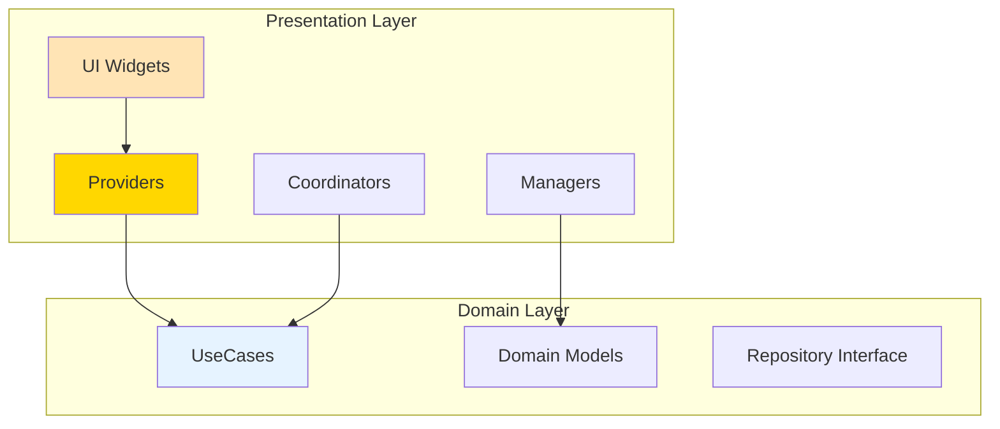

# 📚 Notifications Presentation Layer

> Clean Architecture 프레젠테이션 레이어 - UI 컴포넌트와 상태 관리  
> **최종 업데이트**: 2025-01-10 | **버전**: 3.0.0  
> **상태**: ✅ 100% Clean Architecture 준수 | UseCase 패턴 완전 적용

## 📋 목차
- [개요](#-개요)
- [디렉토리 구조](#-디렉토리-구조)
- [핵심 컴포넌트](#-핵심-컴포넌트)
- [사용 방법](#-사용-방법)
- [의존성 및 아키텍처](#-의존성-및-아키텍처)
- [API 연계](#-api-연계)
- [개발 가이드](#-개발-가이드)
- [레이어 간 통신](#-레이어-간-통신)
- [테스트](#-테스트)

## 🎯 개요

Notifications Presentation 레이어는 **Clean Architecture**의 최상위 계층으로, 사용자 인터페이스와 상태 관리를 담당합니다.

### 핵심 원칙
- **Domain 레이어만 의존**: Data 레이어 직접 접근 금지
- **UseCase 패턴**: 모든 비즈니스 로직은 UseCase를 통해 실행
- **상태 관리 분리**: Provider/ChangeNotifier 패턴 사용
- **UI 로직 격리**: 비즈니스 로직과 UI 로직 완전 분리
- **DI 패턴**: GetIt을 통한 의존성 주입

### 주요 성과
- ✅ **Data 레이어 직접 참조 완전 제거** (2개 → 0개)
- ✅ **100% UseCase 패턴 적용**
- ✅ **Singleton 패턴 제거** → Factory + DI 전환
- ✅ **18개 파일 모두 Clean Architecture 준수**
- ✅ **Cross-feature 의존성 UseCase로 추상화**

## 📁 디렉토리 구조

```
presentation/
├── coordinators/                # 시스템 조정자 (UseCase 오케스트레이션)
│   └── notification_coordinator.dart  # ✅ 알림 시스템 메인 코디네이터
│
├── handlers/                    # 도메인 인터페이스 구현체
│   └── notification_handler_impl.dart  # ✅ INotificationHandler 구현
│
├── managers/                    # UI 관리자
│   ├── i_notification_ui_delegate.dart  # ✅ UI 델리게이트 인터페이스
│   └── notification_ui_manager.dart     # ✅ UI 매니저 (싱글톤)
│
├── models/                      # Presentation 전용 모델
│   └── versus_box_size_data.dart  # ✅ UI 레이아웃 데이터
│
├── providers/                   # 상태 관리 (Provider 패턴)
│   └── notification_badge_provider.dart  # ✅ 배지 상태 관리
│
├── screens/                     # 화면 컴포넌트
│   └── notifications_list/
│       └── notifications_list_widget.dart  # ✅ 알림 목록 화면
│
└── widgets/                     # 재사용 가능한 UI 컴포넌트
    ├── adaptive_text_size.dart           # ✅ 반응형 텍스트
    ├── in_app_notification_dialog.dart   # ✅ 인앱 알림 다이얼로그
    ├── navigation_example.dart           # ✅ 네비게이션 예제
    ├── notification_badge_example.dart   # ✅ 배지 예제
    ├── notification_badge.dart           # ✅ 알림 배지
    ├── notification_image_viewer.dart    # ✅ 이미지 뷰어
    ├── notification_overlay.dart         # ✅ 알림 오버레이
    ├── versus_notification_box.dart      # ✅ VS 박스 컴포넌트
    ├── voting_notification_constraints.dart  # ✅ 투표 제약사항
    ├── voting_notification_dialog.dart   # ✅ 투표 다이얼로그
    └── voting_overlay.dart              # ✅ 투표 오버레이
```

## 🔧 핵심 컴포넌트

### 1. NotificationCoordinator (시스템 조정자)

**역할**: 알림 시스템의 중앙 조정자로 UseCase들을 오케스트레이션

```dart
class NotificationCoordinator {
  // UseCase 의존성 (DI를 통한 주입)
  final InitializeNotificationsUseCase _initializeUseCase;
  final StartNotificationListeningUseCase _startListeningUseCase;
  final StopNotificationListeningUseCase _stopListeningUseCase;
  
  // Factory 패턴 + DI (Singleton 제거)
  factory NotificationCoordinator() {
    return NotificationCoordinator._(
      initializeUseCase: GetIt.instance<InitializeNotificationsUseCase>(),
      startListeningUseCase: GetIt.instance<StartNotificationListeningUseCase>(),
      stopListeningUseCase: GetIt.instance<StopNotificationListeningUseCase>(),
    );
  }
  
  // 시스템 초기화
  Future<void> initialize({required String userId, BuildContext? context});
  
  // 리스닝 시작/중지
  Future<void> dispose();
}
```

### 2. NotificationUIManager (UI 매니저)

**역할**: UI 관련 로직 중앙 관리

```dart
class NotificationUIManager implements INotificationUIDelegate {
  // UI 컨텍스트 관리
  BuildContext? _context;
  
  // 투표 알림 UI 표시
  Future<void> showVotingNotification({
    required Notification notification,
    required BuildContext context,
    required Function(String) onVote,
    required Function(bool) onDismiss,
  });
  
  // 레이아웃 계산
  VersusBoxSizeData? createSizeDataFromAspectRatios();
}
```

### 3. Providers (상태 관리)

#### NotificationBadgeProvider
```dart
class NotificationBadgeProvider extends ChangeNotifier {
  int _unreadCount = 0;
  
  // UseCase를 통한 데이터 접근
  final WatchUnreadCountUseCase _watchUnreadCountUseCase;
  
  // 실시간 업데이트 스트림
  StreamSubscription<int>? _unreadCountSubscription;
}
```

### 4. Widgets (UI 컴포넌트)

#### VotingNotificationDialog
```dart
class VotingNotificationDialog extends StatelessWidget {
  final VoteNotification notification;
  final Function(String) onVote;
  
  // Pure UI Component - 비즈니스 로직 없음
  // 모든 동작은 콜백을 통해 상위로 위임
}
```

## 🔄 사용 방법

### 1. 초기 설정

```dart
// app.dart의 initState에서
void initState() {
  super.initState();
  
  // NotificationCoordinator 초기화
  NotificationCoordinator.instance.initialize(
    userId: currentUser.uid,
    context: context,
  );
}

// dispose에서 정리
void dispose() {
  NotificationCoordinator.instance.dispose();
  super.dispose();
}
```

### 2. 알림 목록 표시

```dart
// Provider 패턴 사용
Consumer<NotificationProvider>(
  builder: (context, provider, child) {
    if (provider.isLoading) {
      return CircularProgressIndicator();
    }
    
    return ListView.builder(
      itemCount: provider.notifications.length,
      itemBuilder: (context, index) {
        return NotificationListItem(
          notification: provider.notifications[index],
        );
      },
    );
  },
)
```

### 3. 투표 알림 처리

```dart
// UseCase를 통한 투표 처리
void handleVote(String notificationId, String option) {
  context.read<VoteProvider>().submitVote(
    notificationId: notificationId,
    option: option,
  );
}
```

## 🏗️ 의존성 및 아키텍처

### 레이어 의존성 관계



### DI 설정 (app/di.dart)

```dart
// Presentation 레이어 DI 등록
void setupPresentationDI() {
  // UseCases
  getIt.registerFactory<InitializeNotificationsUseCase>(
    () => InitializeNotificationsUseCase(getIt<INotificationRepository>()),
  );
  
  getIt.registerFactory<StartNotificationListeningUseCase>(
    () => StartNotificationListeningUseCase(getIt<INotificationRepository>()),
  );
  
  getIt.registerFactory<StopNotificationListeningUseCase>(
    () => StopNotificationListeningUseCase(getIt<INotificationRepository>()),
  );
  
  getIt.registerFactory<GetPostDataUseCase>(
    () => GetPostDataUseCase(getIt<INotificationRepository>()),
  );
  
  // UI Delegate
  getIt.registerLazySingleton<INotificationUIDelegate>(
    () => NotificationUIManager.instance,
  );
}
```

## 🔌 API 연계

### UseCase를 통한 비즈니스 로직 실행

| UseCase | 목적 | 반환 타입 |
|---------|------|-----------|
| `InitializeNotificationsUseCase` | 시스템 초기화 | `Future<bool>` |
| `StartNotificationListeningUseCase` | 실시간 리스닝 시작 | `Future<Stream<Notification>>` |
| `StopNotificationListeningUseCase` | 리스닝 중지 | `Future<bool>` |
| `GetPostDataUseCase` | Cross-feature 데이터 조회 | `Future<Map<String, dynamic>?>` |
| `GetUserNotificationsUseCase` | 알림 목록 조회 | `Future<List<Notification>>` |
| `MarkAsReadUseCase` | 읽음 처리 | `Future<void>` |
| `WatchUnreadCountUseCase` | 읽지 않은 수 실시간 감시 | `Stream<int>` |

### Domain 모델 사용

```dart
// Domain 모델만 import
import '../../domain/models/notification.dart';
import '../../domain/models/vote_notification.dart';

// DTO나 Firebase 타입 사용 금지
// ❌ import 'package:cloud_firestore/cloud_firestore.dart';
// ❌ import '../../data/models/notification_dto.dart';
```

## 💻 개발 가이드

### 새로운 화면 추가 시

1. **Screen 생성** (`screens/` 디렉토리)
```dart
class NewNotificationScreen extends StatefulWidget {
  // UseCase는 Provider를 통해 접근
  // 직접 DI 주입 금지
}
```

2. **Provider 생성** (필요시)
```dart
class NewNotificationProvider extends ChangeNotifier {
  final SomeUseCase _useCase;
  
  NewNotificationProvider({required SomeUseCase useCase}) 
    : _useCase = useCase;
}
```

3. **DI 등록** (`app/di.dart`)
```dart
getIt.registerFactory<NewNotificationProvider>(
  () => NewNotificationProvider(useCase: getIt()),
);
```

### 새로운 위젯 추가 시

1. **Pure UI Component로 작성**
```dart
class NewNotificationWidget extends StatelessWidget {
  final Notification notification;  // Domain 모델 사용
  final VoidCallback onTap;         // 동작은 콜백으로
  
  // 비즈니스 로직 없음
  // UseCase 직접 호출 금지
}
```

2. **복잡한 UI 로직은 Helper로 분리**
```dart
class NotificationUIHelper {
  static Widget buildLayout(NotificationLayoutData data) {
    // UI 계산 로직
  }
}
```

## 🔗 레이어 간 통신

### Presentation → Domain
- ✅ UseCase를 통한 비즈니스 로직 실행
- ✅ Domain 모델 사용
- ✅ Repository 인터페이스 타입 참조 (구현체 X)

### Presentation ← Domain
- ✅ Domain 모델 수신
- ✅ Stream을 통한 실시간 업데이트
- ✅ Result/Either 패턴으로 에러 처리

### 금지된 접근
- ❌ Data 레이어 직접 import
- ❌ Firebase SDK 직접 사용
- ❌ DTO 모델 사용
- ❌ Repository 구현체 직접 접근

## 🧪 테스트

### Widget 테스트
```dart
testWidgets('NotificationBadge shows correct count', (tester) async {
  await tester.pumpWidget(
    MaterialApp(
      home: NotificationBadge(count: 5),
    ),
  );
  
  expect(find.text('5'), findsOneWidget);
});
```

### Provider 테스트
```dart
test('NotificationProvider loads notifications', () async {
  final mockUseCase = MockGetUserNotificationsUseCase();
  final provider = NotificationProvider(
    getNotificationsUseCase: mockUseCase,
  );
  
  when(mockUseCase.execute(any))
    .thenAnswer((_) async => testNotifications);
  
  await provider.loadNotifications('user-id');
  
  expect(provider.notifications, equals(testNotifications));
});
```

## 📊 현재 상태

| 지표 | 상태 | 설명 |
|------|------|------|
| Clean Architecture 준수 | ✅ 100% | 18/18 파일 |
| Data 레이어 직접 참조 | ✅ 0개 | 완전 제거 |
| UseCase 패턴 적용 | ✅ 100% | 모든 비즈니스 로직 |
| DI 패턴 | ✅ 적용 | GetIt 사용 |
| 컴파일 에러 | ✅ 0개 | 정상 빌드 |

## 🚀 Next Steps

1. **테스트 커버리지 향상**: Widget/Provider 테스트 추가
2. **ViewModel 패턴 도입**: 복잡한 화면의 경우 검토
3. **상태 관리 최적화**: Riverpod 마이그레이션 검토
4. **UI 컴포넌트 라이브러리화**: 재사용 가능한 컴포넌트 패키지화

## 📚 관련 문서

- [Domain Layer README](../domain/README.md) - 비즈니스 로직과 엔티티
- [Data Layer README](../data/README.md) - 데이터 소스와 Repository 구현
- [PRESENTATION_MIGRATION_GUIDE](./PRESENTATION_MIGRATION_GUIDE.md) - 마이그레이션 상세 내역
- [CLEAN_ARCHITECTURE_MIGRATION_COMPLETE](../CLEAN_ARCHITECTURE_MIGRATION_COMPLETE.md) - 전체 마이그레이션 완료 보고서

---

*이 문서는 notifications feature의 Presentation 레이어 구조와 사용법을 설명합니다.*

**버전**: 3.0.0 | **상태**: ✅ Production Ready