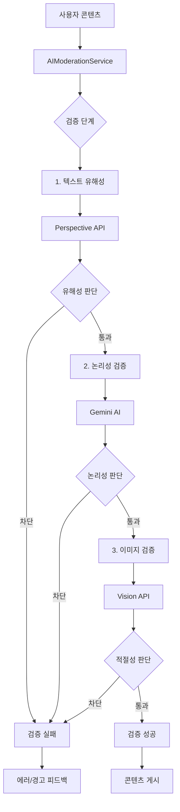

# 🛡️ AI Moderation System - 통합 AI 검열 시스템

> Versus Space의 콘텐츠 안전성과 품질을 보장하는 3단계 AI 검열 시스템

## 📊 시스템 메타정보

| 항목 | 상태 | 상세 |
|------|------|------|
| **시스템명** | AI Moderation System | 통합 AI 검열 |
| **버전** | v3.0.0 | 2025-08-23 기준 |
| **모듈 수** | 4개 | 메인 서비스 + 3개 하위 모듈 |
| **API 통합** | 3개 | Perspective, Vision, Gemini |
| **검증 단계** | 3단계 | 텍스트 → 논리성 → 이미지 |

## 🎯 개요

AI Moderation System은 Versus Space의 모든 사용자 생성 콘텐츠를 실시간으로 검증하는 통합 시스템입니다. Google의 3대 AI API를 활용하여 텍스트 유해성, 논리적 일관성, 이미지 적절성을 종합적으로 판단하며, 단계별 검증을 통해 안전하고 품질 높은 콘텐츠만 플랫폼에 게시되도록 보장합니다.

### 핵심 가치
- 🔐 **안전성 최우선**: 유해 콘텐츠 사전 차단
- ⚖️ **공정성 보장**: A/B 선택지 균형성 평가
- 🚀 **성능 최적화**: 병렬 처리 및 조건부 검증
- 🌍 **글로벌 대응**: 다국어 콘텐츠 검열 지원

## 📐 네이밍 컨벤션

| 구분 | 규칙 | 예시 |
|------|------|------|
| **파일명** | snake_case | `ai_moderation_service.dart` |
| **디렉토리명** | snake_case | `text_moderation/` |
| **클래스명** | PascalCase | `AIModerationService` |
| **메서드명** | camelCase | `moderatePostContent()` |
| **필드명** | camelCase | `isValid`, `violations` |

> 상세 규칙은 [프로젝트 네이밍 컨벤션](../../../NAMING_CONVENTION.md) 참조

## 🏗️ 시스템 아키텍처

### 디렉토리 구조
```
ai_moderation/
├── README.md                       # 시스템 통합 문서 (현재 파일)
├── ai_moderation_service.dart      # 메인 통합 서비스
├── constants/                      # 설정 및 임계값 관리
│   ├── README.md                  # 설정 모듈 문서
│   └── moderation_config.dart     # 중앙 설정 클래스
├── models/                        # 데이터 모델
│   ├── README.md                  # 모델 문서
│   └── moderation_result.dart     # 결과 및 요청 모델
└── text_moderation/               # 텍스트 검증 서비스
    ├── README.md                  # 텍스트 검증 문서
    └── gemini_service.dart        # Gemini AI 통합
```

### 시스템 플로우


## 🔧 주요 구성요소

### 1. AIModerationService (메인 통합 서비스)

전체 검열 플로우를 조율하는 중앙 서비스입니다.

#### 핵심 메서드
```dart
class AIModerationService {
  /// 포스트 콘텐츠 전체 검증
  static Future<ModerationResult> moderatePostContent({
    required ModerationRequest request,
    ModerationOptions options = ModerationOptions.defaultOptions,
    Function(String)? onProgressUpdate,
  })
  
  /// 검증 결과 다이얼로그 표시
  static Future<void> showModerationDialog(
    BuildContext context,
    ModerationResult result,
  )
}
```

#### 검증 단계별 처리
1. **텍스트 유해성 검사** (Perspective API)
   - 욕설, 위협, 혐오 표현 감지
   - 카테고리별 점수 산출
   - 임계값 기반 차단 결정

2. **논리성 검증** (Gemini AI)
   - A vs B 선택지 균형성 평가
   - 예상 선택 비율 예측
   - 개선 제안 생성

3. **이미지 안전성 검사** (Vision API)
   - 성인/폭력/의료 콘텐츠 감지
   - 얼굴 평가 키워드 차단
   - 멀티 이미지 개별 검증

### 2. Constants Module (설정 관리)

#### ModerationConfig 클래스
```dart
// 텍스트 유해성 임계값
static const double toxicityThreshold = 0.6;
static const double severeToxicityThreshold = 0.5;

// Vision API 레벨
static const List<String> inappropriateLabels = ['VERY_LIKELY', 'LIKELY'];

// 한국어 카테고리 매핑
static const Map<String, String> koreanCategoryNames = {
  'TOXICITY': '유해한 콘텐츠',
  'INSULT': '모욕적 표현',
  // ...
};
```

#### ModerationOptions 클래스
```dart
class ModerationOptions {
  final bool enablePerspectiveAPI;  // 텍스트 검열
  final bool enableVisionAPI;       // 이미지 검열
  final bool enableGeminiAI;        // 논리성 검증
  
  // 프리셋
  static const defaultOptions;      // 모든 API 활성화
  static const textOnly;            // 텍스트만 검증
  static const imageOnly;           // 이미지만 검증
}
```

### 3. Models Module (데이터 모델)

#### 통합 결과 모델
```dart
class ModerationResult {
  final bool isValid;                     // 전체 통과 여부
  final String severity;                  // pass/warning/error
  final List<String> violations;          // 위반 사항 목록
  final TextModerationResult? textResult;
  final ImageModerationResult? imageResult;
  final GeminiModerationResult? geminiResult;
  
  // 헬퍼 메서드
  bool get hasWarning => severity == 'warning';
  bool get hasError => severity == 'error';
  bool get hasPassed => severity == 'pass';
}
```

#### 요청 모델
```dart
class ModerationRequest {
  // 텍스트 필드
  final String? questionTitle;
  final String? description;
  final String? titleA;
  final String? titleB;
  
  // 이미지 필드
  final List<String>? imageUrlsA;
  final List<String>? imageUrlsB;
  
  // 메타데이터
  final String userId;
  final Map<String, dynamic>? metadata;
}
```

### 4. Text Moderation Module (텍스트 검증)

#### GeminiModerationService 클래스
```dart
class GeminiModerationService {
  /// Cloud Functions를 통한 Gemini AI 호출
  static Future<GeminiModerationResult?> validateContent({
    required String userId,
    required String? questionTitle,
    // ... 파라미터
  })
}
```

## 💡 핵심 기능

### 1. 3단계 순차 검증 시스템

```dart
// 단계별 검증 플로우
if (options.enablePerspectiveAPI) {
  // 1단계: 텍스트 유해성
  textResult = await _moderateText(request);
  if (textResult.isToxic) {
    violations.add(_formatTextViolation(textResult));
  }
}

if (options.enableGeminiAI && violations.isEmpty) {
  // 2단계: 논리성 검증 (텍스트 통과 시에만)
  geminiResult = await GeminiModerationService.validateContent(...);
}

if (options.enableVisionAPI && violations.isEmpty) {
  // 3단계: 이미지 검증 (이전 단계 통과 시에만)
  imageResult = await VisionService.moderateImages(...);
}
```

### 2. 실시간 진행 상태 업데이트

```dart
onProgressUpdate?.call('텍스트를 검토하고 있습니다...');
// 검증 진행
onProgressUpdate?.call('AI가 내용을 분석하고 있습니다...');
// 검증 진행
onProgressUpdate?.call('이미지를 확인하고 있습니다...');
```

### 3. 심각도 기반 처리

```dart
// 심각도 레벨 결정
static String _determineSeverity(...) {
  if (textResult?.isToxic == true) return 'error';  // 즉시 차단
  if (geminiResult != null) return geminiResult.severity;
  return violations.isNotEmpty ? 'error' : 'pass';
}
```

### 4. 사용자 피드백 시스템

```dart
// 경고 다이얼로그 (수정 가능)
if (result.severity == 'warning') {
  final proceed = await _showWarningDialog(
    context,
    result.geminiResult!.reason,
    result.geminiResult!.suggestions,
  );
}

// 차단 다이얼로그 (수정 필수)
if (!result.isValid) {
  await _showBlockDialog(
    context,
    result.violations,
    result.geminiResult?.suggestions,
  );
}
```

## 🚀 사용 예시

### 기본 사용법
```dart
// 콘텐츠 생성 시 검증
final request = ModerationRequest(
  questionTitle: "어떤 스타일이 더 좋아?",
  titleA: "클래식",
  titleB: "모던",
  userId: currentUser.uid,
);

final result = await AIModerationService.moderatePostContent(
  request: request,
  onProgressUpdate: (message) {
    // 진행 상태 표시
    setState(() => _progressMessage = message);
  },
);

// 결과 처리
if (result.isValid) {
  // 게시물 생성 진행
  await createPost();
} else {
  // 피드백 표시
  await AIModerationService.showModerationDialog(context, result);
}
```

### 선택적 API 사용
```dart
// 텍스트만 검증
final result = await AIModerationService.moderatePostContent(
  request: request,
  options: ModerationOptions.textOnly,
);

// 이미지만 검증
final result = await AIModerationService.moderatePostContent(
  request: request,
  options: ModerationOptions.imageOnly,
);
```

### 테스트 모드
```dart
// 관리자/테스터 전용 옵션
if (currentUser.role == 'admin' || currentUser.role == 'tester') {
  final options = ModerationOptions(
    enablePerspectiveAPI: false,  // 텍스트 검열 우회
    enableGeminiAI: true,
    enableVisionAPI: true,
  );
  
  final result = await AIModerationService.moderatePostContent(
    request: request,
    options: options,
  );
}
```

## 📊 검증 플로우 상세

### 텍스트 검증 (Perspective API)
| 카테고리 | 임계값 | 설명 |
|----------|--------|------|
| **TOXICITY** | 0.6 | 일반적 유해성 |
| **SEVERE_TOXICITY** | 0.5 | 심각한 유해성 |
| **INSULT** | 0.5 | 모욕적 표현 |
| **PROFANITY** | 0.5 | 욕설 |
| **THREAT** | 0.7 | 위협 |
| **IDENTITY_ATTACK** | 0.7 | 혐오 표현 |

### 논리성 검증 (Gemini AI)
| Action | 의미 | 처리 |
|--------|------|------|
| **PROCEED** | 통과 | 즉시 게시 |
| **PROCEED_WITH_SUGGESTION** | 경고 | 개선 제안 표시 |
| **BLOCK** | 차단 | 수정 필수 |

### 이미지 검증 (Vision API)
| 레벨 | 처리 | 설명 |
|------|------|------|
| **VERY_LIKELY** | 차단 | 매우 높은 확률 |
| **LIKELY** | 차단 | 높은 확률 |
| **POSSIBLE** | 경고 | 가능성 있음 |
| **UNLIKELY** | 통과 | 낮은 확률 |
| **VERY_UNLIKELY** | 통과 | 매우 낮은 확률 |

## 🔄 에러 처리

### API 실패 대응
```dart
try {
  // API 호출
} catch (e) {
  if (shouldFailSafe) {
    // 서비스 중단 방지 - 기본 통과
    return ModerationResult(isValid: true, ...);
  } else {
    // 에러 반환
    return ModerationResult(
      isValid: false,
      errorMessage: '검증 중 오류가 발생했습니다.',
    );
  }
}
```

### 타임아웃 처리
- **기본 타임아웃**: 30초
- **재시도 정책**: 최대 3회
- **지수 백오프**: 1초, 2초, 4초 간격

## 🐛 디버깅

### 로그 패턴
```dart
// 서비스 레벨 로그
print('[AIModerationService] Starting moderation...');
print('[AIModerationService] Text result: ${textResult.isToxic}');
print('[AIModerationService] Gemini result: ${geminiResult?.severity}');

// 모듈 레벨 로그
print('[GeminiModerationService] Calling Cloud Function...');
print('[PerspectiveAPI] Analyzing text: ${text.length} chars');
```

### 디버그 모드
```dart
// 상세 로그 활성화
if (kDebugMode) {
  print('[DEBUG] Request: ${request.toJson()}');
  print('[DEBUG] Response: ${result.toJson()}');
  print('[DEBUG] Processing time: ${stopwatch.elapsed}');
}
```

## 📈 통계 및 메트릭

### 주요 추적 지표
- **전체 검증 통과율**: 65-75% (정상 범위)
- **텍스트 차단율**: 5-10%
- **논리성 경고율**: 15-20%
- **이미지 차단율**: 2-5%
- **평균 처리 시간**: 3-5초

### 성능 최적화 지표
- **API 응답 시간**: Perspective (500ms), Gemini (2s), Vision (1s)
- **병렬 처리 효과**: 30-40% 시간 단축
- **캐시 히트율**: 20-30% (반복 콘텐츠)

## 🚧 향후 계획

### 단기 (1-2개월)
- [ ] 비디오 콘텐츠 검열 지원
- [ ] 실시간 스트리밍 검열
- [ ] 배치 처리 API 구현

### 중기 (3-6개월)
- [ ] 사용자 피드백 기반 학습
- [ ] 커스텀 필터 규칙 시스템
- [ ] 다국어 검열 확대 (일본어, 중국어)

### 장기 (6개월+)
- [ ] 자체 AI 모델 개발
- [ ] 온디바이스 검열 옵션
- [ ] 컨텍스트 인식 검열

## 📝 변경 이력

- **2025-08-23**: 통합 시스템 문서 작성 완료
- **2025-08-20**: Cloud Functions 마이그레이션
- **2025-08-15**: Vision API 통합 완료
- **2025-08-10**: 초기 시스템 구축

---

*이 문서는 Versus Space AI Moderation System의 전체 구조와 사용법을 설명합니다.*
*최종 업데이트: 2025-08-23*