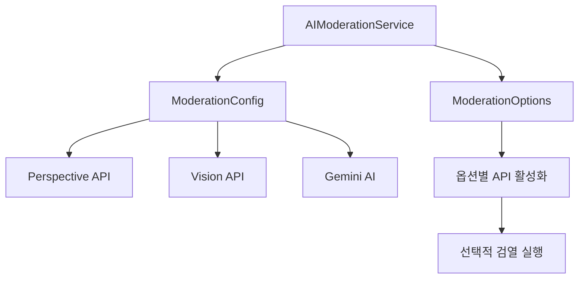

# 🔧 AI Moderation Constants - AI 검열 시스템 설정 모듈

> Versus Space AI 검열 시스템의 모든 설정값과 상수를 중앙 관리하는 설정 모듈

## 📊 모듈 메타정보

| 항목 | 상태 | 상세 |
|------|------|------|
| **모듈명** | AI Moderation Constants | AI 검열 설정 관리 |
| **버전** | v1.0.0 | 2025-08-22 기준 |
| **파일 수** | 1개 | moderation_config.dart |
| **주요 클래스** | 2개 | ModerationConfig, ModerationOptions |
| **의존성** | 없음 | 순수 Dart 상수 클래스 |

## 🎯 개요

AI Moderation Constants 모듈은 Versus Space의 **3단계 AI 검열 시스템**에서 사용되는 모든 설정값을 중앙에서 관리합니다. Perspective API, Vision API, Gemini AI의 임계값과 옵션을 한 곳에서 통합 관리하여 일관성과 유지보수성을 보장합니다.

### 핵심 원칙
- 🎯 **중앙 집중화**: 모든 검열 관련 상수를 한 곳에서 관리
- 🔧 **설정 유연성**: 환경별로 다른 임계값 적용 가능
- 🌍 **다국어 지원**: 한국어 카테고리 매핑 제공
- ⚡ **성능 최적화**: 캐시 및 재시도 정책 설정

## 📐 네이밍 컨벤션

| 구분 | 규칙 | 예시 |
|------|------|------|
| **파일명** | snake_case | `moderation_config.dart` |
| **클래스명** | PascalCase | `ModerationConfig` |
| **상수명** | lowerCamelCase | `toxicityThreshold` |
| **정적 메서드** | lowerCamelCase | `getThreshold()` |
| **Map 키** | UPPER_SNAKE_CASE | `'TOXICITY'` |

> 상세 규칙은 [프로젝트 네이밍 컨벤션](../../../../NAMING_CONVENTION.md) 참조

## 🏗️ 아키텍처

### 모듈 구조
```
constants/
└── moderation_config.dart      # 검열 시스템 설정 및 상수
    ├── ModerationConfig         # 정적 설정 클래스
    │   ├── Perspective API 임계값
    │   ├── Vision API 설정
    │   ├── Gemini API 설정
    │   ├── 재시도 정책
    │   └── 한국어 매핑
    └── ModerationOptions        # 동적 옵션 클래스
        ├── API 활성화 플래그
        ├── 캐싱 옵션
        └── 커스텀 임계값

```

### 데이터 플로우


## 🔧 주요 구성요소

### 1. ModerationConfig 클래스

모든 검열 시스템의 정적 설정값을 관리하는 핵심 클래스입니다.

#### Perspective API 임계값
```dart
class ModerationConfig {
  // 텍스트 유해성 검사 임계값 (0.0 ~ 1.0)
  static const double toxicityThreshold = 0.6;          // 일반 유해성
  static const double severeToxicityThreshold = 0.5;    // 심각한 유해성
  static const double insultThreshold = 0.5;            // 모욕적 표현
  static const double profanityThreshold = 0.5;         // 욕설
  static const double threatThreshold = 0.7;            // 위협
  static const double identityAttackThreshold = 0.7;    // 혐오 표현
  static const double sexuallyExplicitThreshold = 0.7;  // 성적 콘텐츠
}
```

#### Vision API 설정
```dart
// 이미지 안전성 레벨
static const List<String> inappropriateLabels = [
  'VERY_LIKELY',  // 매우 높은 확률로 부적절
  'LIKELY',       // 높은 확률로 부적절
];

static const List<String> warningLabels = [
  'POSSIBLE',     // 경고 수준
];
```

#### Gemini AI 설정
```dart
// AI 모델 파라미터
static const String geminiModel = 'gemini-pro';
static const double geminiTemperature = 0.3;  // 낮을수록 일관성 있는 응답
static const int geminiMaxTokens = 1000;      // 최대 토큰 수
```

#### 시스템 설정
```dart
// 재시도 정책
static const int maxRetries = 3;
static const Duration retryDelay = Duration(seconds: 1);

// 타임아웃 설정
static const Duration apiTimeout = Duration(seconds: 30);

// 캐시 설정
static const Duration cacheExpiry = Duration(hours: 1);
```

#### 한국어 카테고리 매핑
```dart
static const Map<String, String> koreanCategoryNames = {
  'TOXICITY': '유해한 콘텐츠',
  'SEVERE_TOXICITY': '심각한 유해 콘텐츠',
  'IDENTITY_ATTACK': '혐오 표현',
  'INSULT': '모욕적 표현',
  'PROFANITY': '욕설',
  'THREAT': '위협적 표현',
  'SEXUALLY_EXPLICIT': '성적 콘텐츠',
};

static const Map<String, String> visionCategoryNames = {
  'adult': '성인 콘텐츠',
  'violence': '폭력적 콘텐츠',
  'racy': '선정적 콘텐츠',
  'spoof': '조작된 콘텐츠',
  'medical': '의료 콘텐츠',
};
```

### 2. ModerationOptions 클래스

검열 실행 시 동적으로 설정 가능한 옵션을 제공합니다.

#### 옵션 구조
```dart
class ModerationOptions {
  final bool enablePerspectiveAPI;  // Perspective API 활성화
  final bool enableVisionAPI;       // Vision API 활성화
  final bool enableGeminiAI;        // Gemini AI 활성화
  final bool enableOCR;              // OCR 기능 활성화
  final bool cacheResults;          // 결과 캐싱 여부
  final Map<String, double>? customThresholds;  // 커스텀 임계값
}
```

#### 사전 정의 프리셋
```dart
// 기본 옵션 (모든 API 활성화)
static const ModerationOptions defaultOptions = ModerationOptions();

// 텍스트 전용 검열
static const ModerationOptions textOnly = ModerationOptions(
  enableVisionAPI: false,
  enableOCR: false,
);

// 이미지 전용 검열
static const ModerationOptions imageOnly = ModerationOptions(
  enablePerspectiveAPI: false,
  enableGeminiAI: false,
);
```

## 💡 핵심 기능

### 임계값 관리 시스템

#### 동적 임계값 조정
```dart
// 커스텀 임계값 적용 예시
final options = ModerationOptions(
  customThresholds: {
    'toxicity': 0.8,      // 더 관대한 설정
    'profanity': 0.3,     // 더 엄격한 설정
  },
);

// 임계값 적용 로직
double getThreshold(String category) {
  return options.customThresholds?[category] ?? 
         ModerationConfig.toxicityThreshold;
}
```

### 다국어 지원 시스템

#### 사용자 친화적 메시지 생성
```dart
String getKoreanMessage(String category) {
  return ModerationConfig.koreanCategoryNames[category] ?? 
         '부적절한 콘텐츠';
}

// 예: "TOXICITY" → "유해한 콘텐츠"
```

### 성능 최적화 설정

#### API 재시도 로직
```dart
Future<T> retryWithConfig<T>(Future<T> Function() action) async {
  for (int i = 0; i < ModerationConfig.maxRetries; i++) {
    try {
      return await action().timeout(ModerationConfig.apiTimeout);
    } catch (e) {
      if (i == ModerationConfig.maxRetries - 1) rethrow;
      await Future.delayed(ModerationConfig.retryDelay * (i + 1));
    }
  }
  throw Exception('Max retries exceeded');
}
```

## 🚀 사용 예시

### 기본 사용법
```dart
import 'package:versus_space/services/ai_moderation/constants/moderation_config.dart';

// 임계값 확인
if (toxicityScore > ModerationConfig.toxicityThreshold) {
  return ModerationResult(
    isValid: false,
    message: ModerationConfig.koreanCategoryNames['TOXICITY'],
  );
}
```

### 옵션 커스터마이징
```dart
// 특정 상황에 맞는 옵션 생성
final strictOptions = ModerationOptions(
  enablePerspectiveAPI: true,
  enableVisionAPI: true,
  enableGeminiAI: true,
  customThresholds: {
    'toxicity': 0.4,  // 더 엄격한 기준
    'threat': 0.5,
  },
);

// 캐싱 활성화 옵션
final cachedOptions = ModerationOptions(
  cacheResults: true,
);
```

### Vision API 레벨 확인
```dart
bool isInappropriate(String likelihood) {
  return ModerationConfig.inappropriateLabels.contains(likelihood);
}

bool shouldWarn(String likelihood) {
  return ModerationConfig.warningLabels.contains(likelihood);
}
```

## 📊 설정 가이드

### 임계값 조정 가이드

| 카테고리 | 기본값 | 권장 범위 | 설명 |
|----------|--------|-----------|------|
| **toxicity** | 0.6 | 0.5-0.8 | 일반적인 유해성 |
| **severeToxicity** | 0.5 | 0.4-0.7 | 심각한 유해성 |
| **insult** | 0.5 | 0.4-0.7 | 모욕적 표현 |
| **profanity** | 0.5 | 0.4-0.7 | 욕설 |
| **threat** | 0.7 | 0.6-0.9 | 위협 |
| **identityAttack** | 0.7 | 0.6-0.9 | 혐오 표현 |
| **sexuallyExplicit** | 0.7 | 0.6-0.9 | 성적 콘텐츠 |

### 환경별 설정 예시

#### 개발 환경
```dart
// 느슨한 검열 (빠른 테스트)
customThresholds: {
  'toxicity': 0.9,
  'profanity': 0.9,
}
```

#### 프로덕션 환경
```dart
// 표준 검열
// ModerationConfig 기본값 사용
```

#### 아동 보호 모드
```dart
// 매우 엄격한 검열
customThresholds: {
  'toxicity': 0.3,
  'profanity': 0.2,
  'sexuallyExplicit': 0.3,
}
```

## 🔄 버전 관리

### 변경 시 고려사항
1. **하위 호환성**: 기존 임계값 변경 시 기존 콘텐츠 영향 검토
2. **A/B 테스트**: 새로운 임계값은 점진적 롤아웃
3. **모니터링**: 변경 후 거부율/승인율 추적
4. **피드백 수집**: 사용자 신고 및 피드백 분석

## 🐛 디버깅

### 로그 패턴
```dart
debugPrint('[ModerationConfig] Category: $category, Threshold: $threshold');
debugPrint('[ModerationConfig] Applied options: ${options.toString()}');
```

### 일반적인 문제 해결

#### 너무 많은 콘텐츠가 거부될 때
- 임계값을 0.1씩 높여가며 조정
- 특정 카테고리만 선택적 조정
- 사용자 피드백 기반 미세 조정

#### 부적절한 콘텐츠가 통과할 때
- 임계값을 0.1씩 낮춰가며 조정
- 복수 API 검증 활성화
- OCR 기능 활성화 (이미지 내 텍스트)

## 📈 통계 및 메트릭

### 주요 지표
- **평균 거부율**: 전체 콘텐츠 중 거부 비율
- **카테고리별 거부율**: 각 위반 유형별 통계
- **API 응답 시간**: 각 API별 평균 응답 시간
- **재시도 비율**: API 호출 실패 및 재시도 빈도

## 🚧 향후 계획

### 단기 (1-2개월)
- [ ] 환경별 설정 파일 분리
- [ ] 동적 임계값 조정 시스템
- [ ] A/B 테스트 지원

### 중기 (3-6개월)
- [ ] 머신러닝 기반 임계값 자동 조정
- [ ] 사용자별 맞춤 검열 수준
- [ ] 실시간 임계값 업데이트

### 장기 (6개월+)
- [ ] 다중 언어 카테고리 매핑 확대
- [ ] 커뮤니티 기반 검열 규칙
- [ ] AI 모델 버전 관리 시스템

## 📝 변경 이력

- **2025-08-22**: 상세 문서 작성 완료
- **2025-08-13**: ModerationOptions 클래스 추가
- **2025-08-10**: Vision API 카테고리 매핑 추가
- **2025-08-05**: 초기 ModerationConfig 클래스 생성

---

*이 문서는 Versus Space AI Moderation Constants 모듈의 구조와 사용법을 설명합니다.*
*최종 업데이트: 2025-08-22*