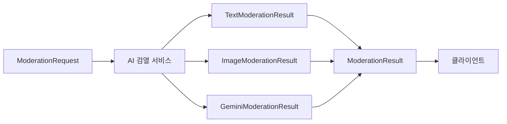

# 📦 AI Moderation Models - AI 검열 데이터 모델

> Versus Space AI 검열 시스템의 모든 데이터 구조와 결과 모델을 정의하는 모듈

## 📊 모듈 메타정보

| 항목 | 상태 | 상세 |
|------|------|------|
| **모듈명** | AI Moderation Models | AI 검열 데이터 모델 |
| **버전** | v1.0.0 | 2025-08-23 기준 |
| **파일 수** | 1개 | moderation_result.dart |
| **주요 클래스** | 5개 | ModerationResult 및 관련 모델들 |
| **의존성** | 없음 | 순수 Dart 데이터 모델 |

## 🎯 개요

AI Moderation Models 모듈은 Versus Space의 **3단계 AI 검열 시스템**에서 사용되는 모든 데이터 구조를 정의합니다. 요청(Request), 응답(Result), 그리고 각 API별 세부 결과 모델을 체계적으로 관리하여 타입 안정성과 데이터 일관성을 보장합니다.

### 핵심 원칙
- 📊 **타입 안정성**: 모든 데이터 구조에 강타입 적용
- 🔄 **재사용성**: 통합 및 개별 API 결과 모델 분리
- 📋 **확장 가능성**: 새로운 검열 서비스 추가 용이
- ✅ **유효성 검증**: 결과 판단을 위한 헬퍼 메서드 제공

## 📐 네이밍 컨벤션

| 구분 | 규칙 | 예시 |
|------|------|------|
| **파일명** | snake_case | `moderation_result.dart` |
| **클래스명** | PascalCase | `ModerationResult` |
| **필드명** | camelCase | `isValid`, `textResult` |
| **Getter** | camelCase | `hasWarning`, `hasPassed` |
| **nullable 필드** | ? 접미사 | `String?`, `errorMessage?` |

> 상세 규칙은 [프로젝트 네이밍 컨벤션](../../../../NAMING_CONVENTION.md) 참조

## 🏗️ 아키텍처

### 모델 계층 구조
```
models/
└── moderation_result.dart
    ├── ModerationResult         # 통합 검열 결과
    ├── TextModerationResult     # Perspective API 결과
    ├── ImageModerationResult    # Vision API 결과
    ├── GeminiModerationResult   # Gemini AI 결과
    └── ModerationRequest        # 검열 요청 데이터
```

### 데이터 플로우


## 🔧 주요 구성요소

### 1. ModerationResult (통합 결과 모델)

모든 검열 서비스의 결과를 통합하여 관리하는 최상위 모델입니다.

#### 핵심 필드
```dart
class ModerationResult {
  final bool isValid;                    // 전체 검증 통과 여부
  final String severity;                 // 심각도: 'pass', 'warning', 'error'
  final List<String> violations;         // 위반 사항 목록
  final TextModerationResult? textResult;     // 텍스트 검열 결과
  final ImageModerationResult? imageResult;   // 이미지 검열 결과
  final GeminiModerationResult? geminiResult; // AI 논리성 검증 결과
  final String? errorMessage;            // 에러 메시지
}
```

#### 헬퍼 Getters
```dart
bool get hasWarning => severity == 'warning';  // 경고 여부
bool get hasError => severity == 'error';      // 에러 여부
bool get hasPassed => severity == 'pass';      // 통과 여부
```

### 2. TextModerationResult (텍스트 검열 결과)

Perspective API를 통한 텍스트 유해성 검사 결과를 담는 모델입니다.

#### 구조 및 용도
```dart
class TextModerationResult {
  final Map<String, double> scores;    // 카테고리별 점수
  final bool isToxic;                  // 유해성 판정
  final String? detectedCategory;      // 감지된 주요 카테고리
  final double confidence;             // 신뢰도 (0.0 ~ 1.0)
}
```

#### 점수 맵 예시
```dart
scores: {
  'TOXICITY': 0.85,
  'SEVERE_TOXICITY': 0.45,
  'INSULT': 0.62,
  'PROFANITY': 0.38,
  'THREAT': 0.12,
  'IDENTITY_ATTACK': 0.23,
  'SEXUALLY_EXPLICIT': 0.08,
}
```

### 3. ImageModerationResult (이미지 검열 결과)

Google Cloud Vision API를 통한 이미지 안전성 검사 결과 모델입니다.

#### 필드 설명
```dart
class ImageModerationResult {
  final bool isAppropriate;           // 적절성 판정
  final String? reason;                // 부적절한 이유
  final Map<String, String> safeSearchAnnotations;  // 안전 검색 주석
  final bool hasText;                  // 텍스트 포함 여부
  final String? extractedText;         // 추출된 텍스트 (OCR)
}
```

#### SafeSearch 주석 예시
```dart
safeSearchAnnotations: {
  'adult': 'UNLIKELY',
  'violence': 'VERY_UNLIKELY',
  'racy': 'POSSIBLE',
  'spoof': 'VERY_UNLIKELY',
  'medical': 'UNLIKELY',
}
```

### 4. GeminiModerationResult (AI 논리성 검증 결과)

Gemini AI를 통한 A vs B 비교 논리성 검증 결과 모델입니다.

#### 세부 필드
```dart
class GeminiModerationResult {
  final bool isValid;              // 논리성 검증 통과
  final String reason;             // 판정 이유
  final String severity;           // 심각도 레벨
  final String suggestions;        // 개선 제안
  final double confidence;         // AI 신뢰도
  final String? documentId;        // 문서 ID (추적용)
  final double expectedRatioA;     // 예상 선택 비율 A
  final double expectedRatioB;     // 예상 선택 비율 B
}
```

### 5. ModerationRequest (검열 요청 모델)

검열을 요청할 때 필요한 모든 데이터를 담는 요청 모델입니다.

#### 요청 데이터 구조
```dart
class ModerationRequest {
  // 텍스트 데이터
  final String? questionTitle;      // 질문 제목
  final String? description;        // 설명
  final String? titleA;             // A 옵션 제목
  final String? titleB;             // B 옵션 제목
  
  // 이미지 데이터
  final List<String>? imageUrlsA;   // A 옵션 이미지들
  final List<String>? imageUrlsB;   // B 옵션 이미지들
  final Map<String, dynamic>? visionDataA;  // A Vision 데이터
  final Map<String, dynamic>? visionDataB;  // B Vision 데이터
  
  // 메타데이터
  final String userId;              // 사용자 ID (필수)
  final Map<String, dynamic>? metadata;  // 추가 메타데이터
  final String? sessionId;         // 세션 ID
  final String? documentId;        // 문서 ID
  final int? revisionCount;        // 수정 횟수
}
```

## 💡 핵심 기능

### 통합 결과 판정 시스템

#### 심각도 레벨 판정
```dart
// 심각도 레벨 정의
enum SeverityLevel {
  pass,     // 통과: 모든 검증 통과
  warning,  // 경고: 개선 권고 (진행 가능)
  error,    // 에러: 차단 (수정 필요)
}

// 사용 예시
if (result.hasPassed) {
  // 게시물 생성 진행
} else if (result.hasWarning) {
  // 경고 표시 후 진행
} else if (result.hasError) {
  // 차단 및 수정 요청
}
```

### Null Safety 처리

#### Optional 필드 활용
```dart
// 선택적 검열 결과 처리
if (result.textResult != null) {
  // 텍스트 검열 결과 처리
  print('텍스트 유해성: ${result.textResult!.isToxic}');
}

if (result.imageResult != null) {
  // 이미지 검열 결과 처리
  print('이미지 적절성: ${result.imageResult!.isAppropriate}');
}
```

### 에러 처리 패턴

#### 에러 메시지 관리
```dart
// 에러 발생 시
if (result.errorMessage != null) {
  showDialog(
    title: '검열 실패',
    message: result.errorMessage!,
  );
}

// 서비스별 에러 체크
final hasServiceError = 
  result.textResult == null && 
  result.imageResult == null && 
  result.geminiResult == null;
```

## 🚀 사용 예시

### 검열 요청 생성
```dart
final request = ModerationRequest(
  questionTitle: "어떤 디자인이 더 좋아?",
  titleA: "미니멀 디자인",
  titleB: "화려한 디자인",
  imageUrlsA: ["https://example.com/minimal.jpg"],
  imageUrlsB: ["https://example.com/colorful.jpg"],
  userId: currentUser.uid,
  metadata: {
    'category': 'design',
    'timestamp': DateTime.now().toIso8601String(),
  },
);
```

### 결과 처리
```dart
// 통합 결과 확인
void handleModerationResult(ModerationResult result) {
  if (result.hasPassed) {
    // 통과: 게시물 생성
    createPost();
  } else if (result.hasWarning) {
    // 경고: 사용자에게 알림
    showWarningDialog(result.violations);
  } else if (result.hasError) {
    // 에러: 차단
    showErrorDialog(result.violations);
  }
}
```

### 세부 결과 접근
```dart
// 텍스트 검열 상세
if (result.textResult != null) {
  final toxicityScore = result.textResult!.scores['TOXICITY'] ?? 0.0;
  if (toxicityScore > 0.6) {
    print('높은 유해성 감지: $toxicityScore');
  }
}

// 이미지 검열 상세
if (result.imageResult != null) {
  final adultContent = result.imageResult!.safeSearchAnnotations['adult'];
  if (adultContent == 'LIKELY' || adultContent == 'VERY_LIKELY') {
    print('성인 콘텐츠 감지');
  }
}

// AI 검증 상세
if (result.geminiResult != null) {
  print('AI 제안: ${result.geminiResult!.suggestions}');
  print('예상 선택 비율 - A: ${result.geminiResult!.expectedRatioA}');
}
```

## 📊 데이터 검증

### 필수 필드 검증
```dart
bool validateRequest(ModerationRequest request) {
  // 필수 필드 체크
  if (request.userId.isEmpty) {
    throw ArgumentError('userId는 필수입니다');
  }
  
  // 최소 하나의 콘텐츠 필요
  final hasContent = 
    request.questionTitle != null ||
    request.titleA != null ||
    request.titleB != null ||
    request.imageUrlsA != null ||
    request.imageUrlsB != null;
    
  return hasContent;
}
```

### 결과 일관성 검증
```dart
bool validateResult(ModerationResult result) {
  // severity와 isValid 일관성
  if (result.hasPassed && !result.isValid) {
    return false;
  }
  
  if (result.hasError && result.isValid) {
    return false;
  }
  
  // violations와 severity 일관성
  if (result.violations.isEmpty && result.hasError) {
    return false;
  }
  
  return true;
}
```

## 🔄 버전 관리

### 모델 버전 관리 전략
1. **하위 호환성 유지**: 새 필드는 nullable로 추가
2. **Deprecated 마킹**: 제거 예정 필드에 @deprecated 어노테이션
3. **마이그레이션 가이드**: 버전 업데이트 시 변경사항 문서화
4. **테스트 커버리지**: 모든 모델에 단위 테스트 작성

## 🐛 디버깅

### 로그 패턴
```dart
// 요청 로깅
debugPrint('[ModerationRequest] userId: ${request.userId}');
debugPrint('[ModerationRequest] hasImages: ${request.imageUrlsA != null}');

// 결과 로깅
debugPrint('[ModerationResult] severity: ${result.severity}');
debugPrint('[ModerationResult] violations: ${result.violations.join(', ')}');
```

### 디버그 헬퍼
```dart
extension ModerationResultDebug on ModerationResult {
  void printDebugInfo() {
    print('=== Moderation Result ===');
    print('Valid: $isValid');
    print('Severity: $severity');
    print('Violations: ${violations.length}');
    print('Has Text Result: ${textResult != null}');
    print('Has Image Result: ${imageResult != null}');
    print('Has Gemini Result: ${geminiResult != null}');
    print('========================');
  }
}
```

## 📈 통계 및 메트릭

### 주요 추적 지표
- **검열 통과율**: `passed / total * 100`
- **경고 비율**: `warnings / total * 100`
- **에러 비율**: `errors / total * 100`
- **API별 응답률**: 각 API 결과 존재 비율
- **평균 신뢰도**: Gemini confidence 평균

## 🚧 향후 계획

### 단기 (1-2개월)
- [ ] 비디오 검열 결과 모델 추가
- [ ] 실시간 스트리밍 검열 모델
- [ ] 배치 검열 요청/결과 모델

### 중기 (3-6개월)
- [ ] 다국어 검열 결과 모델
- [ ] 사용자 피드백 모델 통합
- [ ] 검열 이력 추적 모델

### 장기 (6개월+)
- [ ] 머신러닝 기반 예측 모델
- [ ] 커뮤니티 검열 투표 모델
- [ ] 통계 분석 전용 모델

## 📝 변경 이력

- **2025-08-23**: 상세 문서 작성 완료
- **2025-08-21**: GeminiModerationResult 예상 비율 필드 추가
- **2025-08-15**: ImageModerationResult OCR 필드 추가
- **2025-08-10**: 초기 모델 구조 설계 및 구현

---

*이 문서는 Versus Space AI Moderation Models 모듈의 구조와 사용법을 설명합니다.*
*최종 업데이트: 2025-08-23*