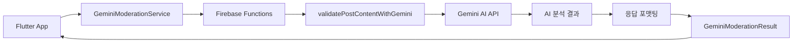

# 🧠 Text Moderation Service - AI 기반 텍스트 검증 모듈

> Versus Space의 텍스트 콘텐츠를 Gemini AI로 검증하는 고급 모듈

## 📊 모듈 메타정보

| 항목 | 상태 | 상세 |
|------|------|------|
| **모듈명** | Text Moderation Service | AI 텍스트 검증 |
| **버전** | v2.0.0 | 2025-08-23 기준 |
| **파일 수** | 1개 | gemini_service.dart |
| **주요 클래스** | 1개 | GeminiModerationService |
| **의존성** | Firebase Functions | Cloud Functions 호출 |

## 🎯 개요

Text Moderation Service는 Versus Space의 A vs B 비교 콘텐츠에서 텍스트의 논리성, 적절성, 균형성을 검증하는 AI 기반 모듈입니다. Google Gemini AI를 활용하여 질문과 선택지 간의 논리적 일관성을 검증하고, 예상 선택 비율을 예측하여 편향된 콘텐츠를 사전에 감지합니다.

### 핵심 특징
- 🤖 **Gemini AI 통합**: Google의 최신 LLM 활용
- ☁️ **Cloud Functions 기반**: 서버리스 아키텍처
- 📊 **예상 비율 예측**: A/B 선택지 균형성 평가
- 🔄 **실시간 피드백**: 개선 제안 즉시 제공

## 📐 네이밍 컨벤션

| 구분 | 규칙 | 예시 |
|------|------|------|
| **파일명** | snake_case | `gemini_service.dart` |
| **클래스명** | PascalCase | `GeminiModerationService` |
| **메서드명** | camelCase | `validateContent()` |
| **매개변수** | camelCase | `questionTitle`, `userId` |
| **상수** | UPPER_SNAKE_CASE | `CLOUD_FUNCTION_NAME` |

> 상세 규칙은 [프로젝트 네이밍 컨벤션](../../../../NAMING_CONVENTION.md) 참조

## 🏗️ 아키텍처

### 시스템 구조
```
text_moderation/
└── gemini_service.dart
    └── GeminiModerationService (Static Class)
        ├── initialize()                    # 초기화 (레거시)
        └── validateContent()                # 콘텐츠 검증
            ├── Cloud Function 호출
            ├── 응답 파싱
            └── 결과 객체 생성
```

### 데이터 플로우


## 🔧 주요 구성요소

### GeminiModerationService 클래스

텍스트 검증을 위한 정적 서비스 클래스입니다.

#### 클래스 구조
```dart
class GeminiModerationService {
  static final FirebaseFunctions _functions = 
    FirebaseFunctions.instanceFor(region: 'asia-northeast3');
  
  static void initialize();                    // 초기화 (레거시)
  static Future<GeminiModerationResult?> validateContent();  // 콘텐츠 검증
}
```

#### 주요 메서드

##### validateContent() - 콘텐츠 검증
```dart
static Future<GeminiModerationResult?> validateContent({
  // 필수 파라미터
  required String userId,           // 사용자 ID
  
  // 텍스트 콘텐츠
  required String? questionTitle,   // 질문 제목
  required String? description,     // 설명
  required String? titleA,          // A 선택지
  required String? titleB,          // B 선택지
  
  // 이미지 관련 (선택)
  String? imageUrlA,                // A 이미지 URL
  String? imageUrlB,                // B 이미지 URL
  Map<String, dynamic>? visionDataA,  // Vision API 데이터 A
  Map<String, dynamic>? visionDataB,  // Vision API 데이터 B
  
  // 추가 컨텍스트
  Map<String, double>? perspectiveScores,  // Perspective API 점수
  String? sessionId,                // 세션 ID
  String? documentId,               // 문서 ID  
  int? revisionCount,               // 수정 횟수
})
```

## 💡 핵심 기능

### 1. Cloud Functions 통합

#### Firebase Functions 호출
```dart
// Cloud Function 설정
final callable = _functions.httpsCallable('validatePostContentWithGemini');

// 파라미터 전달
final response = await callable.call({
  'question': questionTitle,
  'titleA': titleA,
  'titleB': titleB,
  'descriptionText': description,
  'imageUrlA': imageUrlA,
  'imageUrlB': imageUrlB,
  'visionDataA': visionDataA,
  'visionDataB': visionDataB,
  'perspectiveData': perspectiveScores,
  'userId': userId,
  // ... 추가 메타데이터
});
```

### 2. 응답 포맷 처리

#### 새로운 응답 포맷 (v2.0)
```dart
// action 기반 응답
{
  "action": "PROCEED" | "PROCEED_WITH_SUGGESTION" | "BLOCK",
  "feedback": {
    "title": "피드백 제목",
    "description": "상세 설명"
  },
  "expectedRatio": {
    "A": 0.6,
    "B": 0.4
  },
  "confidence": 0.85
}
```

#### 레거시 응답 포맷 (v1.0) - 하위 호환성
```dart
{
  "isValid": true,
  "reason": "검증 이유",
  "severity": "pass" | "warning" | "error",
  "suggestions": "개선 제안",
  "expectedRatio": {
    "A": 0.5,
    "B": 0.5
  }
}
```

### 3. 에러 처리

#### FirebaseFunctionsException 처리
```dart
try {
  // Cloud Function 호출
} on FirebaseFunctionsException catch (e) {
  if (e.code == 'unauthenticated') {
    throw Exception('로그인이 필요합니다.');
  }
  throw Exception('Gemini AI 검증 중 오류가 발생했습니다: ${e.message}');
} catch (e) {
  throw Exception('콘텐츠 검증 중 오류가 발생했습니다.');
}
```

## 🚀 사용 예시

### 기본 사용법
```dart
// 텍스트 콘텐츠 검증
final result = await GeminiModerationService.validateContent(
  userId: currentUser.uid,
  questionTitle: "어떤 디자인이 더 좋아?",
  titleA: "미니멀 디자인",
  titleB: "화려한 디자인",
  description: "새로운 앱 UI 디자인 선택",
);

if (result != null && result.isValid) {
  print('검증 통과!');
  print('예상 비율 - A: ${result.expectedRatioA}, B: ${result.expectedRatioB}');
} else {
  print('검증 실패: ${result?.reason}');
  print('개선 제안: ${result?.suggestions}');
}
```

### 이미지 포함 검증
```dart
// 이미지와 함께 검증
final result = await GeminiModerationService.validateContent(
  userId: currentUser.uid,
  questionTitle: "어떤 사진이 더 멋져?",
  titleA: "일출",
  titleB: "일몰",
  imageUrlA: "https://storage.../sunrise.jpg",
  imageUrlB: "https://storage.../sunset.jpg",
  visionDataA: visionResultA,  // Vision API 결과
  visionDataB: visionResultB,
);
```

### Perspective API 점수 포함
```dart
// 유해성 검사 결과와 함께 검증
final result = await GeminiModerationService.validateContent(
  userId: currentUser.uid,
  questionTitle: questionText,
  titleA: optionA,
  titleB: optionB,
  perspectiveScores: {
    'TOXICITY': 0.2,
    'INSULT': 0.1,
    'THREAT': 0.05,
  },
);
```

## 📊 검증 로직

### Action 레벨 판정
| Action | 의미 | 처리 방법 |
|--------|------|-----------|
| **PROCEED** | 통과 | 즉시 게시 가능 |
| **PROCEED_WITH_SUGGESTION** | 경고 | 개선 제안 표시 후 게시 |
| **BLOCK** | 차단 | 수정 필요, 게시 불가 |

### 예상 비율 분석
```dart
// 균형잡힌 질문 (좋음)
expectedRatioA: 0.48
expectedRatioB: 0.52

// 편향된 질문 (개선 필요)
expectedRatioA: 0.85
expectedRatioB: 0.15
```

## 🔄 버전 관리

### v2.0.0 (2025-08-23)
- Cloud Functions 완전 마이그레이션
- 새로운 action 기반 응답 포맷
- 하위 호환성 유지

### v1.0.0 (2025-08-10)
- 초기 구현
- 직접 API 호출 방식

## 🐛 디버깅

### 로그 패턴
```dart
// 요청 로깅
print('[GeminiModerationService] Calling Cloud Function validatePostContentWithGemini');

// 응답 로깅
print('[GeminiModerationService] Response received from Cloud Function');
print('[GeminiModerationService] Full response data: ${response.data}');

// 에러 로깅
print('[GeminiModerationService] Cloud Function Error: ${e.code} - ${e.message}');
```

### 일반적인 문제 해결

#### Cloud Function 타임아웃
- 증상: 30초 후 타임아웃 에러
- 해결: Cloud Function 타임아웃 설정 증가
- 대안: 텍스트 길이 제한

#### 인증 오류
- 증상: 'unauthenticated' 에러
- 해결: Firebase Auth 로그인 상태 확인
- 대안: 익명 로그인 지원

## 📈 통계 및 메트릭

### 주요 추적 지표
- **평균 응답 시간**: 2-3초 (정상), 5초+ (지연)
- **검증 통과율**: 전체 요청 중 PROCEED 비율
- **경고 비율**: PROCEED_WITH_SUGGESTION 비율
- **차단 비율**: BLOCK 비율
- **예상 비율 정확도**: 실제 투표 결과와 비교

## 🚧 향후 계획

### 단기 (1-2개월)
- [ ] 응답 캐싱 시스템 구현
- [ ] 배치 검증 API 추가
- [ ] 실시간 스트리밍 응답

### 중기 (3-6개월)
- [ ] 다국어 검증 지원
- [ ] 사용자 피드백 학습
- [ ] 커스텀 검증 규칙

### 장기 (6개월+)
- [ ] 자체 모델 파인튜닝
- [ ] 온디바이스 검증 옵션
- [ ] 실시간 제안 시스템

## 📝 변경 이력

- **2025-08-23**: 상세 문서 작성 완료
- **2025-08-20**: Cloud Functions 마이그레이션
- **2025-08-15**: 예상 비율 예측 기능 추가
- **2025-08-10**: 초기 구현

---

*이 문서는 Versus Space Text Moderation Service의 구조와 사용법을 설명합니다.*
*최종 업데이트: 2025-08-23*