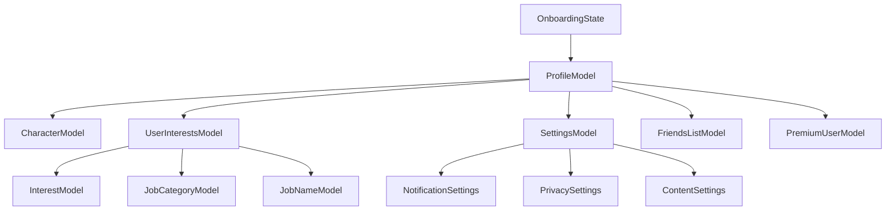

# 🎯 /lib/features/profile/domain/models

> Feature-First Architecture - Profile 도메인 모델

## 📋 개요

프로필 기능의 **Domain Models Layer**를 담당하는 디렉토리입니다. 비즈니스 엔티티와 값 객체를 정의하며, 애플리케이션의 핵심 데이터 구조를 표현합니다.

### 🎯 목적
- **도메인 모델 정의**: 프로필 관련 핵심 엔티티
- **데이터 구조화**: 타입 안정성 보장
- **비즈니스 규칙**: 도메인 로직 캡슐화
- **불변성 보장**: Immutable 데이터 모델

## 🏗️ 디렉토리 구조

```
models/
├── profile_model.dart           # 사용자 프로필 모델
├── character_model.dart         # 캐릭터 모델
├── interest_model.dart          # 관심사 모델
├── job_category_model.dart      # 직업 카테고리 모델
├── job_name_model.dart          # 직업명 모델
├── expertise_model.dart         # 전문분야 모델
├── friends_list_model.dart      # 친구 목록 모델
├── settings_model.dart          # 설정 모델
├── premium_user_model.dart      # 프리미엄 사용자 모델
└── onboarding_state_model.dart  # 온보딩 상태 모델
```

## 📂 주요 모델 사양

### ProfileModel

**역할**: 사용자 프로필 도메인 모델

**주요 필드**:
- `id`: 사용자 ID
- `email`: 이메일 주소
- `displayName`: 표시 이름
- `photoURL`: 프로필 사진 URL
- `bio`: 소개글
- `pointsA`: 답변 포인트
- `pointsQ`: 질문 포인트
- `totalPosts`: 총 게시물 수
- `totalVotes`: 총 투표 수
- `ranking`: 순위
- `jobCategory`: 직업 카테고리
- `expertise`: 전문분야 (최대 4개)
- `hobbies`: 취미 (최대 8개)
- `characterId`: 캐릭터 ID
- `friendIds`: 친구 목록
- `isPremium`: 프리미엄 여부
- `role`: 사용자 역할 (user, tester, admin)
  
  /// Firestore에서 생성
  factory ProfileModel.fromFirestore(
    DocumentSnapshot<Map<String, dynamic>> doc,
  ) {
    final data = doc.data()!;
    return ProfileModel(
      id: doc.id,
      email: data['email'] ?? '',
      displayName: data['displayName'],
      photoURL: data['photoURL'],
      bio: data['bio'],
      pointsA: data['pointsA'] ?? 0,
      pointsQ: data['pointsQ'] ?? 0,
      totalPoints: (data['pointsA'] ?? 0) + (data['pointsQ'] ?? 0),
      totalPosts: data['totalPosts'] ?? 0,
      totalVotes: data['totalVotes'] ?? 0,
      totalLikes: data['totalLikes'] ?? 0,
      ranking: data['ranking'] ?? 0,
      jobCategory: data['jobCategory'],
      jobName: data['jobName'],
      expertise: List<String>.from(data['expertise'] ?? []),
      hobbies: List<String>.from(data['hobbies'] ?? []),
      characterId: data['characterId'],
      characterCustomization: data['characterCustomization'],
      friendIds: List<String>.from(data['friendIds'] ?? []),
      friendCount: data['friendCount'] ?? 0,
      isPremium: data['isPremium'] ?? false,
      premiumExpiresAt: data['premiumExpiresAt']?.toDate(),
      language: data['language'] ?? 'ko',
      notificationsEnabled: data['notificationsEnabled'] ?? true,
      onboardingCompleted: data['onboardingCompleted'] ?? false,
      ageVerified: data['ageVerified'] ?? false,
      createdAt: data['createdAt']?.toDate() ?? DateTime.now(),
      updatedAt: data['updatedAt']?.toDate() ?? DateTime.now(),
      lastLoginAt: data['lastLoginAt']?.toDate(),
      role: data['role'] ?? 'user',
    );
  }
  
  /// Firestore로 변환
  Map<String, dynamic> toFirestore() {
    return {
      'email': email,
      'displayName': displayName,
      'photoURL': photoURL,
      'bio': bio,
      'pointsA': pointsA,
      'pointsQ': pointsQ,
      'totalPosts': totalPosts,
      'totalVotes': totalVotes,
      'totalLikes': totalLikes,
      'ranking': ranking,
      'jobCategory': jobCategory,
      'jobName': jobName,
      'expertise': expertise,
      'hobbies': hobbies,
      'characterId': characterId,
      'characterCustomization': characterCustomization,
      'friendIds': friendIds,
      'friendCount': friendCount,
      'isPremium': isPremium,
      'premiumExpiresAt': premiumExpiresAt != null 
          ? Timestamp.fromDate(premiumExpiresAt!)
          : null,
      'language': language,
      'notificationsEnabled': notificationsEnabled,
      'onboardingCompleted': onboardingCompleted,
      'ageVerified': ageVerified,
      'createdAt': Timestamp.fromDate(createdAt),
      'updatedAt': FieldValue.serverTimestamp(),
      'lastLoginAt': lastLoginAt != null 
          ? Timestamp.fromDate(lastLoginAt!)
          : null,
      'role': role,
    };
  }
  
  /// JSON 직렬화
  factory ProfileModel.fromJson(Map<String, dynamic> json) =>
      _$ProfileModelFromJson(json);
  
  /// 캐시에서 생성
  factory ProfileModel.fromCache(Map<String, dynamic> cache) {
    return ProfileModel(
      id: cache['id'],
      email: cache['email'],
      displayName: cache['displayName'],
      photoURL: cache['photoURL'],
      bio: cache['bio'],
      pointsA: cache['pointsA'] ?? 0,
      pointsQ: cache['pointsQ'] ?? 0,
      totalPoints: cache['totalPoints'] ?? 0,
      totalPosts: cache['totalPosts'] ?? 0,
      totalVotes: cache['totalVotes'] ?? 0,
      totalLikes: cache['totalLikes'] ?? 0,
      ranking: cache['ranking'] ?? 0,
      jobCategory: cache['jobCategory'],
      jobName: cache['jobName'],
      expertise: List<String>.from(cache['expertise'] ?? []),
      hobbies: List<String>.from(cache['hobbies'] ?? []),
      characterId: cache['characterId'],
      characterCustomization: cache['characterCustomization'],
      friendIds: List<String>.from(cache['friendIds'] ?? []),
      friendCount: cache['friendCount'] ?? 0,
      isPremium: cache['isPremium'] ?? false,
      premiumExpiresAt: cache['premiumExpiresAt'] != null
          ? DateTime.parse(cache['premiumExpiresAt'])
          : null,
      language: cache['language'] ?? 'ko',
      notificationsEnabled: cache['notificationsEnabled'] ?? true,
      onboardingCompleted: cache['onboardingCompleted'] ?? false,
      ageVerified: cache['ageVerified'] ?? false,
      createdAt: DateTime.parse(cache['createdAt']),
      updatedAt: DateTime.parse(cache['updatedAt']),
      lastLoginAt: cache['lastLoginAt'] != null
          ? DateTime.parse(cache['lastLoginAt'])
          : null,
      role: cache['role'] ?? 'user',
    );
  }
  
  // 비즈니스 로직
  
  /// 프로필 완성도 계산 (0-100%)
  int get completionPercentage {
    int score = 0;
    if (displayName != null) score += 20;
    if (photoURL != null) score += 20;
    if (bio != null) score += 10;
    if (jobCategory != null) score += 10;
    if (expertise.isNotEmpty) score += 20;
    if (hobbies.isNotEmpty) score += 20;
    return score;
  }
  
  /// 랭킹 티어 계산
  String get rankTier {
    if (ranking <= 10) return '마스터';
    if (ranking <= 50) return '다이아몬드';
    if (ranking <= 100) return '플래티넘';
    if (ranking <= 500) return '골드';
    if (ranking <= 1000) return '실버';
    return '브론즈';
  }
  
  /// 활동 레벨 계산
  int get activityLevel {
    final totalActivity = totalPosts + totalVotes;
    if (totalActivity >= 1000) return 5;
    if (totalActivity >= 500) return 4;
    if (totalActivity >= 100) return 3;
    if (totalActivity >= 50) return 2;
    if (totalActivity >= 10) return 1;
    return 0;
  }
  
  /// 프리미엄 활성 여부
  bool get isPremiumActive {
    if (!isPremium) return false;
    if (premiumExpiresAt == null) return true;
    return premiumExpiresAt!.isAfter(DateTime.now());
  }
  
  /// 관리자 여부
  bool get isAdmin => role == 'admin';
  
  /// 테스터 여부
  bool get isTester => role == 'tester' || role == 'admin';
}

/// 프로필 업데이트 모델
@freezed
class ProfileUpdateModel with _$ProfileUpdateModel {
  const factory ProfileUpdateModel({
    String? displayName,
    String? photoURL,
    String? bio,
    String? jobCategory,
    String? jobName,
    List<String>? expertise,
    List<String>? hobbies,
    String? characterId,
    Map<String, dynamic>? characterCustomization,
    String? language,
    bool? notificationsEnabled,
  }) = _ProfileUpdateModel;
  
  factory ProfileUpdateModel.fromJson(Map<String, dynamic> json) =>
      _$ProfileUpdateModelFromJson(json);
}
```

### CharacterModel

**CharacterModel 사양**:
- **역할**: 사용자 캐릭터 정보 관리
- **주요 필드**:
  - id: 캐릭터 고유 식별자
  - name: 캐릭터 이름
  - imageUrl: 캐릭터 이미지 URL
  - thumbnailUrl: 썸네일 이미지 URL
  - description: 캐릭터 설명
  - rarity: 희귀도 (normal, rare, epic, legendary)
  - level: 캐릭터 레벨
  - experience: 경험치
  - customization: 커스터마이징 정보 Map
  - isPremium: 프리미엄 캐릭터 여부
  - isLocked: 잠금 상태
  - unlockPrice: 잠금 해제 가격
  - order: 표시 순서
  - isActive: 활성화 상태
  - releasedAt: 출시일
  - usedCount: 사용 횟수
  - popularity: 인기도 점수

**CharacterCustomization 사양**:
- **역할**: 캐릭터 외형 커스터마이징 정보
- **주요 필드**:
  - skinColor: 피부색
  - hairStyle: 헤어 스타일
  - hairColor: 헤어 색상
  - eyeColor: 눈 색상
  - outfit: 의상
  - accessories: 액세서리 목록
  - advanced: 고급 커스터마이징 옵션 Map

### InterestModel

```dart
/// 관심사 도메인 모델
@freezed
class InterestModel with _$InterestModel {
  const factory InterestModel({
    required String id,
    required String name,
    required String category,
    String? icon,
    String? description,
    
    // 가중치 및 인기도
    @Default(0) int weight,
    @Default(0) int userCount,
    @Default(0.0) double trendScore,
    
    // 관련 태그
    @Default([]) List<String> tags,
    @Default([]) List<String> relatedInterests,
    
    // 메타데이터
    @Default(true) bool isActive,
    DateTime? createdAt,
    DateTime? lastSelected,
  }) = _InterestModel;
  
  factory InterestModel.fromJson(Map<String, dynamic> json) =>
      _$InterestModelFromJson(json);
  
  factory InterestModel.fromFirestore(
    DocumentSnapshot<Map<String, dynamic>> doc,
  ) {
    final data = doc.data()!;
    return InterestModel(
      id: doc.id,
      name: data['name'] ?? doc.id,
      category: data['category'] ?? 'general',
      icon: data['icon'],
      description: data['description'],
      weight: data['weight'] ?? 0,
      userCount: data['userCount'] ?? 0,
      trendScore: (data['trendScore'] ?? 0).toDouble(),
      tags: List<String>.from(data['tags'] ?? []),
      relatedInterests: List<String>.from(data['relatedInterests'] ?? []),
      isActive: data['isActive'] ?? true,
      createdAt: data['createdAt']?.toDate(),
      lastSelected: data['lastSelected']?.toDate(),
    );
  }
}

/// 사용자 관심사 모델
@freezed
class UserInterestsModel with _$UserInterestsModel {
  const UserInterestsModel._();
  
  const factory UserInterestsModel({
    String? jobCategory,
    String? jobName,
    @Default([]) List<String> expertise,  // 최대 4개
    @Default([]) List<String> hobbies,    // 최대 8개
    DateTime? updatedAt,
  }) = _UserInterestsModel;
  
  factory UserInterestsModel.fromJson(Map<String, dynamic> json) =>
      _$UserInterestsModelFromJson(json);
  
  /// 전체 관심사 목록
  List<String> get allInterests => [...expertise, ...hobbies];
  
  /// 관심사 수
  int get totalCount => expertise.length + hobbies.length;
  
  /// 유효성 검증
  bool get isValid {
    return expertise.length <= 4 && hobbies.length <= 8;
  }
  
  /// 관심사 추가 가능 여부
  bool canAddExpertise() => expertise.length < 4;
  bool canAddHobby() => hobbies.length < 8;
}

/// 관심사 카테고리 모델
@freezed
class InterestCategory with _$InterestCategory {
  const factory InterestCategory({
    required String id,
    required String name,
    String? icon,
    String? description,
    @Default([]) List<String> items,
    @Default(0) int order,
  }) = _InterestCategory;
  
  factory InterestCategory.fromJson(Map<String, dynamic> json) =>
      _$InterestCategoryFromJson(json);
}
```

### SettingsModel

```dart
/// 사용자 설정 모델
@freezed
class SettingsModel with _$SettingsModel {
  const SettingsModel._();
  
  const factory SettingsModel({
    // 기본 설정
    @Default('ko') String language,
    @Default(ThemeMode.system) ThemeMode themeMode,
    
    // 알림 설정
    @Default(NotificationSettings()) NotificationSettings notificationSettings,
    
    // 프라이버시
    @Default(PrivacySettings()) PrivacySettings privacySettings,
    
    // 보안
    @Default(false) bool autoLogin,
    @Default(false) bool biometricEnabled,
    String? lastBackupDate,
    
    // 콘텐츠 설정
    @Default(ContentSettings()) ContentSettings contentSettings,
  }) = _SettingsModel;
  
  factory SettingsModel.fromJson(Map<String, dynamic> json) =>
      _$SettingsModelFromJson(json);
  
  /// 설정 병합
  static SettingsModel merge(
    SettingsModel local,
    Map<String, dynamic>? remote,
  ) {
    if (remote == null) return local;
    
    return local.copyWith(
      language: remote['language'] ?? local.language,
      themeMode: _parseThemeMode(remote['themeMode']) ?? local.themeMode,
      notificationSettings: remote['notificationSettings'] != null
          ? NotificationSettings.fromJson(remote['notificationSettings'])
          : local.notificationSettings,
      privacySettings: remote['privacySettings'] != null
          ? PrivacySettings.fromJson(remote['privacySettings'])
          : local.privacySettings,
      autoLogin: remote['autoLogin'] ?? local.autoLogin,
      biometricEnabled: remote['biometricEnabled'] ?? local.biometricEnabled,
    );
  }
  
  static ThemeMode? _parseThemeMode(String? mode) {
    switch (mode) {
      case 'light':
        return ThemeMode.light;
      case 'dark':
        return ThemeMode.dark;
      case 'system':
        return ThemeMode.system;
      default:
        return null;
    }
  }
}

/// 알림 설정 모델
@freezed
class NotificationSettings with _$NotificationSettings {
  const factory NotificationSettings({
    @Default(true) bool pushEnabled,
    @Default(true) bool emailEnabled,
    @Default(false) bool smsEnabled,
    
    // 알림 유형별 설정
    @Default(true) bool votingRequests,
    @Default(true) bool friendRequests,
    @Default(true) bool comments,
    @Default(true) bool likes,
    @Default(false) bool marketing,
    
    // 방해 금지 시간
    String? doNotDisturbStart,
    String? doNotDisturbEnd,
  }) = _NotificationSettings;
  
  factory NotificationSettings.fromJson(Map<String, dynamic> json) =>
      _$NotificationSettingsFromJson(json);
}

/// 프라이버시 설정 모델
@freezed
class PrivacySettings with _$PrivacySettings {
  const factory PrivacySettings({
    @Default('public') String profileVisibility,  // public, friends, private
    @Default(true) bool showOnlineStatus,
    @Default(true) bool allowFriendRequests,
    @Default(true) bool showInSearch,
    @Default(false) bool hideAge,
    @Default([]) List<String> blockedUsers,
  }) = _PrivacySettings;
  
  factory PrivacySettings.fromJson(Map<String, dynamic> json) =>
      _$PrivacySettingsFromJson(json);
}

/// 콘텐츠 설정 모델
@freezed
class ContentSettings with _$ContentSettings {
  const factory ContentSettings({
    @Default(true) bool showMatureContent,
    @Default(false) bool autoplayVideos,
    @Default('medium') String imageQuality,  // low, medium, high
    @Default(true) bool dataSaver,
  }) = _ContentSettings;
  
  factory ContentSettings.fromJson(Map<String, dynamic> json) =>
      _$ContentSettingsFromJson(json);
}
```

### OnboardingStateModel

```dart
/// 온보딩 상태 모델
@freezed
class OnboardingState with _$OnboardingState {
  const OnboardingState._();
  
  const factory OnboardingState({
    @Default(false) bool isCompleted,
    @Default(0) int currentStep,
    @Default([]) List<String> completedSteps,
    
    // 단계별 완료 상태
    @Default(false) bool agreedToTerms,
    @Default(false) bool ageVerified,
    @Default(false) bool hasSelectedJob,
    @Default(false) bool hasSelectedExpertise,
    @Default(false) bool hasSelectedHobbies,
    @Default(false) bool hasCreatedCharacter,
    @Default(false) bool hasSetupProfile,
    
    // 입력 데이터
    int? birthYear,
    String? selectedJobCategory,
    String? selectedJobName,
    List<String>? selectedExpertise,
    List<String>? selectedHobbies,
    String? selectedCharacterId,
    
    // 메타데이터
    DateTime? startedAt,
    DateTime? completedAt,
    @Default(false) bool skipped,
  }) = _OnboardingState;
  
  factory OnboardingState.fromJson(Map<String, dynamic> json) =>
      _$OnboardingStateFromJson(json);
  
  /// 초기 상태
  factory OnboardingState.notStarted() => const OnboardingState();
  
  /// 다음 단계
  OnboardingStep? get nextStep {
    if (!agreedToTerms) return OnboardingStep.termsAgreement;
    if (!ageVerified) return OnboardingStep.ageVerification;
    if (!hasSelectedJob) return OnboardingStep.jobSelection;
    if (!hasSelectedExpertise) return OnboardingStep.expertiseSelection;
    if (!hasSelectedHobbies) return OnboardingStep.hobbiesSelection;
    if (!hasCreatedCharacter) return OnboardingStep.characterCreation;
    if (!hasSetupProfile) return OnboardingStep.profileSetup;
    return null;
  }
  
  /// 진행률 (0-100%)
  int get progressPercentage {
    int completed = 0;
    if (agreedToTerms) completed++;
    if (ageVerified) completed++;
    if (hasSelectedJob) completed++;
    if (hasSelectedExpertise) completed++;
    if (hasSelectedHobbies) completed++;
    if (hasCreatedCharacter) completed++;
    if (hasSetupProfile) completed++;
    
    return ((completed / 7) * 100).round();
  }
  
  /// 남은 단계 수
  int get remainingSteps => 7 - (progressPercentage ~/ 15);
}

/// 온보딩 단계 열거형
enum OnboardingStep {
  termsAgreement,
  ageVerification,
  jobSelection,
  expertiseSelection,
  hobbiesSelection,
  characterCreation,
  profileSetup,
}
```

## 🔄 모델 관계



## 🧪 테스트 전략

### 모델 테스트

```dart
void main() {
  group('ProfileModel Tests', () {
    test('should calculate completion percentage correctly', () {
      final profile = ProfileModel(
        id: 'test',
        email: 'test@example.com',
        displayName: 'Test User',
        photoURL: 'https://example.com/photo.jpg',
        expertise: ['Flutter'],
        hobbies: ['Gaming', 'Reading'],
        createdAt: DateTime.now(),
        updatedAt: DateTime.now(),
      );
      
      expect(profile.completionPercentage, equals(80));
    });
    
    test('should determine rank tier correctly', () {
      final profile = ProfileModel(
        id: 'test',
        email: 'test@example.com',
        ranking: 25,
        createdAt: DateTime.now(),
        updatedAt: DateTime.now(),
      );
      
      expect(profile.rankTier, equals('다이아몬드'));
    });
  });
}
```

## ✅ 체크리스트

### 구현 완료
- [ ] ProfileModel
- [ ] CharacterModel
- [ ] InterestModel
- [ ] JobCategoryModel
- [ ] JobNameModel
- [ ] SettingsModel
- [ ] OnboardingStateModel
- [ ] FriendsListModel
- [ ] PremiumUserModel

### 구현 예정
- [ ] ProfileStatsModel
- [ ] AchievementModel
- [ ] BadgeModel

## 📚 참고 자료

- [Freezed Documentation](https://pub.dev/packages/freezed)
- [Domain-Driven Design](https://martinfowler.com/tags/domain%20driven%20design.html)
- [Flutter Data Models](https://flutter.dev/docs/development/data-and-backend/json)

---

*이 문서는 Feature-First Architecture의 Profile 기능 도메인 모델 가이드입니다.*
*최종 업데이트: 2025-08-25*