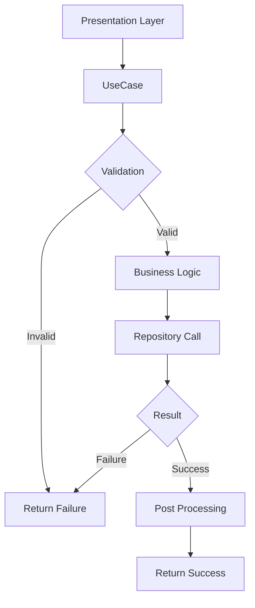

# 💼 /lib/features/profile/domain/usecases

> Feature-First Architecture - Profile 유스케이스 계층

## 📋 개요

프로필 기능의 **Use Cases Layer**를 담당하는 디렉토리입니다. 애플리케이션의 비즈니스 규칙을 구현하며, 프레젠테이션 계층과 데이터 계층을 연결합니다.

### 🎯 목적
- **비즈니스 로직 캡슐화**: 핵심 비즈니스 규칙 구현
- **단일 책임 원칙**: 각 유스케이스는 하나의 기능만 담당
- **의존성 역전**: 리포지토리 인터페이스에만 의존
- **테스트 가능성**: 독립적으로 테스트 가능한 비즈니스 로직

## 🏗️ 디렉토리 구조

```
usecases/
├── profile/
│   ├── get_profile_usecase.dart         # 프로필 조회
│   ├── update_profile_usecase.dart      # 프로필 수정
│   ├── upload_avatar_usecase.dart       # 아바타 업로드
│   └── delete_account_usecase.dart      # 계정 삭제
├── settings/
│   ├── change_settings_usecase.dart     # 설정 변경
│   ├── change_language_usecase.dart     # 언어 변경
│   └── toggle_notifications_usecase.dart # 알림 토글
├── social/
│   ├── add_friend_usecase.dart          # 친구 추가
│   ├── remove_friend_usecase.dart       # 친구 삭제
│   └── block_user_usecase.dart          # 사용자 차단
├── interests/
│   ├── update_interests_usecase.dart    # 관심사 수정
│   ├── get_recommendations_usecase.dart # 추천 관심사
│   └── search_interests_usecase.dart    # 관심사 검색
├── premium/
│   ├── upgrade_premium_usecase.dart     # 프리미엄 업그레이드
│   └── check_premium_status_usecase.dart # 프리미엄 상태 확인
└── onboarding/
    ├── complete_onboarding_step_usecase.dart # 온보딩 단계 완료
    └── skip_onboarding_usecase.dart         # 온보딩 건너뛰기
```

## 📂 주요 유스케이스 구현

### GetProfileUseCase

**역할**: 프로필 조회 비즈니스 로직

**주요 기능**:
- 프로필 조회 및 캐시 관리
- 온보딩 완료 여부 검증
- 프로필 통계 업데이트 (비동기)

**의존성**:
- ProfileRepository

**GetProfileParams**:
- userId: 프로필 사용자 ID
- forceRefresh: 캐시 무시 여부 (기본값: false)
- allowIncomplete: 미완성 프로필 허용 (기본값: true)

### UpdateProfileUseCase

**역할**: 프로필 업데이트 비즈니스 로직

**주요 기능**:
- 입력 데이터 유효성 검증
- 권한 확인 및 보안 처리
- 이미지 최적화 및 업로드
- 캐시 무효화 및 이벤트 발행

**의존성**:
- ProfileRepository
- ValidationService
- ImageProcessingService

**UpdateProfileParams**:
- userId: 프로필 사용자 ID
- displayName: 표시 이름
- photoURL: 프로필 사진 URL
- photoBytes: 프로필 사진 바이트 데이터
- bio: 자기소개 (150자 제한)
- jobCategory: 직업 카테고리
- jobName: 직업명
- expertise: 전문분야 (최대 4개)
- hobbies: 취미 (최대 8개)

### UpdateInterestsUseCase

**역할**: 관심사 업데이트 비즈니스 로직

**주요 기능**:
- 전문분야/취미 개수 제한 검증
- 중복 제거 및 교집합 체크
- 추천 시스템 업데이트 (비동기)
- 관심사 가중치 업데이트 (비동기)

**의존성**:
- InterestRepository
- RecommendationService

**UpdateInterestsParams**:
- userId: 프로필 사용자 ID
- expertise: 전문분야 목록 (최대 4개)
- hobbies: 취미 목록 (최대 8개)

### CompleteOnboardingStepUseCase

**역할**: 온보딩 단계 완료 비즈니스 로직

**주요 기능**:
- 온보딩 단계 순서 검증
- 단계별 데이터 유효성 검증
- 단계 완료 후처리 (캐릭터 잠금 해제, 보너스 지급)
- 온보딩 완료 보상 처리

**의존성**:
- OnboardingRepository
- ProfileRepository

**CompleteOnboardingStepParams**:
- userId: 프로필 사용자 ID
- step: 온보딩 단계 (OnboardingStep enum)
- data: 단계별 데이터 Map

## 🔄 유스케이스 플로우



## 🧪 테스트 전략

### 유스케이스 테스트

**테스트 구조**:
- 각 유스케이스별 독립적인 테스트 그룹
- Mock 객체를 사용한 의존성 격리
- setUp/tearDown으로 테스트 환경 관리

**주요 테스트 케이스**:
- 유효성 검사 실패 시나리오
- 권한 검증 실패 처리
- 성공적인 실행 경로 검증
- 비즈니스 규칙 준수 확인
- 에러 처리 적절성 확인
- 비동기 작업 완료 검증

**Mock 객체**:
- MockProfileRepository
- MockValidationService
- MockImageProcessingService
- MockRecommendationService

**검증 항목**:
- 파라미터 유효성 검사
- Repository 메서드 호출 여부
- 반환값 정확성
- 에러 타입 적절성

## ⚠️ 에러 처리

### 유스케이스 실패 타입

**기본 실패 타입**:
- **Failure**: 기본 실패 클래스
  - message: 에러 메시지 필드

**특화된 실패 타입**:
- **ValidationFailure**: 입력값 검증 실패
  - 잘못된 형식, 길이 제한 위반, 필수 값 누락
- **PermissionFailure**: 권한 부족
  - 다른 사용자 프로필 수정 시도, 권한 없는 작업
- **IncompleteProfileFailure**: 불완전한 프로필
  - 온보딩 미완료, 필수 정보 부재
- **OnboardingFailure**: 온보딩 단계 실패
  - 순서 위반, 데이터 검증 실패
- **ImageProcessingFailure**: 이미지 처리 실패
  - 업로드 실패, 리사이징 오류, 포맷 미지원

**에러 처리 전략**:
- Either<Failure, Success> 패턴 사용
- 명시적 에러 타입 반환
- 에러 메시지 국제화 지원

## ✅ 체크리스트

### 구현 완료
- [ ] GetProfileUseCase
- [ ] UpdateProfileUseCase
- [ ] UploadAvatarUseCase
- [ ] ChangeSettingsUseCase
- [ ] UpdateInterestsUseCase
- [ ] AddFriendUseCase
- [ ] CompleteOnboardingStepUseCase
- [ ] UpgradePremiumUseCase

### 구현 예정
- [ ] SearchProfilesUseCase
- [ ] ExportProfileDataUseCase
- [ ] DeleteAccountUseCase

## 📚 참고 자료

- [Clean Architecture UseCase](https://blog.cleancoder.com/uncle-bob/2012/08/13/the-clean-architecture.html)
- [Domain-Driven Design](https://martinfowler.com/tags/domain%20driven%20design.html)
- [Flutter Clean Architecture](https://github.com/ResoCoder/flutter-tdd-clean-architecture-course)

---

*이 문서는 Feature-First Architecture의 Profile 기능 유스케이스 가이드입니다.*
*최종 업데이트: 2025-08-25*