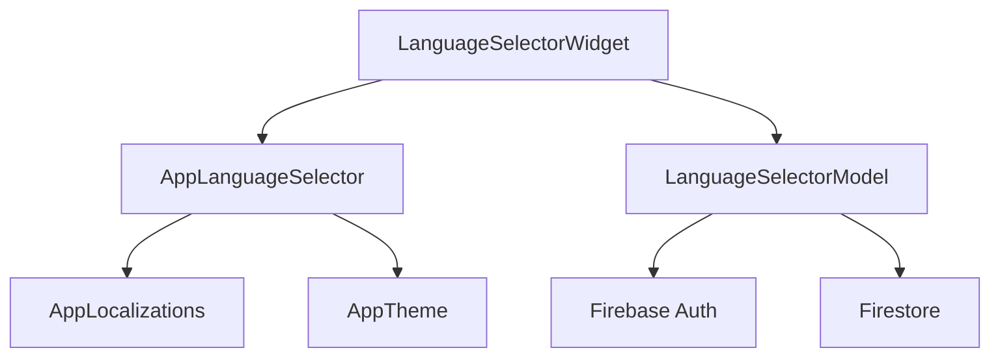
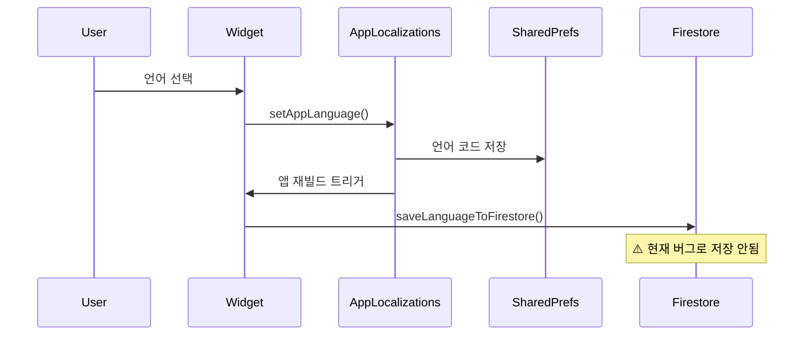

# 🌐 Language Selector - 언어 선택 컴포넌트

> Versus Space 앱의 언어 설정 기능을 제공하는 UI 컴포넌트

## 📋 개요

Language Selector는 사용자가 앱의 표시 언어를 선택할 수 있는 드롭다운 위젯입니다. AppLocalizations 시스템과 통합되어 실시간으로 앱 전체 언어를 변경하며, 선택된 언어 설정을 Firebase Firestore에 저장합니다.

### 🎯 주요 목적
- **언어 선택**: 지원되는 언어 목록에서 선택
- **즉시 적용**: 선택 즉시 앱 전체에 반영
- **설정 저장**: Firestore에 사용자 설정 유지
- **국제화 지원**: Flutter 다국어 시스템 통합

### 📊 디렉토리 정보
- **위치**: `/lib/pages/user_info/language_selector/`
- **파일 수**: 3개 (위젯, 모델, README)
- **총 코드**: 92줄
- **생성일**: 2025-08-22

## 🏗️ 아키텍처

### 컴포넌트 구조
```
language_selector/
├── language_selector_widget.dart    # 메인 UI 위젯 (67줄)
├── language_selector_model.dart     # 상태 관리 모델 (25줄)
└── README.md                        # 문서
```

### 의존성 관계


### FlutterFlow 레거시 구조
- **AppModel 패턴**: FlutterFlow의 표준 상태 관리
- **createModel**: 모델 인스턴스 생성 헬퍼
- **onUpdate**: 상태 변경 시 콜백

## 📐 네이밍 컨벤션

### 파일명
- **패턴**: snake_case (Dart 표준)
- **예시**: `language_selector_widget.dart`
- ✅ 모든 파일명 규칙 준수

### 클래스명
- **패턴**: PascalCase
- **예시**: `LanguageSelectorWidget`, `LanguageSelectorModel`
- ✅ 정상적인 클래스 네이밍

### 필드 및 메서드
- **필드**: camelCase (`selectedLanguage`)
- **메서드**: camelCase (`saveLanguageToFirestore`)
- ✅ 네이밍 컨벤션 준수

> 참조: [프로젝트 전체 네이밍 컨벤션](../../../../NAMING_CONVENTION.md)

## 🔧 주요 구성요소

### 1. LanguageSelectorWidget - 메인 UI 위젯

**언어 선택 드롭다운을 렌더링하는 StatefulWidget입니다.**

#### 위젯 구조
```dart
class LanguageSelectorWidget extends StatefulWidget {
  const LanguageSelectorWidget({super.key});
  
  @override
  State<LanguageSelectorWidget> createState() => 
      _LanguageSelectorWidgetState();
}
```

#### 핵심 빌드 메서드
```dart
@override
Widget build(BuildContext context) {
  return AppLanguageSelector(
    width: 200.0,
    height: 40.0,
    backgroundColor: AppTheme.of(context).secondaryBackground,
    borderColor: Colors.transparent,
    dropdownIconColor: AppTheme.of(context).secondaryText,
    borderRadius: 8.0,
    textStyle: AppTheme.of(context).bodyMedium.override(
      font: GoogleFonts.plusJakartaSans(...),
      letterSpacing: 0.0,
    ),
    hideFlags: true,  // 국기 아이콘 숨김
    flagSize: 24.0,
    flagTextGap: 8.0,
    currentLanguage: AppLocalizations.of(context).languageCode,
    languages: AppLocalizations.languages(),
    onChanged: (lang) => setAppLanguage(context, lang),
  );
}
```

#### 주요 설정
- **크기**: 200x40 픽셀
- **스타일**: AppTheme 기반 디자인
- **폰트**: Plus Jakarta Sans
- **국기 표시**: 비활성화 (hideFlags: true)
- **언어 변경**: setAppLanguage 헬퍼 함수 사용

### 2. LanguageSelectorModel - 상태 관리 모델

**위젯의 상태와 비즈니스 로직을 관리하는 모델 클래스입니다.**

#### 클래스 구조
```dart
class LanguageSelectorModel extends AppModel<LanguageSelectorWidget> {
  // 로컬 상태 필드
  String? selectedLanguage;
  
  @override
  void initState(BuildContext context) {}
  
  @override
  void dispose() {}
  
  // Action blocks
  Future saveLanguageToFirestore(BuildContext context) async {
    await currentUserReference!.update(createUsersModelData(
      role: '',  // ⚠️ 버그: 언어 대신 role 필드 업데이트
    ));
  }
}
```

#### 알려진 문제점
1. **잘못된 필드 업데이트**: `role` 필드를 빈 값으로 설정
2. **언어 값 미저장**: `selectedLanguage`가 실제로 저장되지 않음
3. **미사용 필드**: `selectedLanguage` 필드가 사용되지 않음

### 3. AppLanguageSelector - 코어 컴포넌트

**실제 언어 선택 로직을 처리하는 핵심 컴포넌트입니다.**

#### 주요 기능
- 드롭다운 UI 렌더링
- 지원 언어 목록 표시
- 언어 변경 이벤트 처리
- AppLocalizations 시스템 통합

## 🎨 디자인 시스템

### AppTheme 통합 (레거시)
```dart
// 배경색
backgroundColor: AppTheme.of(context).secondaryBackground

// 텍스트 색상
dropdownIconColor: AppTheme.of(context).secondaryText

// 텍스트 스타일
textStyle: AppTheme.of(context).bodyMedium
```

### 스타일 속성
- **너비**: 200px
- **높이**: 40px
- **모서리 반경**: 8px
- **테두리**: 투명
- **폰트**: Plus Jakarta Sans
- **글자 간격**: 0.0

## 💻 사용 방법

### 1. 위젯 배치
```dart
// 설정 페이지에 언어 선택기 추가
Column(
  children: [
    Text('언어 설정'),
    LanguageSelectorWidget(),
  ],
)
```

### 2. 언어 변경 처리
```dart
// AppLanguageSelector의 onChanged 콜백
onChanged: (lang) => setAppLanguage(context, lang)
```

### 3. 지원 언어 확인
```dart
// AppLocalizations에서 지원 언어 목록 가져오기
final supportedLanguages = AppLocalizations.languages();
// 예: ['en', 'de']
```

## 🔄 언어 변경 플로우



## ⚠️ 알려진 문제점

### 1. Firestore 저장 버그
```dart
// 현재 코드 (버그)
await currentUserReference!.update(createUsersModelData(
  role: '',  // ❌ role 필드를 빈 값으로 설정
));

// 올바른 코드 (수정 필요)
await currentUserReference!.update(createUsersModelData(
  preferredLanguage: selectedLanguage,  // ✅ 언어 코드 저장
));
```

### 2. selectedLanguage 필드 미사용
- 모델에 정의되었지만 실제로 사용되지 않음
- 언어 변경 시 값이 업데이트되지 않음

### 3. 국기 아이콘 미표시
- `hideFlags: true`로 설정되어 있어 국기 표시 안됨
- UX 개선을 위해 활성화 고려 필요

## 🌍 지원 언어

현재 AppLocalizations에서 지원하는 언어:
- **영어** (en) - English
- **독일어** (de) - Deutsch

## 🔗 관련 컴포넌트

### 의존성
- `/core/app_language_selector.dart` - 핵심 언어 선택기
- `/core/app_utils.dart` - 유틸리티 함수
- `/core/app_theme.dart` - 테마 시스템
- `/core/internationalization.dart` - i18n 설정

### 사용처
- 사용자 설정 페이지
- 온보딩 플로우
- 프로필 편집 화면

## 🚀 개선 제안

### 1. Firestore 저장 로직 수정
```dart
Future saveLanguageToFirestore(BuildContext context) async {
  final currentLang = AppLocalizations.of(context).languageCode;
  await currentUserReference!.update(createUsersModelData(
    preferredLanguage: currentLang,  // 실제 언어 코드 저장
  ));
  selectedLanguage = currentLang;  // 로컬 상태 업데이트
}
```

### 2. 국기 아이콘 활성화
```dart
hideFlags: false,  // 국기 표시 활성화
flagSize: 24.0,    // 적절한 크기 설정
```

### 3. 언어 변경 확인 다이얼로그
```dart
onChanged: (lang) async {
  final confirm = await showDialog(...);
  if (confirm) {
    setAppLanguage(context, lang);
    await saveLanguageToFirestore(context);
  }
}
```

## 📊 성능 고려사항

### 메모리 사용
- 위젯 자체는 매우 가벼움 (~1KB)
- AppLocalizations 캐시 활용

### 언어 변경 비용
- 전체 앱 재빌드 발생
- SharedPreferences 쓰기 작업
- Firestore 네트워크 호출

## 🧪 테스트 가이드

### 단위 테스트
```dart
testWidgets('언어 선택 변경 테스트', (tester) async {
  await tester.pumpWidget(LanguageSelectorWidget());
  
  // 드롭다운 탭
  await tester.tap(find.byType(AppLanguageSelector));
  await tester.pumpAndSettle();
  
  // 독일어 선택
  await tester.tap(find.text('Deutsch'));
  await tester.pumpAndSettle();
  
  // 언어 변경 확인
  expect(AppLocalizations.of(context).languageCode, 'de');
});
```

### 통합 테스트
1. 언어 변경 후 앱 전체 텍스트 변경 확인
2. Firestore 저장 확인 (버그 수정 후)
3. 앱 재시작 후 언어 설정 유지 확인

## 📝 변경 이력

### 2025-08-22
- 초기 README 템플릿 생성
- 기본 구조만 작성됨

### 2025-08-23
- 전체 문서 작성 완료
- 코드 분석 및 버그 문서화
- 개선 제안 추가

## 🔍 추가 참고사항

### FlutterFlow 마이그레이션
- 이 컴포넌트는 FlutterFlow에서 생성됨
- AppModel 패턴 사용 (레거시)
- 향후 네이티브 Flutter 패턴으로 리팩토링 필요

### 접근성
- 스크린 리더 지원 필요
- 키보드 네비게이션 테스트 필요
- 충분한 컨트라스트 확인 필요

### 보안
- currentUserReference null 체크 필요
- 언어 코드 유효성 검증 필요
- XSS 방지를 위한 입력 검증

---

*이 문서는 language_selector 컴포넌트의 공식 기술 문서입니다.*
*최종 업데이트: 2025-08-23*