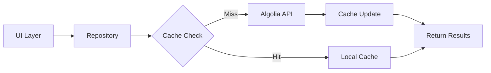

# 📂 Search Feature - Data Layer

> 검색 기능의 데이터 접근 및 처리를 담당하는 레이어

## 📋 개요

Data Layer는 검색 기능의 모든 데이터 소스와의 통신을 관리합니다. Algolia, Firestore, 로컬 캐시 등 다양한 데이터 소스를 추상화하여 상위 레이어에 일관된 인터페이스를 제공합니다.

## 🏗️ 구조

```
data/
├── datasources/              # 데이터 소스
│   ├── algolia_datasource.dart        # Algolia API 통신
│   ├── local_search_datasource.dart   # 로컬 검색 캐싱
│   └── firestore_search_datasource.dart # Firestore 검색
│
├── repositories/             # 리포지토리 구현
│   └── search_repository_impl.dart    # 검색 리포지토리 구현체
│
└── services/                 # 검색 서비스
    ├── algolia_manager.dart          # Algolia 매니저 (기존)
    ├── search_cache_service.dart     # 검색 결과 캐싱
    ├── search_history_service.dart   # 검색 기록 관리
    └── search_filter_service.dart    # 검색 필터 처리
```

## 📦 주요 컴포넌트

### 1. Data Sources

#### AlgoliaDataSource
**역할**: Algolia 검색 엔진과의 직접 통신 담당

**주요 메서드**:
- `searchPosts()`: 게시물 검색
  - 파라미터: query (String), filters (Map), limit (int?)
  - 반환: List<AlgoliaObjectSnapshot>
- `searchUsers()`: 사용자 검색
  - 파라미터: query (String), limit (int?)
  - 반환: List<AlgoliaObjectSnapshot>
- `searchChats()`: 채팅 검색
- `multiIndexSearch()`: 여러 인덱스 동시 검색

#### LocalSearchDataSource
**역할**: 로컬 캐싱 및 오프라인 검색 지원

**주요 메서드**:
- `getCachedResults()`: 캐시된 검색 결과 조회
  - 파라미터: query (String)
  - 반환: List<SearchResult>? (캐시 미스 시 null)
- `cacheResults()`: 검색 결과 캐싱
  - 파라미터: query (String), results (List<SearchResult>)
- `clearCache()`: 캐시 초기화
- `getCacheSize()`: 캐시 크기 확인

#### FirestoreSearchDataSource
**역할**: Firestore 데이터베이스 검색 및 기록 관리

**주요 메서드**:
- `searchDocuments()`: Firestore 문서 검색
  - 파라미터: collection (String), field (String), query (String)
  - 반환: List<DocumentSnapshot>
- `saveSearchHistory()`: 검색 기록 저장
- `getSearchHistoryStream()`: 실시간 검색 기록 스트림
- `deleteSearchHistory()`: 검색 기록 삭제

### 2. Repository Implementation

#### SearchRepositoryImpl
**역할**: SearchRepository 인터페이스의 구체적 구현체

**의존성**:
- AlgoliaDataSource: Algolia API 통신
- LocalSearchDataSource: 로컬 캐싱
- FirestoreSearchDataSource: Firestore 접근
- SearchCacheService: 캐시 관리

**구현 패턴**:
1. 캐시 우선 확인 (Cache-First)
2. 캐시 미스 시 Algolia 검색
3. 결과 캐싱 및 반환
4. 에러 핸들링 및 폴백

**주요 메서드**:
- `search()`: 통합 검색 실행
- `searchPosts()`: 게시물 검색
- `searchUsers()`: 사용자 검색
- `saveSearchHistory()`: 검색 기록 저장
- `getSearchHistoryStream()`: 실시간 기록 스트림

### 3. Services

#### AlgoliaManager (기존)
**역할**: Algolia 클라이언트 초기화 및 관리

**설정 정보**:
- Application ID: 0GAS0MPT9Z
- 인덱스: posts, users, chats
- API 키: 환경 변수로 관리

#### SearchCacheService
**역할**: 검색 결과 메모리 캐싱 및 TTL 관리

**캐시 정책**:
- TTL: 5분
- 최대 항목: 100개
- LRU 제거 정책

**주요 메서드**:
- `hasValidCache()`: 캐시 유효성 확인
- `cacheResult()`: 결과 캐싱
- `invalidateCache()`: 캐시 무효화
- `clearExpired()`: 만료 캐시 정리

#### SearchHistoryService
**역할**: 검색 기록 관리 및 분석

**기록 정책**:
- 최대 항목: 50개
- 중복 제거: 동일 검색어 최신 타임스탬프로 업데이트
- 정렬: 시간 역순

**주요 메서드**:
- `addToHistory()`: 검색 기록 추가
- `getRecentSearches()`: 최근 검색어 조회
- `getMostSearched()`: 자주 검색한 키워드
- `clearHistory()`: 전체 기록 삭제
- `deleteItem()`: 특정 기록 삭제

#### SearchFilterService
**역할**: 검색 필터 처리 및 Algolia 필터 변환

**필터 타입**:
- 카테고리 필터
- 날짜 범위 필터
- 타입 필터 (post, user, chat)
- 태그 필터
- 정렬 옵션

**주요 메서드**:
- `buildAlgoliaFilters()`: Algolia 형식으로 필터 변환
- `validateFilter()`: 필터 유효성 검증
- `mergeFilters()`: 여러 필터 병합
- `getDefaultFilter()`: 기본 필터 반환

## 🔗 의존성

### 외부 패키지
- `algolia: ^1.1.1` - Algolia 검색 엔진
- `cloud_firestore: ^5.5.0` - Firebase Firestore
- `hive: ^2.2.3` - 로컬 캐싱
- `injectable: ^2.1.0` - 의존성 주입

### 내부 의존성
- `/features/search/domain/models/` - 도메인 모델
- `/features/search/domain/repositories/` - 리포지토리 인터페이스

## 📊 데이터 흐름



## ⚙️ 설정

### Algolia 설정
**Application ID**: 0GAS0MPT9Z

**인덱스 매핑**:
- posts: 'posts_index'
- users: 'users_index'
- chats: 'chats_index'

**API 키 관리**: 환경 변수로 관리 (ALGOLIA_SEARCH_API_KEY)

### 캐시 설정
**TTL (Time To Live)**: 5분
**최대 항목 수**: 100개
**최대 메모리 크기**: 10MB
**제거 정책**: LRU (Least Recently Used)

## 🚨 에러 처리

### AlgoliaException
**역할**: Algolia API 오류 처리

**필드**:
- message: String - 오류 메시지
- statusCode: int? - HTTP 상태 코드

### CacheException
**역할**: 캐시 관련 오류 처리

**필드**:
- message: String - 오류 메시지

## 📈 성능 최적화

### 1. 배치 검색
- 여러 인덱스 동시 검색 시 `Future.wait` 사용
- 병렬 처리로 응답 시간 단축

### 2. 캐시 전략
- LRU 캐시로 메모리 효율성
- TTL 기반 자동 무효화
- 검색어 정규화로 캐시 히트율 향상

### 3. 인덱싱 최적화
- 필요한 필드만 인덱싱
- 검색 가능 속성 최소화
- 파셜 업데이트 활용

## ✅ 테스트

### 단위 테스트
**테스트 시나리오**:
- 캐시 히트 시 동작 검증
- 캐시 미스 시 Algolia 호출 검증
- 에러 처리 및 폴백 동작
- 필터 적용 정확성

### 통합 테스트
**테스트 시나리오**:
- 전체 검색 플로우 테스트
- 캐시 → Algolia → 저장 프로세스
- 여러 데이터 소스 통합
- 성능 및 시간 초과 테스트

## 📝 마이그레이션 노트

### Phase 1 완료 시
- [ ] AlgoliaManager 이동 확인
- [ ] serialization_util 이동 확인
- [ ] 기존 import 경로 업데이트

### Phase 2 완료 시
- [ ] DataSource 구현 완료
- [ ] Repository 구현 완료
- [ ] Service 구현 완료

---

*Data Layer는 검색 기능의 데이터 접근을 책임지는 핵심 레이어입니다.*