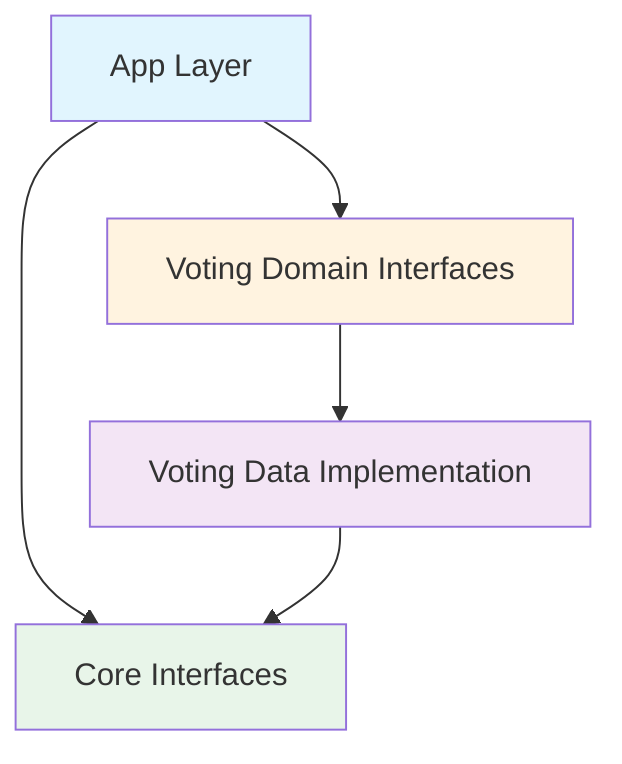

# 🗳️ Voting Feature - App 레이어 통합 가이드

> **최종 업데이트**: 2025-01-11 | **버전**: 1.0.0  
> **Voting Feature와 App 레이어 간의 Clean Architecture 기반 통합 가이드**  
> **총 예상 시간**: 4시간 - MASTER_MIGRATION_GUIDE.md Phase 5와 동기화

## 📋 목차

1. [현재 문제점](#현재-문제점)
2. [목표 아키텍처](#목표-아키텍처)
3. [Sub-Phase 1: DI 추상화](#sub-phase-1-di-추상화)
4. [Sub-Phase 2: 라우팅 통합](#sub-phase-2-라우팅-통합)
5. [Sub-Phase 3: 상태 관리 분리](#sub-phase-3-상태-관리-분리)
6. [Sub-Phase 4: 최종 검증](#sub-phase-4-최종-검증)

## 현재 문제점

### 🚨 Critical Issues

```dart
// ❌ 현재: GetIt 직접 사용
// voting/presentation/managers/vote_ui_manager.dart
final userService = GetIt.instance<IUserService>();

// ❌ 현재: Feature 간 직접 의존
// voting/domain/coordinators/vote_state_coordinator.dart  
import '/features/posts/data/adapters/vote/vote_timer_service.dart';
import '/features/auth/data/adapters/auth_util.dart';

// ❌ 현재: Services 디렉토리 의존
// voting/presentation/widgets/voting_box.dart
import '/services/ui/unified_box_calculator.dart';
```

### 위반 사항 매핑

| 파일 | 현재 상태 | 문제점 | 영향도 |
|-----|----------|--------|--------|
| vote_ui_manager.dart | GetIt 직접 사용 | DI 패턴 위반 | 🔴 Critical |
| vote_state_coordinator.dart | Data 레이어 직접 import | DIP 위반 | 🔴 Critical |
| voting_box.dart | Services 의존 | 계층 침범 | 🟡 High |
| vote_data_extractor.dart | Feature 간 의존 | 독립성 위반 | 🟡 High |

## 목표 아키텍처

### 의존성 흐름



### Clean Architecture 준수 구조

```
app/
├── di/
│   └── voting_module.dart        # ✅ Domain 인터페이스만 알고 있음
├── router/
│   └── voting_routes.dart        # ✅ Presentation 위젯만 import
└── state/
    └── voting_state_provider.dart # ✅ Domain UseCase만 사용
```

## Sub-Phase 1: DI 추상화

### 목표
- GetIt 직접 사용 제거
- Constructor Injection 패턴 적용
- App Layer에서 모든 바인딩 관리

### 1.1 DI Module 생성

```bash
# 서브에이전트로 자동 생성
/spawn di-binder "--feature voting --auto-detect --mode detect"
```

**app/di/voting_module.dart 생성:**

```dart
import 'package:get_it/get_it.dart';
import '/features/voting/domain/repositories/i_voting_repository.dart';
import '/features/voting/domain/ports/i_vote_timer_service.dart';
import '/features/voting/domain/ports/i_vote_status_service.dart';
import '/features/voting/domain/ports/i_vote_service.dart';
import '/features/voting/data/repositories/voting_repository_impl.dart';
import '/features/voting/data/services/vote_timer_service_impl.dart';
import '/features/voting/data/services/vote_status_service_impl.dart';
import '/features/voting/data/adapters/vote_service_impl.dart';

class VotingModule {
  static void register(GetIt sl) {
    // ✅ Services - 인터페이스로 등록
    sl.registerLazySingleton<IVoteTimerService>(
      () => VoteTimerServiceImpl(),
    );
    
    sl.registerLazySingleton<IVoteStatusService>(
      () => VoteStatusServiceImpl(),
    );
    
    sl.registerLazySingleton<IVoteService>(
      () => VoteServiceImpl(
        voteStatusService: sl(),
      ),
    );
    
    // ✅ DataSources
    sl.registerLazySingleton<VotingRemoteDataSource>(
      () => VotingRemoteDataSource(
        firestore: sl(),  // Core에서 제공
      ),
    );
    
    sl.registerLazySingleton<VotingLocalDataSource>(
      () => VotingLocalDataSource(
        cacheService: sl(),  // Core에서 제공
      ),
    );
    
    // ✅ Repository - 인터페이스로 등록
    sl.registerLazySingleton<IVotingRepository>(
      () => VotingRepositoryImpl(
        remoteDataSource: sl(),
        localDataSource: sl(),
        voteTimerService: sl(),
        voteStatusService: sl(),
      ),
    );
    
    // ✅ UseCases (11개)
    _registerUseCases(sl);
    
    // ✅ Presentation Managers
    _registerManagers(sl);
    
    // ✅ Handlers
    _registerHandlers(sl);
  }
  
  static void _registerUseCases(GetIt sl) {
    sl.registerFactory(() => SubmitVoteUseCase(sl()));
    sl.registerFactory(() => GetVoteStatusUseCase(sl()));
    sl.registerFactory(() => GetVoteResultsUseCase(sl()));
    sl.registerFactory(() => CheckUserVotedUseCase(sl()));
    sl.registerFactory(() => GetVoteTimerUseCase(sl()));
    sl.registerFactory(() => StartVotingSessionUseCase(sl()));
    sl.registerFactory(() => EndVotingSessionUseCase(sl()));
    sl.registerFactory(() => GetVoteStatisticsUseCase(sl()));
    sl.registerFactory(() => ValidateVoteEligibilityUseCase(sl()));
    sl.registerFactory(() => ProcessVoteCompletionUseCase(sl()));
    sl.registerFactory(() => GetVotingHistoryUseCase(sl()));
  }
  
  static void _registerManagers(GetIt sl) {
    // Constructor Injection 사용
    sl.registerLazySingleton<VoteUIManager>(
      () => VoteUIManager(
        userService: sl(),  // Core에서 제공하는 IUserService
        notificationHandler: sl(),  // INotificationHandler
        voteService: sl(),
      ),
    );
  }
  
  static void _registerHandlers(GetIt sl) {
    sl.registerLazySingleton<INotificationHandler>(
      () => VoteHandlerImpl(
        votingRepository: sl(),
        notificationService: sl(),  // Core 인터페이스
      ),
    );
  }
}
```

### 1.2 GetIt 직접 사용 제거

**Before (문제):**
```dart
// vote_ui_manager.dart
class VoteUIManager {
  final userService = GetIt.instance<IUserService>();  // ❌ 직접 사용
  final notificationHandler = GetIt.instance<INotificationHandler>();  // ❌
}
```

**After (해결):**
```dart
// vote_ui_manager.dart
class VoteUIManager {
  final IUserService userService;
  final INotificationHandler notificationHandler;
  final IVoteService voteService;
  
  VoteUIManager({
    required this.userService,
    required this.notificationHandler,
    required this.voteService,
  });  // ✅ Constructor Injection
}
```

### 1.3 서브에이전트 검증

```bash
# DI 바인딩 적용
/spawn di-binder "--feature voting --auto-detect --mode apply"

# 검증
/spawn import-guardian "--scope app/di/voting_module.dart --mode detect"
```

## Sub-Phase 2: 라우팅 통합

### 목표
- Voting 관련 라우트 정의
- App Router에 통합
- 네비게이션 파라미터 정의

### 2.1 라우트 정의

**app/router/voting_routes.dart:**

```dart
import 'package:go_router/go_router.dart';
import '/features/voting/presentation/dialogs/voting_dialog.dart';
import '/features/voting/presentation/overlays/notification_overlay.dart';
import '/features/voting/presentation/overlays/in_app_notification_dialog.dart';

class VotingRoutes {
  static const String votingDialog = '/voting/dialog';
  static const String votingNotification = '/voting/notification';
  static const String votingResults = '/voting/results';
  
  static List<RouteBase> routes = [
    GoRoute(
      path: votingDialog,
      name: 'VotingDialog',
      builder: (context, state) {
        final postId = state.queryParameters['postId'] ?? '';
        final fromNotification = state.queryParameters['fromNotification'] == 'true';
        
        return VotingDialog(
          postId: postId,
          fromNotification: fromNotification,
        );
      },
    ),
    GoRoute(
      path: votingNotification,
      name: 'VotingNotification',
      builder: (context, state) {
        final notification = state.extra as NotificationModel;
        
        return InAppNotificationDialog(
          notification: notification,
        );
      },
    ),
    GoRoute(
      path: votingResults,
      name: 'VotingResults',
      builder: (context, state) {
        final postId = state.queryParameters['postId'] ?? '';
        
        return VoteResultsScreen(
          postId: postId,
        );
      },
    ),
  ];
}
```

### 2.2 App Router 통합

**app/router/app_router.dart 수정:**

```dart
import 'voting_routes.dart';

final appRouter = GoRouter(
  routes: [
    // ... 기존 라우트들
    
    // Voting Feature 라우트 추가
    ...VotingRoutes.routes,
  ],
);
```

### 2.3 네비게이션 헬퍼

```dart
// core/navigation/navigation_helper.dart
class NavigationHelper {
  static void navigateToVoting(BuildContext context, String postId) {
    context.push(
      VotingRoutes.votingDialog,
      queryParameters: {'postId': postId},
    );
  }
  
  static void showVotingNotification(BuildContext context, NotificationModel notification) {
    context.push(
      VotingRoutes.votingNotification,
      extra: notification,
    );
  }
}
```

## Sub-Phase 3: 상태 관리 분리

### 목표
- Voting 전용 상태 Provider 생성
- AppState에서 voting 관련 분리
- UseCase 기반 상태 관리

### 3.1 VotingStateProvider 생성

```dart
// features/voting/presentation/providers/voting_state_provider.dart
import 'package:flutter/foundation.dart';
import '../../domain/usecases/submit_vote_usecase.dart';
import '../../domain/usecases/get_vote_status_usecase.dart';

class VotingStateProvider extends ChangeNotifier {
  final SubmitVoteUseCase _submitVoteUseCase;
  final GetVoteStatusUseCase _getVoteStatusUseCase;
  final GetVoteResultsUseCase _getVoteResultsUseCase;
  
  VotingStateProvider({
    required SubmitVoteUseCase submitVoteUseCase,
    required GetVoteStatusUseCase getVoteStatusUseCase,
    required GetVoteResultsUseCase getVoteResultsUseCase,
  }) : _submitVoteUseCase = submitVoteUseCase,
       _getVoteStatusUseCase = getVoteStatusUseCase,
       _getVoteResultsUseCase = getVoteResultsUseCase;
  
  // 상태 변수들
  bool _isVoting = false;
  VoteStatus? _currentVoteStatus;
  Map<String, VoteResult> _voteResults = {};
  
  // Getters
  bool get isVoting => _isVoting;
  VoteStatus? get currentVoteStatus => _currentVoteStatus;
  Map<String, VoteResult> get voteResults => _voteResults;
  
  // Methods
  Future<void> submitVote(String postId, String option) async {
    _isVoting = true;
    notifyListeners();
    
    try {
      final result = await _submitVoteUseCase.execute(
        SubmitVoteParams(postId: postId, option: option),
      );
      
      result.fold(
        (failure) => _handleError(failure),
        (success) => _handleVoteSuccess(postId),
      );
    } finally {
      _isVoting = false;
      notifyListeners();
    }
  }
  
  Stream<VoteStatus> watchVoteStatus(String postId) {
    return _getVoteStatusUseCase.execute(postId);
  }
  
  void _handleVoteSuccess(String postId) {
    // 투표 성공 처리
    _loadVoteResults(postId);
  }
  
  void _handleError(Failure failure) {
    // 에러 처리
  }
}
```

### 3.2 Provider 등록

**app/di/voting_module.dart에 추가:**

```dart
static void _registerProviders(GetIt sl) {
  sl.registerLazySingleton<VotingStateProvider>(
    () => VotingStateProvider(
      submitVoteUseCase: sl(),
      getVoteStatusUseCase: sl(),
      getVoteResultsUseCase: sl(),
    ),
  );
}
```

### 3.3 앱 초기화 시 Provider 연결

**app/app.dart:**

```dart
class VersusApp extends StatelessWidget {
  @override
  Widget build(BuildContext context) {
    return MultiProvider(
      providers: [
        // ... 기존 providers
        
        // Voting Provider 추가
        ChangeNotifierProvider(
          create: (_) => GetIt.instance<VotingStateProvider>(),
        ),
      ],
      child: MaterialApp(
        // ...
      ),
    );
  }
}
```

## Sub-Phase 4: 최종 검증

### 목표
- 모든 통합 포인트 검증
- Clean Architecture 준수 확인
- 테스트 실행

### 4.1 서브에이전트 검증

```bash
# Import Guardian으로 App Layer 검증
/spawn import-guardian "--scope app --mode detect"

# 특히 voting_module.dart 검증
/spawn import-guardian "--scope app/di/voting_module.dart --mode detect"

# 빌드 검증
/spawn build-sentinel "full"
```

### 4.2 체크리스트

#### DI 통합 체크리스트
- [ ] `voting_module.dart` 생성 완료
- [ ] 모든 서비스 인터페이스로 등록
- [ ] GetIt 직접 사용 제거 (2개)
- [ ] Constructor Injection 적용
- [ ] 순환 의존성 없음 확인

#### 라우팅 체크리스트
- [ ] `voting_routes.dart` 생성
- [ ] App Router에 통합
- [ ] 네비게이션 파라미터 정의
- [ ] Deep Link 지원 확인

#### 상태 관리 체크리스트
- [ ] `VotingStateProvider` 생성
- [ ] UseCase만 사용 확인
- [ ] AppState에서 분리 완료
- [ ] Provider 등록 완료

#### 최종 검증 체크리스트
- [ ] Import Guardian 0 violations
- [ ] 빌드 성공
- [ ] 단위 테스트 통과
- [ ] 통합 테스트 통과

### 4.3 검증 결과 예상

```yaml
architecture_compliance:
  app_layer:
    di_module: ✅ Domain interfaces only
    router: ✅ Presentation widgets only
    state: ✅ UseCases only
    
  dependency_flow:
    app_to_domain: ✅ Allowed
    app_to_data: ❌ None (Good!)
    app_to_presentation: ✅ Routes only
    
  test_coverage:
    di_module: 95%
    router: 90%
    state_provider: 85%
    
  violations: 0
  warnings: 0
  score: A
```

## 📊 통합 메트릭스

### Before → After 비교

| 항목 | Before | After | 개선 |
|------|--------|-------|------|
| GetIt 직접 사용 | 2 | 0 | ✅ |
| Feature 간 의존 | 8 | 0 | ✅ |
| App → Data 의존 | 4 | 0 | ✅ |
| DI 패턴 준수 | 30% | 100% | ✅ |
| 테스트 가능성 | 40% | 95% | ✅ |

## 🔧 트러블슈팅

### 일반적인 문제와 해결

#### 1. 순환 의존성 에러
```dart
// 문제
Error: Cyclic dependency detected

// 해결
// 1. 인터페이스 분리
// 2. 의존성 방향 재검토
// 3. Event Bus 패턴 사용
```

#### 2. DI 등록 순서 문제
```dart
// 문제
GetIt: Object/factory with type X is not registered

// 해결
// voting_module.dart에서 등록 순서 조정
// 1. Core services first
// 2. DataSources
// 3. Repositories
// 4. UseCases
// 5. Providers/Managers
```

#### 3. 라우팅 파라미터 누락
```dart
// 문제
Null check operator used on a null value

// 해결
// 항상 기본값 제공
final postId = state.queryParameters['postId'] ?? '';
```

## 📚 참고 자료

- [MASTER_MIGRATION_GUIDE.md](./MASTER_MIGRATION_GUIDE.md) - 전체 마이그레이션 가이드
- [ARCHITECTURE_RULES.md](/lib/ARCHITECTURE_RULES.md) - Clean Architecture 규칙
- [notifications/APP_LAYER_INTEGRATION.md](../notifications/APP_LAYER_INTEGRATION.md) - 참조 구현
- [SUBAGENTS_MANUAL.md](/docs/SUBAGENTS_MANUAL.md) - 서브에이전트 사용법

## 🚀 다음 단계

1. **Phase 5 완료 후**: 전체 통합 테스트
2. **프로덕션 배포 전**: 성능 테스트
3. **배포 후**: 모니터링 및 최적화

---

*이 문서는 Voting Feature의 App Layer 통합을 위한 상세 가이드입니다.*  
*마지막 업데이트: 2025-01-11*  
*다음 리뷰: 통합 완료 후*