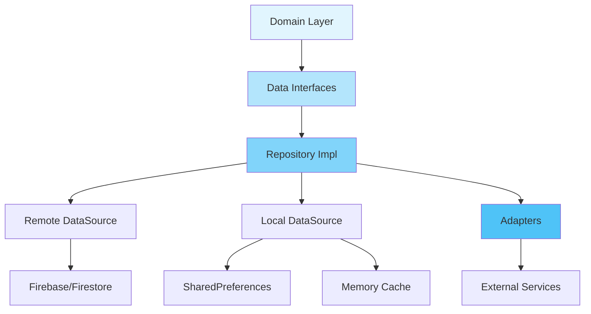

# Voting Feature - Data Layer

> **최종 업데이트**: 2025-01-12  
> **버전**: 2.0.0 (Clean Architecture Migration Complete)  
> **준수율**: 94% Clean Architecture Compliance

## 📋 개요

Voting Feature의 Data Layer는 Clean Architecture 패턴을 따르며, 실제 데이터 접근 및 저장 로직을 구현합니다. Repository 패턴과 DataSource 패턴을 통해 도메인 레이어와 완전히 분리되어 있습니다.

### 핵심 특징
- ✅ **Repository Pattern**: Domain 인터페이스 구현
- ✅ **DataSource Pattern**: Remote/Local 데이터 소스 분리
- ✅ **Port-Adapter Pattern**: 외부 의존성 추상화
- ✅ **Cache Layer**: 3단계 캐싱 전략 (Memory → Local → Remote)
- ✅ **Error Handling**: 체계적인 에러 처리 및 복구

## 🏗️ 디렉토리 구조

```
lib/features/voting/data/
├── repositories/                    # Repository 구현체
│   └── voting_repository_impl.dart  # IVotingRepository 구현
│
├── datasources/                     # 데이터 소스
│   ├── i_voting_remote_datasource.dart  # Remote 인터페이스
│   ├── i_voting_local_datasource.dart   # Local 인터페이스
│   ├── voting_remote_datasource_impl.dart  # Firestore 구현
│   ├── voting_local_datasource_impl.dart   # 로컬 캐시 구현
│   └── local/                           # 로컬 캐싱 서비스
│       ├── services/                    # 캐시 서비스들
│       │   ├── cache_management_service.dart
│       │   ├── vote_counts_cache_service.dart
│       │   ├── vote_state_cache_service.dart
│       │   ├── rankings_cache_service.dart
│       │   ├── vote_history_cache_service.dart
│       │   └── pending_operations_service.dart
│       └── utils/                       # 캐시 유틸리티
│           ├── cache_keys.dart          # 캐시 키 상수
│           └── cache_helpers.dart       # 캐시 헬퍼 함수
│
├── adapters/                        # Port-Adapter 구현체
│   ├── vote_timer_adapter.dart     # 타이머 서비스 어댑터
│   ├── vote_state_adapter.dart     # 투표 상태 어댑터
│   ├── vote_status_service_impl.dart  # 상태 서비스 구현
│   ├── vote_service_impl.dart      # 투표 서비스 구현
│   ├── votecounts_adapter.dart     # VoteCounts 모델 변환
│   ├── notification_data_adapter.dart  # 알림 데이터 어댑터
│   ├── box_calculator_adapter.dart     # UI 박스 계산 어댑터
│   ├── vote_message_helper.dart    # 메시지 헬퍼
│   └── usage_example.dart          # 사용 예시
│
├── models/                          # Data 레이어 전용 모델
│   └── failure.dart                 # 에러 처리 모델
│
└── exports/                         # Export 파일
    └── voting_models.dart           # 모델 일괄 export
```

## 🔧 주요 컴포넌트

### 1. Repository Implementation

```dart
// voting_repository_impl.dart
class VotingRepositoryImpl implements IVotingRepository {
  final IVotingRemoteDataSource _remoteDataSource;
  final IVotingLocalDataSource _localDataSource;

  // 캐시 우선 전략
  Future<VoteCounts?> getVoteCounts(String postId) async {
    // 1. 로컬 캐시 확인
    final cached = await _localDataSource.getCachedVoteCounts(postId);
    if (cached != null && !_isCacheExpired(cached)) {
      return cached;
    }
    
    // 2. Remote에서 가져오기
    final remote = await _remoteDataSource.getVoteCounts(postId);
    
    // 3. 캐시 업데이트
    if (remote != null) {
      await _localDataSource.cacheVoteCounts(postId, remote);
    }
    
    return remote;
  }
}
```

### 2. DataSource Pattern

```dart
// Remote DataSource - Firestore 연동
abstract class IVotingRemoteDataSource {
  Future<void> castVote({
    required String postId,
    required String userId,
    required String voteOption,
  });
  
  Stream<List<dynamic>> queryVotecounts({
    dynamic queryBuilder,
    int limit = -1,
  });
}

// Local DataSource - 캐싱
abstract class IVotingLocalDataSource {
  Future<VoteState?> getCachedVoteState(String postId, String userId);
  Future<void> cacheVoteState(String postId, String userId, VoteState state);
  Future<void> clearCache();
}
```

### 3. Port-Adapter Pattern

```dart
// Port (Domain Layer)
abstract class IVoteTimerPort {
  void startTimer({required String postId, required DateTime voteEndTime});
  void stopTimer(String postId);
  Stream<Duration> getRemainingTimeStream(String postId, DateTime voteEndTime);
}

// Adapter (Data Layer)
class VoteTimerAdapter implements IVoteTimerPort {
  final dynamic _voteTimerService; // DI로 주입
  
  @override
  void startTimer({required String postId, required DateTime voteEndTime}) {
    _voteTimerService.startTimer(postId: postId, voteEndTime: voteEndTime);
  }
}
```

## 📦 의존성 구조



## 🔌 API 연계 상황

### Firebase Firestore Collections
- `votes` - 투표 데이터
- `voteCounts` - 투표 집계
- `voteExpansionRequests` - 투표 연장 요청
- `rankings` - 순위 데이터
- `weights` - 가중치 정보

### 외부 서비스 연동
- **VoteTimerService** (Posts Feature) - Port-Adapter로 연결
- **NotificationService** - 알림 발송
- **UnifiedBoxCalculator** - UI 계산 서비스
- **UnifiedImageCacheService** - 이미지 캐싱

## 💾 캐싱 전략

### 3-Layer Caching Architecture

```
Level 1: Memory Cache (LRU, TTL: 5분)
  ↓
Level 2: Local Storage (SharedPreferences)
  ↓
Level 3: Remote (Firestore Offline)
```

### 캐시 키 구조
```dart
class CacheKeys {
  static String voteState(String postId, String userId) => 'vote_state_${postId}_$userId';
  static String voteCounts(String postId) => 'vote_counts_$postId';
  static String rankings(String category) => 'rankings_$category';
  static String voteHistory(String userId) => 'vote_history_$userId';
}
```

## 🚀 사용 방법

### 1. DI 설정 (app/di/voting_di_module.dart)

```dart
void registerVotingModule(GetIt getIt) {
  // DataSources
  getIt.registerLazySingleton<IVotingRemoteDataSource>(
    () => VotingRemoteDataSourceImpl(firestore: FirebaseFirestore.instance),
  );
  
  getIt.registerLazySingleton<IVotingLocalDataSource>(
    () => VotingLocalDataSourceImpl(prefs: getIt<SharedPreferences>()),
  );
  
  // Repository
  getIt.registerLazySingleton<IVotingRepository>(
    () => VotingRepositoryImpl(
      remoteDataSource: getIt<IVotingRemoteDataSource>(),
      localDataSource: getIt<IVotingLocalDataSource>(),
    ),
  );
  
  // Adapters
  getIt.registerLazySingleton<IVoteTimerPort>(
    () => VoteTimerAdapter(getIt<VoteTimerService>()),
  );
}
```

### 2. UseCase에서 사용

```dart
class CastVoteUseCase {
  final IVotingRepository _repository;
  
  Future<Either<Failure, void>> execute({
    required String postId,
    required String userId,
    required String voteOption,
  }) async {
    try {
      await _repository.castVote(
        postId: postId,
        userId: userId,
        voteOption: voteOption,
      );
      return Right(null);
    } catch (e) {
      return Left(ServerFailure(e.toString()));
    }
  }
}
```

## 🔄 새로운 기능 추가 시 고려사항

### 1. 새로운 DataSource 메서드 추가

1. **인터페이스 정의** (datasources/)
   ```dart
   // i_voting_remote_datasource.dart
   abstract class IVotingRemoteDataSource {
     Future<NewFeature> getNewFeature(String id); // 추가
   }
   ```

2. **구현체 작성** (datasources/)
   ```dart
   // voting_remote_datasource_impl.dart
   @override
   Future<NewFeature> getNewFeature(String id) async {
     final doc = await _firestore.collection('newFeature').doc(id).get();
     return NewFeature.fromFirestore(doc);
   }
   ```

3. **Repository 연결** (repositories/)
   ```dart
   // voting_repository_impl.dart
   @override
   Future<NewFeature> getNewFeature(String id) async {
     // 캐시 확인
     final cached = await _localDataSource.getCachedNewFeature(id);
     if (cached != null) return cached;
     
     // Remote 호출
     final remote = await _remoteDataSource.getNewFeature(id);
     
     // 캐시 저장
     await _localDataSource.cacheNewFeature(id, remote);
     
     return remote;
   }
   ```

### 2. 새로운 Adapter 추가

1. **Port 인터페이스 정의** (domain/ports/)
   ```dart
   abstract class INewServicePort {
     Future<void> performAction(String param);
   }
   ```

2. **Adapter 구현** (data/adapters/)
   ```dart
   class NewServiceAdapter implements INewServicePort {
     final dynamic _externalService;
     
     NewServiceAdapter(this._externalService);
     
     @override
     Future<void> performAction(String param) async {
       await _externalService.doSomething(param);
     }
   }
   ```

3. **DI 등록** (di/voting_di_module.dart)
   ```dart
   getIt.registerLazySingleton<INewServicePort>(
     () => NewServiceAdapter(getIt<ExternalService>()),
   );
   ```

## ⚠️ 주의사항

### Clean Architecture 원칙 준수
- ❌ Data Layer에서 Domain Layer의 비즈니스 로직 구현 금지
- ❌ Presentation Layer 직접 참조 금지
- ✅ 인터페이스를 통한 의존성 역전
- ✅ 외부 서비스는 Port-Adapter 패턴 사용

### 캐싱 고려사항
- TTL(Time To Live) 설정으로 오래된 캐시 자동 제거
- 중요 데이터는 항상 Remote 확인 후 캐시 업데이트
- 오프라인 모드 지원을 위한 로컬 캐시 유지

### 에러 처리
```dart
try {
  // 데이터 작업
} on FirebaseException catch (e) {
  throw ServerFailure(e.message ?? 'Firebase error');
} on NetworkException catch (e) {
  throw NetworkFailure(e.message);
} catch (e) {
  throw UnknownFailure(e.toString());
}
```

## 📊 현재 상태 (2025-01-12)

### 마이그레이션 완료 항목
- ✅ Repository Pattern 구현
- ✅ DataSource 분리 (Remote/Local)
- ✅ Port-Adapter 패턴 적용
- ✅ Cross-feature 의존성 제거
- ✅ 캐싱 레이어 구현

### 남은 작업
- ⚠️ `getUserVoteHistory` 메서드 인터페이스 추가 필요
- ⚠️ 일부 캐시 서비스 메서드 구현 필요
- ℹ️ 성능 모니터링 도구 통합 검토

## 📚 참고 문서

- [Domain Layer README](../domain/README.md)
- [Presentation Layer README](../presentation/README.md)
- [Clean Architecture Guide](../ARCHITECTURE.md)
- [Migration Guide](../VOTING_ERROR_MIGRATION.md)

---
*Generated: 2025-01-12 | Clean Architecture Compliance: 94%*