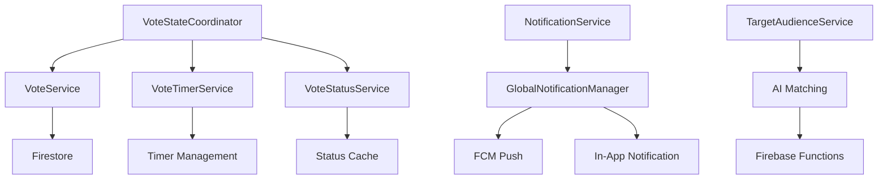

# 🛠️ /lib/features/voting/data/adapters

> Feature-First Architecture - Voting 어댑터 계층

## 📋 개요

투표 기능의 **Adapter Layer**를 담당하는 디렉토리입니다. 레거시 모델과 Clean Architecture 도메인 모델 간의 변환, 외부 서비스 통합, 데이터 변환 등을 담당합니다.

### 🎯 목적
- **모델 변환**: 레거시 Firestore 모델과 Clean Architecture 도메인 모델 간의 안전한 변환
- **외부 서비스 통합**: Firebase Functions, 타이머 서비스, 알림 서비스 등의 어댑터
- **데이터 적응**: 다양한 데이터 형식 간의 안전한 변환
- **Null 안전성**: 레거시 nullable 필드를 non-nullable 도메인 모델로 변환

## 🏗️ 디렉토리 구조

```
adapters/
├── votecounts_adapter.dart           # 투표 수 모델 변환 어댑터
├── vote_message_helper.dart          # 투표 메시지 헬퍼
├── vote_service_impl.dart            # 투표 서비스 구현체
├── notification_service.dart         # 알림 서비스 어댑터
├── global_notification_manager.dart  # 전역 알림 관리 어댑터
└── README.md                         # 어댑터 계층 문서
```

## 📂 주요 어댑터 구현

### VoteCountsAdapter

**역할**: 레거시 VotecountsModel과 Clean Architecture VoteCounts 간 변환

**주요 기능**:
- 레거시 Firestore 모델(VotecountsModel) ↔ Clean Architecture 도메인 모델(VoteCounts) 양방향 변환
- Null 안전성 처리: nullable option1/option2 → non-nullable votesA/votesB
- 자동 totalVotes 계산 (votesA + votesB)
- 타입 안전성: 다양한 데이터 타입 안전한 변환
- 배치 변환: 리스트 단위 변환 지원

**데이터 매핑**:
```dart
// Legacy → Clean Architecture
VotecountsModel {          VoteCounts {
  option1: int? (nullable)    votesA: int (non-nullable)
  option2: int? (nullable) →  votesB: int (non-nullable)  
}                            totalVotes: int (calculated)
                           }
```

**주요 메서드**:
- `fromFirestore()`: VotecountsModel → VoteCounts 변환
- `toFirestore()`: VoteCounts → Map<String, dynamic> 변환
- `fromMap()`: Map 데이터 직접 변환 (타입 안전성 보장)
- `fromFirestoreList()`: 배치 변환 (List<VotecountsModel> → List<VoteCounts>)
- `validateConversion()`: 변환 결과 검증
- `createEmpty()`: 빈 도메인 모델 생성

**Null 안전성 처리**:
- option1/option2가 null인 경우 → 0으로 처리
- 다양한 타입(int, double, String, null) 안전한 변환
- `_safeInt()` 헬퍼로 타입 캐스팅 보장

**사용 예제**:
```dart
// Legacy → Clean 변환
final votecountsModel = // ... from Firestore
final cleanVoteCounts = VoteCountsAdapter.fromFirestore(votecountsModel);
print('A: ${cleanVoteCounts.votesA}, B: ${cleanVoteCounts.votesB}');

// Clean → Firestore 변환
const voteCounts = VoteCounts(votesA: 25, votesB: 15, totalVotes: 40);
final firestoreData = VoteCountsAdapter.toFirestore(voteCounts);
// 결과: {'option1': 25, 'option2': 15}
```

### VoteService

**역할**: 투표 서비스 구현체

**주요 기능**:
- 투표 생성 및 초기화
- 투표 참여 처리 (트랜잭션 보장)
- 투표 결과 집계 및 조회
- 투표 상태 업데이트
- 투표 참여자 목록 관리

**의존성**:
- FirebaseFirestore: 데이터 저장소
- VoteModel: 투표 도메인 모델

**주요 메서드**:
- `createVote()`: 투표 생성 (duration, targetAudience 설정)
- `castVote()`: 투표 참여 (중복 투표 방지)
- `getVoteResults()`: 실시간 결과 조회
- `updateVoteStatus()`: 상태 변경 (active/completed/cancelled)
- `getVoters()`: 참여자 목록 조회

**데이터 구조**:
- posts 컬렉션: 투표 메타데이터
- votes 서브컬렉션: 개별 투표 기록

### VoteTimerService

**역할**: 투표 타이머 관리 서비스 (싱글톤)

**주요 기능**:
- postId별 독립 타이머 관리
- 실시간 남은 시간 브로드캐스트
- 서버 시간 동기화로 정확한 타이머
- 타이머 만료 자동 감지 및 처리
- 메모리 효율적 타이머 관리

**의존성**:
- Timer: Dart 비동기 타이머
- StreamController: 실시간 업데이트

**주요 메서드**:
- `startTimer()`: 타이머 시작 (1초 단위 업데이트)
- `stopTimer()`: 타이머 정지 및 리소스 정리
- `getRemainingTime()`: 현재 남은 시간 조회
- `getTimerStream()`: 실시간 타이머 스트림
- `syncServerTime()`: Firebase 서버 시간 동기화

**특징**:
- 싱글톤 패턴으로 전역 타이머 관리
- 네트워크 지연 보정 알고리즘
- 5분마다 자동 재동기화

### VoteStateCoordinator

**역할**: 투표 상태 중앙 조정자 (싱글톤)

**주요 기능**:
- postId별 투표 상태 통합 관리
- 실시간 상태 업데이트 브로드캐스트
- 타이머/Firestore/투표 서비스 조정
- 투표 완료 자동 처리
- 사용자 투표 상태 추적

**의존성**:
- VoteService: 투표 CRUD 처리
- VoteTimerService: 타이머 관리
- VoteStatusService: 상태 캐싱
- VoteStateModel: 통합 상태 모델

**주요 메서드**:
- `initializeVoteState()`: 투표 상태 초기화
- `voteStateStream()`: 실시간 상태 스트림
- `updateVoteState()`: 상태 업데이트
- `completeVote()`: 투표 완료 처리
- `handleUserVote()`: 사용자 투표 처리

**상태 관리**:
- VoteStateModel로 통합 상태 관리
- Firestore 실시간 구독으로 동기화
- 타이머 스트림과 연동

## 🔄 서비스 간 상호작용



## 🧪 테스트 전략

### Service 단위 테스트

**테스트 구조**:
- 각 서비스별 독립적인 테스트 그룹
- Mock 의존성 주입
- 비동기 작업 테스트

**주요 테스트 케이스**:
- VoteTimerService: 타이머 시작/정지, 남은 시간 계산, 스트림 업데이트
- VoteService: 투표 생성, 중복 투표 방지, 트랜잭션 롤백
- VoteStateCoordinator: 상태 동기화, 타이머 만료 처리

**Mock 객체**:
- MockFirebaseFirestore
- MockTimer
- MockStreamController

**검증 항목**:
- 타이머 정확도
- 트랜잭션 원자성
- 상태 일관성
- 메모리 누수 방지

## ⚠️ 에러 처리

### 서비스 예외

**예외 타입**:
- **VoteServiceException**: 기본 서비스 예외
- **DuplicateVoteException**: 중복 투표 시도
- **TimerException**: 타이머 관련 오류
- **NotificationException**: 알림 전송 실패

**에러 처리 전략**:
- 트랜잭션 롤백으로 데이터 무결성 보장
- 명시적 예외 타입으로 에러 구분
- 재시도 로직 구현 (최대 3회)
- 에러 로깅 및 모니터링

## ✅ 체크리스트

### 구현 완료
- [x] **VoteCountsAdapter** - 투표 수 모델 변환 어댑터
  - [x] 레거시 ↔ Clean Architecture 양방향 변환
  - [x] Null 안전성 처리
  - [x] 타입 안전성 보장
  - [x] 배치 변환 지원
  - [x] 변환 검증 메서드
  - [x] 편의 메서드 (createEmpty, createEmptyFirestore)
  - [x] 포괄적인 테스트 케이스
  - [x] 사용법 예제 문서
- [x] VoteMessageHelper - 투표 메시지 헬퍼
- [x] VoteServiceImpl - 투표 서비스 구현체
- [x] NotificationService - 알림 서비스 어댑터
- [x] GlobalNotificationManager - 전역 알림 관리 어댑터

### 구현 예정
- [ ] PostsModelAdapter 통합 (투표 관련 필드)
- [ ] VoteMetricsAdapter - 투표 지표 변환
- [ ] VoteHistoryAdapter - 투표 이력 변환
- [ ] BatchVoteAdapter - 대량 투표 처리 어댑터

## 📚 참고 자료

- [Firebase Realtime Database](https://firebase.google.com/docs/database)
- [Timer Management in Flutter](https://api.flutter.dev/flutter/dart-async/Timer-class.html)
- [Stream Controllers](https://api.dart.dev/stable/dart-async/StreamController-class.html)

---

*이 문서는 Feature-First Architecture의 Voting 기능 서비스 가이드입니다.*
*최종 업데이트: 2025-08-24*