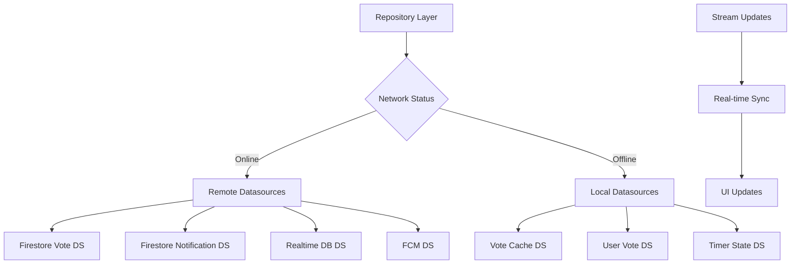

# 📡 /lib/features/voting/data/datasources

> Feature-First Architecture - Voting 데이터소스 계층

## 📋 개요

투표 기능의 **Data Sources Layer**를 담당하는 디렉토리입니다. Firebase Firestore, Realtime Database, 로컬 캐시 등 데이터 소스와의 직접적인 통신을 관리합니다.

### 🎯 목적
- **데이터 소스 분리**: 원격/로컬 데이터 접근 로직 분리
- **실시간 동기화**: Firebase Realtime 스트림 관리
- **캐싱 전략**: 투표 상태 로컬 캐싱
- **오프라인 지원**: 네트워크 없이도 기본 기능 제공

## 🏗️ 디렉토리 구조

```
datasources/
├── remote/                                    # 원격 데이터소스
│   ├── firestore_vote_datasource.dart        # Firestore 투표 데이터
│   ├── firestore_notification_datasource.dart # 알림 데이터
│   ├── realtime_vote_datasource.dart         # Realtime DB 투표 상태
│   ├── fcm_datasource.dart                   # FCM 푸시 알림
│   └── functions_datasource.dart             # Cloud Functions 호출
│
└── local/                                     # 로컬 데이터소스
    ├── vote_cache_datasource.dart            # 투표 로컬 캐시
    ├── notification_cache_datasource.dart    # 알림 로컬 캐시
    ├── vote_timer_datasource.dart            # 타이머 상태 저장
    └── user_vote_datasource.dart             # 사용자 투표 기록
```

## 📂 Remote 데이터소스 사양

### FirestoreVoteDatasource
- **역할**: Firestore 투표 데이터 관리
- **주요 기능**:
  - 투표 생성 및 초기화
  - 투표 데이터 조회 (단일/목록)
  - 실시간 투표 스트림
  - 사용자 투표 기록 및 확인
  - 투표 집계 증가 (votesA, votesB, totalVotes)
  - 투표 상태 업데이트 (active, completed, expired)
  - 투표 확장 요청 생성
  - 활성 투표 목록 조회
- **컬렉션**: `posts`, `votes` (subcollection), `voteExpansionRequests`
- **에러 처리**: VoteDataSourceException

### FirestoreNotificationDatasource
- **역할**: 알림 데이터 관리
- **주요 기능**:
  - 알림 생성
  - 알림 목록 조회
  - 알림 읽음 처리
  - 실시간 알림 스트림
  - FCM 토큰 관리
- **컬렉션**: `notifications`, `users`
- **에러 처리**: NotificationDataSourceException

### RealtimeVoteDatasource (예정)
- **역할**: Firebase Realtime Database 실시간 동기화
- **주요 기능**:
  - 실시간 투표 집계
  - 타이머 동기화
  - 온라인 사용자 추적

### FCMDatasource (예정)
- **역할**: Firebase Cloud Messaging 푸시 알림
- **주요 기능**:
  - 푸시 알림 전송
  - 토픽 구독 관리
  - 백그라운드 메시지 처리

### FunctionsDatasource (예정)
- **역할**: Cloud Functions 호출
- **주요 기능**:
  - AI 타겟 매칭
  - 투표 완료 처리
  - 알림 배치 전송

## 📂 Local 데이터소스 사양

### VoteCacheDatasource
- **역할**: 투표 로컬 캐싱
- **주요 기능**:
  - 투표 데이터 캐싱 (5분 TTL)
  - 활성 투표 목록 캐싱
  - 캐시 유효성 검증
  - 캐시 클리어
- **스토리지**: Hive Box (`vote_cache`)
- **캐시 전략**: TTL 기반 자동 만료

### UserVoteDatasource
- **역할**: 사용자 투표 기록 로컬 저장
- **주요 기능**:
  - 사용자 투표 기록 저장
  - 투표 여부 확인 (로컬)
  - 투표 옵션 조회
  - 투표 히스토리 관리
- **스토리지**: Hive Box (`user_votes`)
- **키 구조**: `{userId}_{postId}`

### VoteTimerDatasource
- **역할**: 타이머 상태 로컬 저장
- **주요 기능**:
  - 타이머 상태 저장/조회
  - 활성 타이머 목록 관리
  - 만료된 타이머 자동 정리
- **스토리지**: Hive Box (`vote_timers`)

### NotificationCacheDatasource (예정)
- **역할**: 알림 로컬 캐싱
- **주요 기능**:
  - 알림 목록 캐싱
  - 읽음 상태 로컬 관리
  - 오프라인 알림 큐

## 🔄 데이터 흐름



## 🧪 테스트 전략

### Mock 데이터소스
- **MockFirestoreVoteDatasource**: Firestore 투표 데이터소스 모킹
  - 내부 Map으로 투표 데이터 관리
  - 비동기 지연으로 네트워크 시뮬레이션
  - 주기적 스트림으로 실시간 업데이트 모방
  - 메서드: createVote, getVote, voteStream, castVote

- **MockNotificationDatasource**: 알림 데이터소스 모킹
  - 알림 목록 및 읽음 상태 관리
  - 실시간 알림 스트림 시뮬레이션

- **MockVoteCacheDatasource**: 캐시 데이터소스 모킹
  - TTL 기반 캐시 만료 시뮬레이션
  - 캐시 히트/미스 테스트 지원

## ⚠️ 에러 처리

### 커스텀 예외
- **VoteDataSourceException**: 기본 데이터소스 예외
  - message: 에러 메시지
  - code: 선택적 에러 코드
  - 모든 데이터소스 예외의 기본 클래스

- **NotificationDataSourceException**: 알림 데이터소스 예외
  - VoteDataSourceException 확장
  - 알림 관련 에러 처리

- **VoteCacheException**: 캐시 예외
  - VoteDataSourceException 확장
  - 캐시 관련 에러 처리 (TTL 만료, 캐시 미스 등)

## ✅ 체크리스트

### 구현 완료
- [x] Firestore 투표 데이터소스
- [x] Firestore 알림 데이터소스
- [x] 투표 캐시 데이터소스
- [x] 사용자 투표 기록 데이터소스
- [x] 타이머 상태 데이터소스

### 구현 예정
- [ ] Realtime Database 통합
- [ ] FCM 푸시 알림 통합
- [ ] Cloud Functions 호출 래퍼
- [ ] 오프라인 동기화 큐

## 📚 참고 자료

- [Cloud Firestore Documentation](https://firebase.google.com/docs/firestore)
- [Firebase Realtime Database](https://firebase.google.com/docs/database)
- [Hive Documentation](https://docs.hivedb.dev/)
- [FCM Documentation](https://firebase.google.com/docs/cloud-messaging)

---

*이 문서는 Feature-First Architecture의 Voting 기능 데이터소스 가이드입니다.*
*최종 업데이트: 2025-08-24*