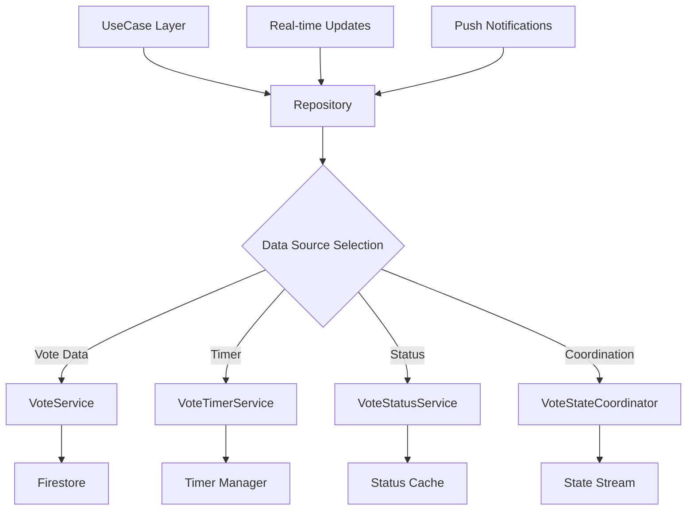

# 📚 /lib/features/voting/data/repositories

> Feature-First Architecture - Voting 리포지토리 계층

## 📋 개요

투표 기능의 **Repository Layer**를 담당하는 디렉토리입니다. 데이터 소스와 도메인 계층 사이의 추상화를 제공하며, 투표 로직과 데이터 접근을 분리합니다.

### 🎯 목적
- **데이터 추상화**: Remote/Local 데이터 소스 통합 관리
- **실시간 동기화**: Firebase Realtime Database 통합
- **상태 조정**: VoteStateCoordinator를 통한 복잡한 상태 관리
- **에러 처리**: 통일된 에러 처리 및 재시도 로직

## 🏗️ 디렉토리 구조

```
repositories/
├── vote_repository_impl.dart       # 투표 리포지토리 구현
├── notification_repository_impl.dart # 알림 리포지토리 구현
├── ranking_repository_impl.dart    # 순위 리포지토리 구현
└── interfaces/                     # 리포지토리 인터페이스
    ├── vote_repository.dart         # 투표 리포지토리 인터페이스
    ├── notification_repository.dart # 알림 리포지토리 인터페이스
    └── ranking_repository.dart      # 순위 리포지토리 인터페이스
```

## 📂 리포지토리 사양

### VoteRepositoryImpl
- **역할**: 투표 데이터 관리 및 조정
- **주요 기능**:
  - 투표 생성 (타이머, 타겟 오디언스 설정)
  - 투표 참여 (중복 방지, 실시간 집계)
  - 투표 상태 스트림 제공
  - 투표 결과 조회 및 집계
  - 투표 종료 처리
  - 투표 확장 요청 관리
- **의존성**:
  - VoteService: 투표 비즈니스 로직
  - VoteTimerService: 타이머 관리
  - VoteStatusService: 상태 추적
  - VoteStateCoordinator: 상태 조정
  - FirestoreVoteDatasource: 데이터 접근
- **에러 처리**: Either 패턴으로 명시적 에러 처리

### NotificationRepositoryImpl
- **역할**: 알림 데이터 관리
- **주요 기능**:
  - 알림 생성 및 전송
  - 알림 목록 조회
  - 알림 읽음 처리
  - 실시간 알림 스트림
  - FCM 푸시 알림 통합
- **의존성**:
  - NotificationService: 알림 로직
  - GlobalNotificationManager: 전역 알림 관리
  - FirestoreNotificationDatasource: 데이터 접근

### RankingRepositoryImpl
- **역할**: 순위 데이터 관리
- **주요 기능**:
  - 순위 계산 및 업데이트
  - 리더보드 조회
  - 사용자 순위 조회
  - 순위 변동 추적

## 🔄 데이터 흐름



## 🧪 테스트 전략

### Mock Repository
- **MockVoteRepository**: 투표 리포지토리 모킹 구현
  - 투표 데이터를 메모리에 저장
  - 투표자 목록 관리로 중복 투표 방지
  - Either 패턴으로 에러 처리
  - 주요 메서드:
    - createVote: 투표 생성
    - castVote: 투표 참여
    - getVoteResults: 결과 조회
    - voteStream: 실시간 스트림

- **MockNotificationRepository**: 알림 리포지토리 모킹
  - 알림 데이터 메모리 관리
  - 실시간 알림 스트림 시뮬레이션
  - FCM 푸시 알림 모킹

- **MockRankingRepository**: 순위 리포지토리 모킹
  - 순위 계산 로직 시뮬레이션
  - 리더보드 데이터 관리

## ⚠️ 에러 처리

### 커스텀 예외
- **VoteException**: 투표 관련 기본 예외
  - message: 에러 메시지
  - 모든 투표 예외의 추상 클래스

- **VoteNotFoundException**: 투표를 찾을 수 없음
  - 존재하지 않는 postId 접근 시

- **VoteAlreadyCompletedException**: 투표 이미 종료
  - 종료된 투표에 참여 시도 시

- **DuplicateVoteException**: 중복 투표
  - 사용자가 이미 투표한 경우

- **VoteTimerException**: 타이머 관련 예외
  - 타이머 시작/종료 오류

## ✅ 체크리스트

### 구현 완료
- [x] 투표 리포지토리 인터페이스
- [x] 투표 생성 및 관리
- [x] 실시간 투표 상태 스트림
- [x] 중복 투표 방지
- [x] 타이머 관리

### 구현 예정
- [ ] 투표 통계 분석
- [ ] 투표 히스토리 관리
- [ ] 투표 확장 시스템
- [ ] A/B 테스트 통합

## 📚 참고 자료

- [VoteStateCoordinator Documentation](../services/README.md)
- [Firebase Realtime Database](https://firebase.google.com/docs/database)
- [Stream-based Architecture](../../domain/README.md)

---

*이 문서는 Feature-First Architecture의 Voting 기능 리포지토리 가이드입니다.*
*최종 업데이트: 2025-08-24*