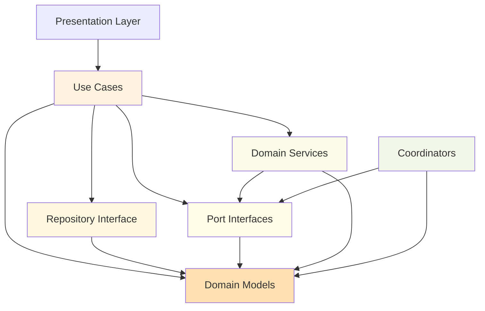

# Voting Feature - Domain Layer

> **최종 업데이트**: 2025-01-12  
> **버전**: 2.0.0 (Clean Architecture Migration Complete)  
> **준수율**: 100% Domain Independence

## 📋 개요

Voting Feature의 Domain Layer는 Clean Architecture의 핵심 레이어로, 비즈니스 로직과 규칙을 정의합니다. 외부 의존성이 전혀 없어 가장 안정적이고 테스트 가능한 레이어입니다.

### 핵심 원칙
- ✅ **Framework Independence**: Flutter/Firebase 의존성 없음
- ✅ **Business Logic Central**: 모든 비즈니스 규칙 중앙화
- ✅ **Testability**: 100% 단위 테스트 가능
- ✅ **Dependency Inversion**: 인터페이스를 통한 의존성 역전
- ✅ **Use Case Pattern**: 단일 책임 원칙 준수

## 🏗️ 디렉토리 구조

```
lib/features/voting/domain/
│
├── models/                          # 도메인 모델 (비즈니스 엔티티)
│   ├── vote_counts_model.dart       # 투표 집계 모델
│   ├── vote_model.dart              # 기본 투표 모델
│   ├── votes_model.dart             # 투표 컬렉션 모델
│   ├── rankings_model.dart          # 순위 모델
│   ├── weights_model.dart           # 가중치 모델
│   ├── vote_expansion_requests_model.dart  # 투표 연장 요청
│   ├── vote_state.dart              # 투표 상태
│   ├── vote_cache_state.dart        # 캐시 상태
│   ├── vote_display_data.dart       # 표시용 데이터
│   ├── vote_notification.dart       # 알림 모델
│   ├── versus_box_size_data.dart    # UI 박스 크기 데이터
│   └── voting_failure.dart          # 실패 케이스 정의
│
├── repositories/                    # Repository 인터페이스
│   └── i_voting_repository.dart    # 데이터 접근 추상화
│
├── usecases/                        # 비즈니스 유스케이스
│   ├── base/
│   │   └── use_case.dart            # UseCase 베이스 클래스
│   │
│   ├── cast_vote_use_case.dart      # 투표하기
│   ├── remove_vote_use_case.dart    # 투표 취소
│   ├── submit_vote_use_case.dart    # 투표 제출
│   ├── get_vote_counts_use_case.dart    # 투표 수 조회
│   ├── stream_vote_counts_use_case.dart # 실시간 투표 수
│   ├── check_user_vote_use_case.dart    # 사용자 투표 확인
│   ├── check_user_vote_status_use_case.dart  # 투표 상태 확인
│   ├── get_vote_status_use_case.dart    # 투표 상태 조회
│   ├── update_vote_status_use_case.dart # 투표 상태 업데이트
│   ├── get_vote_history_use_case.dart   # 투표 이력 조회
│   ├── get_rankings_use_case.dart       # 순위 조회
│   ├── stream_rankings_use_case.dart    # 실시간 순위
│   ├── update_rankings_use_case.dart    # 순위 업데이트
│   └── request_vote_expansion_use_case.dart  # 투표 연장 요청
│
├── ports/                           # 외부 서비스 인터페이스
│   ├── i_vote_timer_port.dart      # 타이머 서비스 포트
│   ├── i_vote_state_port.dart      # 상태 관리 포트
│   ├── i_vote_service.dart         # 투표 서비스 포트
│   ├── i_vote_status_service.dart  # 상태 서비스 포트
│   ├── i_notification_data_port.dart   # 알림 데이터 포트
│   ├── i_box_calculator_port.dart      # UI 계산 포트
│   └── i_vote_ui_delegate.dart         # UI 델리게이트 포트
│
├── services/                        # 도메인 서비스
│   └── vote_data_extractor_service.dart  # 데이터 추출 서비스
│
└── coordinators/                    # 조정자 패턴
    └── vote_state_coordinator.dart  # 투표 상태 조정자
```

## 🔧 주요 컴포넌트

### 1. Domain Models (비즈니스 엔티티)

```dart
// vote_counts_model.dart
class VoteCounts {
  final String postId;
  final int votesA;
  final int votesB;
  final int totalVotes;
  final double percentageA;
  final double percentageB;
  final DateTime? lastUpdated;
  
  bool get hasVotes => totalVotes > 0;
  String get winningOption => votesA > votesB ? 'A' : 'B';
}

// vote_state.dart
enum VoteStatus {
  notStarted,
  inProgress,
  completed,
  expired
}

class VoteState {
  final String? option;  // 'A' or 'B'
  final DateTime? timestamp;
  final bool completed;
  final VoteStatus status;
}
```

### 2. Use Cases (비즈니스 로직)

```dart
// base/use_case.dart
abstract class UseCase<Type, Params> {
  Future<Either<Failure, Type>> call(Params params);
}

// cast_vote_use_case.dart
class CastVoteUseCase extends UseCase<void, CastVoteParams> {
  final IVotingRepository repository;
  
  @override
  Future<Either<Failure, void>> call(CastVoteParams params) async {
    // 1. 비즈니스 규칙 검증
    if (params.voteOption != 'A' && params.voteOption != 'B') {
      return Left(ValidationFailure('Invalid option'));
    }
    
    // 2. Repository 호출
    try {
      await repository.castVote(
        postId: params.postId,
        userId: params.userId,
        voteOption: params.voteOption,
      );
      return Right(null);
    } catch (e) {
      return Left(ServerFailure(e.toString()));
    }
  }
}
```

### 3. Repository Interface (데이터 추상화)

```dart
// i_voting_repository.dart
abstract class IVotingRepository {
  // 투표 작업
  Future<void> castVote({
    required String postId,
    required String userId,
    required String voteOption,
  });
  
  Future<void> removeVote({
    required String postId,
    required String userId,
  });
  
  // 조회 작업
  Future<VoteCounts?> getVoteCounts(String postId);
  Stream<List<VoteCounts>> queryVotecounts({
    dynamic queryBuilder,
    int limit = -1,
  });
  
  // 순위 작업
  Future<void> updateRankings();
  Future<List<RankingsModel>> getTopRankings({int limit = 10});
  
  // 사용자 이력
  Future<List<Map<String, dynamic>>> getUserVoteHistory(String userId);
}
```

### 4. Port Interfaces (외부 서비스 추상화)

```dart
// i_vote_timer_port.dart
abstract class IVoteTimerPort {
  void startTimer({
    required String postId,
    required DateTime voteEndTime,
  });
  
  void stopTimer(String postId);
  
  Stream<Duration> getRemainingTimeStream(
    String postId, 
    DateTime voteEndTime
  );
  
  Duration? getCachedRemainingTime(String postId);
  
  Future<void> syncServerTime();
  DateTime get synchronizedNow;
}

// i_vote_state_port.dart
abstract class IVoteStatePort {
  Future<void> submitVote({
    required String postId,
    required String userId,
    required String choice,
  });
  
  Stream<VoteState> getVoteStateStream(String postId);
  
  Future<bool> hasUserVoted(String postId, String userId);
}
```

### 5. Coordinator Pattern (상태 조정)

```dart
// vote_state_coordinator.dart
class VoteStateCoordinator {
  static VoteStateCoordinator? _instance;
  final IVoteStatePort _voteStatePort;
  
  // 싱글톤 패턴
  static VoteStateCoordinator get instance {
    if (_instance == null) {
      throw StateError('VoteStateCoordinator not initialized');
    }
    return _instance!;
  }
  
  // 투표 제출 조정
  Future<void> submitVote({
    required String postId,
    required String userId,
    required String choice,
  }) async {
    // 1. 중복 투표 확인
    final hasVoted = await _voteStatePort.hasUserVoted(postId, userId);
    if (hasVoted) {
      throw DuplicateVoteException();
    }
    
    // 2. 투표 제출
    await _voteStatePort.submitVote(
      postId: postId,
      userId: userId,
      choice: choice,
    );
    
    // 3. 타이머 시작
    // 4. 알림 발송
    // etc...
  }
}
```

## 📦 의존성 구조



## 🔌 비즈니스 규칙

### 투표 규칙
1. **선택지**: A 또는 B만 가능
2. **중복 투표**: 사용자당 1개 포스트에 1표만
3. **시간 제한**: 10분 타이머 (연장 가능)
4. **최소 참여**: 2명 이상 투표 시 완료
5. **투표 변경**: 시간 내 변경 가능

### 순위 규칙
1. **점수 계산**: 승률 × 참여자 수
2. **카테고리별**: 분야별 순위 분리
3. **실시간 업데이트**: 투표 완료 시 즉시 반영
4. **가중치**: 신규 투표에 높은 가중치

## 💾 Use Case 사용 방법

### 1. DI 설정

```dart
// di/voting_di_module.dart
void registerVotingUseCases(GetIt getIt) {
  // Repository 먼저 등록
  getIt.registerLazySingleton<IVotingRepository>(
    () => VotingRepositoryImpl(...),
  );
  
  // Use Cases 등록
  getIt.registerFactory<CastVoteUseCase>(
    () => CastVoteUseCase(getIt<IVotingRepository>()),
  );
  
  getIt.registerFactory<GetVoteCountsUseCase>(
    () => GetVoteCountsUseCase(getIt<IVotingRepository>()),
  );
}
```

### 2. Provider에서 사용

```dart
// presentation/providers/voting_state_provider.dart
class VotingStateProvider extends ChangeNotifier {
  final CastVoteUseCase _castVoteUseCase;
  final GetVoteCountsUseCase _getVoteCountsUseCase;
  
  Future<void> castVote(String postId, String voteOption) async {
    final result = await _castVoteUseCase(
      CastVoteParams(
        postId: postId,
        userId: currentUser.id,
        voteOption: voteOption,
      ),
    );
    
    result.fold(
      (failure) => _handleError(failure),
      (_) => _handleSuccess(),
    );
  }
}
```

## 🚀 새로운 기능 추가 가이드

### 1. 새로운 Use Case 추가

```dart
// 1. 파라미터 클래스 정의
// domain/usecases/new_feature_use_case.dart
class NewFeatureParams {
  final String param1;
  final int param2;
  
  NewFeatureParams({required this.param1, required this.param2});
}

// 2. Use Case 구현
class NewFeatureUseCase extends UseCase<ReturnType, NewFeatureParams> {
  final IVotingRepository repository;
  
  NewFeatureUseCase(this.repository);
  
  @override
  Future<Either<Failure, ReturnType>> call(NewFeatureParams params) async {
    try {
      // 비즈니스 로직
      if (!_validateBusinessRule(params)) {
        return Left(ValidationFailure('Business rule violated'));
      }
      
      // Repository 호출
      final result = await repository.newFeatureMethod(params);
      
      return Right(result);
    } catch (e) {
      return Left(ServerFailure(e.toString()));
    }
  }
  
  bool _validateBusinessRule(NewFeatureParams params) {
    // 비즈니스 규칙 검증
    return params.param2 > 0;
  }
}

// 3. DI 등록
getIt.registerFactory<NewFeatureUseCase>(
  () => NewFeatureUseCase(getIt<IVotingRepository>()),
);
```

### 2. 새로운 Port 추가

```dart
// 1. Port 인터페이스 정의
// domain/ports/i_new_service_port.dart
abstract class INewServicePort {
  Future<void> performAction(String param);
  Stream<NewData> getDataStream();
}

// 2. Use Case에서 사용
class NewServiceUseCase extends UseCase<void, String> {
  final INewServicePort _servicePort;
  
  NewServiceUseCase(this._servicePort);
  
  @override
  Future<Either<Failure, void>> call(String params) async {
    try {
      await _servicePort.performAction(params);
      return Right(null);
    } catch (e) {
      return Left(ServiceFailure(e.toString()));
    }
  }
}
```

### 3. 새로운 Domain Model 추가

```dart
// domain/models/new_model.dart
class NewModel {
  final String id;
  final String name;
  final DateTime createdAt;
  final ModelStatus status;
  
  // 비즈니스 로직 메서드
  bool get isActive => status == ModelStatus.active;
  bool get canEdit => isActive && !isExpired;
  bool get isExpired => DateTime.now().isAfter(expiryDate);
  
  // 불변 객체 패턴
  NewModel copyWith({
    String? name,
    ModelStatus? status,
  }) {
    return NewModel(
      id: id,
      name: name ?? this.name,
      status: status ?? this.status,
      createdAt: createdAt,
    );
  }
}
```

## ⚠️ 주의사항

### Domain Layer 원칙
- ❌ **No Framework Dependencies**: Flutter/Firebase import 금지
- ❌ **No External Libraries**: 최소한의 외부 패키지만 사용 (dartz 등)
- ❌ **No UI Logic**: 화면 표시 로직 포함 금지
- ✅ **Pure Business Logic**: 순수 비즈니스 로직만
- ✅ **Testable**: 모든 코드 단위 테스트 가능
- ✅ **Immutable Models**: 불변 객체 패턴 사용

### 네이밍 컨벤션
```dart
// Models: 단수형 명사
VoteModel, RankingModel (❌ VotesModel, RankingsModel)

// Use Cases: 동사 + UseCase
CastVoteUseCase, GetRankingsUseCase

// Ports: I + 서비스명 + Port
IVoteTimerPort, INotificationPort

// Parameters: UseCase명 + Params
CastVoteParams, GetRankingsParams
```

## 📊 현재 상태 (2025-01-12)

### 구현 완료
- ✅ 14개 Use Cases 구현
- ✅ 11개 Domain Models 정의
- ✅ 7개 Port Interfaces 정의
- ✅ Repository Interface 정의
- ✅ Coordinator Pattern 적용

### 개선 필요
- ⚠️ `getUserVoteHistory` 메서드 구현 필요
- ⚠️ 일부 Use Case 에러 처리 강화 필요
- ℹ️ 단위 테스트 커버리지 확대 필요

## 🧪 테스트 전략

```dart
// test/features/voting/domain/usecases/cast_vote_use_case_test.dart
void main() {
  late CastVoteUseCase useCase;
  late MockVotingRepository mockRepository;
  
  setUp(() {
    mockRepository = MockVotingRepository();
    useCase = CastVoteUseCase(mockRepository);
  });
  
  test('should cast vote when valid option', () async {
    // Given
    when(mockRepository.castVote(any)).thenAnswer((_) async => null);
    
    // When
    final result = await useCase(CastVoteParams(
      postId: 'post1',
      userId: 'user1',
      voteOption: 'A',
    ));
    
    // Then
    expect(result, Right(null));
    verify(mockRepository.castVote(any)).called(1);
  });
  
  test('should return ValidationFailure for invalid option', () async {
    // When
    final result = await useCase(CastVoteParams(
      postId: 'post1',
      userId: 'user1',
      voteOption: 'C', // Invalid
    ));
    
    // Then
    expect(result, isA<Left>());
  });
}
```

## 📚 참고 문서

- [Data Layer README](../data/README.md)
- [Presentation Layer README](../presentation/README.md)
- [Clean Architecture Guide](../ARCHITECTURE.md)
- [Migration Guide](../VOTING_ERROR_MIGRATION.md)

---
*Generated: 2025-01-12 | Domain Independence: 100%*