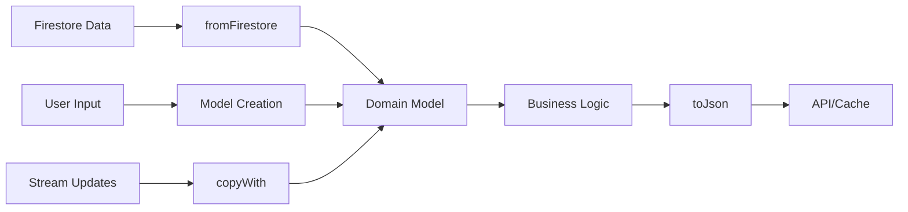

# 📦 /lib/features/voting/domain/models

> Feature-First Architecture - Voting 도메인 모델

## 📋 개요

투표 기능의 **Domain Models**를 정의하는 디렉토리입니다. 비즈니스 로직과 데이터 구조를 표현하며, 불변성과 타입 안정성을 보장합니다.

### 🎯 목적
- **도메인 모델 정의**: 투표 관련 핵심 데이터 구조
- **비즈니스 로직 캡슐화**: 모델 내 비즈니스 규칙 구현
- **불변성 보장**: Freezed를 활용한 immutable 모델
- **타입 안정성**: 강타입 시스템으로 런타임 에러 방지

## 🏗️ 디렉토리 구조

```
models/
├── vote_model.dart              # 투표 데이터 모델
├── vote_result_model.dart       # 투표 결과 모델
├── vote_counts_model.dart       # 투표 집계 모델
├── vote_state_model.dart        # 투표 상태 모델
├── notification_model.dart      # 알림 모델
├── vote_expansion_model.dart    # 투표 확장 요청 모델
├── ranking_model.dart           # 순위 모델
├── target_audience_model.dart   # 타겟 오디언스 모델
└── enums/                       # 열거형 정의
    ├── vote_status.dart         # 투표 상태 열거형
    ├── vote_option.dart         # 투표 옵션 (A/B)
    └── notification_type.dart   # 알림 유형
```

## 📂 주요 모델 구현

### VoteModel

**역할**: 투표 도메인 모델

**필드**:
- **postId**: 게시물 ID
- **creatorId**: 생성자 ID
- **voteStartTime**: 투표 시작 시간
- **voteEndTime**: 투표 종료 시간
- **status**: 투표 상태 (VoteStatus enum)
- **votesA**: A 옵션 투표 수
- **votesB**: B 옵션 투표 수
- **totalVotes**: 전체 투표 수
- **targetAudience**: 타겟 오디언스 정보
- **winner**: 승자 (optional)
- **completedAt**: 완료 시간 (optional)
- **metadata**: 추가 메타데이터 (optional)

**비즈니스 로직**:
- `isActive`: 투표 진행 중 여부
- `isCompleted`: 투표 완료 여부
- `remainingTime`: 남은 시간 계산
- `percentageA/B`: 각 옵션 비율 계산
- `currentWinner`: 현재 승자 결정
- `canVote()`: 투표 가능 여부 확인
- `formattedEndTime`: 마감 시간 포맷

**변환 메서드**:
- `fromJson()`: JSON 직렬화
- `fromFirestore()`: Firestore 데이터 변환
- `toFirestore()`: Firestore 저장용 변환

### VoteStateModel

**역할**: 투표 상태 모델 (UI 상태 관리용)

**필드**:
- **postId**: 게시물 ID
- **status**: 투표 상태
- **votesA**: A 옵션 투표 수
- **votesB**: B 옵션 투표 수
- **totalVotes**: 전체 투표 수
- **remainingSeconds**: 남은 시간 (초)
- **hasUserVoted**: 사용자 투표 여부
- **userVoteOption**: 사용자가 선택한 옵션 (optional)
- **lastUpdated**: 마지막 업데이트 시간
- **errorMessage**: 에러 메시지 (optional)
- **isLoading**: 로딩 상태 (optional)

**계산된 속성**:
- `percentageA/B`: 각 옵션 비율
- `formattedRemainingTime`: 남은 시간 포맷 (MM:SS)
- `canVote`: 투표 가능 여부
- `canShowResults`: 결과 표시 가능 여부
- `leadingOption`: 현재 리딩 옵션

**팩토리 메서드**:
- `initial()`: 초기 상태 생성
- `fromJson()`: JSON 직렬화

### NotificationModel

**역할**: 알림 도메인 모델

**필드**:
- **id**: 알림 ID (optional)
- **userId**: 수신자 ID
- **title**: 알림 제목
- **body**: 알림 본문
- **type**: 알림 유형 (NotificationType enum)
- **data**: 알림 데이터 (Map)
- **createdAt**: 생성 시간
- **isRead**: 읽음 여부 (optional)
- **readAt**: 읽은 시간 (optional)
- **sendPush**: 푸시 전송 여부 (optional)
- **imageUrl**: 이미지 URL (optional)
- **action**: 액션 정보 (optional)
- **metadata**: 메타데이터 (optional)

**팩토리 메서드**:
- `fromJson()`: JSON 직렬화
- `fromFirestore()`: Firestore 데이터 변환
- `voteRequest()`: 투표 요청 알림 생성
- `voteCompleted()`: 투표 완료 알림 생성

**비즈니스 로직**:
- `ageText`: 알림 나이 텍스트 계산
- `priority`: 알림 우선순위 결정
- `requiresAction`: 액션 필요 여부

### Enums

**VoteStatus** - 투표 상태:
- `inactive`: 비활성
- `active`: 진행 중
- `completed`: 완료됨
- `cancelled`: 취소됨

**VoteOption** - 투표 옵션:
- `A`: 옵션 A
- `B`: 옵션 B

**NotificationType** - 알림 유형:
- `voteRequest`: 투표 요청
- `voteCompleted`: 투표 완료
- `voteExpiring`: 투표 마감 임박
- `rankingUpdate`: 순위 업데이트
- `general`: 일반 알림

**메서드**:
- `fromString()`: 문자열로부터 enum 변환
- `displayName`: 표시용 이름 반환

### TargetAudienceModel

**역할**: 타겟 오디언스 모델

**필드**:
- **mode**: 타겟 모드 ('quick', 'public', 'custom')
- **targetCount**: 타겟 사용자 수 (optional)
- **targetUserIds**: 타겟 사용자 ID 목록 (optional)
- **filters**: 필터 조건 (optional)
- **aiCriteria**: AI 매칭 기준 (optional)

**팩토리 메서드**:
- `fromJson()`: JSON 직렬화
- `quick()`: Quick Collection 모드 생성
- `public()`: Public 모드 생성
- `custom()`: Custom 모드 생성

**비즈니스 로직**:
- `usesAI`: AI 매칭 사용 여부
- `totalTargets`: 타겟 사용자 수 계산
- `modeDisplayName`: 모드 표시 이름

## 🔄 모델 변환 플로우



## 🧪 테스트 전략

### 모델 단위 테스트

**테스트 영역**:
- 비즈니스 로직 검증
- 계산 로직 정확성
- Edge case 처리
- 직렬화/역직렬화

**주요 테스트 케이스**:
- VoteModel: 비율 계산, 승자 결정, 0표 처리
- VoteStateModel: 투표 가능 여부, 결과 표시 조건
- NotificationModel: 우선순위 계산, 나이 텍스트
- TargetAudienceModel: 모드별 동작, AI 사용 여부

**검증 항목**:
- Freezed 코드 생성 정확성
- JSON 변환 무결성
- Firestore 변환 정확성
- 비즈니스 규칙 준수

## ✅ 체크리스트

### 구현 완료
- [x] VoteModel - 투표 데이터
- [x] VoteStateModel - 투표 상태
- [x] NotificationModel - 알림
- [x] TargetAudienceModel - 타겟 오디언스
- [x] Enums - 상태, 옵션, 타입

### 구현 예정
- [ ] VoteResultModel - 상세 결과
- [ ] VoteCountsModel - 집계 모델
- [ ] VoteExpansionModel - 확장 요청
- [ ] RankingModel - 순위 모델

## 📚 참고 자료

- [Freezed Documentation](https://pub.dev/packages/freezed)
- [JSON Serialization](https://docs.flutter.dev/data-and-backend/json)
- [Domain-Driven Design](https://martinfowler.com/tags/domain%20driven%20design.html)

---

*이 문서는 Feature-First Architecture의 Voting 기능 도메인 모델 가이드입니다.*
*최종 업데이트: 2025-08-24*