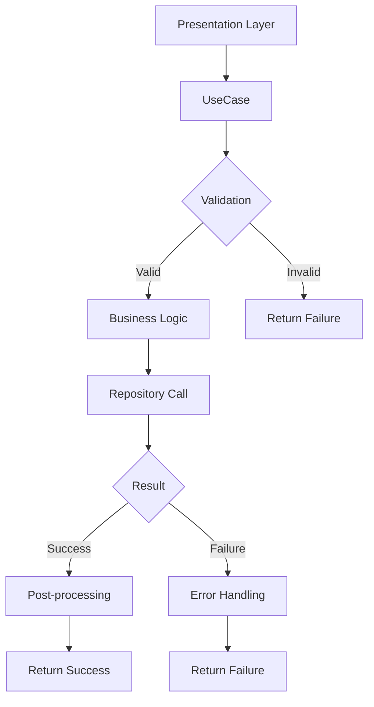

# 🎯 /lib/features/voting/domain/usecases

> Feature-First Architecture - Voting 유스케이스 계층

## 📋 개요

투표 기능의 **Use Cases Layer**를 정의하는 디렉토리입니다. 비즈니스 규칙을 구현하고, 도메인 로직과 데이터 접근을 조정합니다.

### 🎯 목적
- **비즈니스 규칙 구현**: 투표 관련 핵심 비즈니스 로직
- **단일 책임 원칙**: 각 유스케이스는 하나의 비즈니스 작업만 수행
- **의존성 역전**: 리포지토리 인터페이스에 의존
- **테스트 가능성**: 격리된 비즈니스 로직으로 단위 테스트 용이

## 🏗️ 디렉토리 구조

```
usecases/
├── cast_vote_usecase.dart          # 투표하기
├── create_vote_usecase.dart        # 투표 생성
├── get_vote_results_usecase.dart   # 결과 조회
├── close_vote_usecase.dart         # 투표 종료
├── send_notification_usecase.dart  # 알림 전송
├── expand_vote_usecase.dart        # 투표 확장
├── calculate_ranking_usecase.dart  # 순위 계산
├── get_vote_state_usecase.dart     # 상태 조회
└── validate_vote_usecase.dart      # 투표 검증
```

## 📂 주요 유스케이스 구현

### CastVoteUseCase

**역할**: 투표하기 유스케이스

**주요 기능**:
- 투표 유효성 검증
- 중복 투표 방지
- 투표 처리 및 집계
- 성공 로깅

**의존성**:
- VoteRepository: 투표 데이터 접근

**처리 플로우**:
1. 필수 필드 검증 (postId, userId)
2. 투표 상태 확인 (active 여부)
3. 중복 투표 확인
4. 투표 처리
5. Analytics 로깅

**CastVoteParams**:
- postId: 게시물 ID
- userId: 사용자 ID  
- option: 투표 옵션 (A/B)

### CreateVoteUseCase

**역할**: 투표 생성 유스케이스

**주요 기능**:
- 투표 파라미터 검증
- 타겟 오디언스 처리
- 투표 생성 및 초기화
- 알림 전송 트리거

**의존성**:
- VoteRepository: 투표 데이터 접근
- NotificationRepository: 알림 처리

**처리 플로우**:
1. 파라미터 유효성 검증
2. 타겟 오디언스 처리 (quick/public/custom)
3. 투표 생성
4. Firebase Functions로 알림 전송

**CreateVoteParams**:
- postId: 게시물 ID
- creatorId: 생성자 ID
- duration: 투표 기간
- targetMode: 타겟 모드 (quick/public/custom)
- targetCount: 타겟 수
- targetUserIds: 타겟 사용자 목록 (optional)
- filters: 필터 조건 (optional)
- aiCriteria: AI 매칭 기준 (optional)

**팩토리 메서드**:
- defaultVote(): 기본 10분 투표 생성

### GetVoteResultsUseCase

**역할**: 투표 결과 조회 유스케이스

**주요 기능**:
- 투표 결과 조회
- 결과 데이터 후처리
- 통계 계산

**의존성**:
- VoteRepository: 투표 데이터 접근

**처리 플로우**:
1. postId 유효성 검증
2. 투표 결과 조회
3. 결과 데이터 가공
4. VoteResultModel 반환

**통계 계산**:
- participationRate: 참여율
- voteDifference: 투표 차이
- confidenceLevel: 신뢰 수준
- isDecisive: 결정적 여부

### CloseVoteUseCase

**역할**: 투표 종료 유스케이스

**주요 기능**:
- 투표 상태 확인
- 최종 결과 계산
- 투표 종료 처리
- 완료 알림 전송
- 순위 업데이트

**의존성**:
- VoteRepository: 투표 데이터 접근
- NotificationRepository: 알림 처리

**처리 플로우**:
1. 투표 상태 확인 (active 여부)
2. 최종 결과 계산
3. 투표 종료 처리
4. 완료 알림 전송
5. 순위 업데이트

**알림 전송**:
- 투표 참여자 전원에게 결과 알림
- Firebase Functions와 연동

### SendNotificationUseCase

**역할**: 알림 전송 유스케이스

**주요 기능**:
- 알림 파라미터 검증
- 알림 생성
- 단일/배치 알림 전송

**의존성**:
- NotificationRepository: 알림 처리

**처리 플로우**:
1. 파라미터 검증 (사용자 ID, 제목, 본문)
2. NotificationModel 생성
3. 단일/배치 전송 처리

**SendNotificationParams**:
- targetUserIds: 수신자 ID 리스트 (필수)
- title: 알림 제목 (필수)
- body: 알림 본문 (필수)
- type: NotificationType enum (필수)
- data: 추가 데이터 Map (필수)
- sendPush: 푸시 전송 여부 (기본값: true)
- imageUrl: 이미지 URL (optional)
- action: 액션 정보 (optional)

## 🔄 유스케이스 흐름



## 🧪 테스트 전략

### 유스케이스 단위 테스트

**테스트 구조**:
- 각 유스케이스별 독립적인 테스트 그룹
- Mock 객체를 사용한 의존성 격리
- setUp/tearDown으로 테스트 환경 관리

**주요 테스트 케이스**:
- 유효성 검사 실패 시나리오
- 권한 검증 실패 처리
- 성공적인 실행 경로 검증
- 비즈니스 규칙 준수 확인
- 에러 처리 적절성 확인
- 비동기 작업 완료 검증

**Mock 객체**:
- MockVoteRepository
- MockNotificationRepository
- MockValidationService

**검증 항목**:
- 파라미터 유효성 검사
- Repository 메서드 호출 여부
- 반환값 정확성
- 에러 타입 적절성

## ⚠️ 에러 처리

### 비즈니스 에러

**에러 타입**:
- **ValidationFailure**: 유효성 검증 실패
  - 잘못된 입력값
  - 필수 필드 누락
  - 형식 오류
  
- **AuthorizationFailure**: 권한 부족
  - 인증되지 않은 사용자
  - 권한 없는 작업 시도
  
- **PartialFailure**: 부분 실패 (배치 작업)
  - failedIds: 실패한 항목 ID 목록
  - 일부 성공, 일부 실패 상황
  
- **BusinessRuleFailure**: 비즈니스 규칙 위반
  - 중복 투표 시도
  - 만료된 투표 참여
  - 규칙 위반 상황

**에러 처리 전략**:
- Either<Failure, Success> 패턴 사용
- 명시적 에러 타입 반환
- 에러 메시지 국제화 지원
- 에러 로깅 및 모니터링

## ✅ 체크리스트

### 구현 완료
- [x] CastVoteUseCase - 투표하기
- [x] CreateVoteUseCase - 투표 생성
- [x] GetVoteResultsUseCase - 결과 조회
- [x] CloseVoteUseCase - 투표 종료
- [x] SendNotificationUseCase - 알림 전송

### 구현 예정
- [ ] ExpandVoteUseCase - 투표 확장
- [ ] CalculateRankingUseCase - 순위 계산
- [ ] GetVoteStateUseCase - 상태 조회
- [ ] ValidateVoteUseCase - 투표 검증

## 📚 참고 자료

- [Clean Architecture](https://blog.cleancoder.com/uncle-bob/2012/08/13/the-clean-architecture.html)
- [Use Case Pattern](https://martinfowler.com/eaaCatalog/useCaseController.html)
- [Either Pattern](https://pub.dev/packages/either_dart)

---

*이 문서는 Feature-First Architecture의 Voting 기능 유스케이스 가이드입니다.*
*최종 업데이트: 2025-08-24*