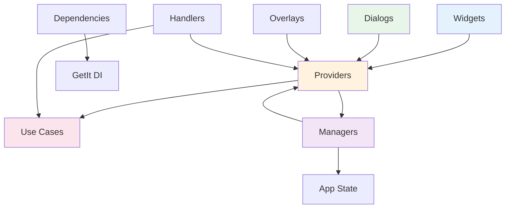

# Voting Feature - Presentation Layer

> **최종 업데이트**: 2025-01-12  
> **버전**: 2.0.0 (Clean Architecture Migration Complete)  
> **UI Framework**: Flutter with Provider Pattern

## 📋 개요

Voting Feature의 Presentation Layer는 사용자 인터페이스와 상호작용을 담당합니다. Provider 패턴을 통한 상태 관리와 재사용 가능한 위젯 컴포넌트로 구성되어 있습니다.

### 핵심 특징
- ✅ **Provider Pattern**: 반응형 상태 관리
- ✅ **Component-Based Architecture**: 재사용 가능한 위젯 구조
- ✅ **Responsive Design**: 다양한 화면 크기 대응
- ✅ **Animation Support**: 부드러운 사용자 경험
- ✅ **Clean Architecture**: Domain Layer와 완전 분리

## 🏗️ 디렉토리 구조

```
lib/features/voting/presentation/
│
├── providers/                       # 상태 관리 (Provider Pattern)
│   ├── voting_state_provider.dart   # 투표 상태 관리
│   ├── voting_data_provider.dart    # 데이터 스트림 관리
│   └── voting_ui_provider.dart      # UI 상태 관리
│
├── managers/                        # 상태 조정자
│   ├── voting_state_manager.dart    # 전역 상태 조정
│   └── vote_ui_manager.dart         # UI 이벤트 처리
│
├── widgets/                         # 재사용 가능한 위젯
│   ├── voting_box.dart              # 메인 투표 박스
│   ├── voting_box/                  # 투표 박스 컴포넌트
│   │   ├── components/              # 하위 컴포넌트
│   │   │   ├── voting_box_header.dart      # 헤더 (A/B 라벨)
│   │   │   ├── voting_box_content.dart     # 콘텐츠 영역
│   │   │   ├── voting_box_overlay.dart     # 오버레이
│   │   │   └── voting_box_animations.dart  # 애니메이션
│   │   ├── models/                  # 박스 상태 모델
│   │   │   └── voting_box_state.dart
│   │   └── utils/                   # 유틸리티
│   │       └── voting_box_helpers.dart
│   │
│   ├── vote_card/                   # 투표 카드 위젯
│   │   ├── vote_card_widget.dart    # 메인 카드
│   │   ├── components/              # 카드 컴포넌트
│   │   │   ├── vote_card_header.dart   # 헤더
│   │   │   ├── vote_card_body.dart     # 본문
│   │   │   └── vote_card_footer.dart   # 푸터
│   │   ├── models/                  # 카드 모델
│   │   │   └── vote_card_props.dart
│   │   └── utils/                   # 유틸리티
│   │       └── vote_card_helpers.dart
│   │
│   ├── image_viewer/                # 이미지 뷰어
│   │   ├── voting_image_viewer.dart # 메인 뷰어
│   │   ├── components/              # 뷰어 컴포넌트
│   │   │   ├── image_viewer_app_bar.dart
│   │   │   ├── image_viewer_page_view.dart
│   │   │   ├── image_viewer_controls.dart
│   │   │   ├── image_viewer_indicators.dart
│   │   │   └── image_viewer_text_sections.dart
│   │   └── utils/
│   │       └── image_viewer_helpers.dart
│   │
│   └── vote_options_widget.dart     # 투표 옵션
│       vote_results_widget.dart     # 결과 표시
│       vote_status_badge.dart       # 상태 배지
│       vote_timer_widget.dart       # 타이머
│
├── dialogs/                         # 다이얼로그
│   ├── voting_dialog.dart           # 메인 투표 다이얼로그
│   ├── voting_dialog_refactored.dart # 리팩토링 버전
│   ├── voting_overlay.dart          # 오버레이 다이얼로그
│   └── voting_dialog/               # 다이얼로그 컴포넌트
│       ├── components/
│       │   ├── voting_dialog_header.dart
│       │   ├── voting_dialog_content.dart
│       │   ├── voting_dialog_actions.dart
│       │   └── voting_dialog_timer.dart
│       ├── animations/
│       │   └── voting_dialog_animations.dart
│       ├── models/
│       │   └── voting_dialog_state.dart
│       └── utils/
│           └── voting_dialog_helpers.dart
│
├── overlays/                        # 오버레이 UI
│   ├── notification_overlay.dart    # 알림 오버레이
│   └── in_app_notification_dialog.dart # 앱 내 알림
│
├── utils/                           # 유틸리티
│   ├── adaptive_text_size.dart      # 적응형 텍스트 크기
│   └── text_size/                   # 텍스트 크기 관리
│       ├── constants/
│       │   ├── text_size_constants.dart
│       │   └── breakpoint_constants.dart
│       ├── calculators/
│       │   ├── scale_factor_calculator.dart
│       │   ├── text_size_calculator.dart
│       │   └── responsive_calculator.dart
│       └── helpers/
│           ├── device_helpers.dart
│           └── text_style_helpers.dart
│
├── dependencies/                    # 의존성 관리
│   ├── voting_dependencies.dart     # 인터페이스
│   └── voting_dependencies_impl.dart # 구현
│
├── handlers/                        # 이벤트 핸들러
│   └── vote_handler_impl.dart       # 투표 이벤트 처리
│
├── constants/                       # 상수
│   └── voting_dialog_constraints.dart # UI 제약사항
│
└── routes/                          # 라우팅
    └── voting_routes.dart           # 투표 관련 라우트
```

## 🔧 주요 컴포넌트

### 1. State Management (Provider Pattern)

```dart
// voting_state_provider.dart
class VotingStateProvider extends ChangeNotifier {
  // Use Cases 주입
  final CastVoteUseCase _castVoteUseCase;
  final GetVoteCountsUseCase _getVoteCountsUseCase;
  
  // 상태 변수
  String? _currentUserVote;
  VoteCounts? _voteCounts;
  bool _isLoading = false;
  
  // 투표 처리
  Future<void> castVote({
    required String postId,
    required String userId,
    required String voteOption,
  }) async {
    _isLoading = true;
    notifyListeners();
    
    final result = await _castVoteUseCase(
      CastVoteParams(
        postId: postId,
        userId: userId,
        voteOption: voteOption,
      ),
    );
    
    result.fold(
      (failure) => _handleError(failure),
      (_) => _handleSuccess(),
    );
    
    _isLoading = false;
    notifyListeners();
  }
}
```

### 2. Widget Components

```dart
// voting_box.dart - 메인 투표 박스 위젯
class VotingBox extends StatelessWidget {
  final VotingBoxConfig config;
  final VotingBoxState state;
  
  @override
  Widget build(BuildContext context) {
    return Container(
      width: config.width,
      height: config.height,
      child: Column(
        children: [
          VotingBoxHeader(
            label: config.label,
            voteCount: state.voteCount,
          ),
          Expanded(
            child: VotingBoxContent(
              content: config.content,
              isSelected: state.isSelected,
            ),
          ),
          if (state.showOverlay)
            VotingBoxOverlay(
              onTap: config.onTap,
            ),
        ],
      ),
    );
  }
}

// vote_card_widget.dart - 투표 카드
class VoteCardWidget extends StatefulWidget {
  final String postId;
  final VoteCardProps props;
  
  @override
  Widget build(BuildContext context) {
    return Consumer<VotingStateProvider>(
      builder: (context, votingState, child) {
        return Card(
          child: Column(
            children: [
              VoteCardHeader(
                title: props.title,
                timer: VoteTimerWidget(postId: postId),
              ),
              VoteCardBody(
                optionA: props.optionA,
                optionB: props.optionB,
                voteCounts: votingState.voteCounts,
              ),
              VoteCardFooter(
                onVoteA: () => _handleVote('A'),
                onVoteB: () => _handleVote('B'),
                isLoading: votingState.isLoading,
              ),
            ],
          ),
        );
      },
    );
  }
}
```

### 3. Dialogs & Overlays

```dart
// voting_dialog.dart - 투표 다이얼로그
class VotingDialog extends StatefulWidget {
  final VotingDialogConfig config;
  
  static Future<VoteResult?> show(
    BuildContext context,
    VotingDialogConfig config,
  ) {
    return showDialog<VoteResult>(
      context: context,
      barrierDismissible: false,
      builder: (context) => VotingDialog(config: config),
    );
  }
  
  @override
  Widget build(BuildContext context) {
    return Dialog(
      shape: RoundedRectangleBorder(
        borderRadius: BorderRadius.circular(16),
      ),
      child: Container(
        constraints: VotingDialogConstraints.getConstraints(context),
        child: Column(
          mainAxisSize: MainAxisSize.min,
          children: [
            VotingDialogHeader(title: config.title),
            VotingDialogContent(
              optionA: config.optionA,
              optionB: config.optionB,
            ),
            VotingDialogTimer(endTime: config.voteEndTime),
            VotingDialogActions(
              onVote: _handleVote,
              onCancel: () => Navigator.pop(context),
            ),
          ],
        ),
      ),
    );
  }
}
```

### 4. State Manager (Coordinator)

```dart
// voting_state_manager.dart
class VotingStateManager extends ChangeNotifier {
  static VotingStateManager? _instance;
  
  // Singleton pattern
  static VotingStateManager get instance {
    _instance ??= VotingStateManager._();
    return _instance!;
  }
  
  // Provider coordination
  void coordinateProviders({
    required VotingStateProvider stateProvider,
    required VotingDataProvider dataProvider,
    required VotingUIProvider uiProvider,
  }) {
    // AppState와 동기화
    _syncWithAppState();
    
    // Provider 간 연결
    _connectProviders();
    
    // 이벤트 리스너 설정
    _setupEventListeners();
  }
}
```

## 📦 의존성 구조



## 🎨 UI/UX 특징

### Responsive Design
```dart
// adaptive_text_size.dart
class AdaptiveTextSize {
  static double calculate(BuildContext context, double baseSize) {
    final screenWidth = MediaQuery.of(context).size.width;
    final scaleFactor = ResponsiveCalculator.getScaleFactor(screenWidth);
    return baseSize * scaleFactor;
  }
}
```

### Animation Support
```dart
// voting_box_animations.dart
class VotingBoxAnimations {
  static Widget buildAnimatedBox({
    required Widget child,
    required bool isSelected,
  }) {
    return AnimatedContainer(
      duration: Duration(milliseconds: 300),
      curve: Curves.easeInOut,
      transform: isSelected 
        ? Matrix4.identity()..scale(1.05)
        : Matrix4.identity(),
      child: child,
    );
  }
}
```

## 💾 Provider 사용 방법

### 1. Provider 설정

```dart
// main.dart 또는 app.dart
MultiProvider(
  providers: [
    ChangeNotifierProvider(
      create: (_) => getIt<VotingStateProvider>(),
    ),
    ChangeNotifierProvider(
      create: (_) => getIt<VotingDataProvider>(),
    ),
    ChangeNotifierProvider(
      create: (_) => getIt<VotingUIProvider>(),
    ),
  ],
  child: MyApp(),
)
```

### 2. Widget에서 사용

```dart
// Consumer 패턴
Consumer<VotingStateProvider>(
  builder: (context, votingState, child) {
    if (votingState.isLoading) {
      return CircularProgressIndicator();
    }
    return VoteCardWidget(
      voteCounts: votingState.voteCounts,
    );
  },
)

// Provider.of 패턴
final votingState = Provider.of<VotingStateProvider>(context);
votingState.castVote(postId: 'post1', voteOption: 'A');

// context.watch/read 패턴 (Provider 6.0+)
final votingState = context.watch<VotingStateProvider>();
context.read<VotingStateProvider>().castVote(...);
```

## 🚀 새로운 기능 추가 가이드

### 1. 새로운 Widget 추가

```dart
// 1. Widget 파일 생성
// presentation/widgets/new_voting_widget.dart
class NewVotingWidget extends StatelessWidget {
  final String postId;
  final VotingConfig config;
  
  @override
  Widget build(BuildContext context) {
    // Provider 연결
    return Consumer<VotingStateProvider>(
      builder: (context, state, child) {
        return Container(
          // Widget 구현
        );
      },
    );
  }
}

// 2. 필요시 컴포넌트 분리
// presentation/widgets/new_voting_widget/components/
// - new_widget_header.dart
// - new_widget_body.dart
// - new_widget_footer.dart

// 3. Export 추가
// presentation/widgets/index.dart
export 'new_voting_widget.dart';
```

### 2. 새로운 Provider 추가

```dart
// 1. Provider 클래스 생성
// presentation/providers/new_voting_provider.dart
class NewVotingProvider extends ChangeNotifier {
  final NewUseCase _newUseCase;
  
  // 상태 변수
  bool _isProcessing = false;
  NewData? _data;
  
  // Getters
  bool get isProcessing => _isProcessing;
  NewData? get data => _data;
  
  // 메서드
  Future<void> performAction() async {
    _isProcessing = true;
    notifyListeners();
    
    final result = await _newUseCase.execute();
    
    result.fold(
      (failure) => _handleError(failure),
      (data) => _updateData(data),
    );
    
    _isProcessing = false;
    notifyListeners();
  }
}

// 2. DI 등록
// di/voting_di_module.dart
getIt.registerLazySingleton<NewVotingProvider>(
  () => NewVotingProvider(
    newUseCase: getIt<NewUseCase>(),
  ),
);

// 3. MultiProvider 추가
ChangeNotifierProvider(
  create: (_) => getIt<NewVotingProvider>(),
),
```

### 3. 새로운 Dialog 추가

```dart
// 1. Dialog 생성
// presentation/dialogs/new_voting_dialog.dart
class NewVotingDialog extends StatefulWidget {
  final DialogConfig config;
  
  static Future<DialogResult?> show(
    BuildContext context,
    DialogConfig config,
  ) {
    return showDialog<DialogResult>(
      context: context,
      builder: (_) => NewVotingDialog(config: config),
    );
  }
  
  @override
  Widget build(BuildContext context) {
    return Dialog(
      child: Container(
        padding: EdgeInsets.all(16),
        child: Column(
          mainAxisSize: MainAxisSize.min,
          children: [
            // Dialog 내용
          ],
        ),
      ),
    );
  }
}

// 2. 사용 예시
final result = await NewVotingDialog.show(
  context,
  DialogConfig(
    title: 'New Dialog',
    // 설정
  ),
);
```

## ⚠️ 주의사항

### Clean Architecture 원칙
- ❌ **No Direct Domain Access**: UseCase를 통해서만 Domain 접근
- ❌ **No Business Logic**: 비즈니스 로직은 Domain Layer에
- ✅ **UI Logic Only**: 화면 표시 로직만 포함
- ✅ **State Management**: Provider 패턴 일관성 유지

### Performance 고려사항
```dart
// 1. 불필요한 rebuild 방지
Consumer<VotingStateProvider>(
  builder: (context, state, child) {
    // child는 rebuild되지 않음
    return Column(
      children: [
        Text(state.voteCount.toString()), // rebuild
        child!, // 재사용
      ],
    );
  },
  child: ExpensiveWidget(), // 한 번만 생성
)

// 2. Selector 사용으로 최적화
Selector<VotingStateProvider, int>(
  selector: (_, state) => state.voteCount,
  builder: (context, voteCount, child) {
    // voteCount 변경 시에만 rebuild
    return Text('$voteCount');
  },
)
```

## 📊 현재 상태 (2025-01-12)

### 구현 완료
- ✅ 3개 Provider 구현 (State, Data, UI)
- ✅ 2개 Manager 구현 (State, UI)
- ✅ 15+ Widget Components
- ✅ 5+ Dialog Components
- ✅ Responsive Design System
- ✅ Animation Support

### 개선 필요
- ⚠️ 일부 Widget 리팩토링 필요
- ⚠️ Provider 테스트 커버리지 확대
- ℹ️ 접근성(Accessibility) 개선 검토

## 🧪 테스트 전략

```dart
// test/features/voting/presentation/providers/voting_state_provider_test.dart
void main() {
  late VotingStateProvider provider;
  late MockCastVoteUseCase mockCastVote;
  
  setUp(() {
    mockCastVote = MockCastVoteUseCase();
    provider = VotingStateProvider(
      castVoteUseCase: mockCastVote,
      // other dependencies
    );
  });
  
  test('should update state when vote is cast', () async {
    // Given
    when(mockCastVote(any)).thenAnswer(
      (_) async => Right(null),
    );
    
    // When
    await provider.castVote(
      postId: 'post1',
      userId: 'user1',
      voteOption: 'A',
    );
    
    // Then
    expect(provider.currentUserVote, 'A');
    expect(provider.hasVoted, true);
  });
}
```

## 📚 참고 문서

- [Domain Layer README](../domain/README.md)
- [Data Layer README](../data/README.md)
- [Clean Architecture Guide](../ARCHITECTURE.md)
- [Flutter Provider Documentation](https://pub.dev/packages/provider)

---
*Generated: 2025-01-12 | UI Framework: Flutter + Provider*