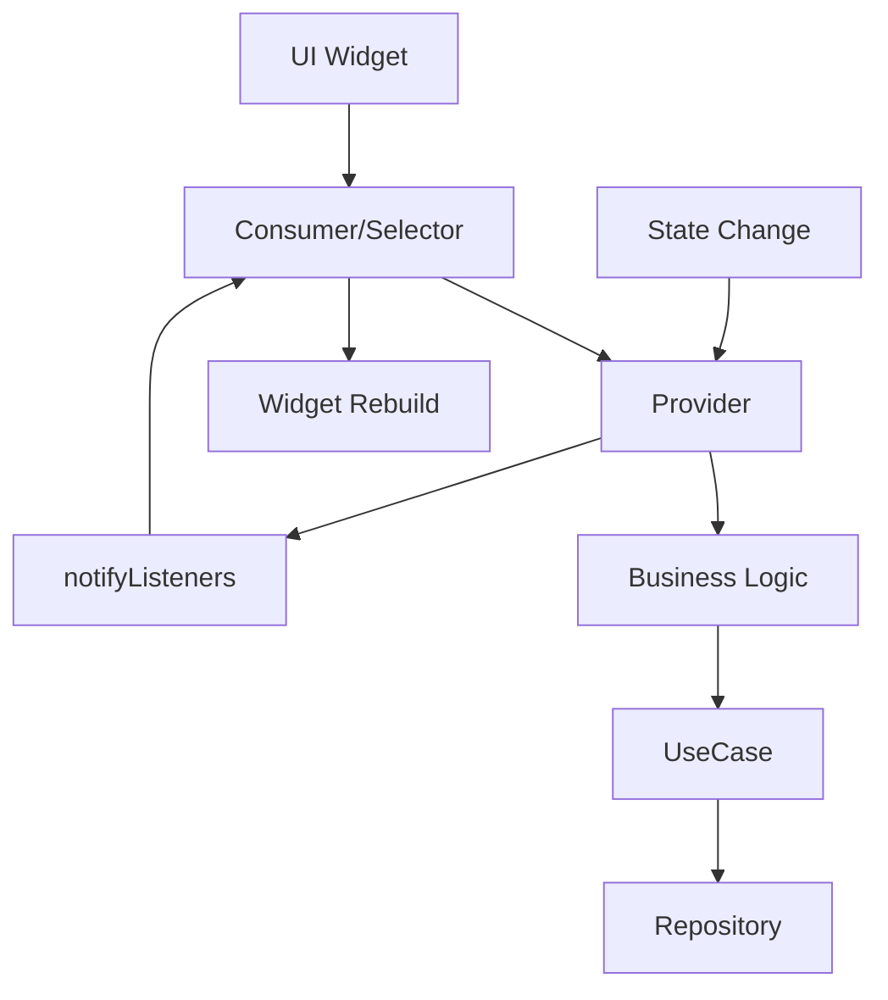

# 🔄 /lib/features/voting/presentation/providers

> Feature-First Architecture - Voting 상태 관리 계층

## 📋 개요

투표 기능의 **State Management Layer**를 담당하는 디렉토리입니다. Provider 패턴을 사용하여 투표 상태, 알림 상태, 순위 정보를 관리합니다.

### 🎯 목적
- **상태 중앙화**: 투표 관련 상태의 중앙 집중식 관리
- **반응형 UI**: 상태 변경 시 자동 UI 업데이트
- **비즈니스 로직 분리**: UI와 비즈니스 로직 분리
- **테스트 용이성**: Provider 단위 테스트 가능

## 🏗️ 디렉토리 구조

```
providers/
├── vote_provider.dart                # 투표 상태 관리
├── notification_provider.dart        # 알림 상태 관리
├── notification_badge_provider.dart  # 알림 뱃지 상태
├── ranking_provider.dart             # 순위 상태 관리
├── vote_timer_provider.dart          # 타이머 상태 관리
└── vote_creation_provider.dart       # 투표 생성 상태
```

## 📂 주요 Provider 구현

### VoteProvider

**역할**: 투표 상태 관리 Provider

**주요 기능**:
- 투표 상태 중앙 관리
- 실시간 투표 업데이트 구독
- 낙관적 업데이트 처리
- 투표 결과 조회 및 캐싱

**의존성**:
- CastVoteUseCase: 투표 실행
- GetVoteResultsUseCase: 결과 조회
- VoteStateCoordinator: 상태 조정

**상태 관리**:
- voteStates: postId별 투표 상태 Map
- subscriptions: 실시간 구독 관리
- isLoading: 로딩 상태
- errorMessage: 에러 메시지

**주요 메서드**:
- `initializeVote()`: 투표 상태 초기화 및 구독
- `castVote()`: 투표 실행 및 낙관적 업데이트
- `getVoteResults()`: 투표 결과 조회
- `getVoteState()`: 특정 투표 상태 조회

**낙관적 업데이트**:
- 즉시 UI 업데이트
- 실패 시 롤백 처리
- 서버 동기화

### NotificationProvider

**역할**: 알림 상태 관리 Provider

**주요 기능**:
- 알림 목록 관리 (전체/미읽음)
- 실시간 알림 구독 및 처리
- 읽음 상태 관리
- 인앱 알림 표시 조정

**의존성**:
- SendNotificationUseCase: 알림 전송
- NotificationService: 알림 서비스
- GlobalNotificationManager: 전역 알림 관리

**상태 관리**:
- notifications: 전체 알림 리스트
- unreadNotifications: 미읽음 알림
- notificationSubscription: 실시간 구독
- unreadCount: 미읽음 개수

**주요 메서드**:
- `initialize()`: 알림 초기화 및 구독 시작
- `markAsRead()`: 개별 알림 읽음 처리
- `markAllAsRead()`: 일괄 읽음 처리
- `deleteNotification()`: 알림 삭제
- `refresh()`: 알림 목록 새로고침

**실시간 처리**:
- 새 알림 자동 추가
- 중복 알림 방지
- 인앱 알림 표시

### NotificationBadgeProvider

**역할**: 알림 뱃지 상태 관리 Provider

**주요 기능**:
- 뱃지 카운트 관리
- 뱃지 표시/숨김 제어
- 99+ 형식 표시 지원

**상태 관리**:
- badgeCount: 뱃지 숫자
- showBadge: 표시 여부
- badgeText: 표시 텍스트 (99+ 처리)

**주요 메서드**:
- `setBadgeCount()`: 카운트 직접 설정
- `incrementBadgeCount()`: 카운트 증가
- `decrementBadgeCount()`: 카운트 감소
- `resetBadge()`: 뱃지 초기화
- `toggleBadgeVisibility()`: 표시 토글

### RankingProvider

**역할**: 순위 상태 관리 Provider

**주요 기능**:
- 답변 순위 관리 (pointsA)
- 질문 순위 관리 (pointsQ)
- 순위 타입 전환
- 사용자 순위 조회

**의존성**:
- RankingRepository: 순위 데이터 접근

**상태 관리**:
- answerRankings: 답변 순위 리스트
- questionRankings: 질문 순위 리스트
- selectedType: 선택된 순위 타입
- currentRankings: 현재 선택된 순위

**주요 메서드**:
- `loadRankings()`: 순위 데이터 로드
- `changeRankingType()`: 순위 타입 변경
- `getUserRank()`: 특정 사용자 순위 조회
- `refresh()`: 순위 새로고침

**순위 시스템**:
- Top 100 사용자 표시
- 실시간 순위 업데이트
- 두 가지 리더보드 관리

## 🔄 Provider 패턴



## 🧪 테스트 전략

### Provider 단위 테스트

**테스트 구조**:
- 각 Provider별 독립적인 테스트 그룹
- Mock 객체를 사용한 의존성 격리
- ChangeNotifier 리스너 테스트

**주요 테스트 케이스**:
- 상태 초기화 테스트
- 비즈니스 로직 실행 테스트
- 낙관적 업데이트 및 롤백
- 에러 처리 테스트
- 스트림 구독 테스트

**Mock 객체**:
- MockCastVoteUseCase
- MockVoteStateCoordinator
- MockNotificationService
- MockRankingRepository

**검증 항목**:
- 상태 변경 확인
- notifyListeners 호출 검증
- 에러 상태 관리
- 리소스 정리

## ⚠️ 에러 처리

### Provider 에러 상태

**에러 타입**:
- **network**: 네트워크 오류
- **validation**: 유효성 검증 실패
- **authorization**: 권한 부족
- **unknown**: 알 수 없는 오류

**ProviderError 구조**:
- message: 에러 메시지
- type: 에러 타입
- details: 추가 정보

**에러 처리 전략**:
- 낙관적 업데이트 후 롤백
- 사용자에게 명확한 피드백
- 에러 로깅 및 모니터링
- 재시도 로직

## ✅ 체크리스트

### 구현 완료
- [x] VoteProvider - 투표 상태 관리
- [x] NotificationProvider - 알림 상태 관리
- [x] NotificationBadgeProvider - 뱃지 상태
- [x] RankingProvider - 순위 상태 관리

### 구현 예정
- [ ] VoteTimerProvider - 타이머 상태
- [ ] VoteCreationProvider - 투표 생성 상태
- [ ] VoteHistoryProvider - 투표 히스토리
- [ ] VoteAnalyticsProvider - 투표 분석

## 📚 참고 자료

- [Provider Documentation](https://pub.dev/packages/provider)
- [ChangeNotifier Pattern](https://api.flutter.dev/flutter/foundation/ChangeNotifier-class.html)
- [State Management Guide](https://docs.flutter.dev/data-and-backend/state-mgmt/intro)

---

*이 문서는 Feature-First Architecture의 Voting 기능 Provider 가이드입니다.*
*최종 업데이트: 2025-08-24*