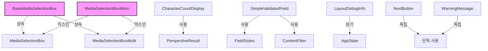

# 📦 In Put Post Image Components 디렉토리

> 게시물 작성 시 사용되는 재사용 가능한 UI 컴포넌트 모음

## 📑 목차
- [개요](#개요)
- [네이밍 컨벤션](#네이밍-컨벤션)
- [주요 구성요소](#주요-구성요소)
- [컴포넌트 상세 설명](#컴포넌트-상세-설명)
- [컴포넌트 관계도](#컴포넌트-관계도)
- [사용 예시](#사용-예시)
- [의존성](#의존성)
- [변경 이력](#변경-이력)

## 🎯 개요

이 디렉토리는 Versus Space 앱의 게시물 작성 기능에서 사용되는 모든 재사용 가능한 UI 컴포넌트들을 포함합니다. 각 컴포넌트는 독립적으로 작동하며 명확한 책임과 인터페이스를 가지고 있습니다.

### 주요 특징
- **모듈화**: 각 컴포넌트는 독립적으로 사용 가능
- **재사용성**: 다양한 컨텍스트에서 재사용 가능한 설계
- **타입 안정성**: 강력한 타입 체크와 null safety 지원
- **성능 최적화**: 이미지 캐싱 및 프리로딩 전략 구현
- **접근성**: 스크린 리더 지원 및 키보드 네비게이션

## 📐 네이밍 컨벤션

프로젝트 전체 네이밍 규칙을 따릅니다:

- **파일명**: snake_case (Dart 표준)
  - ✅ `media_selection_box.dart`
  - ✅ `character_count_display.dart`
  - ❌ `MediaSelectionBox.dart`

- **클래스명**: PascalCase
  - ✅ `MediaSelectionBox`
  - ✅ `CharacterCountDisplay`

- **변수/메서드**: camelCase
  - ✅ `getBoxHeight()`
  - ✅ `imageCount`

- **필드명**: camelCase (Firestore 호환)
  - ✅ `imageUrls`
  - ✅ `dynamicHeight`

상세 내용: [NAMING_CONVENTION.md](../../../../NAMING_CONVENTION.md)

## 🔧 주요 구성요소

### 1. 미디어 선택 컴포넌트

#### BaseMediaSelectionBox (추상 클래스)
```dart
// 기본 추상 클래스 - 공통 기능 정의
abstract class BaseMediaSelectionBox extends StatefulWidget {
  final String label;              // 'A' or 'B'
  final bool isSelected;           // 선택 상태
  final bool isVideoSelected;      // 비디오/이미지 구분
  final VoidCallback onTap;        // 탭 콜백
  final Color boxColor;            // 박스 색상
  final double? dynamicHeight;     // 동적 높이
  final double? dynamicWidth;      // 동적 너비
}
```

#### MediaSelectionBoxMixin
```dart
// 공통 기능 제공 믹스인
mixin MediaSelectionBoxMixin<T extends BaseMediaSelectionBox> on State<T> {
  // 박스 높이 계산
  double getBoxHeight() {
    return widget.dynamicHeight ?? (widget.isSelected 
        ? (widget.isHorizontal ? 350.0 : 250.0)
        : (widget.isHorizontal ? 350.0 : 200.0));
  }
  
  // 메모리 캐시 너비 계산
  int calculateMemCacheWidth() {
    return UnifiedImageCacheService.calculateForBox(
      context,
      boxWidth: widget.dynamicWidth,
      isHorizontal: widget.isHorizontal,
    );
  }
}
```

#### MediaSelectionBox (단일 이미지)
- **용도**: A/B 박스에 단일 이미지 표시
- **기능**: 
  - File과 URL 모두 지원
  - 편집, 추가, 삭제 액션 버튼
  - 검열 상태 오버레이
  - 흔들림 애니메이션

#### MediaSelectionBoxMulti (멀티 이미지)
- **용도**: A/B 박스에 최대 4개 이미지 표시
- **기능**:
  - PageView로 스와이프 지원
  - 페이지 인디케이터와 카운터
  - 인접 이미지 프리로딩
  - 현재 인덱스 추적

### 2. 텍스트 필드 컴포넌트

#### CharacterCountDisplay
```dart
// 글자수 카운터 + 유효성 검사 메시지
class CharacterCountDisplay extends StatefulWidget {
  final TextEditingController? controller;
  final int maxLength;
  final bool isEmpty;
  final bool hasBlockedWord;
  final PerspectiveResult? validationResult;
  
  // 에러 메시지 표시 로직
  String _getErrorMessage() {
    if (isEmpty) return '필수 항목입니다';
    if (validationResult?.isToxic) return '독성 콘텐츠가 감지되었습니다';
    if (hasBlockedWord) return '⚠️ 부적절한 언어가 포함됨';
    return '';
  }
}
```

#### SimpleValidatedField
```dart
// 통합 입력 필드 - 유효성 검사, 필터링, 스타일링
class SimpleValidatedField extends StatelessWidget {
  final TextEditingController? controller;
  final String labelKey;           // i18n 키
  final String hintKey;            // i18n 키
  final String? fieldName;         // 필드 타입
  final PerspectiveResult? validationResult;
  
  // FieldStyles 기반 자동 설정
  final config = FieldStyles.getConfig(fieldName ?? '');
}
```

### 3. UI 도우미 컴포넌트

#### LayoutDebugInfo
- **용도**: 개발 모드에서 레이아웃 정보 표시
- **표시 정보**:
  - 현재 레이아웃 (가로/세로)
  - A/B 박스 크기
  - 이미지 비율
- **조건부 렌더링**: 프로덕션 빌드에서 자동 숨김

#### WarningMessage
- **용도**: 경고/에러 메시지 표시
- **스타일**: 빨간색 텍스트, 커스텀 가능
- **사용처**: "A를 먼저 채워주세요" 등

#### NextButton
- **용도**: 다음 단계 진행 버튼
- **특징**:
  - FloatingActionButton 스타일
  - 애니메이션 페이드 인/아웃
  - 조건부 활성화

## 🔄 컴포넌트 관계도



## 💻 사용 예시

### MediaSelectionBox 사용
```dart
// 단일 이미지 박스
MediaSelectionBox(
  label: 'A',
  isSelected: true,
  isVideoSelected: false,
  onTap: () => _showMediaPicker('A'),
  onCancel: () => _removeImage('A'),
  isHorizontal: false,
  boxColor: AppTheme.of(context).primary,
  imageFile: selectedImageFile,
  imageUrl: fallbackImageUrl,
  showPlusIcon: !isBBoxVisible,
  onPlusIconTap: () => _toggleBBox(),
  onEditTap: () => _editImage('A'),
  onAddImageTap: () => _addMoreImages('A'),
  dynamicHeight: calculatedHeight,
  dynamicWidth: calculatedWidth,
  moderationStatus: 'approved',
)

// 멀티 이미지 박스
MediaSelectionBoxMulti(
  label: 'B',
  isSelected: false,
  isVideoSelected: false,
  onTap: () => _showMediaPicker('B'),
  onCancel: (index) => _removeImageAt('B', index),
  isHorizontal: true,
  boxColor: AppTheme.of(context).secondary,
  imageFiles: multipleImageFiles,
  imageUrls: fallbackImageUrls,
  onCurrentIndexChanged: (index) => setState(() {
    currentIndex = index;
  }),
  onEditTap: () => _editCurrentImage(),
  onAddImageTap: () => _addMoreImages('B'),
)
```

### CharacterCountDisplay 사용
```dart
// 설명 필드 아래에 추가
CharacterCountDisplay(
  controller: _descriptionController,
  maxLength: 200,
  isEmpty: _descriptionController.text.isEmpty,
  hasBlockedWord: _hasBlockedContent,
  validationResult: _perspectiveResult,
  emptyMessage: '설명을 입력해주세요',
  toxicMessage: '부적절한 내용이 포함되어 있습니다',
  horizontalPadding: 22.0,
  hasValidated: _hasTriedSubmit,
)
```

### SimpleValidatedField 사용
```dart
// 유효성 검사가 포함된 입력 필드
SimpleValidatedField(
  controller: _titleController,
  focusNode: _titleFocusNode,
  labelKey: 'fmvkbv7x',  // "제목"
  hintKey: 'h79jzzp9',    // "제목을 입력하세요"
  fieldName: 'questionTitle',
  maxLength: 50,
  textInputAction: TextInputAction.next,
  onFieldChanged: (value, field, isBlocked) {
    setState(() {
      if (isBlocked) {
        _showBlockedContentWarning();
      }
      _updateFieldState(field, value);
    });
  },
  onRequiredFieldsCheck: () => _checkRequiredFields(),
  validationResult: _titleValidationResult,
  showClearButton: true,
  showValidationResults: true,
)
```

### LayoutDebugInfo 사용
```dart
// 개발 모드에서만 표시
if (kDebugMode) {
  LayoutDebugInfo(
    currentLayout: _currentLayout,
  ),
}
```

## 📦 의존성

### 외부 패키지
- `flutter/material.dart` - Flutter 프레임워크
- `provider` - 상태 관리
- `cached_network_image` - 이미지 캐싱
- `font_awesome_flutter` - 아이콘
- `google_fonts` - 폰트
- `easy_debounce` - 디바운싱

### 내부 의존성
- `/core/app_theme.dart` - 앱 테마
- `/core/app_localizations.dart` - 다국어 지원
- `/app_state.dart` - 전역 상태
- `/services/perspective_api_service.dart` - 콘텐츠 검열
- `/services/unified_image_cache_service.dart` - 이미지 캐싱
- `../constants/field_styles.dart` - 필드 스타일
- `../helpers/aspect_ratio_analyzer.dart` - 비율 분석
- `../utils/debug_helper.dart` - 디버그 유틸
- `../utils/content_filter.dart` - 콘텐츠 필터

## 🔄 변경 이력

### 2025-08-23
- 초기 문서 작성
- 10개 컴포넌트 상세 문서화
- 코드 예시 및 관계도 추가

### 주요 리팩토링 이력
- **BaseMediaSelectionBox 추출** (2025-07-13)
  - 공통 로직을 추상 클래스와 믹스인으로 분리
  - 코드 중복 제거 (약 300줄 감소)

- **SimpleValidatedField 통합** (2025-07-14)
  - ValidatedInputField와 SimpleValidatedField 통합
  - 중앙 집중식 스타일 관리 (FieldStyles)

- **멀티 이미지 지원** (2025-07-09)
  - MediaSelectionBoxMulti 컴포넌트 추가
  - PageView 기반 스와이프 구현
  - 인덱스 관리 및 프리로딩 최적화

## 📝 주요 기능 및 규칙

### + 아이콘 표시 규칙
1. **A박스 전용**: B박스에는 + 아이콘 미표시
2. **조건부 표시**: B박스가 숨겨진 상태일 때만
3. **이미지 유무 무관**: 이미지 존재 여부와 독립적

### 액션 버튼 규칙
1. **이미지 있을 때만**: 편집, 추가 버튼 표시
2. **레이아웃 대응**: 가로/세로 레이아웃에 따라 배치 변경
3. **우선순위**: +B → +이미지 → 편집 순서

### 멀티 이미지 인덱스 관리
1. **삭제 시 조정**: 현재 인덱스가 범위 초과하지 않도록
2. **안전한 인덱스**: `clamp(0, imageCount - 1)` 사용
3. **상태 동기화**: PageController와 currentIndex 동기화

### File vs URL 우선순위
1. **File 우선**: imageFile이 있으면 우선 사용
2. **URL 폴백**: File이 없을 때만 imageUrl 사용
3. **하위 호환성**: 기존 URL 기반 코드 지원

## 🚀 향후 개선 사항

### 계획된 기능
- [ ] 비디오 재생 지원 (VideoPlayer 통합)
- [ ] 드래그 앤 드롭 이미지 재정렬
- [ ] 애니메이션 트랜지션 개선
- [ ] 접근성 레이블 추가

### 성능 최적화
- [ ] 이미지 로딩 전략 개선
- [ ] 메모리 사용량 모니터링
- [ ] 렌더링 최적화

### 코드 품질
- [ ] 단위 테스트 추가
- [ ] 위젯 테스트 작성
- [ ] 문서화 개선