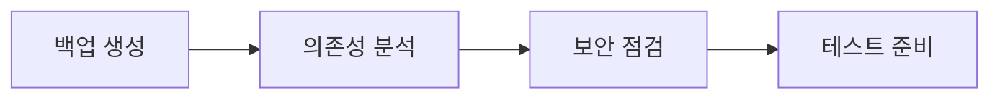

# 📐 Services 레이어 마이그레이션 통합 규칙 문서

> Feature-First Architecture 적용을 위한 Services Layer 통합 마이그레이션 규칙과 순서  
> 작성일: 2025-08-28 | 총 예상 기간: 4주

## 🎯 마이그레이션 핵심 목표

### 1. 아키텍처 목표
- **역방향 의존성 제거**: Services → Features 참조 완전 제거
- **Clean Architecture**: Services 내부에서도 domain/data 분리
- **테스트 가능성**: 정적 메서드 제거, DI 패턴으로 85% 커버리지
- **인터페이스 기반**: 모든 서비스에 인터페이스 정의

### 2. 코드 품질 목표
- **보안 강화**: API 키 환경변수 이동
- **성능 최적화**: 병렬 처리, 캐싱 전략
- **타입 안전성**: 100% 타입 안전한 서비스
- **에러 처리**: 통일된 에러 처리 시스템

## 🛡️ 마이그레이션 백업 규칙

### 1. Git 백업 전략
```bash
# 마이그레이션 시작 전 브랜치 생성
git checkout -b migration/services-layer-$(date +%Y%m%d)
git tag -a backup/pre-services-migration-$(date +%Y%m%d) -m "Before services layer migration"

# 각 서비스별 체크포인트
git tag -a checkpoint/services-[service]-[step] -m "Checkpoint description"

# 예시
git tag -a checkpoint/services-cache-interfaces -m "Cache service interfaces complete"
git tag -a checkpoint/services-moderation-security -m "Moderation API keys secured"
```

### 2. 코드 백업 규칙
```dart
// 삭제 전 반드시 @deprecated 마킹
@deprecated
class OldService { }

// 아카이브 디렉토리 생성
lib/archive/services/[date]/[removed-code]
```

### 3. 호환성 유지 규칙
```dart
// 임시 별칭 제공 (2주일 유지)
// lib/services/cache/unified_cache_service.dart
@Deprecated('Use ICacheService from domain layer')
typedef UnifiedCacheServiceLegacy = UnifiedCacheService;
```

## 📊 현재 상태 분석

### 서비스별 현황
| 서비스 | 파일 수 | 구현율 | 우선순위 | 예상 작업일 |
|--------|---------|--------|----------|-------------|
| **cache** | 4 | 80% | 🔴 Critical | 5일 |
| **moderation** | 3 | 70% | 🔴 Critical | 4일 |
| **ui** | 2 | 60% | 🟡 High | 3일 |
| **content** | 0 | 0% | 🟡 Medium | 5일 |
| **image** | 0 | 0% | 🟡 Medium | 4일 |
| **logger** | 0 | 0% | 🟢 Low | 3일 |

### 핵심 문제 매트릭스
| 문제 | 심각도 | 영향 범위 | 해결 우선순위 |
|------|--------|-----------|--------------|
| API 키 하드코딩 | 🔴 매우 높음 | 보안 | 1 |
| 역방향 의존성 | 🔴 매우 높음 | 아키텍처 | 2 |
| 정적 메서드 남용 | 🟡 중간 | 테스트 | 3 |
| 미구현 서비스 | 🟡 중간 | 기능 | 4 |
| 성능 최적화 부재 | 🟢 낮음 | 성능 | 5 |

## 📋 마이그레이션 실행 순서

### Phase 0: 준비 단계 (Week 1, Day 1)


#### 체크리스트
- [ ] 전체 Services 디렉토리 백업
- [ ] Feature→Services 의존성 매핑
- [ ] API 키 노출 상황 점검
- [ ] 테스트 인프라 준비

### Phase 1: 보안 문제 해결 (Week 1, Day 2) 🚨 URGENT
**목표**: API 키 보안 문제 즉시 해결

#### 실행 내용
1. **환경 변수 설정**
   ```dart
   // .env 파일
   PERSPECTIVE_API_KEY=xxx
   GEMINI_API_KEY=xxx
   CLOUD_VISION_API_KEY=xxx
   
   // lib/core/config/env_config.dart
   class EnvConfig {
     static String get perspectiveApiKey => 
       const String.fromEnvironment('PERSPECTIVE_API_KEY');
   }
   ```

2. **하드코딩 제거**
   ```dart
   // Before
   static const String apiKey = 'AIzaSy...';
   
   // After
   final String apiKey = EnvConfig.perspectiveApiKey;
   ```

#### 성공 기준
- ✅ 모든 API 키 환경변수 이동
- ✅ .gitignore에 .env 추가
- ✅ CI/CD 환경변수 설정

### Phase 2: Cache Service 역방향 의존성 제거 (Week 1, Day 3-5)
**목표**: Services → Backend 의존성 제거

#### Day 3: 인터페이스 정의
```dart
// lib/services/cache/domain/interfaces/i_cache_adapter.dart
abstract interface class ICacheAdapter<T> {
  T fromJson(Map<String, dynamic> json);
  Map<String, dynamic> toJson(T entity);
  String getCacheKey(T entity);
}

// lib/services/cache/domain/interfaces/i_cache_service.dart
abstract interface class ICacheService {
  Future<T?> get<T>(String key);
  Future<void> set<T>(String key, T value, {Duration? ttl});
  Future<void> invalidate(String key);
  void registerAdapter<T>(ICacheAdapter<T> adapter);
}
```

#### Day 4: Adapter 구현
```dart
// lib/features/chat/infrastructure/cache/message_cache_adapter.dart
class MessageCacheAdapter implements ICacheAdapter<Message> {
  @override
  Message fromJson(Map<String, dynamic> json) => Message.fromJson(json);
  
  @override
  Map<String, dynamic> toJson(Message entity) => entity.toJson();
}
```

#### Day 5: 서비스 리팩토링
```dart
// lib/services/cache/data/services/cache_service_impl.dart
@LazySingleton(as: ICacheService)
class CacheServiceImpl implements ICacheService {
  final Map<Type, ICacheAdapter> _adapters = {};
  
  @override
  void registerAdapter<T>(ICacheAdapter<T> adapter) {
    _adapters[T] = adapter;
  }
  
  @override
  Future<T?> get<T>(String key) async {
    final adapter = _adapters[T];
    if (adapter == null) throw AdapterNotRegisteredException(T);
    // 캐시 로직
  }
}
```

#### 성공 기준
- ✅ 모든 Backend import 제거
- ✅ Adapter 패턴 구현
- ✅ DI 통합 완료

### Phase 3: Moderation Service 개선 (Week 2, Day 1-3)
**목표**: 정적 메서드 제거, Clean Architecture 적용

#### Day 1: Clean Architecture 구조
```
lib/services/moderation/
├── domain/
│   ├── entities/
│   │   ├── moderation_result.dart
│   │   └── safety_rating.dart
│   ├── repositories/
│   │   └── i_moderation_repository.dart
│   └── usecases/
│       ├── moderate_text.dart
│       └── moderate_image.dart
├── data/
│   ├── repositories/
│   │   └── moderation_repository_impl.dart
│   └── datasources/
│       ├── perspective_api.dart
│       └── cloud_vision_api.dart
└── presentation/
    └── (없음 - UI 없는 서비스)
```

#### Day 2: 인터페이스 구현
```dart
// domain/repositories/i_moderation_repository.dart
abstract interface class IModerationRepository {
  Future<TextModerationResult> moderateText(String text);
  Future<ImageModerationResult> moderateImage(String path);
  Future<ContentModerationResult> moderateContent({
    required String title,
    required String optionA,
    required String optionB,
    List<String> images = const [],
  });
}
```

#### Day 3: DI 통합
```dart
@module
abstract class ModerationModule {
  @lazySingleton
  IModerationRepository get moderationRepository => 
    ModerationRepositoryImpl(
      perspectiveApi: PerspectiveApiClient(
        apiKey: EnvConfig.perspectiveApiKey,
      ),
      visionApi: CloudVisionClient(
        apiKey: EnvConfig.cloudVisionApiKey,
      ),
    );
}
```

#### 성공 기준
- ✅ 정적 메서드 완전 제거
- ✅ Clean Architecture 구조 적용
- ✅ DI 패턴 구현
- ✅ 병렬 처리 구현

### Phase 4: UI Service 의존성 정리 (Week 2, Day 4-5)
**목표**: Feature 의존성 제거

#### Day 4: AspectRatioAnalyzer 이동
```dart
// Before: services/ui/unified_box_calculator.dart
import 'package:versus_space/features/posts/domain/usecases/media/aspect_ratio_analyzer.dart';

// After: AspectRatioAnalyzer를 Services로 이동
// lib/services/ui/domain/entities/layout_analyzer.dart
class LayoutAnalyzer {
  static LayoutType analyze(List<double> ratios) { }
}
```

#### Day 5: 인터페이스 기반 리팩토링
```dart
// lib/services/ui/domain/interfaces/i_responsive_service.dart
abstract interface class IResponsiveService {
  bool isMobile(BuildContext context);
  bool isTablet(BuildContext context);
  double getBoxHeight(BuildContext context, String type);
}

// lib/services/ui/data/services/responsive_service_impl.dart
@LazySingleton(as: IResponsiveService)
class ResponsiveServiceImpl implements IResponsiveService {
  // 구현
}
```

#### 성공 기준
- ✅ Feature 의존성 제거
- ✅ 정적 메서드 제거
- ✅ DI 패턴 적용

### Phase 5: Content Service 구현 (Week 3, Day 1-3)
**목표**: 콘텐츠 처리 서비스 구축

#### Day 1: 도메인 설계
```dart
// domain/entities/content.dart
class Content {
  final String id;
  final ContentType type;
  final Map<String, dynamic> data;
  final ContentMetadata metadata;
}

// domain/usecases/validate_content.dart
class ValidateContent {
  final IContentRepository repository;
  
  Future<ValidationResult> call(Content content) {
    return repository.validate(content);
  }
}
```

#### Day 2: 구현체 작성
```dart
// data/services/content_service_impl.dart
@LazySingleton(as: IContentService)
class ContentServiceImpl implements IContentService {
  @override
  Future<Content> generate(GenerationParams params) { }
  
  @override
  Future<Content> transform(Content content, TransformationType type) { }
  
  @override
  Future<ValidationResult> validate(Content content) { }
}
```

#### Day 3: Feature 통합
```dart
// Feature에서 사용
final contentService = getIt<IContentService>();
final content = await contentService.generate(params);
```

#### 성공 기준
- ✅ Content Service 완전 구현
- ✅ 테스트 커버리지 80%
- ✅ Feature 통합 완료

### Phase 6: Image Service 구현 (Week 3, Day 4-5)
**목표**: 이미지 처리 서비스 통합

#### Day 4: 서비스 구현
```dart
// lib/services/image/domain/usecases/process_image.dart
class ProcessImage {
  final IImageRepository repository;
  
  Future<ProcessedImage> call(ProcessImageParams params) async {
    // 1. 압축
    final compressed = await repository.compress(params.file);
    
    // 2. 리사이징
    final resized = await repository.resize(compressed, params.size);
    
    // 3. 썸네일 생성
    final thumbnail = await repository.generateThumbnail(resized);
    
    return ProcessedImage(
      original: compressed,
      display: resized,
      thumbnail: thumbnail,
    );
  }
}
```

#### Day 5: 캐싱 통합
```dart
// 이미지 캐싱 최적화
class ImageCacheManager {
  final ICacheService _cache;
  
  Future<void> preloadImages(List<String> urls) async {
    await Future.wait(
      urls.map((url) => _cache.set(url, _downloadImage(url))),
    );
  }
}
```

#### 성공 기준
- ✅ Image Service 구현
- ✅ 압축/리사이징 최적화
- ✅ 캐싱 통합

### Phase 7: Logger Service 구현 (Week 4, Day 1-2)
**목표**: 구조화된 로깅 시스템

#### Day 1: 로깅 인프라
```dart
// domain/entities/log_entry.dart
class LogEntry {
  final LogLevel level;
  final String message;
  final Map<String, dynamic> metadata;
  final DateTime timestamp;
  final String? stackTrace;
}

// domain/usecases/log_event.dart
class LogEvent {
  final ILoggerRepository repository;
  
  Future<void> call(LogEntry entry) {
    return repository.log(entry);
  }
}
```

#### Day 2: 구현 및 통합
```dart
// data/services/logger_service_impl.dart
@LazySingleton(as: ILoggerService)
class LoggerServiceImpl implements ILoggerService {
  @override
  void debug(String message, [Map<String, dynamic>? metadata]) { }
  
  @override
  void info(String message, [Map<String, dynamic>? metadata]) { }
  
  @override
  void warning(String message, [Map<String, dynamic>? metadata]) { }
  
  @override
  void error(String message, [dynamic error, StackTrace? stackTrace]) { }
}
```

#### 성공 기준
- ✅ 구조화된 로깅 구현
- ✅ 메타데이터 지원
- ✅ 외부 서비스 통합 (Sentry, Crashlytics)

### Phase 8: 테스트 및 검증 (Week 4, Day 3-5)
**목표**: 전체 Services Layer 검증

#### Day 3: 단위 테스트
```dart
// 각 서비스별 단위 테스트
group('CacheService', () {
  test('should cache and retrieve data', () async {
    final cache = CacheServiceImpl();
    cache.registerAdapter(TestAdapter());
    
    await cache.set('key', testData);
    final result = await cache.get<TestData>('key');
    
    expect(result, equals(testData));
  });
});
```

#### Day 4: 통합 테스트
```dart
// 서비스 간 통합 테스트
test('Content moderation with caching', () async {
  final moderation = getIt<IModerationService>();
  final cache = getIt<ICacheService>();
  
  final result = await moderation.moderateContent(content);
  await cache.set('moderation_result', result);
  
  final cached = await cache.get<ModerationResult>('moderation_result');
  expect(cached, equals(result));
});
```

#### Day 5: 문서화 및 마무리
- API 문서 생성
- 사용 가이드 작성
- 마이그레이션 완료 보고서

## 🔧 코드 개선 규칙

### 1. 의존성 방향 규칙
```dart
// RULE 1: Services는 Features를 import할 수 없음
// ❌ Bad
import 'package:versus_space/features/chat/domain/models/message.dart';

// ✅ Good - Adapter 패턴 사용
interface ICacheAdapter<T> {
  T fromJson(Map<String, dynamic> json);
}
```

### 2. 정적 메서드 금지 규칙
```dart
// RULE 2: 정적 메서드 사용 금지
// ❌ Bad
class ServiceA {
  static Future<void> doSomething() { }
}

// ✅ Good - 인스턴스 메서드 + DI
@injectable
class ServiceA {
  Future<void> doSomething() { }
}
```

### 3. 보안 규칙
```dart
// RULE 3: API 키는 절대 하드코딩 금지
// ❌ Bad
const API_KEY = 'AIzaSy...';

// ✅ Good
final apiKey = const String.fromEnvironment('API_KEY');
```

### 4. 인터페이스 규칙
```dart
// RULE 4: 모든 서비스는 인터페이스 구현
// ❌ Bad
class ModerationService {
  // 직접 구현
}

// ✅ Good
abstract interface class IModerationService {
  Future<ModerationResult> moderate(String content);
}

@LazySingleton(as: IModerationService)
class ModerationServiceImpl implements IModerationService {
  @override
  Future<ModerationResult> moderate(String content) { }
}
```

### 5. 테스트 우선 규칙
```dart
// RULE 5: 서비스 변경 전 테스트 작성
@GenerateMocks([IModerationService, ICacheService])
void main() {
  test('should moderate content correctly', () async {
    // Given
    when(mockModeration.moderate(any)).thenAnswer((_) async => result);
    
    // When
    final actual = await service.moderate('test');
    
    // Then
    expect(actual, equals(result));
  });
}
```

## 🚨 위험 관리 매트릭스

| 위험 요소 | 발생 확률 | 영향도 | 대응 방안 | 책임자 |
|----------|---------|-------|----------|--------|
| **API 키 노출** | 높음 | 매우 높음 | 즉시 환경변수 이동 | 보안팀 |
| **역방향 의존성** | 높음 | 높음 | Adapter 패턴 적용 | 아키텍트 |
| **서비스 중단** | 중간 | 높음 | 점진적 마이그레이션 | 개발팀 |
| **테스트 부족** | 중간 | 중간 | TDD 적용, CI/CD | QA팀 |
| **성능 저하** | 낮음 | 중간 | 프로파일링, 최적화 | 성능팀 |

## 🔄 롤백 전략

### 1. 즉시 롤백 (< 1시간)
```bash
# 최근 체크포인트로 롤백
git reset --hard checkpoint/services-[service]-[step]

// Feature Flag 사용
FeatureFlags.useNewServices = false;
```

### 2. 부분 롤백 (< 1일)
```dart
// 특정 서비스만 롤백
class ServiceConfig {
  static bool useNewCacheService = false;   // 롤백
  static bool useNewModerationService = true;  // 유지
  static bool useNewUIService = true;          // 유지
}
```

### 3. 전체 롤백 (< 1주)
```bash
# 마이그레이션 전 상태로 복원
git checkout backup/pre-services-migration-[date]
git checkout -b hotfix/rollback-services-migration
```

## 📊 성공 측정 지표

### 정량적 지표
- [ ] **구현 완성도**
  - 서비스 구현율: 100% (6/6)
  - 테스트 커버리지: > 85%
  - 인터페이스 정의: 100%

- [ ] **성능 지표**
  - API 응답 시간: < 200ms
  - 캐시 히트율: > 70%
  - 병렬 처리: 100% 적용

- [ ] **코드 품질**
  - 역방향 의존성: 0개
  - 정적 메서드: 0개
  - 타입 안전성: 100%

### 정성적 지표
- [ ] 보안 강화 완료
- [ ] Clean Architecture 적용
- [ ] DI 패턴 전면 도입
- [ ] 문서화 100%

## 🏁 최종 체크리스트

### Week 1 완료 조건
- [ ] API 키 보안 문제 해결
- [ ] Cache Service 역방향 의존성 제거
- [ ] 기본 인터페이스 정의
- [ ] 테스트 인프라 구축

### Week 2 완료 조건
- [ ] Moderation Service Clean Architecture 적용
- [ ] UI Service 의존성 정리
- [ ] DI 시스템 구현
- [ ] 테스트 커버리지 50%+

### Week 3 완료 조건
- [ ] Content Service 구현
- [ ] Image Service 구현
- [ ] 테스트 커버리지 70%+
- [ ] Feature 통합 완료

### Week 4 완료 조건
- [ ] Logger Service 구현
- [ ] 통합 테스트 완료
- [ ] 테스트 커버리지 85%+
- [ ] 문서화 100%

## 📚 참고 문서

### 서비스별 마이그레이션 가이드
- [Cache Service Migration](./cache/MIGRATION_Part3.md)
- [Moderation Service Migration](./moderation/MIGRATION_Part3.md)
- [UI Service Migration](./ui/MIGRATION_Part3.md)
- [Content Service Migration](./content/MIGRATION_Part3.md)
- [Image Service Migration](./image/MIGRATION_Part3.md)
- [Logger Service Migration](./logger/MIGRATION_Part3.md)

### 테스트 가이드
- [Services Test Guide](./TEST.md)
- [Cache Test Guide](./cache/TEST.md)
- [Moderation Test Guide](./moderation/TEST.md)

### 아키텍처 문서
- [Feature-First Architecture](/FEATURE_ARCHITECTURE.md)
- [Backend Layer Documentation](/lib/backend/README.md)
- [Core Layer Documentation](/lib/core/README.md)

## 🤝 책임 및 역할

| 역할 | 담당자 | 책임 범위 |
|-----|-------|----------|
| **아키텍트** | TBD | 전체 설계, 의존성 관리 |
| **보안 담당** | TBD | API 키 보안, 검증 |
| **백엔드 리드** | TBD | 서비스 구현 |
| **프론트엔드 리드** | TBD | Feature 통합 |
| **QA** | TBD | 테스트 작성 및 검증 |
| **DevOps** | TBD | CI/CD, 환경 설정 |

---

*이 문서는 Services 레이어 전체 마이그레이션의 통합 규칙과 실행 순서를 정의합니다.*  
*4주간의 체계적인 마이그레이션으로 완전한 Clean Architecture와 보안 강화를 달성합니다.*