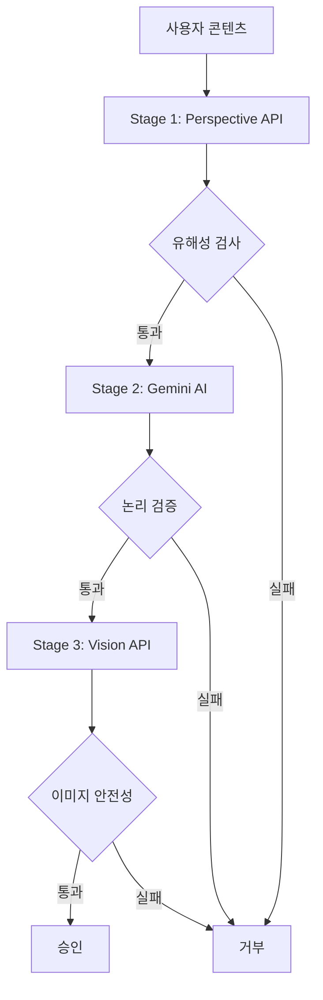

# 📦 Services 디렉토리

> Versus Space 애플리케이션의 핵심 비즈니스 로직과 서비스 레이어

## 🎯 개요

`/lib/services` 디렉토리는 Versus Space 앱의 비즈니스 로직과 외부 서비스 통합을 담당하는 핵심 서비스 레이어입니다. AI 기반 콘텐츠 검열, 3-Layer 캐싱 시스템, 실시간 알림, 투표 시스템 등 앱의 주요 기능을 구현합니다.

## 📐 네이밍 컨벤션

프로젝트 전체 네이밍 컨벤션을 준수합니다:
- **파일명**: snake_case (예: `notification_service.dart`)
- **클래스명**: PascalCase (예: `NotificationService`)
- **메서드/변수**: camelCase (예: `startListening`, `userId`)
- **상수**: camelCase 또는 UPPER_SNAKE_CASE (예: `defaultTimeout`, `API_KEY`)

참고: [프로젝트 네이밍 컨벤션 가이드](../../NAMING_CONVENTION.md)

## 📁 디렉토리 구조

```
services/
├── ai_moderation/              # AI 기반 콘텐츠 검열 시스템
│   ├── constants/              # 검열 설정 및 상수
│   ├── models/                 # 검열 결과 데이터 모델
│   ├── text_moderation/        # 텍스트 검증 모듈
│   └── ai_moderation_service.dart  # 통합 검열 서비스
├── cache/                      # 3-Layer 캐싱 시스템
│   ├── unified_cache_service.dart   # 통합 캐시 오케스트레이터
│   ├── simple_memory_cache.dart     # L1 메모리 캐시
│   ├── cache_statistics.dart        # 캐시 성능 모니터링
│   └── preload_strategy.dart        # 캐시 워밍 전략
├── notification_service.dart         # 실시간 알림 처리
├── global_notification_manager.dart  # 글로벌 알림 매니저
├── target_audience_service.dart      # 타겟 오디언스 관리
├── vote_timer_service.dart           # 투표 타이머 동기화
├── vote_status_service.dart          # 투표 상태 관리
├── vote_state_coordinator.dart       # 투표 상태 조정자
├── storage_service.dart              # Firebase Storage 관리
├── user_cache_service.dart           # 사용자 데이터 캐싱
├── unified_image_cache_service.dart  # 통합 이미지 캐싱
├── perspective_api_service.dart      # Google Perspective API
└── image_moderation_service.dart     # 이미지 검열 (레거시)
```

## 🔧 주요 구성요소

### 1. AI 검열 시스템 (ai_moderation/)

**3단계 AI 기반 콘텐츠 검증 시스템**

#### 📋 개요
텍스트와 이미지를 3단계로 검증하여 안전한 콘텐츠만 플랫폼에 게시되도록 보장합니다.

#### 🔄 검증 플로우


#### 💡 주요 기능
- **텍스트 검열**: Perspective API + Gemini AI
- **이미지 검열**: Google Cloud Vision API
- **실시간 피드백**: 단계별 진행 상태 업데이트
- **상세 거부 사유**: 구체적인 문제점 설명

#### 📊 검증 지표
- **Perspective API**: 유해성, 욕설, 위협, 모욕, 신원 공격
- **Gemini AI**: 논리적 타당성, 대결 구조, 비교 가능성
- **Vision API**: 성인물, 폭력, 의료, 선정성, 스푸핑

#### 💻 사용 예시
```dart
final request = ModerationRequest(
  questionTitle: "어느 것이 더 좋나요?",
  titleA: "옵션 A",
  titleB: "옵션 B",
  userId: currentUser.uid,
  images: [imageFile1, imageFile2],
);

final result = await AIModerationService.moderatePostContent(
  request: request,
  onProgressUpdate: (message) {
    print('진행 상태: $message');
  },
);

if (!result.isValid) {
  await AIModerationService.showModerationDialog(context, result);
}
```

[상세 문서 보기](./ai_moderation/README.md)

### 2. 캐싱 시스템 (cache/)

**3-Layer 고성능 캐싱 아키텍처**

#### 📋 개요
300-500ms의 네트워크 지연을 <10ms로 단축하는 다계층 캐싱 시스템입니다.

#### 🏗️ 아키텍처
```
┌─────────────┐
│   Client    │
└──────┬──────┘
       │
┌──────▼──────┐
│ L1: Memory  │ <10ms (LRU, 100개 제한)
└──────┬──────┘
       │ Miss
┌──────▼──────┐
│  L2: Hive   │ 10-30ms (영구 저장소)
└──────┬──────┘
       │ Miss
┌──────▼──────┐
│L3: Firestore│ 50-100ms (오프라인 캐시)
└──────┬──────┘
       │ Miss
┌──────▼──────┐
│   Network   │ 300-500ms
└─────────────┘
```

#### 💡 주요 기능
- **자동 계층 관리**: 투명한 읽기/쓰기 처리
- **LRU 메모리 캐시**: 100개 제한, 5분 TTL
- **영구 로컬 저장소**: Hive 데이터베이스
- **오프라인 지원**: Firestore 캐시 활용
- **캐시 워밍**: 사전 로딩 전략

#### 📊 성능 지표
| 레이어 | 응답 시간 | 히트율 목표 |
|--------|-----------|-------------|
| L1 Memory | <10ms | 40% |
| L2 Hive | 10-30ms | 30% |
| L3 Firestore | 50-100ms | 20% |
| Network | 300-500ms | 10% |

#### 💻 사용 예시
```dart
// 싱글톤 인스턴스
final cache = UnifiedCacheService.instance;

// 데이터 저장 (모든 레이어에 자동 저장)
await cache.set('user_profile_123', userData);

// 데이터 조회 (L1→L2→L3→Network 순서)
final data = await cache.get('user_profile_123');

// 캐시 무효화
await cache.invalidate('user_profile_123');

// 통계 조회
final stats = cache.getStatistics();
print('캐시 히트율: ${stats.overallHitRate}%');
print('절약된 비용: \$${stats.estimatedCostSavings}');
```

[상세 문서 보기](./cache/README.md)

### 3. 알림 시스템

**실시간 투표 요청 알림 관리**

#### 📋 구성 요소
- **NotificationService**: Firestore 실시간 리스너
- **GlobalNotificationManager**: 알림 큐 관리
- **TargetAudienceService**: 타겟 설정

#### 🔄 알림 플로우
```
Firebase Functions → Firestore → NotificationService 
    → GlobalNotificationManager → UI Display
```

#### 💡 주요 기능
- **실시간 동기화**: Firestore 리스너
- **큐 관리**: 순차적 알림 표시
- **멀티이미지 지원**: PageView 탐색
- **스마트 레이아웃**: aspectRatio 기반 자동 배치

#### 📊 알림 데이터 구조
```dart
{
  'notificationId': String,
  'userId': String,
  'type': 'votingRequest',
  'content': {
    'postData': {
      'questionTitle': String,
      'optionA': Map<String, dynamic>,  // 텍스트, 이미지, aspectRatio
      'optionB': Map<String, dynamic>,
      'layoutType': String,  // 'horizontal', 'vertical'
      'authorName': String
    }
  },
  'createdAt': Timestamp,
  'read': bool,
  'expiryTime': Timestamp
}
```

### 4. 투표 시스템

**중앙 집중식 투표 관리 시스템**

#### 📋 구성 요소
- **VoteTimerService**: 타이머 동기화
- **VoteStatusService**: 투표 제출/검증
- **VoteStateCoordinator**: 상태 조정자

#### 🔄 투표 플로우
```
User Vote → VoteStatusService → Firestore 
    → VoteStateCoordinator → UI Updates
```

#### 💡 주요 기능
- **서버 시간 동기화**: Firebase time_sync 활용
- **실시간 상태 업데이트**: RxDart BehaviorSubject
- **중복 투표 방지**: votes 서브컬렉션 관리
- **타이머 통합**: postId별 단일 Timer

#### 📊 성능 최적화
- Timer 인스턴스: N개 → 1개
- 메모리 사용: O(n) → O(1)
- 모든 기기 동일 시간 표시

#### 💻 사용 예시
```dart
// 투표 제출
await VoteStatusService.submitVote(
  postId: 'post123',
  userId: 'user456',
  choice: 'A',
);

// 상태 스트림 구독
StreamBuilder<VoteState>(
  stream: VoteStateCoordinator.instance.getVoteStateStream(postId),
  builder: (context, snapshot) {
    final state = snapshot.data!;
    return Text('A: ${state.votesA}, B: ${state.votesB}');
  },
);

// 타이머 스트림
StreamBuilder<Duration>(
  stream: VoteTimerService.instance.getRemainingTimeStream(postId, endTime),
  builder: (context, snapshot) {
    final remaining = snapshot.data!;
    return Text('${remaining.inMinutes}분 ${remaining.inSeconds % 60}초');
  },
);
```

### 5. 스토리지 서비스

**Firebase Storage 파일 관리**

#### 💡 주요 기능
- **3단계 이미지 생성**: 원본, 디스플레이(800px), 썸네일(150px)
- **자동 압축**: JPEG 85% 품질
- **메타데이터 관리**: 파일 정보 저장
- **배치 삭제**: 여러 파일 일괄 삭제

#### 💻 사용 예시
```dart
// 이미지 업로드
final urls = await StorageService.uploadImage(
  file: imageFile,
  path: 'posts/images',
  generateThumbnail: true,
);

print('원본: ${urls['original']}');
print('디스플레이: ${urls['display']}');
print('썸네일: ${urls['thumbnail']}');
```

### 6. 이미지 캐싱 서비스

**통합 이미지 최적화 및 캐싱**

#### 💡 주요 기능
- **동적 크기 계산**: 400-1600px 범위
- **컨텍스트별 최적화**: 용도별 캐시 크기
- **프리로딩**: 인접 이미지 사전 로드
- **메모리 관리**: 자동 캐시 정리

#### 💻 사용 예시
```dart
// 이미지 프리로딩
await UnifiedImageCacheService.instance.preloadImages(
  context,
  imageUrls,
  overrideMemCacheWidth: 800,
);

// 동적 캐시 너비 계산
final cacheWidth = UnifiedImageCacheService.calculateMemCacheWidth(displaySize);
```

### 7. 사용자 캐싱 서비스

**사용자 정보 효율적 관리**

#### 💡 주요 기능
- **싱글톤 캐시**: 앱 전체 공유
- **병렬 로드**: Future.wait 활용
- **AI 사용자 지원**: 특수 사용자 처리
- **중복 요청 방지**: 로딩 상태 추적

## 🔄 서비스 통합 플로우

### 게시물 작성 플로우
```dart
// 1. 콘텐츠 검열
final moderationResult = await AIModerationService.moderatePostContent(request);
if (!moderationResult.isValid) return;

// 2. 이미지 업로드
final imageUrls = await StorageService.uploadImage(file, 'posts/images');

// 3. 게시물 생성
final postRef = await FirebaseFirestore.instance.collection('posts').add(postData);

// 4. 타겟 설정
final target = await TargetAudienceService.showTargetAudienceDialog(context, postRef.id);

// 5. 알림 자동 전송 (Firebase Functions)
```

### 채팅방 진입 플로우
```dart
// 1. 캐시에서 메시지 로드
final cachedMessages = await UnifiedCacheService.instance.getChatMessages(chatId);

// 2. 사용자 정보 병렬 로드
final users = await UserCacheService.instance.getUsers(userIds);

// 3. 이미지 프리로드
await UnifiedImageCacheService.instance.preloadImages(context, imageUrls);

// 4. UI 렌더링
```

## 📊 성능 지표

| 서비스 | 개선 전 | 개선 후 | 향상률 |
|--------|---------|---------|--------|
| 채팅 로딩 | 500ms | 200ms | 60% ↓ |
| 메시지 캐싱 | 300ms | <10ms | 97% ↓ |
| 이미지 로딩 | 2s | 500ms | 75% ↓ |
| 투표 동기화 | N timers | 1 timer | O(1) |

## 🔒 보안 고려사항

### API 키 보호
```dart
// 환경 변수 사용
const PERSPECTIVE_API_KEY = String.fromEnvironment('PERSPECTIVE_API_KEY');
const GEMINI_API_KEY = String.fromEnvironment('GEMINI_API_KEY');
```

### 입력 검증
- 모든 사용자 입력 sanitize
- SQL injection 방지
- XSS 공격 방지

### 권한 관리
- Firebase Security Rules 활용
- 사용자별 접근 제어
- Admin/Tester 역할 구분

## 📈 모니터링

### 캐시 통계
```dart
final stats = CacheStatistics.instance;
print(stats.getSummary());
// 히트율, 응답 시간, 비용 절감 등
```

### 에러 추적
```dart
try {
  // 서비스 호출
} catch (e) {
  debugPrint('[ServiceName] Error: $e');
  // Sentry, Crashlytics 등으로 전송
}
```

## 🧪 테스트

### 단위 테스트
```dart
test('캐시 히트율 테스트', () {
  final cache = UnifiedCacheService.instance;
  await cache.set('test_key', 'test_value');
  final value = await cache.get('test_key');
  expect(value, equals('test_value'));
});
```

### 통합 테스트
```dart
testWidgets('알림 표시 플로우', (tester) async {
  // 1. 알림 생성
  // 2. UI 표시 확인
  // 3. 사용자 상호작용
  // 4. 상태 업데이트 확인
});
```

## 📝 변경 이력

### v2.5.0 (2025-08-23)
- 통합 서비스 문서화 완료
- 3-Layer 캐싱 시스템 문서 통합
- AI 검열 시스템 문서 통합

### v2.4.0 (2025-08-18)
- VoteStateCoordinator 리팩토링
- 519줄 레거시 코드 제거
- votes 서브컬렉션 버그 수정

### v2.3.0 (2025-08-17)
- VoteTimerService 서버 동기화 추가
- 캐시 무결성 검증 로직 추가
- PreloadStrategy 인덱스 폴백 구현

### v2.2.0 (2025-08-13)
- 3-Layer 캐싱 시스템 구현
- 채팅 서비스 모듈화
- 사용자 정보 병렬 로드

### v2.1.0 (2025-08-04)
- 스마트 레이아웃 시스템 통합
- 알림 aspectRatio 지원
- 멀티이미지 알림 구현

### v2.0.0 (2025-07-20)
- AI 기반 타겟팅 시스템
- Genkit Framework 통합
- 실시간 알림 시스템 구현

## 🔗 관련 문서

- [AI 검열 시스템 상세](./ai_moderation/README.md)
- [캐싱 시스템 상세](./cache/README.md)
- [프로젝트 아키텍처](../../ARCHITECTURE.md)
- [네이밍 컨벤션](../../NAMING_CONVENTION.md)

## 👥 담당자

- **AI 시스템**: AI/ML 팀
- **캐싱**: 인프라 팀
- **알림**: 백엔드 팀
- **투표**: 프론트엔드 팀

## 📞 문의

기술 문의나 버그 리포트는 GitHub Issues를 통해 제출해주세요.