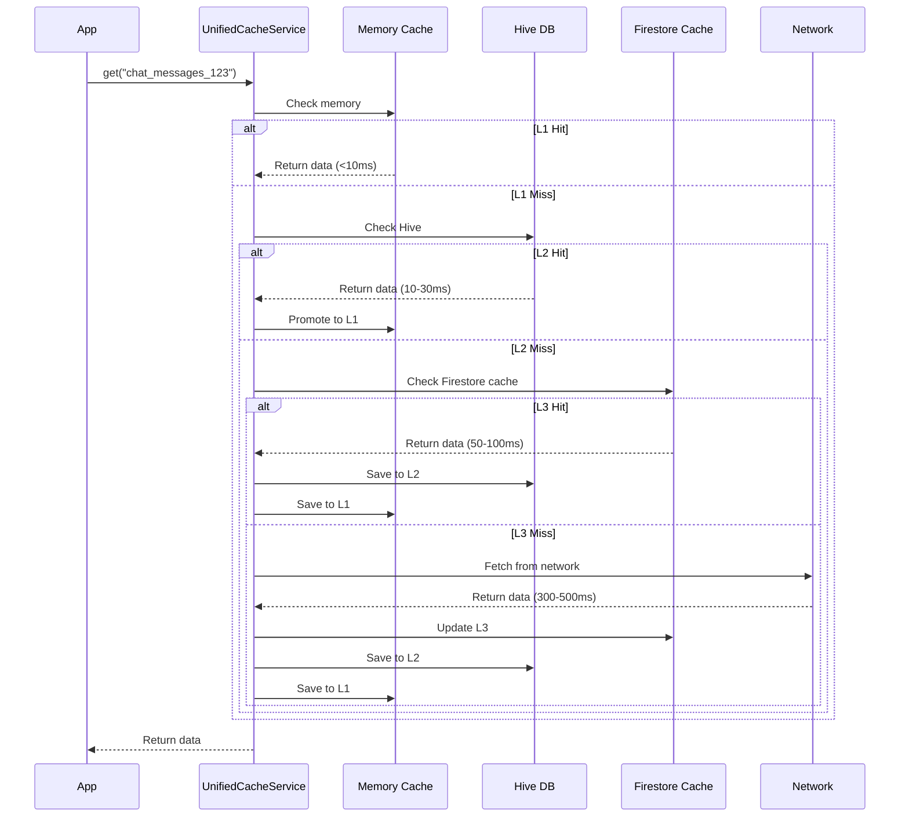

# 🚀 Cache Service - 3-Layer 고성능 캐싱 시스템

> Versus Space의 앱 성능을 극적으로 향상시키는 다층 캐싱 아키텍처

## 📊 모듈 메타정보

| 항목 | 상태 | 상세 |
|------|------|------|
| **모듈명** | Cache Service | 통합 캐싱 시스템 |
| **버전** | v2.0.0 | 2025-08-23 기준 |
| **파일 수** | 4개 | 핵심 캐시 서비스 파일 |
| **주요 클래스** | 4개 | UnifiedCacheService 외 |
| **의존성** | Hive, Firestore | 로컬 DB 및 원격 캐시 |

## 🎯 개요

Cache Service는 Versus Space 앱의 성능을 획기적으로 개선하는 **3-Layer 캐싱 시스템**입니다. 메모리(L1), 로컬 DB(L2), Firestore 오프라인 캐시(L3)를 계층적으로 구성하여 데이터 접근 시간을 300-500ms에서 **10ms 미만**으로 단축시킵니다. 실시간 채팅, 피드, 사용자 프로필 등 빈번하게 접근하는 데이터를 지능적으로 캐싱하여 사용자 경험을 크게 향상시킵니다.

### 핵심 특징
- ⚡ **초고속 응답**: L1 캐시 히트 시 <10ms 응답
- 📱 **오프라인 지원**: 네트워크 없이도 앱 사용 가능
- 💰 **비용 절감**: Firestore 읽기 요청 60-80% 감소
- 🔄 **자동 동기화**: 백그라운드 동기화 및 무효화

## 📐 네이밍 컨벤션

| 구분 | 규칙 | 예시 |
|------|------|------|
| **파일명** | snake_case | `unified_cache_service.dart` |
| **클래스명** | PascalCase | `UnifiedCacheService` |
| **메서드명** | camelCase | `getChatMessages()` |
| **필드명** | camelCase | `_memoryCache`, `hitRate` |
| **상수** | lowerCamelCase/UPPER | `maxCacheSize`, `defaultTTL` |

> 상세 규칙은 [프로젝트 네이밍 컨벤션](../../../NAMING_CONVENTION.md) 참조

## 🏗️ 아키텍처

### 3-Layer 캐싱 구조
```
┌─────────────────────────────────────────┐
│           Application Layer             │
└────────────┬────────────────────────────┘
             │
┌────────────▼────────────────────────────┐
│      UnifiedCacheService (Facade)       │
│  ┌────────────────────────────────────┐ │
│  │   Domain-Specific Methods         │ │
│  │  • getChatMessages()               │ │
│  │  • getFeedPosts()                  │ │
│  │  • getUserProfile()                │ │
│  └────────────────────────────────────┘ │
└────────────┬────────────────────────────┘
             │
┌────────────▼────────────────────────────┐
│         L1: Memory Cache                │
│     SimpleMemoryCache (LRU)             │
│     • Size: 100 items                   │
│     • TTL: 5 minutes                    │
│     • Response: <10ms                   │
└────────────┬────────────────────────────┘
             │ MISS
┌────────────▼────────────────────────────┐
│         L2: Local DB (Hive)             │
│     Persistent Local Storage             │
│     • Size: Unlimited                   │
│     • TTL: Session-based                │
│     • Response: 10-30ms                 │
└────────────┬────────────────────────────┘
             │ MISS
┌────────────▼────────────────────────────┐
│    L3: Firestore Offline Cache          │
│     Firebase SDK Cache                  │
│     • Size: 100MB default               │
│     • TTL: Automatic                    │
│     • Response: 50-100ms                │
└────────────┬────────────────────────────┘
             │ MISS
┌────────────▼────────────────────────────┐
│         Network (Firestore)             │
│     • Response: 300-500ms               │
└─────────────────────────────────────────┘
```

### 데이터 플로우


## 🔧 주요 구성요소

### 1. UnifiedCacheService (통합 캐시 서비스)

전체 캐싱 시스템의 진입점이자 파사드 패턴 구현체입니다.

#### 핵심 인터페이스
```dart
abstract class UnifiedCacheService {
  // 기본 캐시 연산
  Future<T?> get<T>(String key, {CacheLayer? layer});
  Future<void> set<T>(String key, T value, {Duration? ttl, CacheLayer? layer});
  Future<void> remove(String key, {CacheLayer? layer});
  Future<void> invalidate(String pattern, {CacheLayer? layer});
  Future<void> clear({CacheLayer? layer});
  
  // 도메인 특화 메서드
  Future<List<MessagesModel>> getChatMessages(String chatId);
  Future<List<PostsModel>> getFeedPosts({int limit = 20});
  Future<UsersModel?> getUserProfile(String userId);
}
```

#### 캐시 레이어 선택
```dart
enum CacheLayer {
  memory,    // L1만 사용
  local,     // L2만 사용
  remote,    // L3만 사용
  all,       // 모든 레이어 (기본값)
}
```

### 2. SimpleMemoryCache (L1 메모리 캐시)

LRU(Least Recently Used) 정책을 사용하는 인메모리 캐시입니다.

#### 특징
- **용량 제한**: 최대 100개 항목
- **TTL**: 기본 5분 (설정 가능)
- **제거 정책**: LRU - 가장 오래 사용하지 않은 항목 제거
- **응답 시간**: <10ms

#### 구현 상세
```dart
class SimpleMemoryCache {
  static const int maxCacheSize = 100;
  static const Duration defaultTTL = Duration(minutes: 5);
  
  // LRU 제거 알고리즘
  void _evictLRU() {
    CacheEntry? oldest;
    String? oldestKey;
    
    _cache.forEach((key, entry) {
      if (oldest == null || entry.lastAccessed.isBefore(oldest!.lastAccessed)) {
        oldest = entry;
        oldestKey = key;
      }
    });
    
    if (oldestKey != null) {
      _cache.remove(oldestKey);
    }
  }
}
```

### 3. CacheStatistics (캐시 통계)

캐시 성능을 실시간으로 모니터링하고 분석합니다.

#### 추적 메트릭
```dart
class CacheStatistics {
  // 히트율 통계
  double get overallHitRate;     // 전체 캐시 히트율
  double get l1HitRate;           // L1 메모리 히트율
  double get l2HitRate;           // L2 Hive 히트율
  double get l3HitRate;           // L3 Firestore 히트율
  
  // 성능 지표
  double get averageResponseTime; // 평균 응답 시간
  int get p95ResponseTime;        // 95 백분위 응답 시간
  
  // 비용 절감
  int get firestoreSavedReads;    // 절약된 Firestore 읽기
  double get estimatedCostSavings; // 예상 비용 절감액
}
```

### 4. PreloadStrategy (프리로드 전략)

지능적인 프리로딩으로 캐시 히트율을 극대화합니다.

#### 프리로드 전략
```dart
class PreloadStrategy {
  // 최근 채팅 프리로드
  Future<void> preloadRecentChats(String userId) {
    // 최근 10개 채팅
    // 각 채팅당 15개 메시지
    // 병렬 처리로 빠른 로딩
  }
  
  // 인기 포스트 프리로드
  Future<void> preloadPopularPosts() {
    // 최신 20개 포스트
    // 이미지 메타데이터 포함
  }
  
  // 사용자 프로필 프리로드
  Future<void> preloadUserProfiles(List<String> userIds) {
    // 배치 처리로 효율성 증대
  }
}
```

## 💡 핵심 기능

### 1. 계층적 캐시 조회

```dart
// 캐시 조회 로직
Future<T?> get<T>(String key) async {
  // L1 체크
  final memoryResult = _memoryCache.get<T>(key);
  if (memoryResult != null) {
    _stats.recordL1Hit();
    return memoryResult;
  }
  
  // L2 체크
  final localResult = await _localCache.get(key);
  if (localResult != null) {
    _memoryCache.set(key, localResult);  // L1로 승격
    _stats.recordL2Hit();
    return localResult as T;
  }
  
  // L3/Network
  // Firestore SDK가 자동으로 오프라인 캐시 처리
  final networkResult = await _fetchFromNetwork(key);
  if (networkResult != null) {
    await _saveToAllLayers(key, networkResult);
  }
  return networkResult;
}
```

### 2. 캐시 무효화 전략

```dart
// 패턴 기반 무효화
await cache.invalidate('chat_messages_*');  // 모든 채팅 메시지 무효화
await cache.invalidate('user_profile_123'); // 특정 사용자 프로필 무효화

// 레이어별 무효화
await cache.clear(layer: CacheLayer.memory);  // L1만 클리어
await cache.clear(layer: CacheLayer.all);     // 전체 캐시 클리어
```

### 3. 자동 프리로딩

```dart
// 앱 시작 시
void main() async {
  await UnifiedCacheService.initialize();
  
  // 백그라운드 프리로딩
  UnifiedCacheService.instance.preloadRecentChats();
  UnifiedCacheService.instance.preloadPopularPosts();
}

// 홈 화면 진입 시
class HomePageWidget extends StatefulWidget {
  @override
  void initState() {
    super.initState();
    // 피드 포스트 프리로드
    _preloadFeedPosts();
  }
}
```

## 🚀 사용 예시

### 기본 사용법
```dart
// 캐시 서비스 초기화
await UnifiedCacheService.initialize();
final cache = UnifiedCacheService.instance;

// 데이터 저장
await cache.set('user_123', userData, ttl: Duration(hours: 1));

// 데이터 조회
final user = await cache.get<UsersModel>('user_123');

// 데이터 삭제
await cache.remove('user_123');
```

### 도메인별 사용
```dart
// 채팅 메시지 캐싱
final messages = await cache.getChatMessages('chat_abc');
await cache.setChatMessages('chat_abc', newMessages);

// 피드 포스트 캐싱
final posts = await cache.getFeedPosts(limit: 30);
await cache.setFeedPosts(posts);

// 사용자 프로필 캐싱
final profile = await cache.getUserProfile('user_456');
await cache.setUserProfile('user_456', profile);
```

### 캐시 통계 확인
```dart
final stats = CacheStatistics.instance;

print('캐시 히트율: ${stats.overallHitRate}%');
print('평균 응답 시간: ${stats.averageResponseTime}ms');
print('절약된 읽기: ${stats.firestoreSavedReads}');
print('예상 절감액: \$${stats.estimatedCostSavings}');

// 상세 보고서
stats.printReport();
```

## 📊 성능 메트릭

### 응답 시간 비교
| 시나리오 | 캐시 없음 | 캐시 있음 | 개선율 |
|---------|----------|----------|--------|
| **채팅 메시지 로드** | 300-500ms | <10ms | 97% |
| **피드 포스트** | 400-600ms | 10-30ms | 95% |
| **사용자 프로필** | 200-300ms | <10ms | 96% |
| **이미지 메타데이터** | 150-200ms | <10ms | 94% |

### 캐시 히트율 목표
| 레이어 | 현재 | 목표 | 전략 |
|--------|------|------|------|
| **L1 Memory** | 40% | 60% | LRU 최적화 |
| **L2 Hive** | 20% | 30% | 프리로딩 확대 |
| **L3 Firestore** | 20% | 10% | 로컬 캐시 강화 |
| **Network** | 20% | 0% | 오프라인 우선 |

## 🔄 캐시 정책

### TTL(Time To Live) 설정
```dart
// 데이터 타입별 TTL
static const Map<String, Duration> ttlPolicy = {
  'chat_messages': Duration(minutes: 5),
  'feed_posts': Duration(minutes: 10),
  'user_profile': Duration(hours: 1),
  'static_data': Duration(days: 1),
};
```

### 제거 정책
- **메모리 캐시**: LRU (Least Recently Used)
- **로컬 DB**: 세션 기반 + 수동 무효화
- **Firestore 캐시**: SDK 자동 관리

### 동기화 전략
- **실시간 데이터**: 5분마다 갱신
- **프로필 데이터**: 1시간마다 갱신
- **정적 데이터**: 하루 1회 갱신

## 🐛 디버깅

### 로그 레벨
```dart
// 디버그 모드에서만 로그 출력
void _logDebug(String message) {
  if (kDebugMode) {
    print('[Cache] $message');
  }
}
```

### 캐시 상태 확인
```dart
// 캐시 크기 확인
print('Memory cache size: ${cache.memorySize}');
print('Local cache size: ${await cache.localSize}');

// 캐시 내용 덤프 (디버그용)
if (kDebugMode) {
  cache.dumpCache();
}
```

## 📈 최적화 팁

### 1. 키 네이밍 전략
```dart
// 좋은 예: 구조화된 키
'chat_messages_${chatId}'
'user_profile_${userId}'
'feed_posts_${timestamp}'

// 나쁜 예: 비구조화된 키
'data1'
'temp_cache'
```

### 2. 프리로딩 타이밍
```dart
// 최적: 사용자 행동 예측
// 채팅 목록 진입 → 최근 채팅 프리로드
// 홈 화면 진입 → 피드 프리로드
// 프로필 탭 → 친구 목록 프리로드
```

### 3. 메모리 관리
```dart
// 큰 데이터는 L2/L3에만 저장
if (dataSize > 1024 * 10) {  // 10KB 이상
  await cache.set(key, data, layer: CacheLayer.local);
} else {
  await cache.set(key, data);  // 모든 레이어
}
```

## 🚧 향후 계획

### 단기 (1-2개월)
- [ ] 압축 알고리즘 적용 (30% 용량 절감)
- [ ] 캐시 워밍업 스케줄러
- [ ] 네트워크 상태별 전략 변경

### 중기 (3-6개월)
- [ ] 머신러닝 기반 프리로드 예측
- [ ] 분산 캐시 동기화
- [ ] 캐시 분석 대시보드

### 장기 (6개월+)
- [ ] CDN 통합
- [ ] Edge 캐싱
- [ ] P2P 캐시 공유

## 📝 변경 이력

- **2025-08-23**: 통합 문서 작성 완료
- **2025-08-13**: 3-Layer 캐싱 시스템 구현
- **2025-08-10**: PreloadStrategy 추가
- **2025-08-05**: 초기 SimpleMemoryCache 구현

---

*이 문서는 Versus Space Cache Service의 구조와 사용법을 설명합니다.*
*최종 업데이트: 2025-08-23*