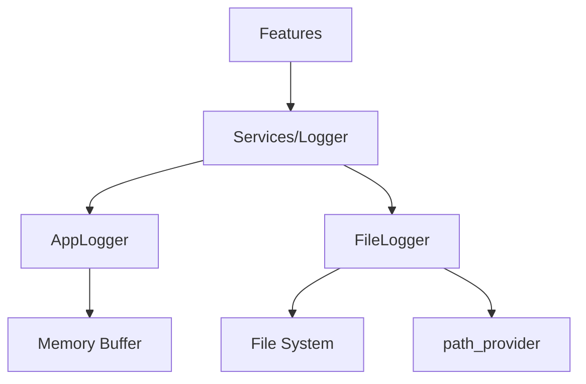

# 🔄 Logger Service 마이그레이션 계획 Part 3

> Logger Service 레이어 리팩토링 및 Clean Architecture 적용  
> 작성일: 2025-08-28 | 예상 기간: 1주

## 📌 Executive Summary

**현재 상황**: 154줄의 2개 파일로 기본 로깅 기능만 구현  
**목표**: Services Layer 유지하며 Clean Architecture 적용  
**방법**: 도메인/데이터/프레젠테이션 레이어 분리, 통합 서비스 구축

## 🏛️ Architecture 원칙

### Feature-First Architecture 준수
```
✅ Services Layer 유지 (전역 서비스이므로)
✅ Features → Services 의존성 (허용됨)  
❌ Services → Features 의존성 (금지)
✅ 내부 Clean Architecture 적용
```

## 📋 현황 분석

### 현재 문제점
1. **분산된 로깅**: AppLogger와 FileLogger가 독립적 동작
2. **레이어 분리 부재**: 단일 파일로만 구현
3. **분석 기능 부재**: 단순 로그 저장만 가능
4. **성능 이슈**: 동기적 처리로 인한 블로킹
5. **원격 추적 부재**: 프로덕션 모니터링 불가

### 현재 구조
```
/lib/services/logger/
├── app_logger.dart      # 64줄 - 메모리 로거
└── file_logger.dart     # 90줄 - 파일 로거
```

### 의존 관계


## 🎯 목표 아키텍처

### Services Layer 내부 Clean Architecture
```
/lib/services/logger/
├── domain/                    # 도메인 레이어
│   ├── entities/
│   │   ├── log_entry.dart         # 로그 엔트리 모델
│   │   ├── log_level.dart         # 로그 레벨 enum
│   │   └── log_category.dart      # 로그 카테고리 enum
│   ├── usecases/
│   │   ├── log_action.dart        # 액션 로깅 유스케이스
│   │   ├── log_error.dart         # 에러 로깅 유스케이스
│   │   ├── filter_logs.dart       # 로그 필터링 유스케이스
│   │   └── export_logs.dart       # 로그 내보내기 유스케이스
│   └── repositories/
│       └── i_log_repository.dart  # Repository 인터페이스
│
├── data/                      # 데이터 레이어
│   ├── services/
│   │   ├── logging_service.dart   # 통합 로깅 서비스
│   │   ├── remote_logger.dart     # 원격 로깅 서비스
│   │   └── batch_processor.dart   # 배치 처리 서비스
│   ├── datasources/
│   │   ├── memory_datasource.dart # 메모리 저장소
│   │   ├── file_datasource.dart   # 파일 저장소
│   │   └── remote_datasource.dart # 원격 저장소
│   └── repositories/
│       └── log_repository_impl.dart # Repository 구현
│
├── presentation/              # 프레젠테이션 레이어 (선택적)
│   ├── providers/
│   │   └── log_provider.dart      # 로그 상태 관리
│   └── widgets/
│       ├── log_viewer.dart        # 로그 뷰어 위젯
│       └── log_exporter.dart      # 로그 내보내기 UI
│
└── utils/                     # 유틸리티
    ├── formatters/
    │   ├── json_formatter.dart    # JSON 포맷터
    │   └── text_formatter.dart    # 텍스트 포맷터
    ├── filters/
    │   ├── level_filter.dart      # 레벨 필터
    │   └── category_filter.dart   # 카테고리 필터
    └── constants.dart             # 상수 정의
```

## 📅 마이그레이션 일정

### Week 1: 기반 구축
**Day 1-2: Domain Layer 생성**
```dart
// lib/features/analytics/domain/entities/log_entry.dart
class LogEntry {
  final String id;
  final DateTime timestamp;
  final LogLevel level;
  final LogCategory category;
  final String message;
  final Map<String, dynamic>? metadata;
  final String? stackTrace;
  final String? userId;
  final String? sessionId;
  
  const LogEntry({
    required this.id,
    required this.timestamp,
    required this.level,
    required this.category,
    required this.message,
    this.metadata,
    this.stackTrace,
    this.userId,
    this.sessionId,
  });
}

// lib/features/analytics/domain/entities/log_level.dart
enum LogLevel {
  verbose(0),
  debug(1),
  info(2),
  warning(3),
  error(4),
  fatal(5);
  
  final int priority;
  const LogLevel(this.priority);
}

// lib/features/analytics/domain/entities/log_category.dart
enum LogCategory {
  navigation,
  user_action,
  network,
  cache,
  performance,
  error,
  security,
  analytics,
  system,
}
```

**Day 3-4: Repository Interface**
```dart
// lib/features/analytics/domain/repositories/logging_repository.dart
abstract class LoggingRepository {
  // 로그 작성
  Future<void> log(LogEntry entry);
  Future<void> logBatch(List<LogEntry> entries);
  
  // 로그 조회
  Future<List<LogEntry>> getRecentLogs({
    int limit = 100,
    LogLevel? minLevel,
    LogCategory? category,
    DateTime? since,
  });
  
  Future<List<LogEntry>> searchLogs({
    String? query,
    LogLevel? level,
    LogCategory? category,
    DateTime? startDate,
    DateTime? endDate,
  });
  
  // 로그 관리
  Future<void> clearLogs({LogCategory? category});
  Future<void> exportLogs(String path);
  Future<int> getLogCount();
  Future<int> getLogSize();
  
  // 실시간 스트림
  Stream<LogEntry> watchLogs({
    LogLevel? minLevel,
    LogCategory? category,
  });
}
```

**Day 5: Use Cases**
```dart
// lib/features/analytics/domain/usecases/log_event.dart
class LogEvent {
  final LoggingRepository repository;
  
  const LogEvent(this.repository);
  
  Future<void> call({
    required String message,
    LogLevel level = LogLevel.info,
    LogCategory category = LogCategory.system,
    Map<String, dynamic>? metadata,
    String? stackTrace,
  }) async {
    final entry = LogEntry(
      id: _generateId(),
      timestamp: DateTime.now(),
      level: level,
      category: category,
      message: message,
      metadata: metadata,
      stackTrace: stackTrace,
      userId: _getCurrentUserId(),
      sessionId: _getSessionId(),
    );
    
    await repository.log(entry);
  }
  
  Future<void> logError(
    dynamic error, {
    StackTrace? stackTrace,
    Map<String, dynamic>? metadata,
  }) async {
    await call(
      message: error.toString(),
      level: LogLevel.error,
      category: LogCategory.error,
      metadata: metadata,
      stackTrace: stackTrace?.toString(),
    );
  }
  
  Future<void> logPerformance({
    required String operation,
    required Duration duration,
    Map<String, dynamic>? metadata,
  }) async {
    await call(
      message: '$operation completed',
      level: LogLevel.info,
      category: LogCategory.performance,
      metadata: {
        'operation': operation,
        'duration_ms': duration.inMilliseconds,
        ...?metadata,
      },
    );
  }
}
```

### Week 2: 구현 및 통합

**Day 6-7: Data Layer 구현**
```dart
// lib/features/analytics/data/services/logging_service.dart
class LoggingService {
  static LoggingService? _instance;
  static LoggingService get instance => _instance ??= LoggingService._();
  
  final _memoryBuffer = LogBuffer(maxSize: 1000);
  final _fileLogger = LocalLogDataSource();
  final _remoteLogger = RemoteLogDataSource();
  final _batchProcessor = BatchProcessor();
  
  LoggingService._() {
    _initialize();
  }
  
  void _initialize() {
    // 배치 처리 설정
    _batchProcessor.start(
      interval: const Duration(seconds: 30),
      onBatch: _processBatch,
    );
    
    // 크래시 핸들러 설정
    FlutterError.onError = _handleFlutterError;
    
    // 메모리 압력 모니터링
    WidgetsBinding.instance.addObserver(_memoryObserver);
  }
  
  Future<void> log(LogEntry entry) async {
    // 1. 메모리 버퍼에 추가
    _memoryBuffer.add(entry);
    
    // 2. 중요도에 따라 즉시 처리
    if (entry.level.priority >= LogLevel.error.priority) {
      await _fileLogger.write(entry);
      
      if (!kDebugMode) {
        _batchProcessor.addHighPriority(entry);
      }
    } else {
      _batchProcessor.add(entry);
    }
    
    // 3. 실시간 스트림 업데이트
    _streamController.add(entry);
  }
  
  Future<void> _processBatch(List<LogEntry> entries) async {
    // 파일 저장
    await _fileLogger.writeBatch(entries);
    
    // 원격 전송 (프로덕션만)
    if (!kDebugMode) {
      try {
        await _remoteLogger.sendBatch(entries);
      } catch (e) {
        // 실패 시 재시도 큐에 추가
        _retryQueue.addAll(entries);
      }
    }
  }
}
```

**Day 8-9: 기존 코드 마이그레이션**
```dart
// 임시 Adapter 생성
class LegacyLoggerAdapter {
  // AppLogger 호환 메서드
  static void logAction(String action, {Map<String, dynamic>? data}) {
    LoggingService.instance.log(
      LogEntry(
        level: LogLevel.info,
        category: LogCategory.user_action,
        message: action,
        metadata: data,
      ),
    );
  }
  
  static void logNavigation(String from, String to) {
    LoggingService.instance.log(
      LogEntry(
        level: LogLevel.info,
        category: LogCategory.navigation,
        message: 'Navigation: $from → $to',
        metadata: {'from': from, 'to': to},
      ),
    );
  }
  
  // FileLogger 호환 메서드
  static Future<void> log(String message) async {
    await LoggingService.instance.log(
      LogEntry(
        level: LogLevel.debug,
        category: LogCategory.system,
        message: message,
      ),
    );
  }
}

// 전역 별칭 설정 (임시)
typedef AppLogger = LegacyLoggerAdapter;
```

**Day 10: Analytics 통합**
```dart
// lib/features/analytics/data/services/analytics_service.dart
class AnalyticsService {
  final LoggingRepository _repository;
  
  AnalyticsService(this._repository);
  
  // 사용자 행동 분석
  Future<UserBehaviorAnalytics> analyzeUserBehavior({
    required String userId,
    required DateTime startDate,
    required DateTime endDate,
  }) async {
    final logs = await _repository.searchLogs(
      category: LogCategory.user_action,
      startDate: startDate,
      endDate: endDate,
    );
    
    return UserBehaviorAnalytics(
      totalActions: logs.length,
      mostFrequentActions: _calculateFrequency(logs),
      sessionDurations: _calculateSessions(logs),
      errorRate: _calculateErrorRate(logs),
    );
  }
  
  // 성능 분석
  Future<PerformanceAnalytics> analyzePerformance({
    required DateTime startDate,
    required DateTime endDate,
  }) async {
    final logs = await _repository.searchLogs(
      category: LogCategory.performance,
      startDate: startDate,
      endDate: endDate,
    );
    
    return PerformanceAnalytics(
      averageResponseTime: _calculateAverageTime(logs),
      p95ResponseTime: _calculatePercentile(logs, 0.95),
      slowestOperations: _findSlowestOperations(logs),
      throughput: _calculateThroughput(logs),
    );
  }
  
  // 에러 분석
  Future<ErrorAnalytics> analyzeErrors({
    required DateTime startDate,
    required DateTime endDate,
  }) async {
    final logs = await _repository.searchLogs(
      level: LogLevel.error,
      startDate: startDate,
      endDate: endDate,
    );
    
    return ErrorAnalytics(
      totalErrors: logs.length,
      errorsByCategory: _groupByCategory(logs),
      errorTrends: _calculateTrends(logs),
      criticalErrors: _findCriticalErrors(logs),
    );
  }
}
```

## 🔍 테스트 전략

### Unit Tests
```dart
// test/features/analytics/domain/usecases/log_event_test.dart
void main() {
  group('LogEvent', () {
    test('should create log entry with correct properties', () async {
      final mockRepo = MockLoggingRepository();
      final useCase = LogEvent(mockRepo);
      
      await useCase(
        message: 'Test log',
        level: LogLevel.info,
        category: LogCategory.system,
      );
      
      verify(mockRepo.log(any)).called(1);
    });
    
    test('should batch logs when threshold reached', () async {
      // 배치 처리 테스트
    });
  });
}
```

### Integration Tests
```dart
// test/features/analytics/integration/logging_flow_test.dart
void main() {
  testWidgets('complete logging flow', (tester) async {
    // 1. 로그 생성
    // 2. 메모리 버퍼 확인
    // 3. 파일 저장 확인
    // 4. 원격 전송 확인
  });
}
```

## 📊 성공 지표

### 성능 메트릭
| 지표 | 현재 | 목표 | 측정 방법 |
|------|------|------|----------|
| 로그 처리 시간 | ~10ms | <1ms | 평균 처리 시간 |
| 메모리 사용량 | 1MB | 500KB | 압축 적용 |
| 배치 전송 효율 | N/A | 95% | 성공률 |
| 검색 속도 | O(n) | O(log n) | 인덱싱 |

### 기능 메트릭
| 기능 | 현재 | 목표 | 검증 |
|------|------|------|------|
| 로그 레벨 | ❌ | ✅ | 6개 레벨 |
| 카테고리 | ❌ | ✅ | 9개 카테고리 |
| 원격 로깅 | ❌ | ✅ | Crashlytics |
| 실시간 분석 | ❌ | ✅ | 대시보드 |

## ⚠️ 위험 요소

### 1. 데이터 손실
- **위험**: 마이그레이션 중 로그 손실
- **대응**: 듀얼 로깅 기간 운영
- **복구**: 백업 시스템 구축

### 2. 성능 저하
- **위험**: 새 시스템의 오버헤드
- **대응**: 점진적 롤아웃
- **모니터링**: 성능 메트릭 추적

### 3. 호환성 문제
- **위험**: 기존 코드 깨짐
- **대응**: Adapter 패턴 사용
- **테스트**: 회귀 테스트 수행

## ✅ 체크리스트

### Week 1
- [ ] Domain Layer 생성
- [ ] Repository Interface 정의
- [ ] Use Cases 구현
- [ ] 테스트 작성 (도메인)

### Week 2
- [ ] Data Layer 구현
- [ ] Service 통합
- [ ] Legacy Adapter 생성
- [ ] 기존 코드 마이그레이션
- [ ] Analytics 서비스 구현
- [ ] 통합 테스트

### Week 3
- [ ] 원격 로깅 통합
- [ ] 모니터링 대시보드
- [ ] 성능 최적화
- [ ] 문서화 완료

## 📈 기대 효과

### 즉각적 효과
1. **구조화된 로깅**: 레벨과 카테고리로 체계화
2. **성능 개선**: 비동기 배치 처리
3. **디버깅 향상**: 필터링과 검색 기능

### 장기적 효과
1. **프로덕션 모니터링**: 실시간 에러 추적
2. **사용자 분석**: 행동 패턴 파악
3. **성능 최적화**: 병목 지점 발견
4. **품질 향상**: 데이터 기반 의사결정

## 🔄 다음 단계

### Phase 4: 고급 기능
1. **AI 기반 로그 분석**
2. **예측적 에러 감지**
3. **자동 알림 시스템**
4. **커스텀 대시보드**

### Phase 5: 최적화
1. **로그 압축 알고리즘**
2. **분산 로깅 시스템**
3. **실시간 스트리밍**
4. **엣지 캐싱**