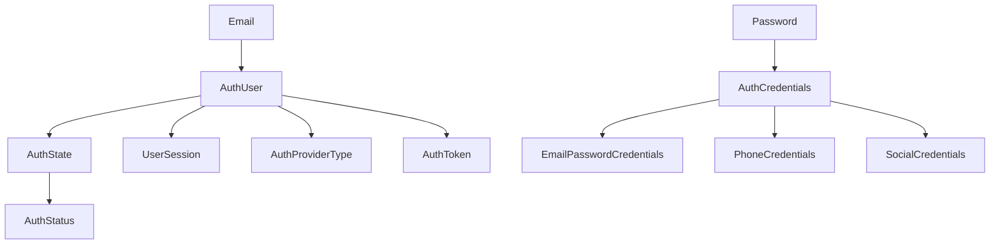
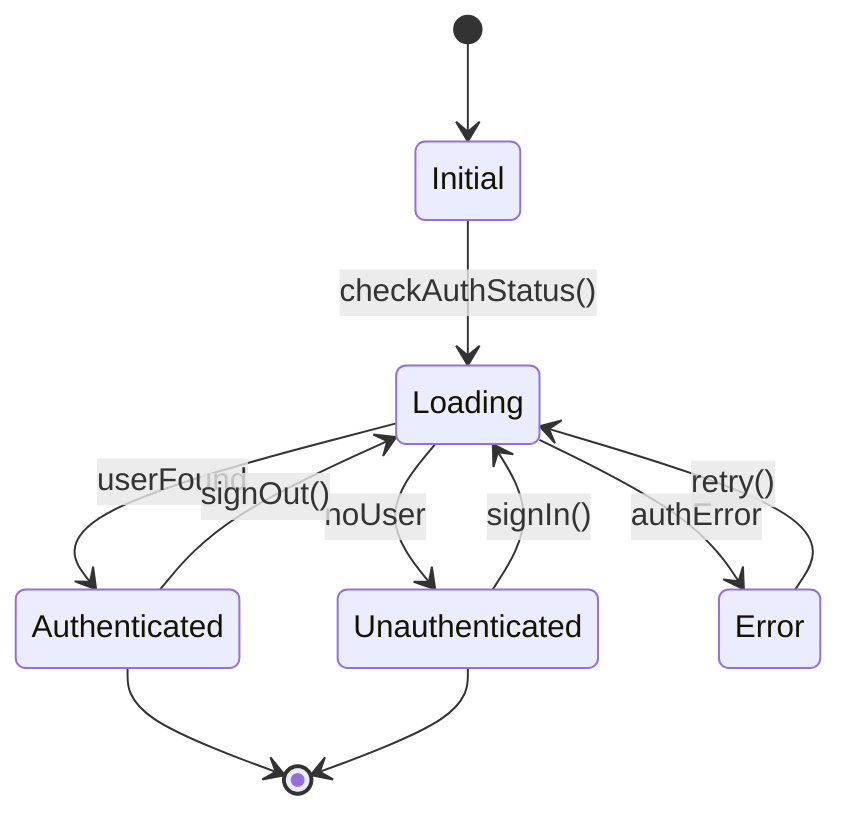

# Data Model: Auth Feature Domain Models

**Date**: 2025-01-19
**Feature**: Auth Feature Clean Architecture Migration

## Overview

Domain models designed for testability and clean architecture compliance. All models are immutable, easily mockable, and framework-agnostic.

## Core Domain Models

### AuthUser

```dart
/// Represents an authenticated user in the system
class AuthUser {
  final String uid;
  final String? email;
  final String? displayName;
  final String? photoUrl;
  final AuthProviderType authProvider;
  final bool isEmailVerified;
  final String? phoneNumber;
  final DateTime createdAt;
  final DateTime? lastSignInAt;
  final String? role; // admin, tester, user
  final Map<String, dynamic>? metadata;

  const AuthUser({
    required this.uid,
    this.email,
    this.displayName,
    this.photoUrl,
    required this.authProvider,
    this.isEmailVerified = false,
    this.phoneNumber,
    required this.createdAt,
    this.lastSignInAt,
    this.role,
    this.metadata,
  });

  // Copyable for state updates
  AuthUser copyWith({
    String? uid,
    String? email,
    String? displayName,
    String? photoUrl,
    AuthProviderType? authProvider,
    bool? isEmailVerified,
    String? phoneNumber,
    DateTime? createdAt,
    DateTime? lastSignInAt,
    String? role,
    Map<String, dynamic>? metadata,
  });

  // For testing
  factory AuthUser.mock() => AuthUser(
    uid: 'test-uid',
    email: 'test@example.com',
    authProvider: AuthProviderType.email,
    createdAt: DateTime.now(),
  );
}
```

### AuthState

```dart
/// Represents the current authentication state
enum AuthStatus {
  initial,       // App just started
  loading,       // Checking auth status
  authenticated, // User is logged in
  unauthenticated, // User is logged out
  error,        // Auth error occurred
}

class AuthState {
  final AuthStatus status;
  final AuthUser? user;
  final String? error;
  final bool isLoading;

  const AuthState({
    required this.status,
    this.user,
    this.error,
    this.isLoading = false,
  });

  factory AuthState.initial() => AuthState(
    status: AuthStatus.initial,
  );

  factory AuthState.loading() => AuthState(
    status: AuthStatus.loading,
    isLoading: true,
  );

  factory AuthState.authenticated(AuthUser user) => AuthState(
    status: AuthStatus.authenticated,
    user: user,
  );

  factory AuthState.unauthenticated() => AuthState(
    status: AuthStatus.unauthenticated,
  );

  factory AuthState.error(String message) => AuthState(
    status: AuthStatus.error,
    error: message,
  );

  AuthState copyWith({
    AuthStatus? status,
    AuthUser? user,
    String? error,
    bool? isLoading,
  });
}
```

### AuthToken

```dart
/// Represents authentication tokens
class AuthToken {
  final String accessToken;
  final String? refreshToken;
  final DateTime expiresAt;
  final String? idToken;
  final Map<String, dynamic>? claims;

  const AuthToken({
    required this.accessToken,
    this.refreshToken,
    required this.expiresAt,
    this.idToken,
    this.claims,
  });

  bool get isExpired => DateTime.now().isAfter(expiresAt);

  Duration get timeUntilExpiry => expiresAt.difference(DateTime.now());

  factory AuthToken.mock() => AuthToken(
    accessToken: 'mock-access-token',
    expiresAt: DateTime.now().add(Duration(hours: 1)),
  );
}
```

### AuthProviderType

```dart
/// Supported authentication providers
enum AuthProviderType {
  email('email'),
  google('google'),
  apple('apple'),
  phone('phone'),
  github('github'),
  anonymous('anonymous');

  final String value;
  const AuthProviderType(this.value);

  static AuthProviderType fromString(String value) {
    return AuthProviderType.values.firstWhere(
      (type) => type.value == value,
      orElse: () => AuthProviderType.email,
    );
  }
}
```

### AuthCredentials

```dart
/// Credentials for authentication
abstract class AuthCredentials {
  const AuthCredentials();
}

class EmailPasswordCredentials extends AuthCredentials {
  final String email;
  final String password;

  const EmailPasswordCredentials({
    required this.email,
    required this.password,
  });
}

class PhoneCredentials extends AuthCredentials {
  final String phoneNumber;
  final String verificationId;
  final String smsCode;

  const PhoneCredentials({
    required this.phoneNumber,
    required this.verificationId,
    required this.smsCode,
  });
}

class SocialCredentials extends AuthCredentials {
  final AuthProviderType provider;
  final String accessToken;
  final String? idToken;

  const SocialCredentials({
    required this.provider,
    required this.accessToken,
    this.idToken,
  });
}
```

### UserSession

```dart
/// Represents an active user session
class UserSession {
  final String sessionId;
  final String userId;
  final DateTime createdAt;
  final DateTime lastActivityAt;
  final String? deviceInfo;
  final String? ipAddress;
  final bool isActive;

  const UserSession({
    required this.sessionId,
    required this.userId,
    required this.createdAt,
    required this.lastActivityAt,
    this.deviceInfo,
    this.ipAddress,
    this.isActive = true,
  });

  Duration get sessionDuration => lastActivityAt.difference(createdAt);

  bool get isExpired {
    final inactivityLimit = Duration(hours: 24);
    return DateTime.now().difference(lastActivityAt) > inactivityLimit;
  }
}
```

## Value Objects

### Email

```dart
/// Email value object with validation
class Email {
  final String value;

  Email(String input) : value = _validate(input);

  static String _validate(String input) {
    final trimmed = input.trim().toLowerCase();
    final emailRegex = RegExp(
      r'^[a-zA-Z0-9._%+-]+@[a-zA-Z0-9.-]+\.[a-zA-Z]{2,}$',
    );

    if (!emailRegex.hasMatch(trimmed)) {
      throw ArgumentError('Invalid email format');
    }

    return trimmed;
  }

  @override
  bool operator ==(Object other) =>
    other is Email && other.value == value;

  @override
  int get hashCode => value.hashCode;
}
```

### Password

```dart
/// Password value object with strength validation
class Password {
  final String value;

  Password(String input) : value = _validate(input);

  static String _validate(String input) {
    if (input.length < 8) {
      throw ArgumentError('Password must be at least 8 characters');
    }

    // Additional validation rules
    final hasUppercase = input.contains(RegExp(r'[A-Z]'));
    final hasLowercase = input.contains(RegExp(r'[a-z]'));
    final hasDigit = input.contains(RegExp(r'[0-9]'));
    final hasSpecialChar = input.contains(RegExp(r'[!@#$%^&*(),.?":{}|<>]'));

    if (!hasUppercase || !hasLowercase || !hasDigit) {
      throw ArgumentError(
        'Password must contain uppercase, lowercase, and numbers',
      );
    }

    return input;
  }

  PasswordStrength get strength {
    // Calculate password strength
    int score = 0;
    if (value.length >= 12) score++;
    if (value.contains(RegExp(r'[A-Z]'))) score++;
    if (value.contains(RegExp(r'[a-z]'))) score++;
    if (value.contains(RegExp(r'[0-9]'))) score++;
    if (value.contains(RegExp(r'[!@#$%^&*(),.?":{}|<>]'))) score++;

    if (score <= 2) return PasswordStrength.weak;
    if (score <= 3) return PasswordStrength.medium;
    return PasswordStrength.strong;
  }
}

enum PasswordStrength {
  weak,
  medium,
  strong,
}
```

## Result Type for Error Handling

```dart
/// Result type for handling success and failure cases
sealed class Result<T> {
  const Result();

  bool get isSuccess => this is Success<T>;
  bool get isFailure => this is Failure<T>;

  T? get data => isSuccess ? (this as Success<T>).value : null;
  String? get error => isFailure ? (this as Failure<T>).message : null;

  static Result<T> success<T>(T value) => Success<T>(value);
  static Result<T> failure<T>(String message) => Failure<T>(message);
}

class Success<T> extends Result<T> {
  final T value;
  const Success(this.value);
}

class Failure<T> extends Result<T> {
  final String message;
  final int? code;
  const Failure(this.message, [this.code]);
}
```

## Entity Relationships



## Validation Rules

### User Creation
- `uid`: Required, unique, non-empty
- `email`: Optional, must be valid format if provided
- `displayName`: Optional, max 100 characters
- `photoUrl`: Optional, must be valid URL if provided
- `authProvider`: Required, must be valid enum value
- `createdAt`: Required, must not be future date

### Authentication
- Email/Password: Email valid format, password meets strength requirements
- Phone: Valid phone number format, verification code 6 digits
- Social: Valid provider, non-empty access token

### Session Management
- Session expires after 24 hours of inactivity
- Multiple sessions per user allowed
- Session ID must be unique

## State Transitions



## Testing Considerations

### Mockable Properties
- All models have factory constructors for mocking
- Immutable design prevents unintended mutations
- Value objects validate at construction time

### Test Fixtures Available
- `AuthUser.mock()` - Default test user
- `AuthToken.mock()` - Valid test token
- `AuthStateFixtures` - Pre-configured states
- `AuthErrorFixtures` - Common error scenarios

### Coverage Requirements
- Domain models: 100% coverage
- Value objects: 100% coverage including validation
- State transitions: All paths tested

---
*These domain models form the core of the auth feature and are designed for complete testability in isolation*