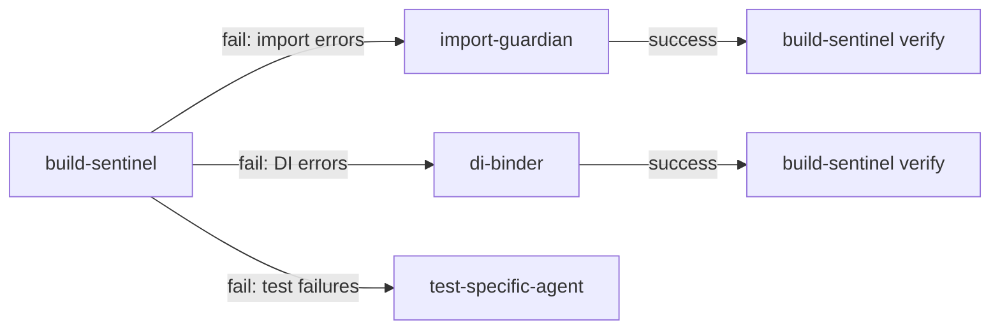
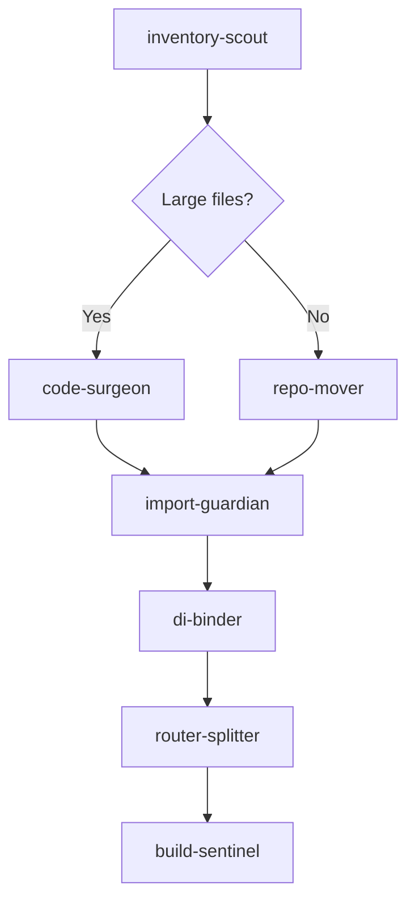

# Agent Chaining Rules for Claude Orchestration

> Version: 1.0.0 | Created: 2025-01-21
> Purpose: Define agent chaining patterns for Claude-centric architecture

## 🎯 Overview

This document defines the rules and patterns for chaining agents in the Claude-centric architecture. All agents produce structured JSON data that Claude uses to determine the next steps in the workflow.

## 📋 Core Chaining Patterns

### 1. Error-Driven Chaining

When an agent reports failure, Claude automatically triggers the appropriate recovery agent:



**Rules**:
- `build-sentinel` (fail) → `import-guardian` (if has_import_errors)
- `build-sentinel` (fail) → `di-binder` (if has_di_errors)
- Any fix agent (success) → `build-sentinel` (verify mode)

### 2. Migration Pipeline Chaining

Standard migration workflow with automatic progression:



**Rules**:
- `inventory-scout` → `code-surgeon` (if large_files > 0)
- `code-surgeon` → `import-guardian` (always)
- `repo-mover` → `import-guardian` (always)
- `struct-weaver` → `import-guardian` (always)
- Any structural change → `build-sentinel` (final validation)

### 3. Feature-Specific Pipeline

When working on a specific feature:

```yaml
feature_pipeline:
  - inventory-scout:
      scope: "{feature}"
      layer_aware: true
  - repo-mover:
      feature: "{feature}"
      mode: "dry-run"
  - di-binder:
      feature: "{feature}"
      mode: "detect"
  - import-guardian:
      scope: "{feature}"
      mode: "fix"
  - build-sentinel:
      mode: "test"
      test_path: "lib/features/{feature}/"
```

### 4. Quality Check Pipeline

For routine quality checks:

```yaml
quality_pipeline:
  - inventory-scout:
      scope: "all"
  - import-guardian:
      mode: "detect"
  - build-sentinel:
      mode: "full"
```

## 🔄 Conditional Chaining

### Decision Logic Format

Each agent returns decision hints that Claude uses:

```json
{
  "decision_hints": {
    "has_large_files": true,
    "has_violations": true,
    "needs_decomposition": true,
    "critical_violations": 5
  },
  "next_action": {
    "recommended_agent": "code-surgeon",
    "params": {
      "file": "path/to/large_file.dart",
      "map": "Symbol->target"
    },
    "priority": "high",
    "reason": "File exceeds 800 lines with mixed responsibilities"
  }
}
```

### Priority Levels

- **critical**: Must execute immediately (build failures, critical violations)
- **high**: Should execute next (large files, import violations)
- **medium**: Can be deferred (optimizations, non-critical refactoring)
- **low**: Optional improvements (style, documentation)

## 🔗 Parameter Passing

### Automatic Parameter Propagation

Parameters flow between agents automatically:

#### From `inventory-scout` to `code-surgeon`:
```json
{
  "large_files": ["path/to/file.dart"],
  "feature": "auth"
}
→
{
  "file": "path/to/file.dart",
  "feature": "auth"
}
```

#### From `import-guardian` to `build-sentinel`:
```json
{
  "affected_features": ["auth", "posts"],
  "fixes_applied": 5
}
→
{
  "test_path": "lib/features/auth/",
  "mode": "test"
}
```

#### From `repo-mover` to `di-binder`:
```json
{
  "moved_files": [
    {"from": "backend/", "to": "features/auth/"}
  ],
  "feature": "auth"
}
→
{
  "feature": "auth",
  "port": "features/auth/domain/repositories/auth_repository.dart",
  "adapter": "features/auth/data/repositories/auth_repository_impl.dart"
}
```

## 📊 Chaining Matrix

| Current Agent | Status | Decision Hint | Next Agent | Priority |
|--------------|--------|---------------|------------|----------|
| inventory-scout | success | has_large_files | code-surgeon | high |
| inventory-scout | success | has_violations | import-guardian | high |
| inventory-scout | success | clean | build-sentinel | low |
| build-sentinel | fail | import_errors > 0 | import-guardian | critical |
| build-sentinel | fail | di_errors > 0 | di-binder | critical |
| build-sentinel | fail | test_failures > 0 | (manual review) | high |
| import-guardian | success | fixes_applied > 0 | build-sentinel | medium |
| code-surgeon | success | patches_created > 0 | import-guardian | high |
| repo-mover | success | files_moved > 0 | import-guardian | high |
| di-binder | success | bindings_added > 0 | build-sentinel | medium |
| router-splitter | success | routes_split > 0 | build-sentinel | medium |
| struct-weaver | success | structures_decomposed > 0 | import-guardian | high |

## 🚀 Pipeline Templates

### C7 Complete Migration

```python
c7_pipeline = [
    ("inventory-scout", {"scope": "all", "layer_aware": True}),
    ("repo-mover", {"mode": "dry-run"}),
    ("struct-weaver", {"task": "mapper", "mode": "detect"}),
    ("struct-weaver", {"task": "state", "mode": "detect"}),
    ("di-binder", {"mode": "detect"}),
    ("import-guardian", {"mode": "fix", "apply": False}),
    ("router-splitter", {"mode": "detect"}),
    ("build-sentinel", {"mode": "full"})
]
```

### Quick Quality Check

```python
quick_check = [
    ("inventory-scout", {"scope": "all"}),
    ("build-sentinel", {"mode": "quick"})
]
```

### Feature Migration

```python
def feature_migration(feature_name):
    return [
        ("inventory-scout", {"scope": feature_name}),
        ("repo-mover", {"feature": feature_name, "mode": "dry-run"}),
        ("di-binder", {"feature": feature_name}),
        ("import-guardian", {"scope": feature_name}),
        ("build-sentinel", {"test_path": f"lib/features/{feature_name}/"})
    ]
```

## ⚡ Performance Optimizations

### Parallel Execution

Some agents can run in parallel when they don't depend on each other:

```yaml
parallel_groups:
  - group_1:  # Can run simultaneously
    - inventory-scout (scope: auth)
    - inventory-scout (scope: posts)
    - inventory-scout (scope: chat)

  - group_2:  # After all inventory scouts complete
    - code-surgeon (for each large file)

  - group_3:  # After all fixes
    - build-sentinel (final validation)
```

### Caching Strategy

Results are cached in `reports/*.json` to avoid re-execution:

```python
cache_validity:
  inventory-scout: 3600  # 1 hour
  build-sentinel: 0      # Never cache (always fresh)
  import-guardian: 1800  # 30 minutes
  others: 900            # 15 minutes default
```

## 🛡️ Safety Rules

### Never Chain These

- Don't chain apply modes without dry-run first
- Don't skip build-sentinel after structural changes
- Don't run di-binder before repo-mover completes
- Don't apply patches without import-guardian validation

### Always Chain These

- After any fix → build-sentinel verify
- After file movement → import-guardian
- After extraction → import-guardian
- Before PR → full pipeline

## 📝 Example Claude Orchestration

```python
from orchestration_utils import AgentOrchestrator

orchestrator = AgentOrchestrator()

# Start with inventory
result = orchestrator.run_agent("inventory-scout", {"scope": "all"})

# Claude reads the JSON and decides
while result.get("next_action"):
    next_action = result["next_action"]
    agent = next_action["recommended_agent"]
    params = next_action.get("params", {})

    print(f"Claude: Running {agent} because: {next_action['reason']}")
    result = orchestrator.run_agent(agent, params)

    if result["status"] == "fail":
        print(f"Claude: {agent} failed, checking recovery options...")
        # Apply error-driven chaining rules

# Final summary
summary = orchestrator.get_execution_summary()
print(f"Completed {summary['total_executions']} agent executions")
```

## 🔍 Debugging Chains

When a chain fails, check:

1. **JSON Output**: Verify each agent produces valid JSON
2. **Decision Hints**: Check decision_hints match expected values
3. **Parameter Passing**: Ensure params propagate correctly
4. **File Paths**: Verify all paths are absolute and exist
5. **Mode Consistency**: Check dry-run before apply modes

## 📚 References

- [AGENT_REFACTORING_PLAN.md](./AGENT_REFACTORING_PLAN.md) - Overall refactoring strategy
- [orchestration_utils.py](./orchestration_utils.py) - Implementation details
- Individual agent documentation in `.claude/agents/*.md`