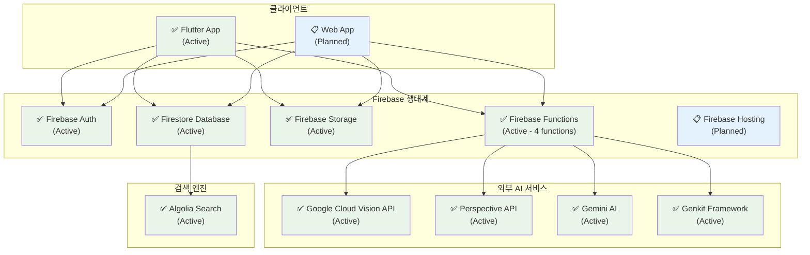
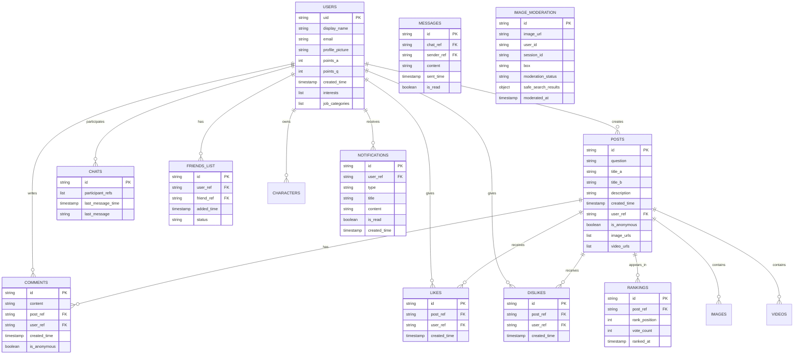
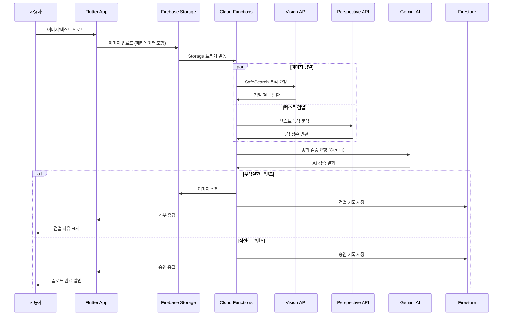
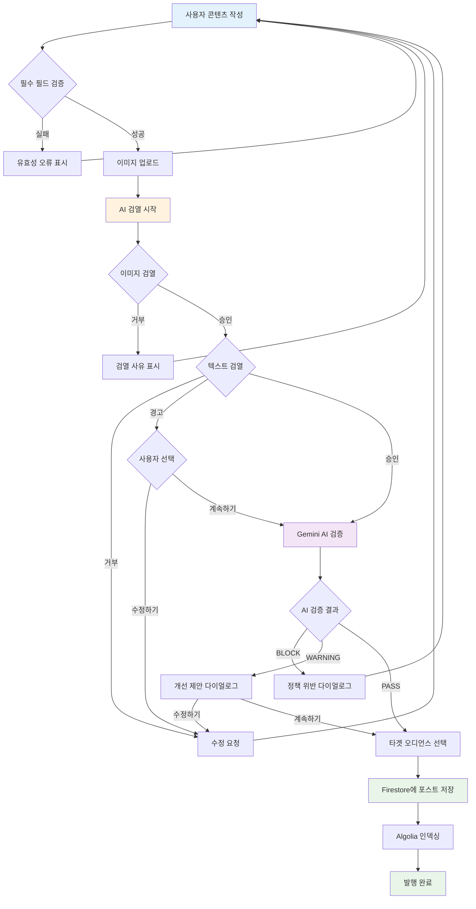
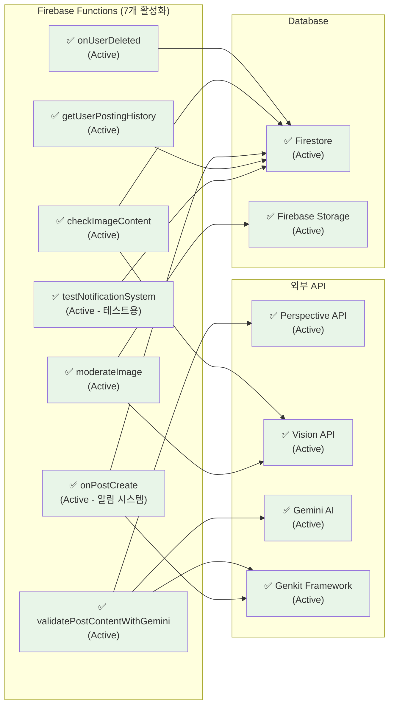
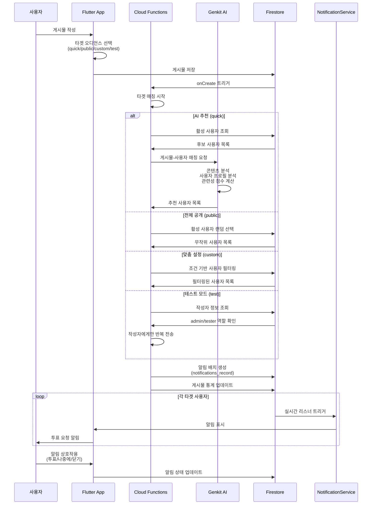
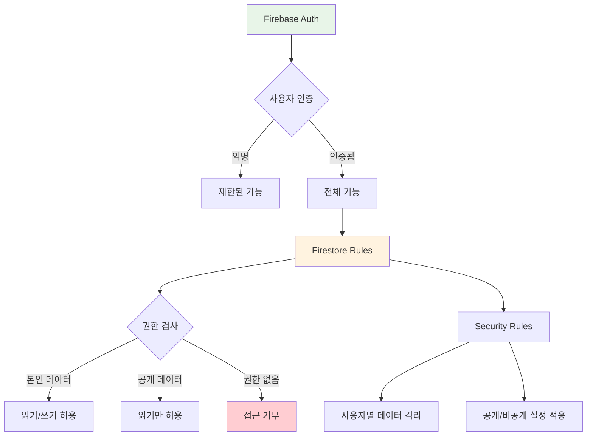

# Versus Space 백엔드 아키텍처 다이어그램

## 1. 전체 시스템 아키텍처 (활성화 상태 포함)

## 2. Firestore 데이터 모델 ERD

## 3. AI 검열 시스템 플로우

## 4. 콘텐츠 생성 및 발행 플로우

## 5. Firebase Functions 상세 기능 (배포 상태)

## 6. AI 기반 알림 시스템 플로우

## 7. 데이터베이스 컬렉션 구조

### 핵심 컬렉션 (35개)

#### 사용자 관리
- `users_record`: 사용자 프로필, 포인트, 설정
- `characters_record`: 사용자 아바타/캐릭터
- `settings_record`: 개인 설정
- `notifications_record`: 알림 관리

#### 콘텐츠 관리
- `posts_record`: A vs B 포스트 메인 데이터
- `comments_record`: 댓글 시스템
- `images_record`: 이미지 메타데이터
- `video_record`: 비디오 메타데이터
- `encodings_record`: 비디오 인코딩 상태

#### 소셜 기능
- `likes_record` / `dislikes_record`: 좋아요/싫어요
- `chats_record` / `group_chats_record`: 메시징
- `messages_record` / `group_messages_record`: 메시지 내용
- `friends_list_record`: 친구 관계

#### 게임화 요소
- `rankings_record`: 리더보드
- `point_record`: 포인트 거래 내역
- `votes_record` / `votecounts_record`: 투표 시스템
- `premium_users_record`: 프리미엄 구독

#### 검색 및 카테고리
- `searches_record`: 검색 기록
- `interest_record`: 관심사 카테고리
- `jops_category_record` / `jops_name_record`: 직업 분류

#### 콘텐츠 모더레이션
- `image_moderation_record`: 이미지 검열 결과
- `content_validations`: AI 검증 로그 (Functions에서 생성)

## 7. 보안 및 권한 관리

## 8. 성능 최적화 전략

### 데이터베이스 최적화
- **복합 인덱스**: 자주 쿼리되는 필드 조합
- **페이지네이션**: 무한 스크롤 구현
- **캐싱**: 자주 접근하는 데이터 로컬 캐싱

### 이미지 처리 최적화
- **다중 해상도**: original, display(800px), thumbnail(150px)
- **압축**: JPEG 85% 품질
- **CDN**: Firebase Storage 자동 CDN

### AI 서비스 최적화
- **토큰 사용량 추적**: Gemini AI 비용 관리
- **배치 처리**: 다중 이미지 병렬 검열
- **캐싱**: 검열 결과 재사용

## 9. 상태 표시 범례

### 🎯 상태 아이콘 의미
- **✅ Active**: 완전히 구현되고 현재 사용 중
- **🚧 Development**: 부분적으로 구현되거나 개발 중
- **❌ Inactive**: 구현되었지만 현재 비활성화
- **📋 Planned**: 계획되었지만 아직 구현되지 않음

### 🎨 색상 코드
- **녹색 (`#e8f5e8`)**: 활성화된 서비스
- **파란색 (`#e3f2fd`)**: 계획 중인 서비스
- **노란색 (`#fff3e0`)**: 개발 중인 서비스
- **회색 (`#f5f5f5`)**: 비활성화된 서비스

### 📊 현재 프로젝트 상태 요약
- **활성화된 서비스**: 11개 (Firebase 생태계 + AI 서비스)
- **계획 중인 서비스**: 2개 (Web App, Firebase Hosting)
- **배포된 Cloud Functions**: 7개 (알림 시스템 포함)
- **통합된 AI 서비스**: 4개 (Vision, Perspective, Gemini, Genkit)
- **사용 중인 Firestore 컬렉션**: 36개 (notifications_record 추가)
- **알림 시스템**: AI 기반 타겟팅 (4가지 모드)

### 🚀 최근 추가 기능 (2025-07-20)
- **AI 기반 알림 시스템**: Genkit을 활용한 스마트 사용자 매칭
- **타겟 오디언스**: quick(AI), public(랜덤), custom(조건), test(개발) 모드
- **실시간 알림**: NotificationService를 통한 즉시 알림
- **테스트 모드**: admin/tester 역할 전용 개발 도구

---

**작성일**: 2025-07-18  
**버전**: 1.2 (AI 알림 시스템 추가)  
**프로젝트**: Versus Space Flutter App  
**백엔드**: Firebase 생태계 + AI 서비스 통합  
**마지막 업데이트**: 2025-07-20